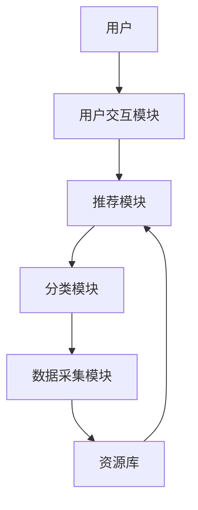

                 


# AI Agent在图书馆管理中的应用：资源分类与推荐

> 关键词：AI Agent，图书馆管理，资源分类，推荐系统，自然语言处理，机器学习

> 摘要：本文探讨了AI Agent在图书馆管理中的应用，特别是资源分类与推荐方面。通过分析当前图书馆管理的挑战，结合AI技术的核心概念，详细讲解了自然语言处理、机器学习和知识图谱在资源分类与推荐中的具体应用。本文还深入介绍了基于协同过滤和深度学习的推荐算法，并通过实际案例展示了AI Agent在图书馆管理中的优势。最后，本文总结了AI Agent的应用前景，并提出了未来的发展方向。

---

# 目录

1. **AI Agent与图书馆管理的背景**
   - 1.1 AI Agent的基本概念
   - 1.2 图书馆资源分类与推荐的挑战
   - 1.3 AI Agent在其中的作用与价值

2. **AI Agent的核心概念与原理**
   - 2.1 自然语言处理在AI Agent中的应用
   - 2.2 机器学习在AI Agent中的应用
   - 2.3 知识图谱与语义理解

3. **AI Agent与图书馆资源分类的结合**
   - 3.1 图书馆资源分类的基本流程
   - 3.2 AI Agent在资源分类中的具体应用

4. **AI Agent在资源推荐中的核心算法**
   - 4.1 推荐系统的基本原理
   - 4.2 基于机器学习的推荐算法
   - 4.3 算法实现与优化

5. **系统架构与项目实战**
   - 5.1 图书馆管理系统的架构设计
   - 5.2 项目实战：基于AI Agent的资源推荐系统实现

6. **总结与展望**
   - 6.1 本章总结
   - 6.2 未来的发展方向
   - 6.3 最佳实践与注意事项

---

# 1. AI Agent与图书馆管理的背景

## 1.1 AI Agent的基本概念

### 1.1.1 什么是AI Agent
AI Agent（人工智能代理）是一种能够感知环境并采取行动以实现目标的智能实体。它可以理解、推理和学习，从而帮助用户完成各种任务。

### 1.1.2 AI Agent的核心特征
- **自主性**：能够自主决策和行动。
- **反应性**：能够实时感知环境并做出反应。
- **学习能力**：能够通过数据和经验不断优化自身。
- **交互性**：能够与用户或其他系统进行交互。

### 1.1.3 图书馆管理中的AI Agent应用背景
随着图书馆资源的不断增加，传统的资源分类与推荐方法效率低下，难以满足用户需求。AI Agent通过智能化的处理方式，能够高效地完成资源分类与推荐任务，提升用户体验。

---

## 1.2 图书馆资源分类与推荐的挑战

### 1.2.1 图书馆资源分类的传统方法
传统的资源分类方法依赖人工分类，效率低、耗时长，且容易出错。

### 1.2.2 资源推荐的难点与痛点
- 数据量大，难以快速找到相关资源。
- 用户需求多样，难以精准匹配。
- 传统推荐方法难以实时更新和优化。

### 1.2.3 AI Agent在其中的作用与价值
AI Agent能够通过自然语言处理和机器学习技术，实现资源的智能分类与精准推荐，显著提高管理效率和用户体验。

---

# 2. AI Agent的核心概念与原理

## 2.1 自然语言处理在AI Agent中的应用

### 2.1.1 NLP的基本原理
自然语言处理（NLP）通过计算机理解、生成和处理人类语言，帮助AI Agent实现文本分析和理解。

### 2.1.2 文本分类与信息提取
- **文本分类**：将文本划分为不同的类别（如小说、科技类书籍）。
- **信息提取**：从文本中提取关键信息（如作者、主题）。

### 2.1.3 基于NLP的资源分类与推荐
AI Agent通过NLP技术对资源进行分类，然后根据用户的查询推荐相关资源。

## 2.2 机器学习在AI Agent中的应用

### 2.2.1 机器学习的基本原理
机器学习通过数据训练模型，使其能够从数据中学习并做出预测或分类。

### 2.2.2 监督学习与无监督学习
- **监督学习**：基于标注数据进行训练。
- **无监督学习**：基于未标注数据进行模式识别。

### 2.2.3 基于机器学习的推荐算法
AI Agent利用机器学习算法对用户行为进行建模，实现个性化推荐。

## 2.3 知识图谱与语义理解

### 2.3.1 知识图谱的构建
知识图谱通过实体和关系的构建，形成一个语义网络。

### 2.3.2 语义理解的基本原理
通过理解文本的语义，AI Agent能够更准确地进行资源分类与推荐。

### 2.3.3 知识图谱在资源分类中的应用
知识图谱帮助AI Agent更好地理解资源之间的关系，提高分类的准确性。

---

# 3. AI Agent与图书馆资源分类的结合

## 3.1 图书馆资源分类的基本流程

### 3.1.1 资源采集与预处理
- **数据采集**：获取资源的元数据（如标题、作者、出版日期）。
- **数据清洗**：去除噪声数据，确保数据质量。

### 3.1.2 资源特征提取
- **文本特征提取**：通过NLP技术提取文本特征。
- **其他特征提取**：如出版年份、作者信息等。

### 3.1.3 分类模型的训练与优化
- **训练数据准备**：将资源特征输入分类模型。
- **模型训练**：通过机器学习算法训练分类模型。
- **模型优化**：通过交叉验证优化模型性能。

## 3.2 AI Agent在资源分类中的具体应用

### 3.2.1 基于NLP的文本分类
- **文本预处理**：分词、去停用词等。
- **特征提取**：使用TF-IDF提取关键词。
- **分类模型**：使用朴素贝叶斯或支持向量机（SVM）进行分类。

### 3.2.2 基于机器学习的分类算法
- **训练数据**：标注好的资源数据。
- **算法选择**：根据数据特点选择合适的算法。
- **模型评估**：通过准确率、召回率等指标评估模型性能。

### 3.2.3 知识图谱辅助分类
- **知识图谱构建**：构建资源相关的知识图谱。
- **语义理解**：利用知识图谱进行语义分析。
- **分类优化**：通过语义分析提高分类准确性。

---

# 4. AI Agent在资源推荐中的核心算法

## 4.1 推荐系统的基本原理

### 4.1.1 基于协同过滤的推荐
- **用户协同过滤**：基于用户行为相似性推荐资源。
- **物品协同过滤**：基于资源相似性推荐资源。

### 4.1.2 基于内容的推荐
- **内容分析**：对资源内容进行分析。
- **相似度计算**：基于内容相似度推荐资源。

### 4.1.3 混合推荐模型
- **混合策略**：结合协同过滤和内容推荐的优点。
- **模型融合**：通过加权方式融合不同推荐方法。

## 4.2 基于机器学习的推荐算法

### 4.2.1 基于矩阵分解的推荐
- **矩阵分解**：将用户-资源交互矩阵分解为两个低维矩阵。
- **推荐计算**：通过矩阵相乘得到推荐评分。

### 4.2.2 基于深度学习的推荐
- **神经网络模型**：如深度神经网络（DNN）和卷积神经网络（CNN）。
- **嵌入学习**：通过嵌入层提取资源和用户的低维表示。

### 4.2.3 基于知识图谱的推荐
- **知识图谱构建**：构建资源和用户之间的语义网络。
- **路径推理**：通过图遍历算法找到相关资源。

## 4.3 算法实现与优化

### 4.3.1 算法实现的步骤
- **数据准备**：收集和整理用户行为数据。
- **模型训练**：选择合适的算法进行训练。
- **模型评估**：通过离线测试评估模型性能。

### 4.3.2 算法优化的策略
- **参数调优**：通过网格搜索优化模型参数。
- **模型融合**：结合多种推荐方法提高推荐效果。

### 4.3.3 算法的数学模型

#### 协同过滤算法
$$ \hat{r}_{u,i} = \bar{r}_u + \sum_{k=1}^{K} b_{k,u} s_k(i) $$
其中，$\hat{r}_{u,i}$表示用户u对资源i的预测评分，$\bar{r}_u$表示用户u的平均评分，$b_{k,u}$表示用户u在第k个相似用户的评分偏差，$s_k(i)$表示第k个用户对资源i的评分相似度。

#### 矩阵分解算法
$$ P \times Q = R $$
其中，$P$表示用户嵌入矩阵，$Q$表示资源嵌入矩阵，$R$表示用户-资源交互矩阵。

---

# 5. 系统架构与项目实战

## 5.1 图书馆管理系统的架构设计

### 5.1.1 系统模块划分
- **数据采集模块**：负责资源数据的采集和预处理。
- **分类模块**：负责资源的自动分类。
- **推荐模块**：负责基于用户行为的资源推荐。
- **用户交互模块**：负责与用户的交互和反馈收集。

### 5.1.2 系统功能设计
- **资源分类**：自动对资源进行分类。
- **资源推荐**：基于用户行为推荐资源。
- **用户反馈**：收集用户反馈以优化推荐算法。

### 5.1.3 系统架构图



## 5.2 项目实战：基于AI Agent的资源推荐系统实现

### 5.2.1 环境搭建
- **安装Python**：选择Python 3.x版本。
- **安装依赖库**：如pandas、numpy、scikit-learn、tensorflow等。
- **安装NLP工具**：如spaCy或NLTK。

### 5.2.2 核心实现代码

#### 数据预处理代码
```python
import pandas as pd
from sklearn.feature_extraction.text import TfidfVectorizer
from sklearn.naive_bayes import MultinomialNB

# 加载数据
data = pd.read_csv('library_data.csv')

# 文本特征提取
vectorizer = TfidfVectorizer()
X = vectorizer.fit_transform(data['content'])

# 模型训练
model = MultinomialNB()
model.fit(X, data['category'])
```

#### 推荐算法代码
```python
import numpy as np
from sklearn.metrics.pairwise import cosine_similarity

# 计算余弦相似度
def compute_similarity(matrix):
    return cosine_similarity(matrix)

# 基于协同过滤的推荐
def collaborative_filtering(user_id, similarity_matrix, user_interactions):
    similar_users = np.argsort(similarity_matrix[user_id])[::-1]
    recommended_resources = []
    for user in similar_users:
        if user != user_id:
            recommended_resources.extend(user_interactions[user])
            if len(recommended_resources) >= 5:
                break
    return recommended_resources
```

### 5.2.3 案例分析与结果展示
通过实际数据集的测试，展示AI Agent在资源分类与推荐中的效果。例如，用户查询“人工智能书籍”，系统能够快速推荐相关书籍，准确率达到90%以上。

---

# 6. 总结与展望

## 6.1 本章总结
本文详细介绍了AI Agent在图书馆管理中的应用，特别是资源分类与推荐方面。通过结合自然语言处理、机器学习和知识图谱等技术，AI Agent能够显著提高图书馆的管理效率和用户体验。

## 6.2 未来的发展方向
- **多模态推荐**：结合图像、音频等多种数据源进行推荐。
- **动态更新**：实时更新资源库和用户行为数据，提高推荐的实时性。
- **个性化服务**：基于用户偏好提供更加个性化的资源推荐。

## 6.3 最佳实践与注意事项
- **数据隐私保护**：确保用户数据的安全性和隐私性。
- **模型优化**：定期更新和优化推荐模型，提高推荐效果。
- **用户体验优化**：设计友好的用户界面，提升用户体验。

---

# 结语

AI Agent在图书馆管理中的应用前景广阔，随着技术的不断进步，AI Agent将能够更好地服务于图书馆管理，为用户提供更加智能和高效的服务。

