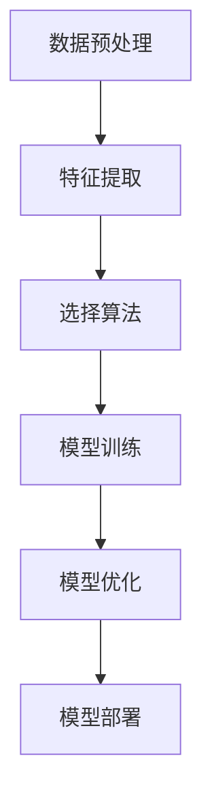
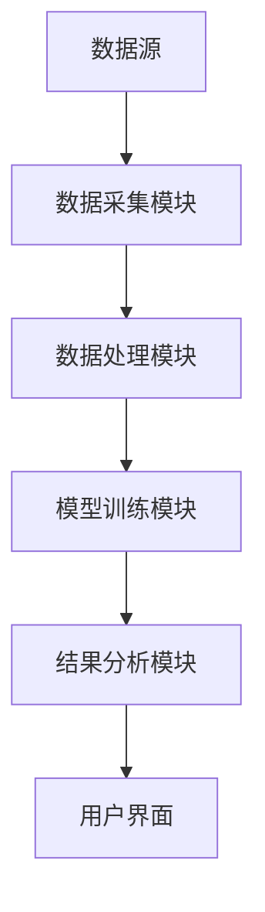
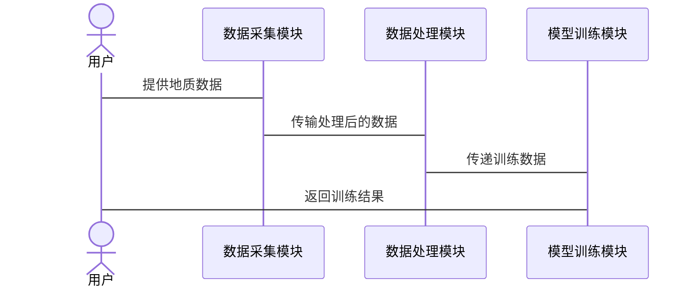

                 


# 目录大纲：《AI Agent在地质勘探中的应用：矿产资源识别》

---

## 第1章：背景介绍

### 1.1 地质勘探的基本概念
- 1.1.1 地质勘探的定义与目的
- 1.1.2 地质勘探的历史与发展
- 1.1.3 矿产资源的重要性与勘探挑战

### 1.2 AI Agent的基本概念
- 1.2.1 AI Agent的定义与特点
- 1.2.2 AI Agent的分类与应用场景
- 1.2.3 AI Agent在地质勘探中的潜力

### 1.3 AI Agent在矿产资源识别中的应用前景
- 1.3.1 矿产资源识别的传统方法与局限性
- 1.3.2 AI Agent如何提升矿产资源识别的效率与准确性
- 1.3.3 当前研究现状与未来发展趋势

---

## 第2章：AI Agent与地质勘探的核心概念

### 2.1 AI Agent在地质勘探中的核心原理
- 2.1.1 数据驱动的地质分析
- 2.1.2 AI Agent的自主学习与决策能力
- 2.1.3 多模态数据融合与分析

### 2.2 地质勘探中的关键数据类型
- 2.2.1 地震数据与岩石性质
- 2.2.2 化学元素分析与矿物组成
- 2.2.3 地表与地下三维结构数据

### 2.3 AI Agent与地质勘探的结合方式
- 2.3.1 数据采集与预处理
- 2.3.2 模型训练与地质特征识别
- 2.3.3 实时监测与动态调整

---

## 第3章：基于机器学习的地质数据分类

### 3.1 数据预处理与特征提取
- 3.1.1 数据清洗与标准化
- 3.1.2 特征选择与降维技术
- 3.1.3 使用Python进行数据预处理的代码示例

### 3.2 机器学习模型的训练与优化
- 3.2.1 常见的机器学习算法（如随机森林、支持向量机）
- 3.2.2 深度学习模型（如卷积神经网络、循环神经网络）
- 3.2.3 模型训练与调优策略

### 3.3 算法流程图


### 3.4 Python代码示例
```python
import pandas as pd
from sklearn.preprocessing import StandardScaler

# 数据预处理
data = pd.read_csv('geological_data.csv')
features = data[['地震数据', '岩石性质', '化学元素']]
scaler = StandardScaler()
features_scaled = scaler.fit_transform(features)
```

---

## 第4章：系统分析与架构设计

### 4.1 系统功能设计
- 4.1.1 数据采集模块
- 4.1.2 数据处理模块
- 4.1.3 模型训练模块
- 4.1.4 结果分析模块

### 4.2 系统架构设计


### 4.3 接口设计与交互流程


---

## 第5章：项目实战

### 5.1 环境安装与配置
- 5.1.1 安装Python与必要的库（如NumPy、Pandas、Scikit-learn）
- 5.1.2 安装机器学习框架（如TensorFlow、Keras）

### 5.2 数据采集与处理
- 5.2.1 数据来源与格式
- 5.2.2 数据清洗与预处理的代码示例

### 5.3 模型训练与优化
- 5.3.1 选择合适的算法并进行训练
- 5.3.2 模型调优与评估

### 5.4 实际案例分析
- 5.4.1 案例背景与目标
- 5.4.2 数据分析与结果展示
- 5.4.3 案例总结与经验分享

---

## 第6章：总结与展望

### 6.1 总结
- 6.1.1 AI Agent在地质勘探中的核心作用
- 6.1.2 本书的主要内容与结论

### 6.2 最佳实践与注意事项
- 6.2.1 数据质量的重要性
- 6.2.2 模型选择与调优的技巧
- 6.2.3 实际应用中的注意事项

### 6.3 未来展望
- 6.3.1 更先进的AI技术在地质勘探中的应用
- 6.3.2 结合物联网与实时监测的未来发展

---

## 关键词
- AI Agent
- 地质勘探
- 矿产资源识别
- 机器学习
- 深度学习
- 数据处理

---

## 摘要
本书系统地探讨了AI Agent在地质勘探中的应用，特别是矿产资源识别方面。通过背景介绍、核心概念、算法原理、系统设计和项目实战，详细讲解了AI Agent如何利用机器学习和深度学习技术，从多模态数据中提取地质特征，优化矿产资源的识别效率与准确性。书中结合实际案例，展示了AI Agent在地质勘探中的巨大潜力，并展望了未来的发展方向。

