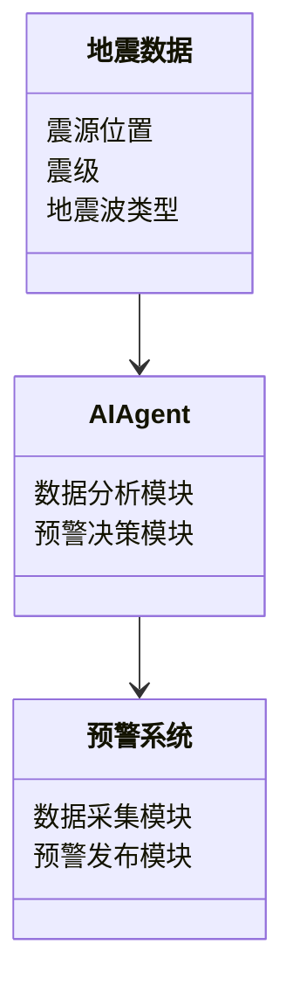
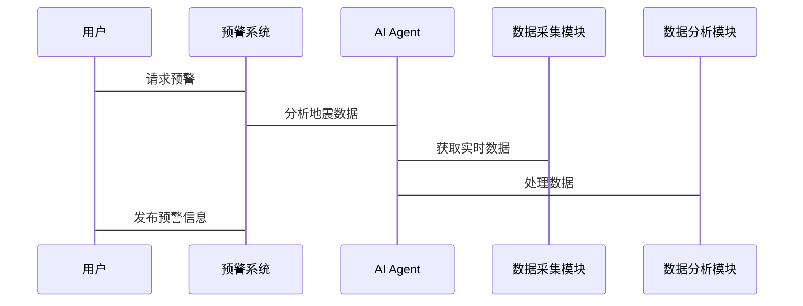

                 


# AI Agent在地震预警中的数据分析应用

---

## 关键词：地震预警，AI Agent，数据分析，机器学习，地震数据

---

## 摘要：  
随着科技的不断进步，地震预警系统的重要性日益凸显。本文探讨了AI Agent在地震预警中的数据分析应用，从地震数据的特征分析、AI Agent的核心作用、算法原理到系统架构设计，再到实际案例的实现，全面解析了AI Agent如何助力地震预警系统的优化与提升。通过本文，读者可以深入了解地震预警的背景、AI Agent的技术优势以及其在地震数据处理中的具体应用。

---

# 第一部分: 地震预警与AI Agent的背景与概念

---

# 第1章: 地震预警概述

## 1.1 地震的基本概念与特征

### 1.1.1 地震的定义与基本特征  
地震是地壳内部能量释放的一种自然现象，通常表现为地面震动。地震的基本特征包括震源位置、震级（Richter scale）和震源深度。震级反映了地震的强度，而震源深度决定了地震影响的范围。

### 1.1.2 地震的分类与影响  
地震可以分为构造地震、火山地震和塌陷地震。构造地震是最常见的类型，主要由板块运动引起。地震对人类社会的影响包括人员伤亡、财产损失以及基础设施的破坏。

### 1.1.3 地震预警的基本原理  
地震预警是指在地震发生后，通过传感器网络快速捕捉地震波信号，并在灾害波及之前向相关区域发出警报。预警系统的核心在于快速分析地震波信号，确定震源位置和震级。

---

## 1.2 AI Agent的基本概念

### 1.2.1 AI Agent的定义  
AI Agent（智能体）是指在计算机系统中能够感知环境、自主决策并执行任务的实体。AI Agent可以是软件程序，也可以是硬件设备，其核心特征包括感知能力、自主决策能力和交互能力。

### 1.2.2 AI Agent的核心特征  
- **感知能力**：通过传感器或数据源获取环境信息。  
- **自主决策能力**：基于感知信息，通过算法做出决策。  
- **交互能力**：与外部系统或用户进行信息交互。  

### 1.2.3 AI Agent与传统算法的区别  
传统算法需要明确的规则和输入，而AI Agent具有自主学习和适应能力，能够根据环境变化动态调整行为。

---

## 1.3 地震预警中的AI Agent应用背景

### 1.3.1 地震预警的传统方法与局限性  
传统的地震预警方法主要依赖地震传感器网络，通过固定的算法分析地震波信号。其局限性在于算法的静态性和对复杂环境的适应能力不足。

### 1.3.2 AI Agent在地震预警中的优势  
AI Agent能够实时分析地震数据，动态调整预警策略，提高预警的准确性和响应速度。

### 1.3.3 当前地震预警技术的发展趋势  
随着人工智能技术的快速发展，地震预警系统正在向智能化、实时化和精准化方向发展。

---

## 1.4 本章小结  
本章介绍了地震的基本概念、AI Agent的核心特征以及其在地震预警中的应用背景，为后续章节的分析奠定了基础。

---

# 第二部分: AI Agent在地震预警中的核心概念与数据分析

---

# 第2章: 地震数据与AI Agent的关系

## 2.1 地震数据的特征与类型

### 2.1.1 地震数据的来源与采集方式  
地震数据主要来源于地震传感器网络，包括地表传感器和地下传感器。数据采集包括模拟信号采集和数字信号采集。

### 2.1.2 地震数据的特征分析  
地震数据的特征包括震源位置、震级、地震波类型（P波和S波）等。这些特征是AI Agent分析的核心内容。

### 2.1.3 地震数据的预处理方法  
预处理包括数据清洗、归一化和特征提取。预处理后的数据更有利于AI Agent的分析。

## 2.2 AI Agent在地震预警中的核心作用

### 2.2.1 数据分析在地震预警中的重要性  
数据分析能够帮助识别地震波模式，预测地震的发展趋势。

### 2.2.2 AI Agent如何处理地震数据  
AI Agent通过机器学习算法分析地震数据，识别潜在的地震模式。

### 2.2.3 AI Agent与地震预警系统的结合  
AI Agent作为地震预警系统的核心模块，负责实时数据分析和预警决策。

## 2.3 地震数据与AI Agent的关系模型

### 2.3.1 数据流图（Mermaid流程图）


### 2.3.2 实体关系图（Mermaid ER图）
```mermaid
graph LR
    D[地震数据] --o> A[AI Agent]
    A --o> P[预警系统]
    P --o> U[用户]
```

---

## 2.4 本章小结  
本章详细分析了地震数据的特征与类型，探讨了AI Agent在地震预警中的核心作用，并通过关系模型展示了地震数据、AI Agent和预警系统之间的关系。

---

# 第三部分: AI Agent在地震预警中的算法原理与系统设计

---

# 第3章: 算法原理与实现

## 3.1 算法选择与原理

### 3.1.1 支持向量机（SVM）算法  
SVM是一种常用的分类算法，适用于地震数据的分类任务。其核心在于找到一个最优超平面，将不同类别的数据分开。

### 3.1.2 算法原理的数学模型  
$$ \text{目标函数: } \min_{w,b} \frac{1}{2}||w||^2 $$
$$ \text{约束条件: } y_i(w \cdot x_i + b) \geq 1 $$

### 3.1.3 算法流程图（Mermaid）  


## 3.2 算法实现与优化

### 3.2.1 算法实现的Python代码  
```python
from sklearn import svm
import numpy as np

# 数据预处理
X = np.array([[特征1, 特征2, ...], [...]])
y = np.array([标签])

# 模型训练
model = svm.SVC()
model.fit(X, y)

# 模型预测
new_data = np.array([[新特征1, 新特征2, ...]])
print(model.predict(new_data))
```

### 3.2.2 算法优化策略  
通过交叉验证和网格搜索优化SVM的参数，提高模型的分类准确率。

---

## 3.3 本章小结  
本章详细分析了AI Agent在地震预警中的算法原理，通过SVM算法的实现和优化，展示了如何利用机器学习技术提高地震预警的准确性。

---

# 第4章: 系统分析与架构设计

## 4.1 系统功能设计

### 4.1.1 领域模型（Mermaid类图）  


### 4.1.2 功能模块划分  
系统主要包括数据采集模块、数据分析模块、预警决策模块和预警发布模块。

## 4.2 系统架构设计

### 4.2.1 系统架构（Mermaid架构图）  


### 4.2.2 系统接口设计  
系统接口包括数据采集接口、模型调用接口和预警发布接口。

## 4.3 系统交互设计

### 4.3.1 系统交互流程（Mermaid序列图）  


---

## 4.4 本章小结  
本章通过系统功能设计和架构设计，展示了AI Agent在地震预警系统中的整体架构和模块交互关系。

---

# 第五部分: 项目实战与总结

---

# 第5章: 项目实战

## 5.1 项目环境与数据准备

### 5.1.1 环境安装  
安装Python、NumPy、Scikit-learn等依赖库。

### 5.1.2 数据获取  
从地震数据库中获取地震数据，包括震源位置、震级和地震波类型。

## 5.2 系统核心实现

### 5.2.1 数据预处理  
```python
import numpy as np

# 数据预处理
X = np.array([[特征1, 特征2, ...], [...]])
y = np.array([标签])

# 标准化处理
from sklearn.preprocessing import StandardScaler
scaler = StandardScaler()
X_scaled = scaler.fit_transform(X)
```

### 5.2.2 模型训练与优化  
```python
from sklearn import svm
from sklearn.model_selection import GridSearchCV

# 参数优化
param_grid = {'C': [1, 10, 100], 'gamma': [0.1, 0.01, 0.001]}
grid = GridSearchCV(svm.SVC(), param_grid, cv=5)
grid.fit(X_scaled, y)
print(grid.best_params_)
```

### 5.2.3 模型部署与预警发布  
```python
# 模型部署
best_model = grid.best_estimator_
new_data = np.array([[新特征1, 新特征2, ...]])
print(best_model.predict(new_data))
```

## 5.3 项目小结

---

# 第6章: 总结与展望

## 6.1 本章总结  
本文详细探讨了AI Agent在地震预警中的数据分析应用，从算法原理到系统设计，再到项目实战，全面展示了AI技术在地震预警中的巨大潜力。

## 6.2 未来展望  
未来，随着AI技术的不断发展，地震预警系统将更加智能化和精准化。结合深度学习、边缘计算等技术，地震预警系统将能够实现更快速的响应和更准确的预测。

---

# 结语  
AI Agent在地震预警中的应用不仅提高了地震预警的准确性，还为人类生命财产的安全提供了有力保障。随着技术的不断进步，AI Agent将在地震预警领域发挥越来越重要的作用。

--- 

* 本文通过逐步分析和详细讲解，帮助读者全面理解AI Agent在地震预警中的数据分析应用。

