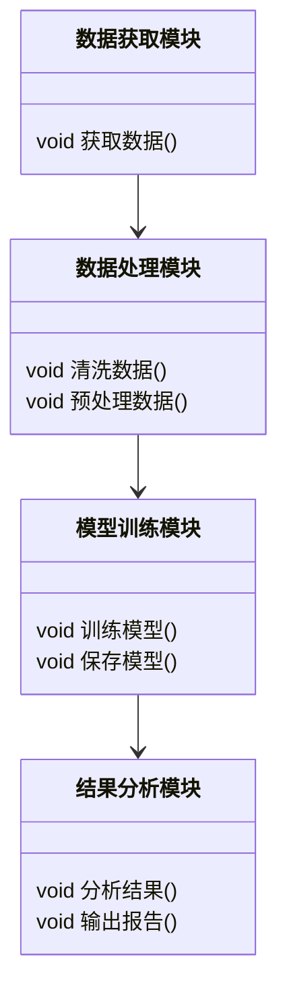
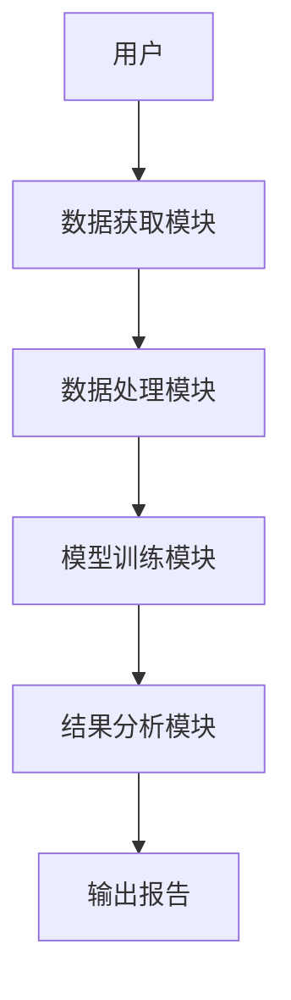

                 


# AI Agent在天文学中的应用：数据处理与模式识别

---

## 关键词：
- AI Agent
- 天文学
- 数据处理
- 模式识别
- 机器学习
- 深度学习

---

## 摘要：
本文深入探讨了AI Agent在天文学中的应用，重点分析了数据处理与模式识别的核心技术。通过结合天文学的实际需求，详细介绍了AI Agent的背景、核心算法、系统架构及项目实战。文章从理论到实践，全面解析了AI Agent如何帮助天文学家处理海量数据并发现新的天体现象。

---

# 第一部分: 背景与基础

## 第1章: AI Agent的基本概念

### 1.1 什么是AI Agent？
- AI Agent的定义与特征
- AI Agent与传统算法的区别
- AI Agent在天文学中的潜力

### 1.2 天文学中的数据处理与模式识别
- 天文学数据的特点
- 数据处理的挑战
- 模式识别的重要性

## 第2章: AI Agent的应用背景

### 2.1 天文学中的数据挑战
- 数据的多样性
- 数据的复杂性
- 数据的实时性

### 2.2 AI Agent的优势
- 高效性
- 自适应性
- 智能性

---

# 第二部分: 核心概念与算法原理

## 第3章: 数据处理的核心算法

### 3.1 数据清洗算法
- 异常值检测
- 数据去重
- 数据填充

#### 示例：使用Python的Pandas库进行数据清洗
```python
import pandas as pd

# 创建示例数据
data = {
    '恒星编号': [1, 2, 3, 4, 5],
    '亮度': [None, 10, 15, None, 20],
    '距离': [100, None, 150, 200, 250]
}
df = pd.DataFrame(data)

# 删除含有缺失值的行
df_clean = df.dropna()

print(df_clean)
```

### 3.2 数据预处理
- 标准化
- 归一化
- 特征提取

## 第4章: 模式识别的核心算法

### 4.1 分类算法
- 监督学习：随机森林、支持向量机
- 无监督学习：K-means、聚类分析

#### 示例：使用K-means进行星系分类
```python
from sklearn.cluster import KMeans

# 示例数据：星系的特征
X = [[1, 2], [1, 3], [2, 2], [10, 11], [10, 12], [11, 10]]

# 初始化K-means模型
kmeans = KMeans(n_clusters=2)
kmeans.fit(X)

# 获取聚类结果
labels = kmeans.labels_
print(labels)
```

### 4.2 异常检测算法
- 基于统计的方法
- 基于深度学习的异常检测

#### 示例：使用Isolation Forest进行异常检测
```python
from sklearn.ensemble import IsolationForest

# 示例数据：恒星的特征
X = [[1, 2], [2, 3], [3, 4], [10, 11], [10, 12], [11, 13]]

# 初始化Isolation Forest模型
iforest = IsolationForest(n_estimators=100)
iforest.fit(X)

# 获取异常分数
scores = iforest.decision_function(X)
print(scores)
```

---

# 第三部分: 系统分析与架构设计

## 第5章: 系统功能设计

### 5.1 领域模型设计
- 数据获取模块
- 数据处理模块
- 模型训练模块
- 结果分析模块

#### 示例：领域模型类图


### 5.2 系统架构设计

#### 示例：系统架构图


### 5.3 系统接口设计

#### 示例：API接口设计
- 获取数据接口：`GET /api/fetch_data`
- 数据处理接口：`POST /api/process_data`
- 模型训练接口：`POST /api/train_model`
- 结果分析接口：`GET /api/get_results`

---

# 第四部分: 项目实战

## 第6章: 项目环境与安装

### 6.1 环境配置
- 安装Python
- 安装必要的库：NumPy、Pandas、Scikit-learn、TensorFlow、Keras

### 6.2 项目代码实现

#### 示例：AI Agent实现恒星分类
```python
import numpy as np
import pandas as pd
from sklearn.model_selection import train_test_split
from sklearn.metrics import accuracy_score
from tensorflow.keras.models import Sequential
from tensorflow.keras.layers import Dense, Dropout

# 示例数据
data = {
    '恒星编号': [1, 2, 3, 4, 5, 6, 7, 8, 9, 10],
    '亮度': [10, 15, 20, 25, 30, 35, 40, 45, 50, 55],
    '距离': [100, 200, 300, 400, 500, 600, 700, 800, 900, 1000],
    '类型': ['主序星', '红巨星', '白矮星', '主序星', '红巨星', '白矮星', '主序星', '红巨星', '白矮星', '主序星']
}

df = pd.DataFrame(data)

# 数据预处理
X = df[['亮度', '距离']]
y = df['类型']

# 划分训练集和测试集
X_train, X_test, y_train, y_test = train_test_split(X, y, test_size=0.2)

# 构建神经网络模型
model = Sequential()
model.add(Dense(64, activation='relu', input_dim=2))
model.add(Dropout(0.5))
model.add(Dense(3, activation='softmax'))

model.compile(optimizer='adam', loss='sparse_categorical_crossentropy', metrics=['accuracy'])

# 训练模型
model.fit(X_train, y_train, epochs=100, batch_size=32, verbose=1)

# 预测
y_pred = model.predict(X_test)
print("准确率:", accuracy_score(y_test, y_pred))
```

## 第7章: 案例分析与总结

### 7.1 案例分析
- 数据清洗的效果评估
- 模型训练的准确率分析
- 模型调优的过程与结果

### 7.2 项目总结
- 项目实现的关键点
- 遇到的问题与解决方案
- 经验与教训

---

# 第五部分: 总结与展望

## 第8章: 总结与最佳实践

### 8.1 核心总结
- AI Agent在天文学中的核心作用
- 数据处理与模式识别的关键技术
- 系统设计与实现的经验总结

### 8.2 最佳实践
- 数据处理的注意事项
- 模型选择的建议
- 系统优化的技巧

## 第9章: 未来展望

### 9.1 技术发展趋势
- 更高效的算法研究
- 更智能的AI Agent设计
- 多模态数据融合的趋势

### 9.2 应用前景
- 天文学研究的更多领域应用
- AI Agent与其他技术的结合
- 未来的挑战与机遇

---

# 附录: 资源与工具推荐

## 附录A: 开发工具
- Python
- Jupyter Notebook
- PyCharm
- VS Code

## 附录B: 推荐库与框架
- NumPy
- Pandas
- Scikit-learn
- TensorFlow
- Keras

## 附录C: 学习资源
- 在线课程推荐
- 书籍推荐
- 论文推荐

---

# 结语

通过本文的详细讲解，读者可以系统地了解AI Agent在天文学中的应用，从基础概念到实际项目实现，全面掌握数据处理与模式识别的关键技术。希望本文能为天文学研究者和AI开发者提供有价值的参考与启发。

