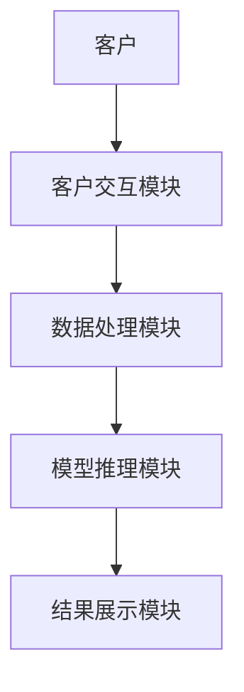
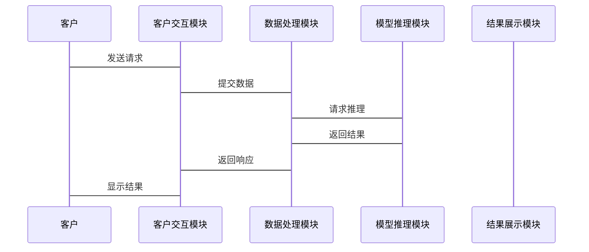

                 


# AI Agent在客户服务中的应用

## 关键词：AI Agent，客户服务，自然语言处理，机器学习，智能客服系统

## 摘要：  
AI Agent（人工智能代理）在客户服务中的应用正在迅速改变传统的客服模式。通过结合自然语言处理、机器学习和强化学习等技术，AI Agent能够实现高效、智能的客户交互，提升客户满意度和企业效率。本文将从AI Agent的核心概念、技术原理、系统架构设计、项目实战以及最佳实践等方面，详细探讨AI Agent在客户服务中的应用。

---

## 第一部分: AI Agent的背景与概念

### 第1章: AI Agent的基本概念

#### 1.1 什么是AI Agent
AI Agent（人工智能代理）是一种能够感知环境、自主决策并执行任务的智能系统。它能够通过与用户交互，理解用户需求，并提供相应的服务或解决方案。AI Agent的核心在于其智能性，能够通过学习和适应不断优化其性能。

#### 1.2 AI Agent的核心特点
- **智能性**：能够理解用户意图，提供个性化的服务。
- **自主性**：无需人工干预，能够自主完成任务。
- **适应性**：能够根据环境变化调整行为。
- **高效性**：通过算法优化，提高服务效率。

#### 1.3 AI Agent与传统客服系统的区别
| 特性                | AI Agent                 | 传统客服系统           |
|---------------------|--------------------------|-----------------------|
| 交互方式            | 自然语言处理             | 人工电话或文本交互     |
| 响应速度            | 实时响应                 | 受限于人工处理速度     |
| 智能性               | 高度智能                 | 依赖人工操作           |
| 成本                 | 降低企业成本             | 人工成本较高           |

---

## 第2章: AI Agent在客户服务中的作用

#### 2.1 提高客户满意度
AI Agent能够通过自然语言处理技术，准确理解客户意图，提供个性化的服务，从而提高客户满意度。

#### 2.2 提升服务效率
AI Agent能够同时处理多个客户请求，显著提升服务效率，减少客户等待时间。

#### 2.3 降低企业成本
通过自动化处理客户咨询和问题，AI Agent能够大幅降低企业的人力成本。

---

## 第3章: AI Agent的发展趋势

#### 3.1 技术驱动因素
- 自然语言处理（NLP）技术的进步，使得AI Agent能够更准确地理解用户需求。
- 机器学习和深度学习算法的优化，提高了AI Agent的智能性和适应性。

#### 3.2 市场需求变化
- 客户对高效、智能服务的需求不断增加。
- 企业希望通过技术手段提升竞争力，降低运营成本。

#### 3.3 未来发展方向
- 更加智能化：结合强化学习，实现更复杂的任务处理。
- 更加个性化：根据客户历史数据，提供定制化服务。
- 更加安全：加强数据保护，确保客户隐私安全。

---

## 第二部分: AI Agent的核心原理与技术

### 第4章: AI Agent的核心原理

#### 4.1 自然语言处理（NLP）
自然语言处理是AI Agent实现智能交互的基础。通过NLP技术，AI Agent能够理解用户的文本或语音输入，并生成相应的回复。

#### 4.2 机器学习（ML）
机器学习用于训练AI Agent的学习能力，使其能够从大量数据中提取模式，并进行预测和分类。

#### 4.3 强化学习（RL）
强化学习用于优化AI Agent的决策过程，通过不断试错，提升其在复杂场景下的决策能力。

---

## 第5章: AI Agent的关键技术

#### 5.1 感知层
- **数据采集**：通过API接口获取客户输入。
- **数据处理**：对输入数据进行清洗和预处理。

#### 5.2 决策层
- **模型推理**：基于训练好的模型，生成响应。
- **策略选择**：根据当前状态选择最优的应对策略。

#### 5.3 执行层
- **结果输出**：将生成的响应返回给用户。
- **反馈收集**：收集用户反馈，用于模型优化。

---

## 第三部分: AI Agent的系统架构与设计

### 第6章: 系统架构概述

#### 6.1 分层架构
分层架构将系统划分为数据层、业务逻辑层和表现层，便于模块化开发和维护。

#### 6.2 微服务架构
微服务架构通过将系统分解为多个独立的服务，提高了系统的可扩展性和灵活性。

#### 6.3 组件化设计
组件化设计通过将系统功能模块化，便于团队协作和功能复用。

---

## 第7章: 系统功能设计

#### 7.1 客户交互模块
- **用户输入**：支持文本和语音输入。
- **多轮对话**：能够处理连续的对话上下文。

#### 7.2 数据处理模块
- **数据清洗**：对输入数据进行预处理。
- **数据存储**：将交互数据存储到数据库中。

#### 7.3 模型推理模块
- **模型加载**：加载预训练好的模型。
- **推理执行**：根据输入生成响应。

#### 7.4 结果展示模块
- **响应生成**：将推理结果转换为自然语言文本。
- **反馈展示**：将反馈信息展示给用户。

---

## 第四部分: AI Agent的算法原理与实现

### 第8章: 算法原理

#### 8.1 基于规则的AI Agent
基于规则的AI Agent通过预定义的规则来处理客户请求，适用于简单的场景。

#### 8.2 基于模型的AI Agent
基于模型的AI Agent通过机器学习模型来生成响应，适用于复杂的场景。

---

## 第五部分: AI Agent的系统分析与架构设计方案

### 第9章: 系统分析与架构设计

#### 9.1 系统架构图


#### 9.2 系统接口设计
- **API接口**：提供RESTful API，供其他系统调用。
- **接口安全**：通过JWT进行身份验证。

#### 9.3 系统交互流程


---

## 第六部分: AI Agent的项目实战

### 第10章: 项目实战

#### 10.1 项目背景
一个智能客服机器人项目，旨在通过AI Agent技术为用户提供24/7的智能客服服务。

#### 10.2 环境安装
```bash
pip install numpy scikit-learn transformers
```

#### 10.3 核心代码实现
```python
from transformers import pipeline

# 初始化NLP pipeline
nlp_pipeline = pipeline("text-classification", model="bert-base-uncased")

def process_customer_query(query):
    # 数据预处理
    inputs = nlp_pipeline.tokenizer(query, return_tensors="pt")
    # 模型推理
    outputs = nlp_pipeline.model(**inputs)
    # 获取预测结果
    prediction = nlp_pipeline.post_processor(outputs, inputs)
    return prediction
```

#### 10.4 功能解读与案例分析
- **功能解读**：通过NLP技术实现智能问答。
- **案例分析**：处理客户咨询，生成个性化的回复。

#### 10.5 项目小结
- 成功实现了智能客服机器人。
- 提高了客户满意度和企业效率。

---

## 第七部分: AI Agent的最佳实践与总结

### 第11章: 最佳实践

#### 11.1 数据质量的重要性
确保数据的多样性和代表性，能够提高模型的泛化能力。

#### 11.2 模型可解释性
选择可解释性较强的模型，有助于调试和优化。

#### 11.3 安全与隐私
加强数据保护，确保客户隐私安全。

#### 11.4 拓展阅读
- 《Deep Learning》
- 《自然语言处理入门》

---

## 第八部分: 总结与展望

### 第12章: 总结
AI Agent在客户服务中的应用前景广阔，能够显著提升客户体验和企业效率。通过不断优化算法和系统架构，AI Agent将更好地服务于未来的客户服务需求。

### 第13章: 展望
随着技术的进步，AI Agent将更加智能化和个性化，为企业和客户创造更大的价值。

---

以上是《AI Agent在客户服务中的应用》的技术博客文章的完整目录结构和内容概述。

