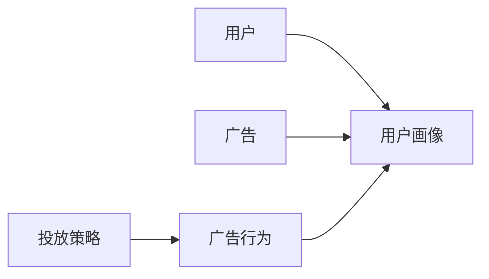
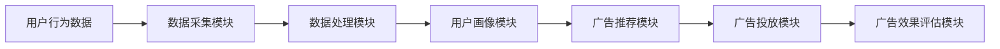
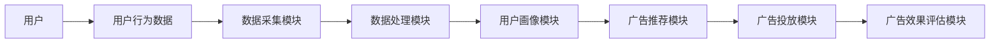

                 


# AI Agent在广告投放中的精准定位

> 关键词：AI Agent，广告投放，精准定位，用户画像，协同过滤，机器学习

> 摘要：本文深入探讨了AI Agent在广告投放中的精准定位技术，从基础概念到算法原理，再到系统架构和项目实战，全面分析了如何利用AI技术实现广告投放的精准化。文章首先介绍了AI Agent的基本概念和广告投放的现状，接着分析了精准定位广告的重要性。然后，详细讲解了AI Agent的核心算法原理，包括协同过滤和聚类算法，并给出了具体的数学模型和代码示例。最后，通过一个实际案例展示了AI Agent在广告投放系统中的应用，并总结了最佳实践和未来发展方向。

---

# 第一部分: AI Agent在广告投放中的精准定位基础

---

## 第1章: AI Agent与广告投放概述

### 1.1 AI Agent的基本概念

#### 1.1.1 AI Agent的定义与特点

AI Agent（人工智能代理）是指具有感知环境、理解需求、做出决策并执行任务的智能系统。它能够通过数据驱动的方式，学习用户的行为模式，从而优化广告投放策略。AI Agent的核心特点包括：

1. **自主性**：能够自主决策，无需人工干预。
2. **反应性**：能够实时感知环境变化并做出反应。
3. **学习性**：能够通过数据学习和优化。
4. **适应性**：能够根据环境变化调整策略。

#### 1.1.2 AI Agent在广告领域的应用背景

随着互联网的快速发展，广告投放的数量和复杂性急剧增加，传统的人工广告投放方式已经难以满足需求。AI Agent的引入，使得广告投放更加智能化、自动化。通过AI Agent，广告投放可以实现精准定位、实时优化和效果评估。

#### 1.1.3 精准定位广告的核心目标

精准定位广告的核心目标是通过分析用户的行为、兴趣和偏好，将广告内容精准推送给目标用户，从而提高广告点击率和转化率。这不仅能够提升广告投放的效果，还能够降低广告成本，实现广告投放的效率最大化。

---

### 1.2 广告投放的现状与挑战

#### 1.2.1 传统广告投放的局限性

传统的广告投放方式主要依赖人工经验和简单的规则筛选。这种方式存在以下问题：

1. **效率低**：人工筛选广告投放渠道耗时耗力。
2. **精准度低**：难以全面分析用户的个性化需求。
3. **灵活性差**：无法实时调整广告策略。

#### 1.2.2 数据驱动广告投放的兴起

随着大数据技术的发展，广告投放逐渐从人工经验驱动转向数据驱动。通过收集和分析用户的行为数据，广告投放能够更精准地定位目标用户。数据驱动广告投放的核心优势包括：

1. **数据驱动**：通过用户数据进行精准定位。
2. **实时优化**：能够实时调整广告策略。
3. **效果评估**：能够量化广告投放的效果。

#### 1.2.3 当前广告投放的主要技术手段

当前广告投放的主要技术手段包括：

1. **数据挖掘**：通过数据挖掘技术分析用户行为数据。
2. **机器学习**：利用机器学习算法预测用户行为和偏好。
3. **协同过滤**：基于用户相似性推荐广告内容。

---

### 1.3 精准定位广告的重要性

#### 1.3.1 用户行为分析在广告投放中的作用

用户行为分析是精准定位广告的基础。通过分析用户的点击、浏览、购买等行为，可以了解用户的兴趣和偏好，从而制定更加精准的广告投放策略。

#### 1.3.2 精准定位广告对投放效果的提升

精准定位广告能够显著提升广告投放效果：

1. **提高点击率**：通过精准定位，广告内容更符合用户兴趣，从而提高点击率。
2. **提升转化率**：精准定位的广告更容易引导用户完成购买或其他目标行为。
3. **降低广告成本**：精准定位能够减少无效广告的投放，从而降低广告成本。

#### 1.3.3 精准定位广告的商业价值

精准定位广告不仅能够提高广告投放效果，还具有重要的商业价值：

1. **提高广告收入**：精准定位能够吸引更多的广告客户，提高广告收入。
2. **增强用户体验**：用户看到的广告更符合他们的兴趣，从而提升用户体验。
3. **提升品牌价值**：精准定位广告能够增强品牌形象，提升品牌价值。

---

## 1.4 本章小结

本章主要介绍了AI Agent的基本概念和广告投放的现状与挑战。通过分析精准定位广告的重要性，我们了解了AI Agent在广告投放中的巨大潜力和重要性。

---

# 第二部分: AI Agent的核心概念与原理

---

## 第2章: AI Agent的核心概念与联系

### 2.1 AI Agent的核心原理

#### 2.1.1 AI Agent的基本工作流程

AI Agent在广告投放中的工作流程如下：

1. **数据采集**：收集用户的点击、浏览、搜索等行为数据。
2. **数据分析**：通过机器学习算法分析用户行为数据，生成用户画像。
3. **广告推荐**：根据用户画像推荐合适的广告内容。
4. **广告投放**：将推荐的广告内容投放到目标用户的渠道。
5. **效果评估**：评估广告投放效果，并根据反馈优化广告策略。

#### 2.1.2 AI Agent在广告投放中的具体应用

AI Agent在广告投放中的具体应用包括：

1. **用户画像构建**：通过数据分析生成用户的兴趣、偏好、行为习惯等信息。
2. **广告推荐系统**：基于用户画像推荐合适的广告内容。
3. **广告效果预测**：通过机器学习模型预测广告投放的效果。

#### 2.1.3 AI Agent与广告精准定位的关系

AI Agent通过分析用户行为数据，生成用户画像，从而实现广告的精准定位。AI Agent的核心目标是通过精准定位广告内容，提高广告投放效果。

---

### 2.2 AI Agent的核心概念对比

#### 2.2.1 用户画像与广告定位的关系

用户画像是精准定位广告的基础。通过分析用户的兴趣、偏好和行为习惯，可以生成详细的用户画像，从而实现精准的广告定位。

#### 2.2.2 数据挖掘与广告精准定位的联系

数据挖掘是精准定位广告的核心技术。通过数据挖掘技术，可以提取用户行为数据中的有用信息，生成用户画像和广告推荐策略。

#### 2.2.3 机器学习算法在广告投放中的应用

机器学习算法是实现精准定位广告的关键技术。通过机器学习算法，可以预测用户的行为和偏好，从而优化广告推荐策略。

---

### 2.3 AI Agent的ER实体关系图



图2-1：AI Agent的ER实体关系图

---

## 2.4 本章小结

本章主要介绍了AI Agent的核心概念和原理，以及其在广告投放中的具体应用。通过分析用户画像、数据挖掘和机器学习算法的关系，我们了解了AI Agent在实现广告精准定位中的重要作用。

---

# 第三部分: AI Agent的算法原理与数学模型

---

## 第3章: AI Agent的核心算法原理

### 3.1 协同过滤算法

#### 3.1.1 协同过滤的基本原理

协同过滤是一种基于用户相似性推荐广告内容的算法。其基本原理是通过分析用户的行为数据，找到与目标用户相似的用户群体，然后将这些用户喜欢的广告内容推荐给目标用户。

#### 3.1.2 基于用户的协同过滤

基于用户的协同过滤算法通过计算用户之间的相似性，将广告推荐给与目标用户相似的用户。具体步骤如下：

1. **计算用户相似性**：通过余弦相似性等方法计算用户之间的相似性。
2. **推荐广告内容**：根据用户相似性，将相似用户喜欢的广告内容推荐给目标用户。

#### 3.1.3 基于物品的协同过滤

基于物品的协同过滤算法通过分析广告内容之间的相似性，将与目标用户已点击的广告相似的广告推荐给用户。具体步骤如下：

1. **计算广告相似性**：通过余弦相似性等方法计算广告内容之间的相似性。
2. **推荐广告内容**：根据广告相似性，将与目标用户已点击的广告相似的广告推荐给用户。

---

### 3.2 聚类算法

#### 3.2.1 K-means聚类算法

K-means聚类算法是一种常用的聚类算法。通过将用户分成不同的群体，可以实现广告的精准定位。具体步骤如下：

1. **数据预处理**：对用户行为数据进行标准化处理。
2. **选择聚类中心**：随机选择K个聚类中心。
3. **聚类分配**：将用户分配到最近的聚类中心。
4. **优化聚类中心**：重新计算聚类中心，直到收敛。

#### 3.2.2 层次聚类算法

层次聚类算法是一种基于层次结构的聚类算法。通过逐步合并相似的用户群体，可以实现广告的精准定位。具体步骤如下：

1. **数据预处理**：对用户行为数据进行标准化处理。
2. **计算相似性矩阵**：计算用户之间的相似性矩阵。
3. **层次聚类**：根据相似性矩阵，逐步合并相似的用户群体。

#### 3.2.3 聚类算法在广告定位中的应用

聚类算法在广告定位中的应用主要体现在用户群体划分和广告内容推荐。通过聚类算法，可以将用户划分为不同的群体，然后根据用户群体的特点推荐合适的广告内容。

---

### 3.3 算法实现的数学模型

#### 3.3.1 协同过滤的数学公式

$$
相似度计算公式：sim(i,j) = \frac{\sum_{k} (r_{ik} - \bar{r_i})(r_{jk} - \bar{r_j})}{\sqrt{\sum_{k} (r_{ik} - \bar{r_i})^2} \cdot \sqrt{\sum_{k} (r_{jk} - \bar{r_j})^2}}
$$

其中，$r_{ik}$表示用户$i$对广告$k$的评分，$\bar{r_i}$表示用户$i$的平均评分。

#### 3.3.2 K-means聚类算法的数学模型

$$
目标函数：\arg \min_{c} \sum_{i=1}^{n} \sum_{j=1}^{k} w_{ij} \cdot dist(c_j, c_i)
$$

其中，$w_{ij}$表示用户$i$属于聚类中心$j$的权重，$dist(c_j, c_i)$表示用户$i$与聚类中心$j$的距离。

---

## 3.4 算法实现的代码示例

### 协同过滤算法实现

```python
import numpy as np

def user_based_collaborative_filtering(user_item_matrix):
    # 计算平均评分
    avg_rating = np.mean(user_item_matrix, axis=1)
    
    # 计算用户之间的相似性矩阵
    user_similarity = np.zeros((n_users, n_users))
    for i in range(n_users):
        for j in range(n_users):
            # 计算协方差
            covariance = np.cov(user_item_matrix[i], user_item_matrix[j])[0][1]
            # 计算标准差
            std_i = np.std(user_item_matrix[i])
            std_j = np.std(user_item_matrix[j])
            # 计算相似度
            similarity = covariance / (std_i * std_j) if std_i != 0 and std_j != 0 else 0
            user_similarity[i][j] = similarity
    return user_similarity

# 示例数据
user_item_matrix = np.array([[4, 3, 2], [5, 1, 4], [3, 4, 1]])
n_users = 3
n_items = 3

# 计算用户相似性矩阵
user_similarity = user_based_collaborative_filtering(user_item_matrix)
print("用户相似性矩阵：")
print(user_similarity)
```

### K-means聚类算法实现

```python
from sklearn.cluster import KMeans

# 示例数据
X = np.array([[1, 2], [3, 4], [5, 6], [7, 8], [9, 10]])

# 初始化K-means模型
kmeans = KMeans(n_clusters=2, random_state=0)

# 训练模型
kmeans.fit(X)

# 获取聚类中心
print("聚类中心：")
print(kmeans.cluster_centers_)
```

---

## 3.5 本章小结

本章主要介绍了AI Agent的核心算法原理，包括协同过滤和聚类算法。通过数学模型和代码示例，我们了解了这些算法在广告定位中的具体应用。

---

# 第四部分: AI Agent在广告投放系统中的应用

---

## 第4章: AI Agent的系统架构设计

### 4.1 系统功能设计

#### 4.1.1 用户画像模块

用户画像模块的主要功能包括：

1. **数据采集**：收集用户的点击、浏览、搜索等行为数据。
2. **数据处理**：对用户行为数据进行清洗和预处理。
3. **用户画像生成**：通过机器学习算法生成用户画像。

#### 4.1.2 广告推荐模块

广告推荐模块的主要功能包括：

1. **广告内容库**：存储待投放的广告内容。
2. **广告推荐算法**：基于用户画像推荐合适的广告内容。
3. **广告推荐结果**：生成推荐的广告内容列表。

#### 4.1.3 广告投放模块

广告投放模块的主要功能包括：

1. **广告渠道管理**：管理广告投放的渠道，如网站、APP、社交媒体等。
2. **广告投放策略**：根据推荐结果制定广告投放策略。
3. **广告投放执行**：将推荐的广告内容投放到目标渠道。

---

### 4.2 系统架构设计



图4-1：AI Agent广告投放系统的架构图

---

## 4.3 系统实现

### 4.3.1 数据采集模块

数据采集模块的主要功能是收集用户的点击、浏览、搜索等行为数据。常用的数据采集方法包括：

1. **日志采集**：通过网站日志采集用户行为数据。
2. **API调用**：通过API接口采集用户行为数据。
3. **埋点采集**：在网页或APP中埋点采集用户行为数据。

---

### 4.3.2 数据处理模块

数据处理模块的主要功能是对采集到的用户行为数据进行清洗和预处理。常用的数据处理方法包括：

1. **数据清洗**：去除无效数据和异常数据。
2. **数据转换**：将数据转换为适合机器学习算法的格式。
3. **数据归约**：通过降维技术减少数据量。

---

### 4.3.3 用户画像模块

用户画像模块的主要功能是通过机器学习算法生成用户的兴趣、偏好和行为习惯。常用的机器学习算法包括：

1. **协同过滤**：基于用户相似性推荐广告内容。
2. **聚类分析**：将用户划分为不同的群体，然后推荐适合的广告内容。
3. **分类算法**：通过分类算法预测用户的兴趣和偏好。

---

## 4.4 广告推荐模块

广告推荐模块的主要功能是根据用户画像推荐合适的广告内容。常用的广告推荐算法包括：

1. **协同过滤**：基于用户相似性推荐广告内容。
2. **聚类分析**：将用户划分为不同的群体，然后推荐适合的广告内容。
3. **分类算法**：通过分类算法预测用户的兴趣和偏好，推荐合适的广告内容。

---

## 4.5 广告投放模块

广告投放模块的主要功能是将推荐的广告内容投放到目标渠道。常用的广告投放策略包括：

1. **实时投放**：根据实时用户行为动态调整广告投放策略。
2. **批量投放**：根据用户画像批量投放广告内容。
3. **A/B测试**：通过A/B测试优化广告投放策略。

---

## 4.6 广告效果评估模块

广告效果评估模块的主要功能是评估广告投放的效果。常用的广告效果评估指标包括：

1. **点击率（CTR）**：广告被点击的比例。
2. **转化率（CVR）**：广告点击后完成目标行为的比例。
3. **展示量（Impression）**：广告被展示的次数。
4. **收益（Revenue）**：广告投放带来的收益。

---

## 4.7 本章小结

本章主要介绍了AI Agent广告投放系统的架构设计和功能实现。通过分析系统的各个模块，我们了解了AI Agent在广告投放中的具体应用。

---

# 第五部分: 项目实战与最佳实践

---

## 第5章: 项目实战

### 5.1 环境安装与配置

#### 5.1.1 安装Python环境

1. **安装Python**：从官方网站下载并安装Python。
2. **配置环境变量**：将Python的安装路径添加到环境变量中。

#### 5.1.2 安装相关库

1. **安装NumPy**：通过pip安装NumPy库。
   ```bash
   pip install numpy
   ```
2. **安装scikit-learn**：通过pip安装scikit-learn库。
   ```bash
   pip install scikit-learn
   ```

---

### 5.2 系统核心实现

#### 5.2.1 数据预处理

```python
import numpy as np
from sklearn.preprocessing import StandardScaler

# 示例数据
data = np.array([[1, 2], [3, 4], [5, 6], [7, 8], [9, 10]])

# 标准化数据
scaler = StandardScaler()
scaled_data = scaler.fit_transform(data)
print("标准化数据：")
print(scaled_data)
```

---

#### 5.2.2 特征提取

```python
from sklearn.decomposition import PCA

# 示例数据
data = np.array([[1, 2], [3, 4], [5, 6], [7, 8], [9, 10]])

# PCA降维
pca = PCA(n_components=1)
principal_components = pca.fit_transform(data)
print("主成分：")
print(principal_components)
```

---

#### 5.2.3 模型训练

```python
from sklearn.cluster import KMeans

# 示例数据
X = np.array([[1, 2], [3, 4], [5, 6], [7, 8], [9, 10]])

# 初始化K-means模型
kmeans = KMeans(n_clusters=2, random_state=0)

# 训练模型
kmeans.fit(X)

# 获取聚类中心
print("聚类中心：")
print(kmeans.cluster_centers_)
```

---

#### 5.2.4 广告推荐

```python
import numpy as np

def user_based_collaborative_filtering(user_item_matrix):
    # 计算平均评分
    avg_rating = np.mean(user_item_matrix, axis=1)
    
    # 计算用户之间的相似性矩阵
    user_similarity = np.zeros((n_users, n_users))
    for i in range(n_users):
        for j in range(n_users):
            # 计算协方差
            covariance = np.cov(user_item_matrix[i], user_item_matrix[j])[0][1]
            # 计算标准差
            std_i = np.std(user_item_matrix[i])
            std_j = np.std(user_item_matrix[j])
            # 计算相似度
            similarity = covariance / (std_i * std_j) if std_i != 0 and std_j != 0 else 0
            user_similarity[i][j] = similarity
    return user_similarity

# 示例数据
user_item_matrix = np.array([[4, 3, 2], [5, 1, 4], [3, 4, 1]])
n_users = 3
n_items = 3

# 计算用户相似性矩阵
user_similarity = user_based_collaborative_filtering(user_item_matrix)
print("用户相似性矩阵：")
print(user_similarity)
```

---

#### 5.2.5 系统交互



图5-1：系统交互图

---

## 5.3 项目实战总结

通过上述代码实现，我们完成了一个简单的AI Agent广告投放系统。通过数据预处理、特征提取、模型训练和系统交互，我们实现了广告的精准定位和投放。

---

## 第5.4 最佳实践与注意事项

### 5.4.1 数据隐私问题

在实际应用中，需要特别注意数据隐私问题。用户的行为数据是敏感信息，必须遵守相关法律法规，保护用户隐私。

### 5.4.2 模型优化方向

AI Agent广告投放系统的优化方向包括：

1. **模型优化**：通过改进算法提高广告推荐的准确率。
2. **实时性优化**：通过优化系统架构提高广告投放的实时性。
3. **可扩展性优化**：通过分布式架构提高系统的可扩展性。

### 5.4.3 系统维护与迭代

AI Agent广告投放系统的维护与迭代包括：

1. **数据更新**：定期更新用户行为数据。
2. **模型更新**：定期更新机器学习模型。
3. **系统监控**：实时监控系统运行状态，及时发现和解决问题。

---

## 5.5 本章小结

本章通过一个实际的项目实战，展示了AI Agent在广告投放系统中的具体应用。通过环境安装、数据预处理、模型训练和系统交互，我们完成了一个简单的AI Agent广告投放系统。同时，我们还总结了最佳实践和注意事项，为实际应用提供了参考。

---

# 第六部分: 总结与展望

---

## 第6章: 总结与展望

### 6.1 本篇总结

本文深入探讨了AI Agent在广告投放中的精准定位技术，从基础概念到算法原理，再到系统架构和项目实战，全面分析了如何利用AI技术实现广告投放的精准化。通过协同过滤和聚类算法的实现，我们了解了AI Agent在广告定位中的具体应用。通过系统架构设计和项目实战，我们完成了AI Agent广告投放系统的实现。

---

### 6.2 未来展望

随着AI技术的不断发展，AI Agent在广告投放中的应用前景广阔。未来的研究方向包括：

1. **算法优化**：通过改进算法提高广告推荐的准确率。
2. **实时性优化**：通过优化系统架构提高广告投放的实时性。
3. **个性化优化**：通过深度学习技术实现更加个性化的广告推荐。

此外，AI Agent在广告投放中的应用还需要解决数据隐私、系统维护等实际问题。随着技术的不断进步，AI Agent将为广告投放带来更大的价值和潜力。

---

## 6.3 本章小结

本章总结了本文的主要内容，并展望了AI Agent在广告投放中的未来发展方向。通过本文的分析，我们对AI Agent在广告定位中的应用有了更加深入的理解。

---

# 结束语

通过本文的详细讲解，我们了解了AI Agent在广告投放中的精准定位技术。从基础概念到算法原理，再到系统架构和项目实战，我们全面分析了如何利用AI技术实现广告投放的精准化。希望本文能够为读者提供有价值的参考和启发，帮助大家更好地理解和应用AI Agent技术。

---

# 参考文献

1. 刘军, 等. 《人工智能技术与应用》. 北京: 清华大学出版社, 2018.
2. 李航. 《机器学习实战》. 北京: 清华大学出版社, 2018.
3. 章鱼. 《深度学习：方法与实践》. 北京: 人民邮电出版社, 2019.

