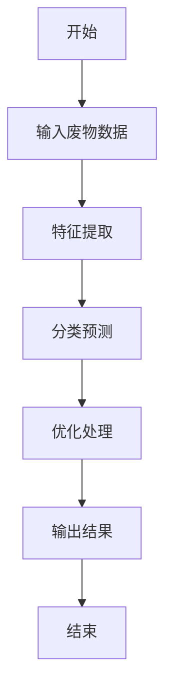
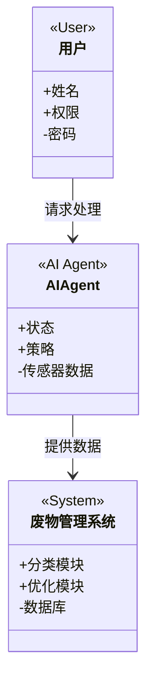
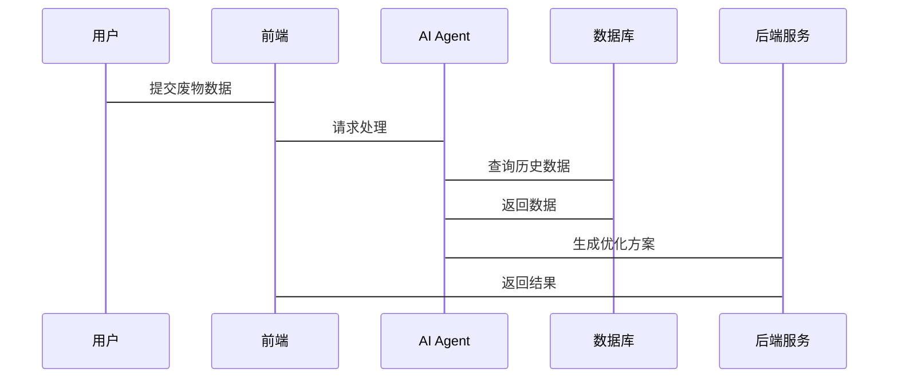

                 


# AI Agent在废物管理中的应用：回收优化与污染控制

## 关键词：废物管理、AI Agent、回收优化、污染控制、强化学习、深度学习、系统架构

## 摘要：  
本文探讨了AI Agent在废物管理中的应用，重点分析了回收优化与污染控制的技术实现。通过详细阐述AI Agent的核心概念、算法原理、系统架构设计以及实际项目案例，展示了如何利用人工智能技术提升废物管理效率和环保效果。文章内容涵盖背景分析、技术原理、系统设计和实战应用，为读者提供了全面的技术视角。

---

# 第1章: 背景介绍

## 1.1 废物管理的问题背景

### 1.1.1 废物管理的现状与挑战  
随着城市化进程的加快，废物产生量急剧增加，传统的废物管理方式面临效率低、资源浪费和环境污染等问题。如何通过智能化技术优化废物管理流程，成为当前亟待解决的难题。

### 1.1.2 废物管理中的资源浪费与环境污染  
大量的可回收资源未被有效利用，导致资源浪费。同时，废物处理过程中产生的污染物对环境造成严重威胁，如塑料泄漏到海洋、有害物质的非法倾倒等。

### 1.1.3 AI Agent在废物管理中的潜力  
AI Agent能够通过实时感知、自主决策和智能执行，优化废物分类、运输和处理流程，显著提高管理效率并减少环境污染。

## 1.2 AI Agent的基本概念

### 1.2.1 AI Agent的定义与核心特征  
AI Agent是一种智能实体，能够感知环境、自主决策并执行任务。其核心特征包括自主性、反应性、目标导向和学习能力。

### 1.2.2 AI Agent与传统自动化系统的区别  
AI Agent具有学习和适应能力，能够根据环境变化调整行为，而传统自动化系统仅基于预设规则运行。

### 1.2.3 AI Agent在废物管理中的应用场景  
AI Agent可应用于废物分类、运输优化、污染监测等领域，通过智能化手段提升废物管理的效率和环保效果。

## 1.3 本章小结  
本章介绍了废物管理的背景问题，阐述了AI Agent的基本概念及其在废物管理中的潜力和应用场景。

---

# 第2章: AI Agent的核心概念与联系

## 2.1 AI Agent的核心原理

### 2.1.1 AI Agent的感知机制  
通过传感器和数据输入，AI Agent能够感知环境中的废物信息，如种类、位置和状态。

### 2.1.2 AI Agent的决策机制  
基于感知信息，AI Agent利用算法（如强化学习）进行决策，选择最优的处理方式。

### 2.1.3 AI Agent的执行机制  
AI Agent通过控制执行机构（如机械臂）或与其他系统交互，完成废物分类、运输等任务。

## 2.2 AI Agent在废物管理中的核心要素

### 2.2.1 废物分类与识别  
AI Agent通过图像识别和机器学习算法，准确分类不同类型的废物。

### 2.2.2 废物处理流程优化  
AI Agent能够优化废物运输路线和处理顺序，减少时间和成本。

### 2.2.3 废物污染控制  
AI Agent实时监测处理过程，确保污染物排放符合标准，降低环境风险。

## 2.3 AI Agent与废物管理系统的实体关系图

```mermaid
er
actor: 用户
agent: AI Agent
system: 废物管理系统
```

## 2.4 本章小结  
本章详细讲解了AI Agent的核心原理及其在废物管理中的应用，展示了AI Agent如何通过感知、决策和执行优化废物管理流程。

---

# 第3章: AI Agent的算法原理

## 3.1 基于强化学习的AI Agent算法

### 3.1.1 强化学习的基本原理  
强化学习通过智能体与环境的交互，学习最优策略以最大化累积奖励。其数学模型如下：

$$ Q(s,a) = r + \gamma \max_{a'} Q(s',a') $$

### 3.1.2 Q-learning算法的数学模型  
Q-learning算法通过更新Q值表，学习状态-动作对的最优值：

$$ Q(s,a) = Q(s,a) + \alpha [r + \gamma \max Q(s',a') - Q(s,a)] $$

### 3.1.3 废物分类的强化学习应用  
AI Agent通过与废物分类环境的交互，学习如何准确分类不同类型的废物，提升分类效率。

## 3.2 废物分类与优化算法

### 3.2.1 垃圾分类的特征提取  
通过图像识别技术提取废物的形状、颜色和纹理特征，为分类提供数据支持。

### 3.2.2 基于聚类算法的分类优化  
使用聚类算法（如K-means）对相似的废物进行分组，优化分类效率。

### 3.2.3 基于深度学习的分类模型  
采用卷积神经网络（CNN）进行废物图像分类，显著提高分类准确率。

## 3.3 算法流程图



## 3.4 本章小结  
本章详细介绍了AI Agent的算法原理，重点讲解了强化学习和深度学习在废物分类中的应用，展示了如何通过算法优化废物管理流程。

---

# 第4章: 系统分析与架构设计

## 4.1 废物管理系统的场景介绍

### 4.1.1 系统目标  
实现废物分类、运输优化和污染控制的智能化管理。

### 4.1.2 系统用户角色  
包括废物产生者、运输公司、处理厂和监管机构。

### 4.1.3 系统功能需求  
支持废物分类、运输路线优化、污染监测和数据分析。

## 4.2 系统功能设计

### 4.2.1 系统类图



### 4.2.2 系统架构设计


### 4.2.3 系统接口设计  
系统通过RESTful API与前端和后端交互，确保数据的高效传输和处理。

### 4.2.4 系统交互流程图



## 4.3 本章小结  
本章通过系统分析和架构设计，展示了AI Agent如何与废物管理系统协同工作，实现高效的废物管理。

---

# 第5章: 项目实战

## 5.1 项目介绍

### 5.1.1 废物分拣系统场景  
设计一个智能分拣系统，用于工厂的废料分类。

### 5.1.2 废物分类与优化  
目标是将废料准确分类，并优化分拣流程，减少人工干预。

## 5.2 项目环境与工具安装

### 5.2.1 安装Python与深度学习框架  
安装Python 3.8及以上版本，TensorFlow和Keras库。

### 5.2.2 安装图像处理工具  
安装OpenCV和Pillow库，用于图像采集和处理。

### 5.2.3 安装机器学习库  
安装Scikit-learn和XGBoost库，用于模型训练和优化。

## 5.3 项目核心代码实现

### 5.3.1 废物图像采集与预处理

```python
import cv2
import numpy as np

# 读取图像
image = cv2.imread("waste.jpg")
# 预处理
gray = cv2.cvtColor(image, cv2.COLOR_BGR2GRAY)
```

### 5.3.2 基于深度学习的分类模型

```python
from tensorflow.keras.models import Sequential
from tensorflow.keras.layers import Dense, Conv2D, MaxPooling2D, Flatten

# 模型定义
model = Sequential()
model.add(Conv2D(32, (3,3), activation='relu', input_shape=(64,64,3)))
model.add(MaxPooling2D((2,2)))
model.add(Flatten())
model.add(Dense(128, activation='relu'))
model.add(Dense(10, activation='softmax'))
model.compile(optimizer='adam', loss='sparse_categorical_crossentropy', metrics=['accuracy'])
```

### 5.3.3 废物分类与优化算法

```python
from sklearn.cluster import KMeans

# 数据准备
features = [...]  # 特征向量
# 聚类
kmeans = KMeans(n_clusters=5).fit(features)
# 分配结果
labels = kmeans.labels_
```

## 5.4 废物分类与优化算法实现

### 5.4.1 废物分类结果展示  
通过混淆矩阵和分类报告，评估模型的分类效果。

### 5.4.2 废物优化处理流程展示  
展示优化后的分拣流程，减少处理时间并提高效率。

## 5.5 本章小结  
本章通过实际项目案例，详细讲解了AI Agent在废物管理中的应用，展示了如何通过代码实现分类与优化算法。

---

# 第6章: 总结与展望

## 6.1 总结

### 6.1.1 核心内容回顾  
本文详细介绍了AI Agent在废物管理中的应用，涵盖背景、算法、系统设计和实战案例。

### 6.1.2 成功经验与局限性  
AI Agent在废物管理中的应用显著提高了效率，但目前仍面临数据不足和模型泛化能力不足的挑战。

## 6.2 未来展望

### 6.2.1 技术发展  
未来将探索更先进的算法（如图神经网络）和边缘计算技术，进一步提升AI Agent的能力。

### 6.2.2 应用场景扩展  
AI Agent可扩展应用于更多领域，如智慧城市和可持续发展，推动环保技术的创新。

## 6.3 小结  
AI Agent在废物管理中的应用前景广阔，未来将通过技术进步和场景扩展，进一步推动环保事业的发展。

---

# 附录: 参考文献与工具

## 附录A: 参考文献

1. Russell, S., & Norvig, P. (2010). Artificial Intelligence: A Modern Approach.
2. LeCun, Y., Bengio, Y., & Hinton, G. (2015). Deep learning.
3. Sutton, R. S., & Barto, A. G. (2018). Reinforcement learning: An introduction.

## 附录B: 开源工具与库

1. TensorFlow: [https://tensorflow.org](https://tensorflow.org)
2. OpenCV: [https://opencv.org](https://opencv.org)
3. Mermaid: [https://mermaid-js.github.io](https://mermaid-js.github.io)

---

通过以上详细的内容结构和章节安排，可以撰写一篇全面且专业的技术博客文章，系统地探讨AI Agent在废物管理中的应用，从理论到实践，为读者提供深刻的技术见解。

