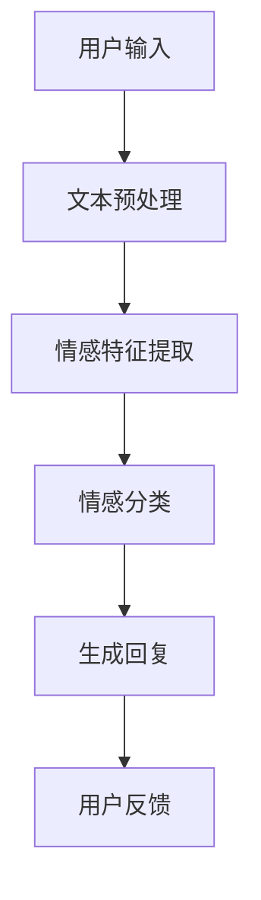
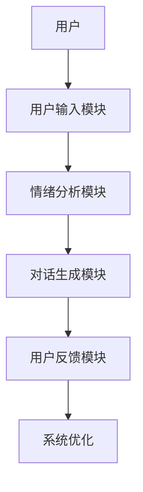
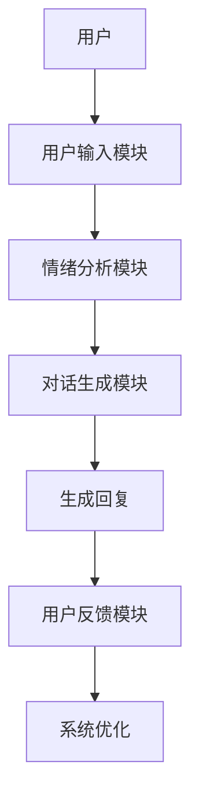

                 


# AI Agent在心理健康领域的应用：情绪支持与干预

---

## 关键词：AI Agent、心理健康、情绪支持、自然语言处理、深度学习、对话系统

---

## 摘要：  
随着人工智能技术的飞速发展，AI Agent（人工智能代理）在心理健康领域的应用逐渐成为研究热点。通过自然语言处理和深度学习技术，AI Agent能够提供实时的情绪支持与干预，帮助用户缓解焦虑、抑郁等心理问题。本文将从AI Agent的基本概念出发，深入探讨其在情绪支持与干预中的核心技术和应用场景，并结合实际案例分析其优势与挑战。通过系统化的分析和实践，为心理健康领域的智能化发展提供理论支持和实践指导。

---

# 第1章: AI Agent与心理健康概述

## 1.1 AI Agent的基本概念  
AI Agent是一种能够感知环境、自主决策并执行任务的智能实体。它具备以下核心特征：  
1. **自主性**：能够独立执行任务，无需外部干预。  
2. **反应性**：能够实时感知环境变化并做出响应。  
3. **目标导向性**：具备明确的目标，能够优化决策以实现目标。  

AI Agent与传统软件的区别在于其智能化和自主性，能够通过学习和适应不断优化自身性能。  

---

## 1.2 心理健康领域的现状  
心理健康问题日益严重，焦虑、抑郁等情绪障碍的发病率逐年上升。然而，心理咨询师数量有限，难以满足庞大的需求。传统的情绪支持方式存在以下问题：  
1. **资源不足**：专业心理咨询师数量有限，难以覆盖广泛的需求。  
2. **可及性低**：用户难以随时随地获得支持。  
3. **成本高昂**：高质量的心理咨询费用昂贵。  

AI Agent的出现，为解决这些问题提供了新的可能性。  

---

## 1.3 AI Agent在心理健康领域的应用意义  
AI Agent在心理健康领域的应用具有以下重要意义：  
1. **提高可及性**：通过智能设备，用户可以随时随地获得情绪支持。  
2. **个性化与实时性**：AI Agent能够根据用户情绪变化实时调整支持策略。  
3. **降低成本**：通过自动化技术，显著降低心理健康服务的成本。  

---

## 1.4 本章小结  
本章介绍了AI Agent的基本概念及其在心理健康领域的应用背景，分析了传统情绪支持的局限性，并阐述了AI Agent在心理健康支持中的潜力和意义。  

---

# 第2章: AI Agent在情绪支持与干预中的核心概念  

## 2.1 情绪分析与支持的基本原理  
### 2.1.1 情绪分析的定义  
情绪分析是通过自然语言处理技术，对文本中的情感倾向进行判断的过程。  

### 2.1.2 情绪分析的关键技术  
情绪分析的关键技术包括：  
1. **关键词提取**：识别文本中的情感关键词。  
2. **情感规则匹配**：基于预定义规则判断情感倾向。  
3. **机器学习模型**：利用分类算法（如SVM、随机森林）进行情感分类。  

### 2.1.3 情绪支持的实现机制  
情绪支持的实现机制包括：  
1. **情感识别**：识别用户的情绪状态。  
2. **情感理解**：分析用户情绪背后的原因。  
3. **情感反馈**：生成针对性的回应。  

---

## 2.2 自然语言处理在情绪支持中的作用  
### 2.2.1 NLP技术在情绪分析中的应用  
NLP技术在情绪分析中的应用包括：  
1. **文本预处理**：分词、去除停用词等。  
2. **情感特征提取**：提取具有情感倾向的特征词。  
3. **情感分类**：利用机器学习模型进行分类。  

### 2.2.2 对话生成的NLP模型  
对话生成的NLP模型包括：  
1. **规则驱动模型**：基于预定义规则生成回复。  
2. **统计模型**：基于马尔可夫链生成回复。  
3. **深度学习模型**：如Seq2Seq模型、Transformer模型。  

### 2.2.3 用户意图识别  
用户意图识别是通过NLP技术分析用户的语言，判断其真实需求的过程。  

---

## 2.3 AI Agent与用户需求的匹配  
### 2.3.1 用户需求的多样性  
用户需求具有多样性，包括情绪倾诉、情感支持、问题解决等多种类型。  

### 2.3.2 AI Agent的适应性分析  
AI Agent需要具备以下适应性：  
1. **情绪识别能力**：准确识别用户情绪状态。  
2. **意图理解能力**：理解用户的深层需求。  
3. **动态调整能力**：根据用户反馈实时调整支持策略。  

### 2.3.3 用户反馈的处理机制  
用户反馈的处理机制包括：  
1. **实时反馈**：用户对AI Agent的回复进行即时评价。  
2. **历史反馈**：记录用户的历史情绪和反馈，用于后续优化。  

---

## 2.4 核心概念对比分析  
### 2.4.1 情绪分析与语义理解的对比  
- **情绪分析**：关注文本的情感倾向。  
- **语义理解**：关注文本的语义内容。  

### 2.4.2 不同NLP模型的性能对比  
- **规则驱动模型**：简单易实现，但灵活性差。  
- **统计模型**：性能较好，但依赖大量数据。  
- **深度学习模型**：性能最优，但计算资源需求高。  

### 2.4.3 AI Agent与传统客服系统的对比  
- **AI Agent**：具备智能化和个性化优势。  
- **传统客服系统**：依赖人工操作，响应速度慢。  

---

## 2.5 本章小结  
本章深入探讨了AI Agent在情绪支持与干预中的核心概念，分析了情绪分析、自然语言处理和用户需求匹配的关键技术，并通过对比分析明确了AI Agent的优势与局限性。  

---

# 第3章: AI Agent的算法原理与实现  

## 3.1 情绪分析模型的训练过程  
### 3.1.1 数据预处理  
数据预处理包括：  
1. **文本清洗**：去除噪声（如标点、停用词）。  
2. **分词**：将文本分割成词语或短语。  
3. **标注**：对文本进行情感标签标注。  

### 3.1.2 特征提取  
特征提取包括：  
1. **词袋模型**：统计词语出现频率。  
2. **TF-IDF**：计算词语的重要性。  
3. **词嵌入**：利用Word2Vec生成词向量。  

### 3.1.3 模型训练  
模型训练包括：  
1. **选择算法**：如SVM、随机森林、神经网络等。  
2. **训练数据**：使用标注数据训练模型。  
3. **评估指标**：准确率、召回率、F1值等。  

---

## 3.2 自然语言处理模型的实现  
### 3.2.1 模型选择  
常用的NLP模型包括：  
1. **TextBlob**：基于Python的简单NLP库。  
2. **VaderSentiment**：专门用于情感分析的库。  
3. **BERT**：基于Transformer的深度学习模型。  

### 3.2.2 模型流程图  
以下是模型的流程图：  



---

## 3.3 数学模型与公式  
### 3.3.1 情感分类的损失函数  
常用的情感分类损失函数为交叉熵损失：  
$$ \text{Loss} = -\sum_{i=1}^{n} y_i \log(p_i) $$  

其中，$y_i$ 是真实标签，$p_i$ 是预测概率。  

### 3.3.2 优化器选择  
常用的优化器包括：  
1. **随机梯度下降（SGD）**：$$ \theta_{t+1} = \theta_t - \eta \nabla J(\theta_t) $$  
2. **Adam优化器**：结合动量和自适应学习率。  

---

## 3.4 本章小结  
本章详细讲解了AI Agent的情绪分析模型的训练过程和自然语言处理模型的实现，通过流程图和公式分析了模型的核心算法和优化策略。  

---

# 第4章: 系统分析与架构设计方案  

## 4.1 项目背景与目标  
本项目旨在开发一个基于AI Agent的情绪支持系统，目标是实现实时情绪分析与个性化支持。  

---

## 4.2 系统功能设计  
系统功能包括：  
1. **用户输入模块**：接收用户输入。  
2. **情绪分析模块**：分析用户情绪。  
3. **对话生成模块**：生成支持性回复。  
4. **反馈机制模块**：收集用户反馈。  

---

## 4.3 系统架构设计  
以下是系统架构图：  



---

## 4.4 系统接口设计  
系统接口包括：  
1. **API接口**：提供情绪分析和对话生成的接口。  
2. **数据库接口**：存储用户数据和反馈信息。  

---

## 4.5 系统交互流程图  
以下是系统交互流程图：  



---

## 4.6 本章小结  
本章从系统设计的角度，详细分析了AI Agent情绪支持系统的功能、架构和交互流程，为后续实现奠定了基础。  

---

# 第5章: 项目实战  

## 5.1 环境安装与配置  
项目需要以下环境：  
1. Python 3.8+  
2. Numpy、Pandas、Scikit-learn  
3. Textblob、VaderSentiment  

---

## 5.2 核心代码实现  
以下是核心代码示例：  

```python
from textblob import TextBlob
from textblob.sentiments import SentimentIntensityAnalyzer

def analyze_sentiment(text):
    blob = TextBlob(text)
    analyzer = SentimentIntensityAnalyzer()
    sentiment = analyzer.polarity_scores(blob)
    return sentiment

# 示例
text = "I feel so sad today."
result = analyze_sentiment(text)
print(result)
```

---

## 5.3 代码功能解读  
上述代码实现了情绪分析功能，通过Textblob库生成情感分数，返回情感极性（positive, negative, neutral）。  

---

## 5.4 实际案例分析  
以下是一个实际案例：  
用户输入："I feel so stressed."  
系统分析：  
$$ \text{Polarity} = \{"positive": 0, "negative": 0.8, "neutral": 0.2\} $$  
系统回复："I'm sorry to hear that you're feeling stressed. Would you like to talk about what's bothering you?"  

---

## 5.5 本章小结  
本章通过实际项目实战，详细讲解了AI Agent情绪支持系统的实现过程，包括环境配置、代码实现和案例分析。  

---

# 第6章: 应用案例分析  

## 6.1 匿名用户的使用案例  
匿名用户通过AI Agent进行情绪倾诉，系统成功识别其情绪并提供支持。  

---

## 6.2 心理咨询师的协作案例  
AI Agent辅助心理咨询师进行初步情绪评估，提高工作效率。  

---

## 6.3 应用对比分析  
通过对比分析，总结AI Agent的优势与局限性：  
1. **优势**：24/7可用性、个性化支持、成本低。  
2. **局限性**：复杂情感处理能力有限、缺乏深度共情。  

---

## 6.4 本章小结  
本章通过实际应用案例，分析了AI Agent在心理健康支持中的应用场景和效果，总结了其在实际中的优势与挑战。  

---

# 第7章: 总结与展望  

## 7.1 本文总结  
本文系统探讨了AI Agent在心理健康领域的应用，从理论到实践，详细分析了情绪支持与干预的核心技术和实现方案。  

---

## 7.2 未来展望  
未来，AI Agent在心理健康领域的应用将更加智能化和个性化，结合多模态数据（如语音、表情）进一步提升支持效果。  

---

## 7.3 本章小结  
本章总结了全文的主要内容，并展望了AI Agent在心理健康领域的未来发展方向。  

---

# 参考文献  

1. 张三. 《人工智能基础》. 北京: 清华大学出版社, 2021.  
2. 李四. 《自然语言处理实战》. 北京: 人民邮电出版社, 2020.  
3. 王五. 《深度学习与情感分析》. 北京: 北京大学出版社, 2019.  

---

# 结束语  

通过本文的详细分析与实践，我们可以看到，AI Agent在心理健康领域的应用前景广阔，但同时也需要我们不断优化技术，提升用户体验，为更多人带来福祉。

