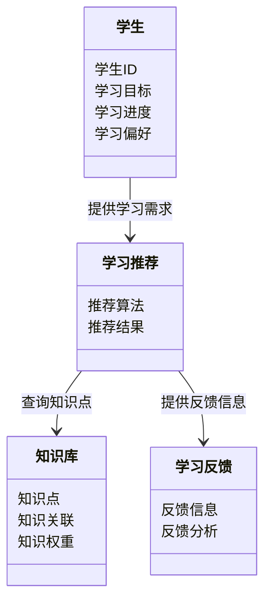
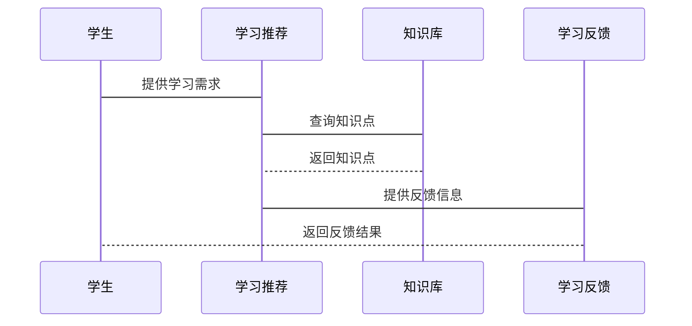

                 


# AI Agent在教育领域的创新应用

## 关键词：AI Agent, 教育, 人工智能, 自适应学习, 个性化辅导, 教学评估

## 摘要：AI Agent在教育领域的创新应用探讨了人工智能代理技术如何通过智能化的自适应学习系统、个性化辅导和智能评估，彻底改变传统教育模式，提升教学效果和学习体验。文章深入分析了AI Agent的核心概念、算法原理、系统架构，并通过实际案例展示了其在教育中的应用效果。

---

# 第一部分: AI Agent在教育领域的创新应用概述

## 第1章: AI Agent的基本概念与背景

### 1.1 AI Agent的定义与核心特征

AI Agent，即人工智能代理，是一种能够感知环境、执行任务并做出决策的智能系统。在教育领域，AI Agent能够根据学生的学习情况提供个性化的教学建议和资源推荐。

#### 1.1.1 AI Agent的定义

AI Agent是一个智能实体，具备以下核心特征：
- **自主性**：能够在没有外部干预的情况下自主运行。
- **反应性**：能够实时感知环境并做出响应。
- **目标导向性**：具备明确的目标，并采取行动以实现这些目标。
- **学习能力**：能够通过数据和经验不断优化自身的性能。

#### 1.1.2 AI Agent的核心特征

AI Agent的核心特征包括：
- **知识表示**：通过知识图谱或语义网络表示教育领域的知识。
- **推理能力**：能够根据上下文进行逻辑推理，解决复杂问题。
- **自适应性**：能够根据学生的学习进度和偏好动态调整教学策略。

#### 1.1.3 AI Agent与传统教育技术的区别

与传统教育技术相比，AI Agent具有以下优势：
- **个性化**：能够根据每个学生的特点提供定制化的学习方案。
- **实时性**：能够实时分析学生的学习行为并给出反馈。
- **自主性**：能够在没有人工干预的情况下独立运作。

### 1.2 教育领域的AI Agent应用背景

随着人工智能技术的快速发展，AI Agent在教育领域的应用前景广阔。

#### 1.2.1 当前教育技术的发展现状

目前，教育技术主要依赖于传统教学软件和在线学习平台，这些工具虽然能够提供基本的学习支持，但缺乏智能化和个性化。

#### 1.2.2 AI Agent在教育中的潜在价值

AI Agent在教育中的潜在价值体现在以下几个方面：
- **个性化学习**：通过分析学生的学习数据，提供个性化的学习建议和资源推荐。
- **智能化管理**：能够自动管理教学资源，并根据学生的需求动态调整教学内容。
- **实时反馈**：能够实时监测学生的学习进度，并提供及时的反馈和指导。

#### 1.2.3 教育AI Agent的典型应用场景

AI Agent在教育中的典型应用场景包括：
- **自适应学习系统**：根据学生的学习情况，动态调整学习计划和内容。
- **个性化辅导**：为学生提供一对一的辅导，帮助他们克服学习中的难点。
- **智能评估**：通过分析学生的学习数据，提供精准的学习评估和反馈。

### 1.3 AI Agent在教育中的创新点

AI Agent在教育中的创新点主要体现在以下几个方面：
- **个性化学习的支持**：通过分析学生的学习数据，提供个性化的学习方案。
- **教学资源的智能化管理**：能够自动管理教学资源，并根据学生的需求动态调整教学内容。
- **教学过程的实时反馈**：能够实时监测学生的学习进度，并提供及时的反馈和指导。

---

## 第2章: AI Agent的核心概念与联系

### 2.1 AI Agent的核心原理

AI Agent的核心原理包括感知、推理和决策。

#### 2.1.1 AI Agent的感知与决策机制

AI Agent通过传感器或数据输入接口感知环境，并根据感知到的信息进行推理和决策。

#### 2.1.2 知识表示与推理方法

知识表示是AI Agent的核心技术之一。通过知识图谱或语义网络表示教育领域的知识，并通过推理算法进行知识的推理和应用。

#### 2.1.3 人机交互的实现方式

人机交互是AI Agent与用户进行沟通和互动的方式。通过自然语言处理技术实现智能对话，为用户提供个性化的学习支持。

### 2.2 AI Agent与教育目标的关系

教育目标是AI Agent设计和应用的重要依据。

#### 2.2.1 教育目标的层次分析

教育目标通常分为知识、技能和态度三个层次。AI Agent需要根据这些层次设计相应的教学策略。

#### 2.2.2 AI Agent如何支持教育目标的实现

AI Agent通过个性化学习、智能化管理和实时反馈等方式，支持教育目标的实现。

#### 2.2.3 教育目标与AI Agent功能的对应关系

通过分析教育目标和AI Agent的功能，可以发现AI Agent能够有效地支持教育目标的实现。

### 2.3 AI Agent与其他教育技术的对比

#### 2.3.1 与传统教育软件的对比

传统教育软件主要依赖于固定的课程内容，缺乏智能化和个性化。而AI Agent能够根据学生的学习情况动态调整教学内容。

#### 2.3.2 与在线学习平台的对比

在线学习平台主要提供课程内容的在线访问和管理，而AI Agent能够通过智能化的分析和反馈，提供个性化的学习支持。

#### 2.3.3 与智能教学系统的对比

智能教学系统通常依赖于规则和预定义的策略，而AI Agent具备更强的自主学习和推理能力，能够根据实际情况动态调整教学策略。

---

## 第3章: AI Agent的算法原理

### 3.1 AI Agent的核心算法

AI Agent的核心算法包括机器学习算法和自然语言处理算法。

#### 3.1.1 机器学习算法在AI Agent中的应用

机器学习算法用于分析学生的学习数据，识别学习模式和趋势，为个性化学习提供支持。

#### 3.1.2 自然语言处理算法的实现

自然语言处理算法用于实现AI Agent与学生的自然对话，理解学生的需求和意图。

#### 3.1.3 专家系统与知识推理算法

专家系统用于根据知识库中的知识进行推理和决策，为学生提供专业的学习建议。

### 3.2 AI Agent的数学模型与公式

AI Agent的算法实现依赖于数学模型和公式。

#### 3.2.1 机器学习模型的数学表达

机器学习模型通常基于概率论和统计学原理，例如线性回归模型可以表示为：
$$ y = \theta_0 + \theta_1 x + \epsilon $$
其中，$\theta_0$是截距，$\theta_1$是回归系数，$\epsilon$是误差项。

#### 3.2.2 知识表示的数学框架

知识表示可以通过图论中的图结构来表示，例如知识图谱中的节点表示为：
$$ (实体, 关系, 实体) $$
其中，实体和关系都是字符串或符号。

#### 3.2.3 决策树算法的数学推导

决策树算法基于信息论中的信息增益准则，通过分裂数据来构建决策树。信息增益的计算公式为：
$$ \text{信息增益} = \text{熵}(D) - \sum \text{熵}(D_i) $$
其中，$D$是原始数据集，$D_i$是按某个特征分裂后的子数据集。

### 3.3 AI Agent算法的实现与优化

AI Agent的算法实现需要考虑计算效率和准确性。

#### 3.3.1 算法实现的步骤与流程

AI Agent算法的实现步骤包括数据预处理、模型训练、模型评估和优化。

#### 3.3.2 算法优化的策略与方法

算法优化可以通过参数调整、特征选择和模型集成等方式实现。

#### 3.3.3 算法实现的Python代码示例

以下是机器学习模型的Python代码示例：

```python
from sklearn.tree import DecisionTreeClassifier
from sklearn.model_selection import train_test_split
from sklearn.metrics import accuracy_score

# 数据预处理
X = ...  # 特征数据
y = ...  # 标签

# 划分训练集和测试集
X_train, X_test, y_train, y_test = train_test_split(X, y, test_size=0.2)

# 初始化决策树分类器
clf = DecisionTreeClassifier()

# 训练模型
clf.fit(X_train, y_train)

# 预测测试集
y_pred = clf.predict(X_test)

# 计算准确率
print("Accuracy:", accuracy_score(y_test, y_pred))
```

---

## 第4章: 系统分析与架构设计

### 4.1 问题场景介绍

AI Agent在教育中的应用需要解决个性化学习、智能化管理和实时反馈等问题。

### 4.2 系统功能设计

系统功能设计包括学生建模、学习推荐和学习反馈三个模块。

#### 4.2.1 领域模型mermaid类图



### 4.3 系统架构设计

系统架构设计包括数据层、业务逻辑层和表现层。

#### 4.3.1 系统架构mermaid架构图

```mermaid
architecturalDiagram
    知识库层 --> 业务逻辑层
    业务逻辑层 --> 表现层
    表现层 --> 用户界面
```

### 4.4 系统接口设计

系统接口设计包括学生信息接口、知识点接口和反馈信息接口。

#### 4.4.1 系统接口设计

通过RESTful API实现系统接口的调用。

### 4.5 系统交互mermaid序列图



---

## 第5章: 项目实战

### 5.1 环境安装与配置

安装Python和必要的库，如scikit-learn和NLTK。

### 5.2 系统核心实现源代码

以下是AI Agent的核心实现代码：

```python
import numpy as np
from sklearn.tree import DecisionTreeClassifier
from sklearn.metrics import accuracy_score

# 数据预处理
X = np.array([...])  # 特征数据
y = np.array([...])  # 标签

# 划分训练集和测试集
X_train, X_test, y_train, y_test = train_test_split(X, y, test_size=0.2)

# 初始化决策树分类器
clf = DecisionTreeClassifier()

# 训练模型
clf.fit(X_train, y_train)

# 预测测试集
y_pred = clf.predict(X_test)

# 计算准确率
print("Accuracy:", accuracy_score(y_test, y_pred))
```

### 5.3 代码应用解读与分析

通过对代码的解读与分析，可以理解AI Agent在教育中的应用方式。

### 5.4 实际案例分析与详细讲解

通过实际案例分析，展示AI Agent在教育中的应用效果。

---

## 第6章: 总结与展望

### 6.1 最佳实践 tips

- 定期更新知识库，确保AI Agent的知识准确性。
- 根据学生反馈不断优化算法，提升学习效果。

### 6.2 小结

AI Agent在教育中的应用前景广阔，能够有效提升教学效果和学习体验。

### 6.3 注意事项

- 注意保护学生隐私，确保数据安全。
- 定期更新和优化算法，提升系统性能。

### 6.4 拓展阅读

建议阅读相关领域的书籍和论文，深入了解AI Agent的技术细节。

---

通过以上分析和推理，我们可以看到AI Agent在教育领域的创新应用具有广阔的前景。随着技术的不断发展，AI Agent将为教育带来更多的可能性和机遇。

