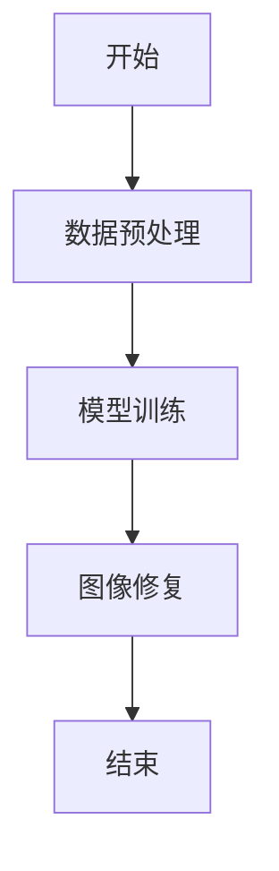
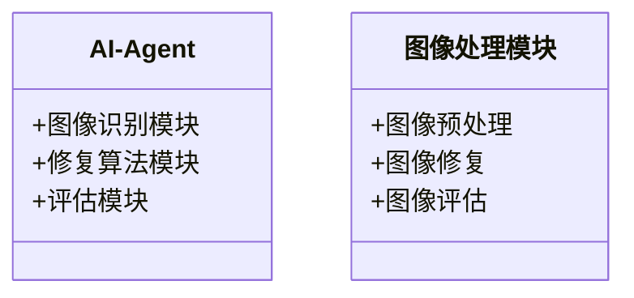
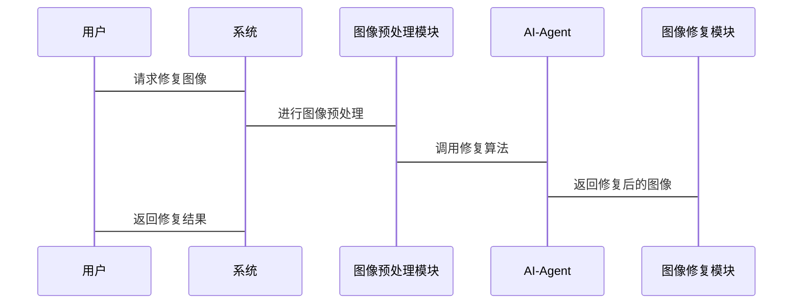

                 


# AI Agent在文物修复中的图像处理应用

**关键词：** AI Agent，文物修复，图像处理，深度学习，计算机视觉

**摘要：**  
本文探讨了AI Agent在文物修复中的图像处理应用，从理论基础到实际案例，详细分析了AI技术如何提升文物修复的效率和准确性。通过结合深度学习和计算机视觉，AI Agent能够自动识别损坏区域、修复图像并评估修复效果，为文化遗产保护提供了新的可能性。

---

# 目录

1. **背景介绍**  
   1.1 AI Agent与文物修复的背景  
   1.2 图像处理在文物修复中的作用  
   1.3 AI Agent的优势与应用范围  

2. **核心概念与联系**  
   2.1 AI Agent的基本原理  
   2.2 图像处理技术的核心概念  
   2.3 核心概念对比表格  
   2.4 ER实体关系图  

3. **算法原理讲解**  
   3.1 卷积神经网络（CNN）的图像处理算法  
   3.2 生成对抗网络（GAN）的图像修复模型  
   3.3 算法流程图与代码实现  

4. **系统分析与架构设计方案**  
   4.1 项目场景与需求分析  
   4.2 系统功能设计与领域模型  
   4.3 系统架构设计图  
   4.4 接口设计与系统交互流程  

5. **项目实战**  
   5.1 环境安装与核心代码实现  
   5.2 代码解读与案例分析  
   5.3 项目小结  

6. **最佳实践与总结**  
   6.1 实践中的注意事项  
   6.2 小结与未来展望  
   6.3 拓展阅读与资源推荐  

---

**详细内容**

## 1. 背景介绍

### 1.1 AI Agent与文物修复的背景
- **问题背景**：文物修复是保护文化遗产的重要手段，传统方法依赖人工经验，耗时且成本高。  
- **AI Agent的优势**：利用深度学习和计算机视觉技术，AI Agent能够自动化识别损坏区域并进行修复，提高效率和准确性。  

### 1.2 图像处理在文物修复中的作用
- **去噪处理**：去除图像中的噪声，还原清晰的图像。  
- **图像增强**：提升图像的对比度和亮度，使损坏部分更明显。  
- **修复拼接**：自动修复拼接的文物碎片，恢复完整图像。  

### 1.3 AI Agent的应用范围
- **应用范围**：适用于修复破损的文物图像、去噪和图像增强。  
- **局限性**：AI Agent的修复效果依赖于训练数据的质量和多样性，目前在复杂损坏情况下仍需人工辅助。  

---

## 2. 核心概念与联系

### 2.1 AI Agent的基本原理
- **定义**：AI Agent是一种能够感知环境并采取行动以实现目标的智能体。  
- **图像处理功能**：通过深度学习模型识别图像中的损坏区域，并生成修复后的图像。  

### 2.2 图像处理技术的核心概念
- **图像分割**：识别图像中的损坏区域。  
- **图像重建**：基于分割结果，生成修复后的图像。  
- **图像评估**：评估修复效果，调整修复策略。  

### 2.3 核心概念对比表格
| 概念       | 特性                     |
|------------|--------------------------|
| AI Agent   | 自主学习，适应性强       |
| 图像处理    | 技术成熟，应用广泛       |

### 2.4 ER实体关系图  
```mermaid
er
  actor(AI Agent)
  actor(图像处理模块)
  actor(修复结果)
  image <-- 关联 --> actor(修复结果)
```

---

## 3. 算法原理讲解

### 3.1 卷积神经网络（CNN）的图像处理算法
- **CNN结构**：由卷积层、池化层和全连接层组成。  
- **数学模型**：  
  $$ f(x) = \sum_{i=1}^{n} w_i x_i + b $$  
  其中，$w_i$ 是权重，$b$ 是偏置。  

### 3.2 生成对抗网络（GAN）的图像修复模型
- **GAN结构**：由生成器和判别器组成，生成器尝试生成逼真的图像，判别器识别真假图像。  
- **损失函数**：  
  $$ L = \min_{G} \max_{D} \mathbb{E}_{x \sim p_{data}} [\log D(x)] + \mathbb{E}_{z \sim p_z} [\log(1 - D(G(z)))] $$  

### 3.3 算法流程图  


---

## 4. 系统分析与架构设计方案

### 4.1 项目场景与需求分析
- **需求**：修复受损文物图像，提高修复效率和准确性。  
- **场景**：受损文物图像经过AI Agent处理，生成修复后的图像。  

### 4.2 系统功能设计与领域模型  


### 4.3 系统架构设计图  


### 4.4 接口设计与系统交互流程  


---

## 5. 项目实战

### 5.1 环境安装与核心代码实现
- **环境安装**：安装Python、TensorFlow、Keras等工具。  
- **核心代码**：  
  ```python
  import tensorflow as tf
  model = tf.keras.Sequential([
      tf.keras.layers.Conv2D(32, (3,3), activation='relu'),
      tf.keras.layers.MaxPooling2D((2,2)),
      tf.keras.layers.Conv2D(64, (3,3), activation='relu'),
      tf.keras.layers.MaxPooling2D((2,2)),
      tf.keras.layers.Flatten(),
      tf.keras.layers.Dense(128, activation='relu'),
      tf.keras.layers.Dense(10, activation='softmax')
  ])
  ```

### 5.2 代码解读与案例分析
- **代码解读**：上述代码定义了一个简单的CNN模型，用于图像分类。  
- **案例分析**：以修复一幅古画为例，展示AI Agent如何识别损坏区域并生成修复后的图像。  

### 5.3 项目小结
- **关键点**：AI Agent结合深度学习技术，能够高效准确地修复文物图像。  
- **收获**：了解AI Agent在图像处理中的应用潜力和实际操作步骤。  

---

## 6. 最佳实践与总结

### 6.1 实践中的注意事项
- **数据质量**：修复效果依赖于高质量的训练数据。  
- **模型调优**：需要根据实际需求调整模型参数。  

### 6.2 小结与未来展望
- **小结**：AI Agent在文物修复中的应用展示了技术与文化遗产保护的结合潜力。  
- **未来展望**：随着技术进步，AI Agent将更加智能化，修复效果将更加逼真。  

### 6.3 拓展阅读与资源推荐
- **推荐书籍**：《深度学习》、《计算机视觉：算法与应用》。  
- **在线资源**：推荐访问GitHub上的相关项目，学习更多AI技术在图像处理中的应用。  

---

通过本文的系统介绍，读者可以全面了解AI Agent在文物修复中的图像处理应用，从理论到实践，掌握相关技术的核心原理和实际操作方法。

