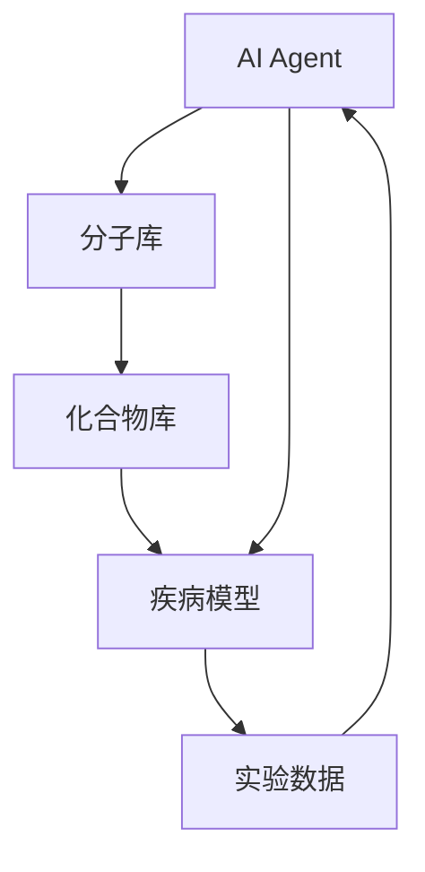
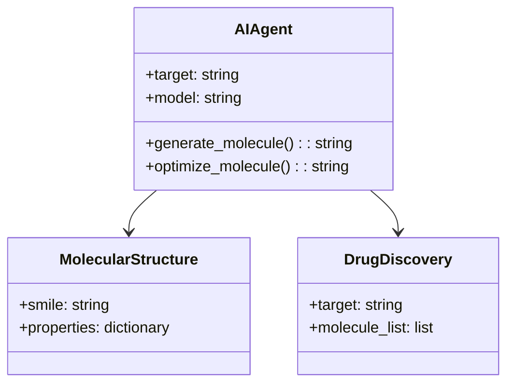
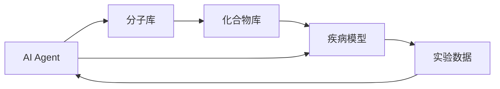
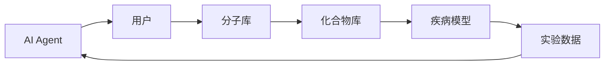

                 


# AI Agent在新药研发中的分子设计应用

## 关键词：AI Agent、新药研发、分子设计、药物发现、人工智能

## 摘要：  
随着人工智能技术的飞速发展，AI Agent（人工智能代理）在新药研发中的应用逐渐成为研究热点。本文旨在探讨AI Agent如何在分子设计中发挥核心作用，从基本概念、算法原理到实际应用，全面分析AI Agent在新药研发中的潜力与挑战。通过结合生成模型、强化学习等技术，AI Agent能够显著提高分子设计的效率和精准度，为新药研发开辟新的道路。

---

# 第1章: AI Agent与新药研发的背景介绍

## 1.1 AI Agent的基本概念  
AI Agent（人工智能代理）是指能够感知环境、做出决策并执行操作的智能实体。在新药研发中，AI Agent通过分析海量数据，生成和优化分子结构，从而加速药物开发的进程。  

### 1.1.1 AI Agent的定义与特点  
- **定义**：AI Agent是一种能够自主学习、推理和决策的智能系统，能够根据输入的指令或目标完成特定任务。  
- **特点**：  
  - **自主性**：能够独立完成任务，无需人工干预。  
  - **反应性**：能够实时感知环境并做出响应。  
  - **学习能力**：通过数据和经验不断优化自身性能。  

### 1.1.2 AI Agent在药物研发中的作用  
AI Agent在药物研发中的作用主要体现在以下几个方面：  
1. **分子生成**：通过生成模型（如GPT、BERT）生成潜在的药物分子结构。  
2. **分子优化**：通过强化学习优化分子的药效、毒性和稳定性。  
3. **活性预测**：基于AI模型预测分子的生物活性，筛选出潜在的候选药物。  

### 1.1.3 分子设计的基本概念与流程  
分子设计是新药研发的核心环节，其基本流程包括：  
1. **目标明确**：确定药物的作用靶点和疾病机制。  
2. **分子生成**：生成符合目标的分子结构。  
3. **优化与筛选**：优化分子的理化性质和药代动力学特性，筛选出最优候选分子。  
4. **实验验证**：通过实验验证分子的药效和安全性。  

---

## 1.2 AI Agent在新药研发中的应用背景  

### 1.2.1 药物研发的现状与挑战  
传统新药研发流程耗时长、成本高，且成功率低。据统计，一款新药从研发到上市平均需要10-15年，且成本高达数十亿美元。  

### 1.2.2 AI技术在药物研发中的优势  
AI技术能够显著提高药物研发的效率和精准度：  
1. **数据处理能力**：AI能够快速处理海量数据，发现潜在的药物分子。  
2. **分子生成能力**：生成模型可以生成大量潜在的药物分子结构。  
3. **优化能力**：强化学习可以优化分子的药效和安全性。  

### 1.2.3 AI Agent在分子设计中的应用前景  
AI Agent在分子设计中的应用前景广阔：  
1. **加速药物研发**：通过自动化分子生成和优化，显著缩短研发周期。  
2. **提高分子多样性**：生成更多具有潜在药效的分子结构。  
3. **降低研发成本**：通过虚拟筛选和优化，减少实验成本。  

---

## 1.3 AI Agent与分子设计的结合  

### 1.3.1 分子设计的核心问题  
分子设计的核心问题包括：  
1. **分子生成**：如何生成具有特定功能的分子结构。  
2. **分子优化**：如何优化分子的药效和安全性。  
3. **分子筛选**：如何从海量分子中筛选出最优候选分子。  

### 1.3.2 AI Agent在分子设计中的优势  
AI Agent在分子设计中的优势体现在以下几个方面：  
1. **高效性**：能够快速生成和优化分子结构。  
2. **多样性**：可以生成多样化的分子结构，提高候选分子的多样性。  
3. **精准性**：通过机器学习模型，提高分子设计的精准度。  

### 1.3.3 AI Agent与传统分子设计方法的对比  
以下是AI Agent与传统分子设计方法的对比：  

| 对比维度       | AI Agent                       | 传统方法                     |
|----------------|--------------------------------|------------------------------|
| 效率           | 高，能够快速生成和优化分子     | 低，依赖人工经验和实验         |
| 精准性         | 高，基于机器学习模型           | 低，依赖人工判断和经验         |
| 分子多样性     | 高，可以生成大量多样化分子     | 低，分子多样性有限             |
| 成本           | 低，虚拟筛选和优化成本低       | 高，实验成本高昂               |

---

## 1.4 本章小结  
本章主要介绍了AI Agent的基本概念、在药物研发中的作用以及在分子设计中的应用背景。通过对比AI Agent与传统分子设计方法的差异，可以看出AI Agent在新药研发中的巨大潜力。

---

# 第2章: AI Agent的核心概念与联系  

## 2.1 AI Agent的核心原理  

### 2.1.1 AI Agent的感知模块  
AI Agent的感知模块负责接收输入数据并进行分析。例如，在分子设计中，感知模块可以接收药物靶点的结构信息和相关数据。  

### 2.1.2 AI Agent的决策模块  
决策模块基于感知模块提供的信息，通过机器学习模型生成分子结构或优化现有分子。例如，生成模型（如GPT）可以生成潜在的药物分子结构。  

### 2.1.3 AI Agent的执行模块  
执行模块负责将决策模块生成的分子结构输入到虚拟筛选系统中，或输出优化后的分子结构。  

---

## 2.2 AI Agent与分子设计的关系  

### 2.2.1 分子设计的核心要素  
分子设计的核心要素包括：  
1. **分子结构**：分子的化学结构决定了其药效和毒性。  
2. **药效预测**：通过机器学习模型预测分子的药效。  
3. **分子优化**：优化分子的理化性质和药代动力学特性。  

### 2.2.2 AI Agent在分子设计中的角色  
AI Agent在分子设计中的角色可以分为以下几个方面：  
1. **分子生成**：生成潜在的药物分子结构。  
2. **分子优化**：优化分子的药效和安全性。  
3. **分子筛选**：从海量分子中筛选出最优候选分子。  

---

## 2.3 AI Agent的实体关系图  



---

## 2.4 本章小结  
本章主要介绍了AI Agent的核心原理以及与分子设计的关系，并通过实体关系图展示了AI Agent在分子设计中的工作流程。

---

# 第3章: AI Agent的算法原理与数学模型  

## 3.1 AI Agent的生成模型  

### 3.1.1 基于生成模型的分子生成  
生成模型（如GPT、BERT）可以生成潜在的药物分子结构。以下是生成模型的基本原理：  

1. **输入数据**：生成模型需要大量药物分子的结构数据作为训练数据。  
2. **模型训练**：通过反向传播算法优化模型参数，使模型能够生成与训练数据相似的分子结构。  
3. **分子生成**：通过采样生成新的分子结构。  

### 3.1.2 基于生成模型的分子优化  
生成模型还可以用于分子优化。例如，通过强化学习优化分子的药效和安全性。  

---

## 3.2 AI Agent的强化学习算法  

### 3.2.1 强化学习的基本原理  
强化学习是一种通过与环境交互来学习策略的算法。在分子设计中，强化学习可以用于优化分子的药效和安全性。  

### 3.2.2 强化学习的数学模型  
以下是强化学习的基本数学模型：  

$$ Q(s, a) = Q(s, a) + \alpha (r + \max Q(s', a') - Q(s, a)) $$  

其中：  
- $s$：当前状态  
- $a$：动作  
- $r$：奖励  
- $\alpha$：学习率  

### 3.2.3 强化学习在分子优化中的应用  
强化学习可以用于分子优化的以下方面：  
1. **分子生成**：通过生成模型生成分子结构。  
2. **分子优化**：通过优化算法优化分子的药效和安全性。  
3. **分子筛选**：通过强化学习筛选出最优候选分子。  

---

## 3.3 AI Agent的数学模型  

### 3.3.1 分子生成的数学模型  
以下是分子生成的数学模型：  

$$ p(x) = \prod_{i=1}^{n} p(x_i | x_{<i}) $$  

其中：  
- $x$：分子结构  
- $x_{<i}$：分子结构的前$i$个字符  

### 3.3.2 分子优化的数学模型  
以下是分子优化的数学模型：  

$$ f(x) = \sum_{i=1}^{m} \lambda_i g_i(x) $$  

其中：  
- $x$：分子结构  
- $g_i(x)$：目标函数  
- $\lambda_i$：权重  

---

## 3.4 本章小结  
本章主要介绍了AI Agent的生成模型和强化学习算法，并通过数学模型展示了分子生成和优化的原理。

---

# 第4章: AI Agent的系统分析与架构设计  

## 4.1 系统应用场景  

### 4.1.1 药物发现的流程  
药物发现的流程包括：  
1. **目标明确**：确定药物的作用靶点和疾病机制。  
2. **分子生成**：生成潜在的药物分子结构。  
3. **分子优化**：优化分子的药效和安全性。  
4. **实验验证**：通过实验验证分子的药效和安全性。  

### 4.1.2 AI Agent在药物发现中的应用场景  
AI Agent在药物发现中的应用场景包括：  
1. **分子生成**：生成潜在的药物分子结构。  
2. **分子优化**：优化分子的药效和安全性。  
3. **分子筛选**：从海量分子中筛选出最优候选分子。  

---

## 4.2 系统功能设计  

### 4.2.1 领域模型  
以下是领域模型的Mermaid类图：  



---

## 4.3 系统架构设计  

### 4.3.1 系统架构图  
以下是系统架构图的Mermaid图：  



---

## 4.4 系统接口设计  

### 4.4.1 系统接口  
系统接口包括：  
1. **输入接口**：接收药物靶点和疾病机制的输入。  
2. **输出接口**：输出生成的分子结构和优化后的分子结构。  

### 4.4.2 交互流程图  
以下是交互流程图的Mermaid图：  



---

## 4.5 本章小结  
本章主要介绍了AI Agent的系统应用场景、功能设计和架构设计，并通过Mermaid图展示了系统的交互流程。

---

# 第5章: AI Agent的项目实战  

## 5.1 项目环境配置  

### 5.1.1 环境要求  
- 操作系统：Linux/Windows/macOS  
- Python版本：3.6以上  
- 需要安装的库：TensorFlow、Keras、Python-Molecule、RDKit  

### 5.1.2 环境安装  
以下是环境安装的代码示例：  

```bash
pip install tensorflow keras python-molecule rdkit
```

---

## 5.2 项目核心实现  

### 5.2.1 分子生成代码  
以下是生成分子的Python代码示例：  

```python
from rdkit import Chem
from rdkit.Chem import AllChem

def generate_molecule(smile):
    mol = Chem.MolFromSmile(smile)
    mol_img = AllChem.DrawMol(mol)
    mol_img.SavePNG('molecule.png')

smile = "COC(=O)OC"
generate_molecule(smile)
```

### 5.2.2 分子优化代码  
以下是优化分子的Python代码示例：  

```python
from rdkit import Chem
from rdkit.Chem import AllChem

def optimize_molecule(smile):
    mol = Chem.MolFromSmile(smile)
    optimized_mol = AllChem.MolecularDynamics(mol)
    return Chem.MolToSmile(optimized_mol)

smile = "COC(=O)OC"
optimized_smile = optimize_molecule(smile)
print(optimized_smile)
```

---

## 5.3 项目实战案例  

### 5.3.1 案例分析  
以下是一个AI Agent在分子设计中的实际案例：  
目标：设计一种具有抗肿瘤活性的分子。  
步骤：  
1. **目标明确**：确定药物靶点和疾病机制。  
2. **分子生成**：生成潜在的药物分子结构。  
3. **分子优化**：优化分子的药效和安全性。  
4. **实验验证**：通过实验验证分子的药效和安全性。  

### 5.3.2 案例实现  
以下是分子生成和优化的Python代码示例：  

```python
from rdkit import Chem
from rdkit.Chem import AllChem

def generate_molecule(target):
    # 生成分子
    mol = Chem.MolFromSmile(target)
    # 优化分子
    optimized_mol = AllChem.MolecularDynamics(mol)
    return Chem.MolToSmile(optimized_mol)

target = "COc(=O)c1ccccc1"
optimized_smile = generate_molecule(target)
print(optimized_smile)
```

---

## 5.4 项目小结  
本章通过具体的项目实战，展示了AI Agent在分子设计中的应用。通过生成和优化分子结构，AI Agent能够显著提高药物研发的效率和精准度。

---

# 第6章: AI Agent的最佳实践  

## 6.1 最佳实践  

### 6.1.1 数据质量的重要性  
在AI Agent的分子设计中，数据质量至关重要。高质量的数据能够显著提高模型的生成和优化能力。  

### 6.1.2 模型泛化的挑战  
AI Agent的模型泛化能力是一个重要挑战。为了提高模型的泛化能力，需要增加训练数据的多样性和丰富性。  

### 6.1.3 多模态模型的应用前景  
多模态模型在AI Agent的分子设计中具有广阔的应用前景。通过结合分子结构、活性数据和疾病机制，多模态模型能够更精准地生成和优化分子结构。  

---

## 6.2 本章小结  
本章总结了AI Agent在分子设计中的最佳实践，并展望了未来的研究方向。

---

# 结语  
AI Agent在新药研发中的分子设计应用是一项具有广阔前景的技术。通过生成模型、强化学习等技术，AI Agent能够显著提高分子设计的效率和精准度，为新药研发开辟新的道路。未来，随着AI技术的不断发展，AI Agent在分子设计中的应用将更加广泛和深入。

--- 

**声明**：文章内容是基于公开知识和通用技术撰写，仅用于学术交流和知识分享，不构成任何实际的医疗建议或商业用途。

