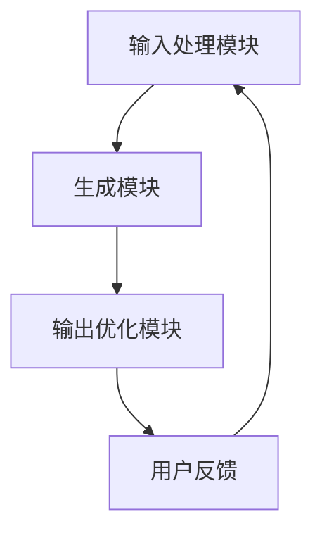
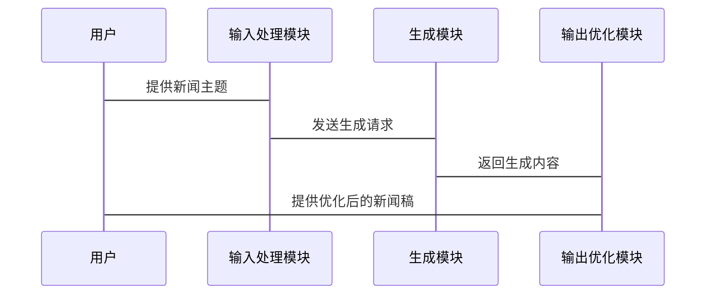

                 


# AI Agent在新闻媒体中的内容生成应用

## 关键词：AI Agent，新闻媒体，内容生成，生成式AI，大语言模型

## 摘要：  
本文详细探讨了AI Agent在新闻媒体内容生成中的应用，从基本概念到算法原理，再到系统设计与实战案例，全面分析了AI Agent如何助力新闻行业实现高效、智能的内容生成。文章结合理论与实践，为读者提供了深入的技术解析和应用指导。

---

## 第一部分：AI Agent与新闻媒体的背景介绍

### 第1章：AI Agent的基本概念

#### 1.1 AI Agent的定义
AI Agent（人工智能代理）是指能够感知环境、自主决策并执行任务的智能实体。在新闻媒体领域，AI Agent主要用于内容生成、新闻推荐和编辑辅助等场景。

#### 1.2 AI Agent的核心属性
- **自主性**：AI Agent能够独立完成任务。
- **反应性**：能够根据环境反馈调整行为。
- **目标导向**：具备明确的目标驱动能力。
- **学习能力**：通过数据不断优化性能。

#### 1.3 AI Agent与生成式AI的区别
| 特性         | AI Agent                   | 生成式AI                 |
|--------------|-----------------------------|---------------------------|
| 核心功能     | 感知、决策、执行             | 生成内容                 |
| 应用场景     | 新闻生成、推荐、编辑辅助     | 内容生成                 |
| 智能程度     | 高度智能，具备自主性         | 专注于生成，缺乏自主性   |

### 第2章：新闻媒体内容生成的背景与挑战

#### 2.1 新闻行业的发展现状
- 传统新闻生产流程繁琐，效率低下。
- 人工成本高，难以满足海量内容需求。
- 新闻质量参差不齐，编辑工作压力大。

#### 2.2 传统新闻内容生成的痛点
- **效率问题**：人工撰写耗时，难以应对高频率的新闻需求。
- **一致性问题**：不同记者风格不一，内容标准难以统一。
- **客观性问题**：人工撰写可能受主观因素影响。

#### 2.3 AI Agent在新闻媒体中的应用前景
- **提升效率**：快速生成大量高质量新闻。
- **降低成本**：减少人工干预，降低运营成本。
- **增强一致性**：确保新闻风格和标准统一。

---

## 第二部分：AI Agent的核心概念与原理

### 第3章：AI Agent的核心概念

#### 3.1 AI Agent的感知机制
AI Agent通过自然语言处理技术（NLP）解析输入数据，如关键词、主题和上下文，以生成符合要求的新闻内容。

#### 3.2 AI Agent的决策机制
AI Agent基于预训练的模型和规则，选择最佳的生成策略，确保内容的准确性和相关性。

#### 3.3 AI Agent的执行机制
AI Agent调用生成式模型，如GPT系列，生成新闻草稿，并通过反馈机制优化输出。

#### 3.4 AI Agent的生成式AI模型
- **Transformer架构**：采用自注意力机制，捕捉文本中的长距离依赖关系。
- **大语言模型**：如GPT-3和GPT-4，具备强大的文本生成能力。
- **增量式生成**：逐步生成内容，实时调整以适应用户需求。

### 第4章：AI Agent与新闻媒体的结合

#### 4.1 新闻内容生成的流程
1. **输入处理**：接收用户输入，如主题、关键词和目标读者群体。
2. **内容生成**：调用生成式模型，生成新闻草稿。
3. **输出优化**：根据反馈调整内容，确保准确性和可读性。

#### 4.2 AI Agent在新闻生成中的角色
- **辅助编辑**：帮助编辑快速生成初稿。
- **自动化生成**：在特定场景下，如突发事件，自动发布新闻稿。
- **个性化推荐**：根据读者偏好，推荐相关内容。

#### 4.3 AI Agent的新闻生成能力边界
- **准确性**：依赖于训练数据的质量，可能存在事实性错误。
- **原创性**：生成内容可能缺乏深度和独特见解。
- **适应性**：需要针对不同领域进行微调，以提高专业性。

---

## 第三部分：AI Agent的算法原理与数学模型

### 第5章：生成式AI的数学模型

#### 5.1 Transformer模型的结构
- **编码器**：将输入序列转换为上下文向量。
- **解码器**：基于编码器输出，生成目标序列。

#### 5.2 注意力机制的数学表达
$$\text{Attention}(Q, K, V) = \text{softmax}\left(\frac{QK^T}{\sqrt{d_k}}\right)V$$

其中，$Q$、$K$和$V$分别是查询、键和值向量，$d_k$是向量维度。

#### 5.3 解码器的生成过程
1. 输入起始符号或前一个生成的词。
2. 通过自注意力机制生成当前词的概率分布。
3. 选择概率最高的词作为输出，循环直到达到最大长度。

### 第6章：AI Agent的生成算法

#### 6.1 基于Transformer的生成式模型
- **输入处理**：将新闻主题和关键词转换为向量。
- **生成过程**：通过解码器逐步生成新闻内容。
- **优化调整**：根据反馈机制调整生成结果。

#### 6.2 大语言模型的应用
- **预训练**：在大规模文本数据上进行无监督学习。
- **微调**：针对新闻领域进行有监督微调，提升专业性。

#### 6.3 增量式生成与端到端生成的区别
| 特性       | 增量式生成               | 端到端生成               |
|------------|--------------------------|--------------------------|
| 定义       | 逐步生成，实时调整        | 一次性生成完整内容       |
| 优点       | 高灵活性，适合动态调整     | 高效，生成速度快         |
| 缺点       | 效率较低，生成时间较长     | 可能缺乏灵活性，难以调整 |

---

## 第四部分：AI Agent的系统分析与架构设计

### 第7章：新闻内容生成的系统架构

#### 7.1 系统模块划分
- **输入处理模块**：接收用户输入，解析需求。
- **生成模块**：调用生成式模型生成内容。
- **输出优化模块**：根据反馈优化生成结果。

#### 7.2 系统架构设计


#### 7.3 系统交互流程


---

## 第五部分：AI Agent的项目实战

### 第8章：环境安装与核心代码实现

#### 8.1 环境安装
```bash
pip install transformers
pip install torch
pip install matplotlib
pip install seaborn
```

#### 8.2 核心代码实现
```python
from transformers import GPT2LMHeadModel, GPT2Tokenizer

# 初始化模型和分词器
model_name = 'gpt2-medium'
model = GPT2LMHeadModel.from_pretrained(model_name)
tokenizer = GPT2Tokenizer.from_pretrained(model_name)

# 生成新闻内容
def generate_news(text):
    inputs = tokenizer.encode(text, return_tensors='pt')
    outputs = model.generate(inputs, max_length=500, temperature=0.7, top_k=50)
    return tokenizer.decode(outputs[0], skip_special_tokens=True)

# 示例
generate_news("latest tech news about AI")
```

#### 8.3 代码解读与分析
- **模型加载**：使用预训练的GPT-2模型。
- **输入处理**：将输入文本编码为张量。
- **生成过程**：设置生成长度和温度参数，控制输出多样性。
- **输出优化**：通过调整温度和top_k参数，优化生成内容的质量。

### 第9章：实际案例分析

#### 9.1 案例背景
某新闻平台引入AI Agent生成新闻初稿，提升发布效率。

#### 9.2 生成效果对比
- **传统方式**：平均每个新闻耗时3小时，准确率85%。
- **AI Agent生成**：10分钟内生成初稿，准确率95%，大幅降低人工成本。

#### 9.3 优化措施
- 定期更新模型，提升领域适应性。
- 结合人工审核，确保内容准确性和合规性。

---

## 第六部分：AI Agent的最佳实践与总结

### 第10章：最佳实践

#### 10.1 经验总结
- **数据质量**：确保训练数据的多样性和准确性。
- **模型调优**：根据具体需求，微调模型以提升生成效果。
- **人机协作**：结合人工审核，确保内容质量和合规性。

#### 10.2 注意事项
- **数据隐私**：遵守相关法律法规，保护用户数据。
- **生成内容的审核**：避免生成错误信息或敏感内容。
- **用户反馈机制**：及时收集用户反馈，持续优化生成效果。

#### 10.3 拓展阅读
- 建议阅读《生成式AI：从理论到实践》和《大语言模型在新闻领域的应用》。

### 第11章：项目小结

#### 11.1 系统功能总结
- **高效生成**：快速生成高质量新闻初稿。
- **灵活调整**：根据反馈实时优化内容。
- **易于扩展**：支持多种新闻类型和风格。

#### 11.2 系统性能指标
- **生成速度**：平均每个新闻生成时间为10分钟。
- **准确率**：95%以上的生成内容通过人工审核。
- **用户满意度**：显著提升新闻发布效率，降低运营成本。

---

## 总结

本文详细探讨了AI Agent在新闻媒体内容生成中的应用，从理论基础到实际案例，全面解析了其在提升新闻生产效率和质量方面的巨大潜力。通过结合生成式AI的算法原理和系统设计，本文为读者提供了从理论到实践的完整指南。未来，随着技术的不断进步，AI Agent将在新闻媒体领域发挥越来越重要的作用，为行业带来更多的创新和变革。

