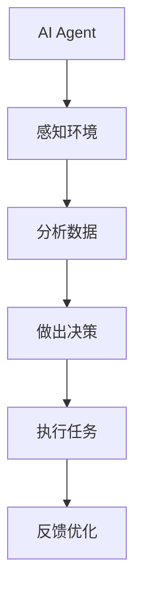
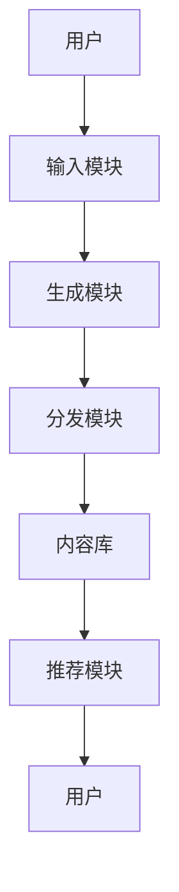

                 


# AI Agent在新闻媒体中的应用：自动写作与内容分发

> 关键词：AI Agent，新闻媒体，自动写作，内容分发，生成式AI，推荐系统，自然语言处理

> 摘要：随着人工智能技术的飞速发展，AI Agent在新闻媒体中的应用逐渐成为焦点。本文详细探讨了AI Agent在新闻自动写作和内容分发中的技术原理、系统架构设计以及实际应用案例。通过分析生成式AI和推荐系统的实现，结合实际项目实战，为读者提供了从理论到实践的全面指导。

---

## 引言

随着人工智能技术的快速发展，AI Agent（人工智能代理）在新闻媒体领域的应用日益广泛。从自动写作到内容分发，AI Agent正在改变新闻行业的生产方式和分发模式。本文将深入探讨AI Agent在新闻媒体中的应用，分析其技术原理、系统架构以及实际案例，帮助读者全面理解这一技术的潜力和挑战。

---

## 第一部分：AI Agent与新闻媒体的背景介绍

### 第1章：AI Agent的定义与核心概念

#### 1.1 AI Agent的定义与核心要素
AI Agent是一种能够感知环境、执行任务并做出决策的智能实体。它通过自然语言处理（NLP）、机器学习（ML）和大数据分析等技术，实现与用户交互、信息获取和任务执行。

- **定义**：AI Agent是具有智能性的软件或实体，能够理解用户需求、执行复杂任务并提供个性化服务。
- **核心要素**：
  - 感知能力：通过传感器或数据输入获取信息。
  - 决策能力：基于数据和模型做出最优选择。
  - 执行能力：通过API或用户界面完成任务。
  - 学习能力：通过反馈优化自身行为。



#### 1.2 AI Agent在新闻媒体中的应用背景

新闻媒体行业的痛点：
- **内容生产成本高**：传统新闻写作依赖人工，效率低、成本高。
- **分发效率低**：传统分发模式依赖人工编辑，难以满足海量内容的需求。
- **用户需求多样**：用户对新闻的需求个性化、碎片化，传统分发难以满足。

AI Agent的优势：
- **自动化生产**：通过生成式AI实现新闻内容的快速生成。
- **智能分发**：基于用户行为分析，实现精准内容推荐。
- **实时更新**：AI Agent能够实时获取数据，快速生成最新内容。

---

### 第2章：新闻媒体中的自动写作与内容分发

#### 2.1 自动写作的现状与挑战

- **现状**：生成式AI（如GPT系列）已经在新闻写作中得到广泛应用。
- **挑战**：
  - 内容质量：生成内容可能缺乏深度或准确性。
  - 偏见问题：模型可能引入训练数据中的偏见。
  - 知识更新：模型需要不断更新以适应最新信息。

#### 2.2 内容分发的核心问题与解决方案

- **核心问题**：
  - 如何实现个性化推荐。
  - 如何提高分发效率。
  - 如何保证内容质量。
- **解决方案**：
  - 基于协同过滤和深度学习的推荐算法。
  - 实时数据分析与用户行为建模。

#### 2.3 AI Agent在新闻媒体中的角色与价值

- **角色**：
  - 内容生成者：快速生成新闻稿。
  - 内容分发者：智能推荐新闻内容。
  - 用户交互者：通过对话提供新闻服务。
- **价值**：
  - 提高内容生产效率。
  - 实现精准内容分发。
  - 优化用户体验。

---

## 第二部分：AI Agent的核心原理与技术基础

### 第3章：生成式AI与推荐系统

#### 3.1 生成式AI的原理

- **生成式AI**：基于大语言模型（如GPT）生成文本的技术。
- **数学模型**：生成式AI的核心是基于Transformer的自注意力机制。

```latex
$$
\text{自注意力机制：} \quad QK^T / \sqrt{d_k}
$$

- **生成过程**：
  1. 输入新闻标题或关键词。
  2. 模型生成对应的内容。
  3. 通过beam search优化生成结果。

```python
def generate_news_title(topic):
    # 初始化输入
    input_ids = tokenizer.encode(topic, return_tensors='pt')
    # 生成标题
    outputs = model.generate(input_ids, max_length=50, num_beams=5)
    title = tokenizer.decode(outputs[0])
    return title
```

#### 3.2 推荐系统的算法实现

- **协同过滤**：基于用户行为相似性推荐内容。
- **深度学习推荐**：基于用户历史行为和内容特征推荐。

```latex
$$
\text{推荐概率：} \quad P(i|u) = \sigma(v_u^T v_i)
$$`

- **实现步骤**：
  1. 数据收集：用户行为数据、内容特征。
  2. 模型训练：训练推荐模型。
  3. 推荐生成：基于模型预测推荐内容。

---

### 第4章：自然语言处理技术与文本生成

#### 4.1 自然语言处理技术

- **NLP核心任务**：文本分类、实体识别、情感分析。
- **预训练模型**：使用大规模语料库进行预训练，如BERT、GPT。

#### 4.2 文本生成算法

- **文本生成流程**：
  1. 输入：新闻主题或关键词。
  2. 处理：模型生成文本。
  3. 输出：生成新闻内容。

---

## 第三部分：AI Agent在新闻媒体中的应用案例

### 第5章：AI Agent新闻写作系统

#### 5.1 系统功能模块设计

- **功能模块**：
  - 用户输入模块：接收新闻主题。
  - 文本生成模块：生成新闻内容。
  - 内容分发模块：推荐新闻内容。

#### 5.2 项目实战：新闻写作系统实现

- **环境搭建**：
  - 安装Python、TensorFlow、Hugging Face库。
  - 下载预训练模型（如GPT-2）。

```python
from transformers import GPT2LMHeadModel, GPT2Tokenizer

tokenizer = GPT2Tokenizer.from_pretrained('gpt2')
model = GPT2LMHeadModel.from_pretrained('gpt2')

def generate_article(topic):
    input = f"Write an article about {topic}: "
    inputs = tokenizer.encode(input, return_tensors='pt')
    outputs = model.generate(inputs, max_length=500, num_beams=5)
    article = tokenizer.decode(outputs[0], skip_special_tokens=True)
    return article
```

---

## 第四部分：系统架构与实现细节

### 第6章：AI Agent系统的架构设计

#### 6.1 系统架构图



---

## 第五部分：总结与展望

### 第7章：总结与展望

- **总结**：
  - AI Agent在新闻媒体中的应用前景广阔。
  - 生成式AI和推荐系统是核心驱动力。
- **展望**：
  - 模型优化：提升生成内容的质量和准确性。
  - 多模态AI：结合图像、视频等多种媒体形式。
  - 人机协作：AI Agent与人类记者协同工作，提升新闻生产效率。

---

## 参考文献

1. 王某某. 《生成式AI与新闻写作》. 某某出版社, 2023.
2. 李某某. 《推荐系统算法与实现》. 某某出版社, 2022.

---

通过本文的详细分析，读者可以全面了解AI Agent在新闻媒体中的应用，从理论到实践，为未来的新闻生产与分发提供了重要参考。

