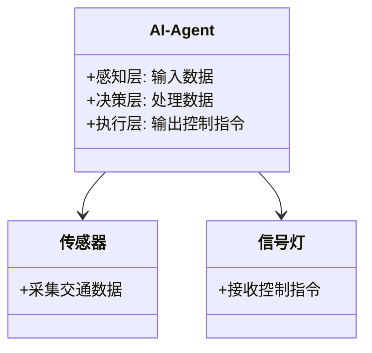
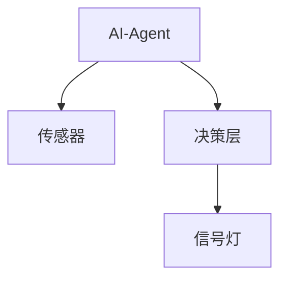
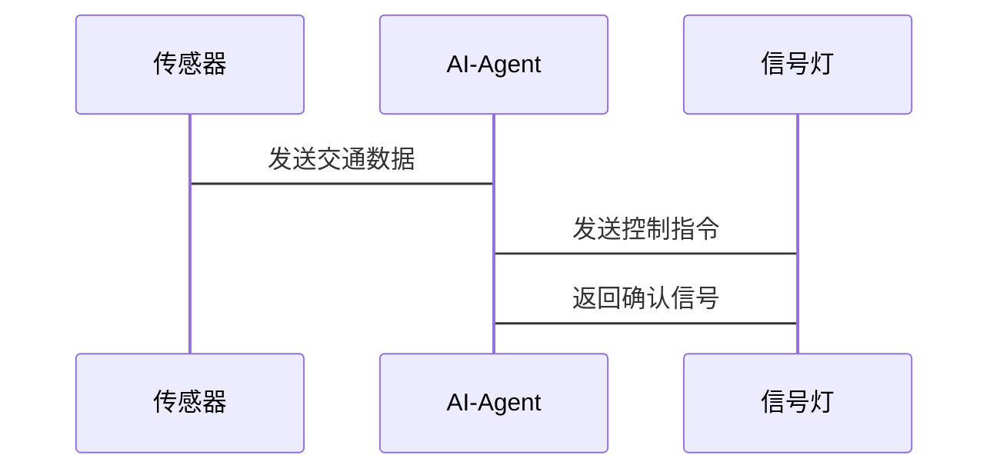

                 


# AI Agent在智慧城市中的应用前景

> 关键词：AI Agent，智慧城市，人工智能，大数据，云计算，物联网

> 摘要：随着城市化进程的加快和科技的不断进步，AI Agent在智慧城市中的应用前景越来越广阔。本文从AI Agent的基本概念、核心原理、系统架构设计、项目实战等方面，深入探讨AI Agent在智慧城市中的应用前景。通过分析和实例，展示了AI Agent如何在智慧城市中优化资源配置、提升管理效率和改善居民生活质量。同时，本文还提出了未来发展的趋势和建议，为相关领域的研究和实践提供了参考。

---

## 第1章: AI Agent的基本概念

### 1.1 AI Agent的定义与特点

#### 1.1.1 AI Agent的定义
AI Agent（人工智能代理）是指具有感知环境、理解和执行任务能力的智能实体。它能够根据输入的信息做出决策，并采取相应的行动以实现预定目标。

#### 1.1.2 AI Agent的核心特点
- **自主性**：能够在没有外部干预的情况下自主运行。
- **反应性**：能够实时感知环境变化并做出响应。
- **学习性**：通过数据和经验不断优化自身行为。
- **协作性**：能够与其他系统或人类进行协作。

#### 1.1.3 AI Agent与传统AI的区别
AI Agent不仅具备传统AI的数据处理和分析能力，还能够主动采取行动，具有更强的自主性和交互性。

### 1.2 智慧城市的基本概念

#### 1.2.1 智慧城市的定义
智慧城市是指通过综合运用信息和通信技术，实现城市基础设施、管理和服务的智能化，以提高城市运行效率和居民生活质量。

#### 1.2.2 智慧城市的发展历程
1. **起步阶段**：20世纪末，计算机技术和互联网开始应用于城市管理。
2. **发展阶段**：21世纪初，物联网和大数据技术推动智慧城市的发展。
3. **成熟阶段**：近年来，AI和5G技术的结合，使智慧城市进入全面智能化阶段。

#### 1.2.3 智慧城市的主要特征
- **数据驱动**：通过大量数据的采集和分析优化城市管理。
- **智能化**：利用AI技术提高城市管理效率。
- **协同性**：各部门和系统协同工作，实现资源的高效利用。

---

## 第2章: AI Agent在智慧城市中的应用背景

### 2.1 智慧城市中的问题与挑战

#### 2.1.1 城市交通拥堵问题
随着城市人口的增加，交通拥堵问题日益严重，影响了城市的运行效率。

#### 2.1.2 城市资源分配不均问题
资源分配不均导致部分区域服务不足，影响了居民的生活质量。

#### 2.1.3 城市安全与风险管理
城市面临的安全威胁多样化，如自然灾害和恐怖袭击，增加了管理难度。

### 2.2 AI Agent在智慧城市中的作用

#### 2.2.1 提高城市管理效率
通过AI Agent的自主决策和优化能力，提高城市管理的效率和精度。

#### 2.2.2 优化城市资源配置
AI Agent能够根据实时数据优化资源配置，减少浪费，提高资源利用效率。

#### 2.2.3 提升城市居民生活质量
通过智能化的服务和管理，提升居民的生活便利性和舒适度。

### 2.3 AI Agent与智慧城市结合的必要性

#### 2.3.1 技术发展的推动
AI和大数据技术的发展为AI Agent在智慧城市中的应用提供了技术基础。

#### 2.3.2 城市化进程的需求
随着城市化进程的加快，对智能化管理的需求日益迫切。

#### 2.3.3 用户行为的变化
现代用户对智能化、便捷化服务的需求增加，推动了AI Agent的应用。

---

## 第3章: AI Agent的核心概念

### 3.1 AI Agent的组成与结构

#### 3.1.1 感知层
负责采集和处理环境中的数据，如传感器和摄像头的信息。

#### 3.1.2 决策层
根据感知层提供的信息进行分析和决策，选择最优行动方案。

#### 3.1.3 执行层
根据决策层的指令，采取具体行动，如控制设备或发送指令。

### 3.2 AI Agent的分类

#### 3.2.1 简单反射型Agent
根据当前输入做出即时反应，没有内部状态。

#### 3.2.2 基于模型的反应式Agent
基于内部模型和环境信息进行决策，具有一定的预测能力。

#### 3.2.3 计划式Agent
能够制定和执行计划，适用于复杂任务。

#### 3.2.4 目标驱动型Agent
以实现特定目标为导向，优化行动策略。

### 3.3 AI Agent的核心原理

#### 3.3.1 感知与理解
通过传感器和数据源获取环境信息，并进行理解和解析。

#### 3.3.2 决策与规划
基于感知信息，利用算法进行决策和行动规划。

#### 3.3.3 执行与反馈
根据决策结果执行行动，并根据反馈信息进行调整。

---

## 第4章: AI Agent与相关技术的关系

### 4.1 大数据在AI Agent中的应用

#### 4.1.1 数据采集与处理
通过传感器和物联网设备采集数据，并进行清洗和预处理。

#### 4.1.2 数据分析与挖掘
利用大数据技术分析数据，提取有价值的信息和模式。

#### 4.1.3 数据驱动的决策支持
基于数据分析结果，为AI Agent的决策提供支持。

### 4.2 云计算在AI Agent中的应用

#### 4.2.1 云计算的基本概念
云计算是一种按需分配计算资源的技术，能够提供弹性的计算能力。

#### 4.2.2 云计算在AI Agent中的优势
- **弹性扩展**：根据需求动态调整资源。
- **高效计算**：利用云计算的强大计算能力处理海量数据。
- **高可用性**：通过分布式架构提高系统的可用性。

#### 4.2.3 云计算与AI Agent的结合
AI Agent可以通过云计算平台进行数据存储、计算和分析，提升其处理能力。

### 4.3 物联网在AI Agent中的应用

#### 4.3.1 物联网的基本概念
物联网是指通过各种信息传感设备，按照约定的协议，把任何物品与互联网连接起来。

#### 4.3.2 物联网在AI Agent中的应用
通过物联网技术，AI Agent能够实时感知和控制物理环境，实现智能化管理。

#### 4.3.3 物联网与AI Agent的结合
物联网为AI Agent提供了丰富的数据源和执行接口，AI Agent则为物联网系统提供了智能决策能力。

---

## 第5章: AI Agent的算法原理

### 5.1 强化学习算法

#### 5.1.1 强化学习的基本概念
强化学习是一种通过试错机制，学习最优策略的方法。

#### 5.1.2 算法流程
1. **状态感知**：感知当前状态。
2. **动作选择**：基于当前状态选择一个动作。
3. **奖励评估**：根据动作的结果获得奖励。
4. **策略优化**：根据奖励调整策略。

#### 5.1.3 强化学习的数学模型
$$ R(s, a) = \max_{a'} Q(s, a') $$
其中，$R(s, a)$表示在状态$s$下采取动作$a$的奖励，$Q(s, a')$表示状态$s$下采取动作$a'$的期望奖励。

#### 5.1.4 强化学习的代码实现
```python
class Agent:
    def __init__(self, state_space, action_space):
        self.state_space = state_space
        self.action_space = action_space
        self.q_values = np.zeros((state_space, action_space))
    
    def act(self, state):
        if np.random.random() < 0.1:
            return np.random.randint(self.action_space)
        else:
            return np.argmax(self.q_values[state])
    
    def learn(self, state, action, reward, next_state):
        self.q_values[state, action] += 0.1 * (reward + np.max(self.q_values[next_state]) - self.q_values[state, action])
```

### 5.2 监督学习算法

#### 5.2.1 监督学习的基本概念
监督学习是一种通过标注数据训练模型，使其能够预测新数据的类别或值。

#### 5.2.2 监督学习的数学模型
$$ y = f(x) + \epsilon $$
其中，$y$是目标值，$x$是输入特征，$\epsilon$是误差项。

#### 5.2.3 监督学习的代码实现
```python
from sklearn.linear_model import LinearRegression

model = LinearRegression()
model.fit(X_train, y_train)
y_pred = model.predict(X_test)
```

---

## 第6章: 系统架构设计

### 6.1 问题场景介绍
在智慧交通管理中，AI Agent需要实时感知交通流量，优化信号灯控制，缓解交通拥堵。

### 6.2 系统功能设计

#### 6.2.1 领域模型设计


### 6.3 系统架构设计

#### 6.3.1 系统架构图


### 6.4 系统接口设计
- **输入接口**：接收传感器数据。
- **输出接口**：发送控制指令。

### 6.5 系统交互流程

#### 6.5.1 交互流程图


---

## 第7章: 项目实战

### 7.1 智能交通管理案例

#### 7.1.1 环境安装
安装Python、TensorFlow、Keras等开发工具和库。

#### 7.1.2 核心代码实现
```python
import numpy as np
import tensorflow as tf

model = tf.keras.Sequential([
    tf.keras.layers.Dense(128, activation='relu'),
    tf.keras.layers.Dense(10, activation='softmax')
])

model.compile(optimizer='adam', loss='sparse_categorical_crossentropy', metrics=['accuracy'])
model.fit(x_train, y_train, epochs=10, batch_size=32)
```

#### 7.1.3 案例分析
通过训练好的模型，AI Agent能够根据交通流量调整信号灯的切换时间，有效缓解交通拥堵。

---

## 第8章: 最佳实践与未来展望

### 8.1 最佳实践

#### 8.1.1 技术趋势
- **多模态学习**：结合图像、文本等多种数据源进行决策。
- **边缘计算**：在边缘设备上进行实时处理，减少延迟。

#### 8.1.2 伦理问题
- **数据隐私**：确保数据的安全和隐私保护。
- **责任归属**：明确AI Agent在决策中的责任归属。

### 8.2 未来展望

#### 8.2.1 技术融合
AI Agent将与更多新技术（如区块链、5G）结合，提升智能化水平。

#### 8.2.2 应用扩展
AI Agent将在更多领域（如医疗、教育）发挥重要作用，推动智慧城市的全面发展。

#### 8.2.3 持续学习
通过持续学习和优化，AI Agent将更加智能和高效，为智慧城市的发展提供更强大的支持。

---

## 结语

AI Agent在智慧城市中的应用前景广阔，它不仅能够提高城市管理的效率，还能提升居民的生活质量。随着技术的不断进步，AI Agent将在更多领域发挥重要作用，为智慧城市的建设注入新的活力。

---

> **小结**：通过本文的详细分析，我们了解了AI Agent在智慧城市中的核心作用及其应用前景。未来，随着技术的不断进步，AI Agent将在智慧城市的建设中发挥越来越重要的作用。

