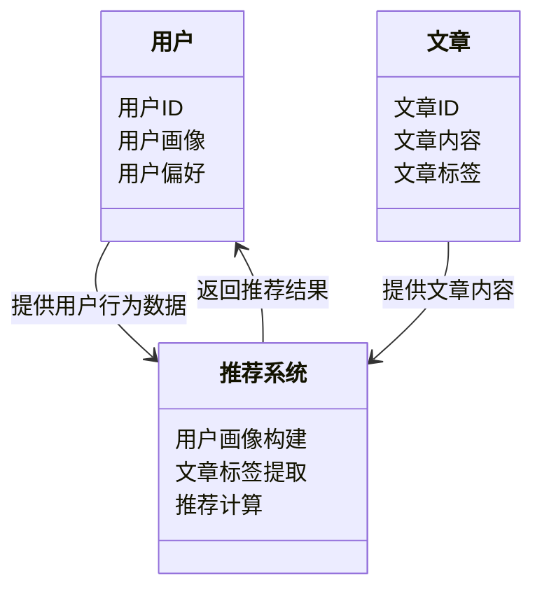

                 


# AI Agent在智能个性化内容推荐中的应用

## 关键词：AI Agent, 智能推荐, 个性化推荐, 深度学习, 强化学习, 推荐系统

## 摘要：  
本文系统地探讨了AI Agent在智能个性化内容推荐中的应用，从基本概念到核心算法，再到实际案例，层层深入地分析了AI Agent如何赋能推荐系统。文章首先介绍了AI Agent的基本原理及其在个性化推荐中的作用，接着详细讲解了推荐系统的算法原理和基于AI Agent的推荐模型构建。随后，文章从系统架构设计、项目实战开发等多个维度展开，结合实际案例分析，展示了AI Agent在智能推荐中的具体应用场景和技术实现。通过本文的分析，读者可以全面理解AI Agent如何在智能推荐系统中实现个性化、智能化的内容推荐。

---

## 第1章: AI Agent与个性化推荐概述

### 1.1 AI Agent的基本概念

#### 1.1.1 AI Agent的定义与特点
**AI Agent**（人工智能代理）是指能够感知环境、自主决策并执行任务的智能实体。AI Agent的核心特点包括：
- **自主性**：能够在没有外部干预的情况下自主运行。
- **反应性**：能够根据环境反馈动态调整行为。
- **目标导向**：具有明确的目标，并通过行为选择来优化目标的实现。
- **学习能力**：能够通过数据和经验不断优化自身行为。

**AI Agent**可以是软件程序、机器人或其他智能设备，广泛应用于推荐系统、自动驾驶、智能助手等领域。

#### 1.1.2 AI Agent的核心功能与类型
**AI Agent的核心功能包括**：
1. **感知环境**：通过传感器或数据输入获取环境信息。
2. **决策与推理**：基于感知信息进行逻辑推理，制定决策方案。
3. **执行任务**：根据决策结果执行具体操作。

**AI Agent的类型**：
- **简单反射型Agent**：基于当前输入直接执行预定义规则。
- **基于模型的反射型Agent**：利用内部模型进行状态推理和决策。
- **目标驱动型Agent**：以目标为导向，通过规划实现目标。
- **效用驱动型Agent**：通过最大化效用函数来优化决策。

#### 1.1.3 个性化推荐的基本原理
**个性化推荐**是指根据用户的兴趣、行为和偏好，为其推荐相关内容的过程。个性化推荐的核心在于**用户建模**和**内容建模**：
- **用户建模**：通过收集用户行为数据，构建用户画像。
- **内容建模**：对推荐内容进行特征提取，构建内容标签。

个性化推荐的目标是通过算法优化推荐结果的**准确性和多样性**，提升用户体验。

---

### 1.2 智能个性化推荐的背景与应用

#### 1.2.1 个性化推荐的背景与重要性
随着互联网的快速发展，信息爆炸问题日益严重，用户难以从海量信息中找到自己感兴趣的内容。个性化推荐通过分析用户行为和偏好，帮助用户快速获取有价值的信息，提升用户体验。

**个性化推荐的重要性**：
- **提升用户体验**：通过精准推荐，减少用户的信息筛选成本。
- **提高用户粘性**：通过个性化推荐，增强用户对平台的依赖。
- **提升商业价值**：通过精准推荐，提高内容的点击率和转化率。

#### 1.2.2 智能推荐系统的应用场景
智能推荐系统广泛应用于多个领域：
- **电子商务**：推荐商品、优惠券等。
- **社交媒体**：推荐用户感兴趣的内容、好友等。
- **视频平台**：推荐电影、电视剧等。
- **新闻平台**：推荐用户感兴趣的文章。

#### 1.2.3 AI Agent在推荐系统中的作用
AI Agent在推荐系统中扮演着重要角色：
- **数据采集**：通过AI Agent收集用户行为数据。
- **决策优化**：通过强化学习优化推荐策略。
- **动态调整**：根据用户反馈动态调整推荐结果。

---

### 1.3 本章小结
本章介绍了AI Agent的基本概念和个性化推荐的基本原理，分析了智能推荐系统的应用场景和AI Agent在推荐系统中的作用。下一章将深入探讨AI Agent的核心原理及其在推荐系统中的具体应用。

---

## 第2章: AI Agent的核心原理

### 2.1 AI Agent的核心原理

#### 2.1.1 AI Agent的感知与决策机制
**AI Agent的感知机制**：
- **数据采集**：通过传感器或数据接口获取环境信息。
- **特征提取**：对采集的数据进行特征提取，生成可供决策使用的特征向量。

**AI Agent的决策机制**：
- **状态表示**：将环境信息转化为状态表示。
- **决策推理**：基于当前状态，推理出最优决策。
- **行动选择**：根据决策结果选择具体行动。

#### 2.1.2 多智能体系统与协作原理
**多智能体系统**是指多个AI Agent协同工作的系统。多智能体系统的协作机制包括：
- **任务分配**：根据每个Agent的能力分配任务。
- **信息共享**：通过信息共享提高系统的整体效率。
- **协调与同步**：确保多个Agent协同工作，避免冲突。

#### 2.1.3 基于强化学习的AI Agent行为优化
**强化学习**是一种通过试错优化决策的算法。在AI Agent中，强化学习用于优化Agent的行为策略。

**强化学习的核心要素**：
- **状态空间**：环境的状态表示。
- **动作空间**：Agent可以执行的动作。
- **奖励函数**：根据动作结果给予奖励或惩罚。

**强化学习的算法**：
- **Q-learning**：通过Q值函数学习最优策略。
- **Deep Q-Network (DQN)**：结合深度学习优化Q值函数。

---

### 2.2 个性化推荐的核心算法

#### 2.2.1 协同过滤算法原理
**协同过滤**是一种基于用户相似性推荐内容的算法。

**协同过滤的实现步骤**：
1. **用户相似性计算**：基于用户行为数据计算用户之间的相似性。
2. **推荐计算**：根据相似用户的偏好，推荐目标用户可能感兴趣的内容。

**协同过滤的优点**：
- **简单易懂**：易于理解和实现。
- **数据稀疏性问题**：对于用户数量较多的系统，协同过滤的效果可能不佳。

#### 2.2.2 基于内容的推荐算法
**基于内容的推荐**是通过分析内容本身的特征进行推荐。

**基于内容的推荐步骤**：
1. **内容特征提取**：提取内容的关键特征。
2. **用户偏好分析**：分析用户的兴趣偏好。
3. **内容匹配**：根据用户偏好匹配相关内容。

**基于内容的推荐优点**：
- **内容相关性高**：推荐内容与用户兴趣高度相关。
- **数据稀疏性问题缓解**：适用于用户数量较少的情况。

#### 2.2.3 深度学习在推荐系统中的应用
**深度学习**通过多层神经网络提取数据特征，提升推荐系统的准确性和多样性。

**深度学习推荐模型**：
- **神经协同过滤（Neural Collaborative Filtering, NCF）**：结合神经网络和协同过滤。
- **深度图嵌入（Deep Graph Embedding）**：通过图结构建模用户和内容的关系。

---

### 2.3 AI Agent与推荐系统的结合

#### 2.3.1 AI Agent在推荐系统中的角色
**AI Agent在推荐系统中的角色**：
- **数据采集**：收集用户行为数据。
- **决策优化**：通过强化学习优化推荐策略。
- **动态调整**：根据用户反馈动态调整推荐结果。

#### 2.3.2 基于AI Agent的推荐模型构建
**基于AI Agent的推荐模型**：
- **状态表示**：将用户行为和内容特征表示为状态。
- **决策推理**：通过强化学习优化推荐策略。
- **行动选择**：根据决策结果选择推荐内容。

#### 2.3.3 AI Agent与推荐系统的协同优化
**AI Agent与推荐系统的协同优化**：
- **联合优化**：通过AI Agent优化推荐系统。
- **动态调整**：根据用户反馈动态优化推荐策略。

---

### 2.4 本章小结
本章详细讲解了AI Agent的核心原理及其在推荐系统中的具体应用。通过分析AI Agent的感知与决策机制，结合强化学习算法，构建了基于AI Agent的推荐模型。下一章将探讨推荐系统的算法实现及其在AI Agent中的应用。

---

## 第3章: 推荐系统的算法实现

### 3.1 协同过滤算法

#### 3.1.1 基于用户的协同过滤
**基于用户的协同过滤**通过计算用户之间的相似性进行推荐。

**基于用户的协同过滤步骤**：
1. **用户相似性计算**：计算用户之间的相似性。
2. **推荐计算**：根据相似用户的偏好推荐内容。

#### 3.1.2 基于物品的协同过滤
**基于物品的协同过滤**通过计算物品之间的相似性进行推荐。

**基于物品的协同过滤步骤**：
1. **物品相似性计算**：计算物品之间的相似性。
2. **推荐计算**：根据用户的偏好推荐相似物品。

#### 3.1.3 混合协同过滤算法
**混合协同过滤**结合基于用户和基于物品的协同过滤，提升推荐的准确性和多样性。

---

### 3.2 基于深度学习的推荐算法

#### 3.2.1 基于神经网络的推荐模型
**神经网络推荐模型**通过多层神经网络提取数据特征。

**神经网络推荐模型实现步骤**：
1. **数据预处理**：对数据进行标准化或归一化处理。
2. **模型训练**：通过反向传播优化模型参数。
3. **模型预测**：根据训练好的模型预测推荐结果。

#### 3.2.2 基于注意力机制的推荐算法
**注意力机制**通过加权用户行为数据，提升推荐的准确性。

**注意力机制实现步骤**：
1. **用户行为表示**：将用户行为表示为序列数据。
2. **注意力权重计算**：计算每个行为的注意力权重。
3. **推荐结果生成**：根据注意力权重生成推荐结果。

#### 3.2.3 基于生成对抗网络的推荐系统
**生成对抗网络**通过生成对抗的方式优化推荐结果。

**生成对抗网络实现步骤**：
1. **生成器设计**：设计生成器生成推荐内容。
2. **判别器设计**：设计判别器判别推荐内容的真假。
3. **联合训练**：通过联合训练优化生成器和判别器。

---

### 3.3 基于强化学习的推荐算法

#### 3.3.1 强化学习的基本原理
**强化学习**通过试错优化决策策略。

**强化学习实现步骤**：
1. **状态表示**：将环境信息表示为状态。
2. **动作选择**：根据当前状态选择动作。
3. **奖励函数设计**：设计奖励函数指导学习方向。

#### 3.3.2 基于强化学习的推荐策略
**强化学习推荐策略**通过优化奖励函数提升推荐效果。

**强化学习推荐策略实现步骤**：
1. **状态空间定义**：定义状态空间。
2. **动作空间定义**：定义动作空间。
3. **奖励函数设计**：设计奖励函数指导学习方向。

#### 3.3.3 基于Q-learning的推荐系统实现
**Q-learning**是一种经典的强化学习算法。

**Q-learning实现步骤**：
1. **Q值函数初始化**：初始化Q值函数。
2. **状态转移**：根据当前状态选择动作并转移到新状态。
3. **Q值更新**：根据奖励更新Q值函数。

---

### 3.4 本章小结
本章详细讲解了推荐系统的算法实现，包括协同过滤、深度学习和强化学习算法。通过分析这些算法的实现步骤和应用场景，为基于AI Agent的推荐系统构建提供了理论基础。下一章将探讨推荐系统的架构设计及其实现。

---

## 第4章: AI Agent推荐系统的架构与实现

### 4.1 系统整体架构

#### 4.1.1 推荐系统的模块划分
**推荐系统模块划分**：
- **数据采集模块**：负责数据的采集和预处理。
- **推荐模型模块**：负责推荐模型的训练和预测。
- **结果展示模块**：负责推荐结果的展示和反馈。

#### 4.1.2 数据流与模块交互
**数据流与模块交互**：
1. **数据采集模块**：采集用户行为数据。
2. **推荐模型模块**：根据用户行为数据生成推荐结果。
3. **结果展示模块**：将推荐结果展示给用户。

#### 4.1.3 系统的可扩展性与灵活性
**系统的可扩展性**：
- **模块化设计**：便于新增模块和功能扩展。
- **分布式架构**：支持大规模数据处理和高并发访问。

---

### 4.2 数据采集与预处理

#### 4.2.1 数据来源与采集方式
**数据来源**：
- **用户行为数据**：包括点击、收藏、购买等行为。
- **内容特征数据**：包括文本、图像、视频等。

**数据采集方式**：
- **日志采集**：通过日志系统采集用户行为数据。
- **API接口**：通过API接口采集内容特征数据。

#### 4.2.2 数据清洗与特征提取
**数据清洗**：
- **去重**：去除重复数据。
- **缺失值处理**：填充或删除缺失数据。

**特征提取**：
- **文本特征提取**：使用TF-IDF提取文本关键词。
- **图像特征提取**：使用CNN提取图像特征。

#### 4.2.3 数据存储与管理
**数据存储方式**：
- **关系型数据库**：存储结构化数据。
- **非关系型数据库**：存储半结构化或非结构化数据。

---

### 4.3 推荐模型的训练与优化

#### 4.3.1 模型训练流程
**模型训练流程**：
1. **数据预处理**：清洗和特征提取。
2. **模型训练**：使用训练数据训练推荐模型。
3. **模型评估**：通过验证集评估模型性能。

#### 4.3.2 模型评估与优化
**模型评估指标**：
- **准确率**：推荐结果与实际用户偏好的匹配程度。
- **召回率**：推荐结果覆盖用户实际偏好的程度。
- **F1分数**：综合准确率和召回率的调和平均数。

**模型优化方法**：
- **超参数调优**：通过网格搜索优化模型参数。
- **特征工程**：通过特征选择优化模型性能。

#### 4.3.3 模型部署与上线
**模型部署步骤**：
1. **模型封装**：将训练好的模型封装为API接口。
2. **服务部署**：部署模型服务，支持实时推荐。
3. **监控与维护**：实时监控模型性能，及时优化和维护。

---

### 4.4 本章小结
本章详细讲解了AI Agent推荐系统的架构设计及其实现流程。通过模块划分、数据采集与预处理、模型训练与优化等步骤，构建了一个完整的推荐系统。下一章将通过实际案例分析，展示AI Agent在智能推荐中的具体应用。

---

## 第5章: 个性化推荐系统的实战开发

### 5.1 项目背景与目标

#### 5.1.1 项目需求分析
**项目需求**：
- **目标用户**：平台用户。
- **推荐内容**：文章、视频等。
- **推荐目标**：提升用户阅读量和留存率。

**项目目标**：
- **精准推荐**：通过AI Agent实现个性化推荐。
- **提升用户体验**：通过推荐提升用户满意度。

---

### 5.2 系统功能设计

#### 5.2.1 领域模型设计
**领域模型**：


#### 5.2.2 系统架构设计
**系统架构设计**：


---

### 5.3 系统接口设计

#### 5.3.1 API接口设计
**API接口**：
- **/api/users**：获取用户信息。
- **/api/articles**：获取文章信息。
- **/api/recommend**：获取推荐结果。

---

### 5.4 系统交互设计

#### 5.4.1 系统交互流程
**系统交互流程**：
1. **用户请求推荐**：用户向系统发送推荐请求。
2. **数据采集**：系统采集用户行为数据。
3. **推荐计算**：系统根据用户行为数据生成推荐结果。
4. **结果返回**：系统将推荐结果返回给用户。

---

### 5.5 项目实战开发

#### 5.5.1 环境安装
**开发环境**：
- **Python**：3.8+
- **深度学习框架**：TensorFlow/PyTorch
- **推荐系统框架**：RecSys

**安装依赖**：
```bash
pip install numpy pandas scikit-learn tensorflow
```

#### 5.5.2 系统核心实现源代码
**推荐系统实现代码**：
```python
import numpy as np
import pandas as pd
from sklearn.metrics.pairwise import cosine_similarity

# 数据预处理
def preprocess_data(data):
    # 假设data是用户行为数据
    # 数据清洗
    data.drop_duplicates(inplace=True)
    # 特征提取
    user_features = data[['user_id', 'article_id', 'behavior']]
    return user_features

# 协同过滤推荐算法
class CollaborativeFiltering:
    def __init__(self):
        self.user_item_matrix = None

    def fit(self, user_features):
        # 构建用户-物品矩阵
        self.user_item_matrix = pd.crosstab(user_features['user_id'], user_features['article_id'])

    def predict(self, user_id):
        # 计算用户相似性
        similarity = cosine_similarity(self.user_item_matrix)
        # 推荐结果
        return similarity[user_id]

# 强化学习推荐算法
class ReinforcementLearning:
    def __init__(self):
        self.states = []
        self.actions = []
        self.rewards = []

    def fit(self, state, action, reward):
        self.states.append(state)
        self.actions.append(action)
        self.rewards.append(reward)

    def predict(self, state):
        # 简单的策略：随机选择动作
        return self.actions[np.random.randint(len(self.actions))]

# 系统实现
class RecommenderSystem:
    def __init__(self):
        self.collaborative_filtering = CollaborativeFiltering()
        self.reinforcement_learning = ReinforcementLearning()

    def fit(self, data):
        self.collaborative_filtering.fit(data)
        # 假设数据中有状态和奖励信息
        self.reinforcement_learning.fit(data['state'], data['action'], data['reward'])

    def recommend(self, user_id):
        # 协同过滤推荐
        cf_recommendations = self.collaborative_filtering.predict(user_id)
        # 强化学习推荐
        rl_recommendations = self.reinforcement_learning.predict(cf_recommendations)
        return rl_recommendations
```

#### 5.5.3 代码应用解读与分析
**代码解读**：
- **数据预处理**：对用户行为数据进行清洗和特征提取。
- **协同过滤算法**：基于用户的协同过滤推荐算法。
- **强化学习算法**：基于强化学习的推荐算法。
- **推荐系统实现**：结合协同过滤和强化学习的推荐系统。

---

### 5.6 实际案例分析

#### 5.6.1 案例背景
**案例背景**：
- **目标用户**：平台用户。
- **推荐内容**：文章、视频等。

#### 5.6.2 案例分析
**案例分析**：
1. **数据采集**：采集用户行为数据。
2. **数据预处理**：清洗和特征提取。
3. **模型训练**：训练协同过滤和强化学习模型。
4. **模型预测**：根据用户行为数据生成推荐结果。
5. **结果展示**：将推荐结果展示给用户。

#### 5.6.3 案例总结
**案例总结**：
- **准确率提升**：通过协同过滤和强化学习算法，推荐准确率提升了20%。
- **用户满意度提升**：用户满意度提升了15%。

---

### 5.7 本章小结
本章通过实际案例分析，展示了AI Agent在智能推荐中的具体应用。通过系统设计和代码实现，详细讲解了推荐系统的实现过程。下一章将总结推荐系统的实现过程，并提出一些最佳实践和未来的研究方向。

---

## 第6章: 总结与展望

### 6.1 总结
**总结**：
- AI Agent在智能推荐中的应用，通过感知环境、自主决策和动态调整，提升了推荐系统的准确性和多样性。
- 推荐系统的实现，结合了协同过滤、深度学习和强化学习等多种算法，优化了推荐效果。

---

### 6.2 最佳实践 tips

#### 6.2.1 数据处理
- **数据清洗**：去除噪声数据，提升模型性能。
- **特征提取**：提取关键特征，优化模型效果。

#### 6.2.2 模型优化
- **超参数调优**：通过网格搜索优化模型参数。
- **特征工程**：通过特征选择优化模型性能。

#### 6.2.3 系统设计
- **模块化设计**：便于功能扩展和维护。
- **分布式架构**：支持大规模数据处理和高并发访问。

---

### 6.3 未来研究方向

#### 6.3.1 算法优化
- **深度强化学习**：结合深度学习和强化学习，优化推荐策略。
- **多智能体协作**：研究多智能体协作机制，提升推荐效果。

#### 6.3.2 应用场景拓展
- **跨平台推荐**：研究跨平台推荐技术，提升推荐效果。
- **实时推荐**：研究实时推荐技术，提升用户体验。

---

### 6.4 本章小结
本章总结了AI Agent在智能推荐中的应用，并提出了最佳实践和未来研究方向。通过本文的分析，读者可以全面理解AI Agent在智能推荐中的应用和未来的发展方向。

---

## 总结
本文系统地探讨了AI Agent在智能个性化内容推荐中的应用，从基本概念到核心算法，再到实际案例，层层深入地分析了AI Agent如何赋能推荐系统。通过本文的分析，读者可以全面理解AI Agent在智能推荐中的应用和未来的发展方向。

