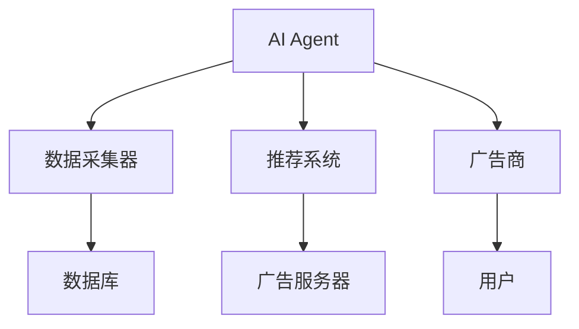

                 


# AI Agent在智能个性化广告投放中的应用

**关键词**：AI Agent，智能个性化广告，广告投放，推荐算法，用户画像

**摘要**：随着人工智能技术的快速发展，AI Agent在广告投放中的应用变得越来越重要。本文详细探讨了AI Agent在智能个性化广告中的核心概念、算法原理、系统架构以及实际应用，旨在为广告从业者和技术人员提供深入的技术指导和实践参考。

---

## 第1章: AI Agent的基本概念与背景

### 1.1 AI Agent的定义与核心原理

AI Agent（人工智能代理）是一种能够感知环境、执行任务并做出决策的智能体。它通过数据驱动的方式，利用机器学习算法来优化广告投放策略。

- **AI Agent的定义**：AI Agent是一种能够自主决策和行动的智能系统，用于优化广告投放效果。
- **AI Agent的核心原理**：通过数据收集、分析和预测，AI Agent能够实时调整广告策略，以匹配用户需求。

### 1.2 广告投放中的问题与挑战

在传统广告投放中，存在以下问题：
- **广告投放的低效性**：难以实时匹配用户需求。
- **用户行为的多样性**：用户需求复杂，难以精准预测。
- **数据驱动的优化需求**：需要高效的数据处理能力。

### 1.3 AI Agent在广告投放中的优势

AI Agent能够显著提升广告投放的效果和效率：
- **高效的数据处理能力**：通过机器学习算法快速分析用户数据。
- **智能的用户行为预测**：基于历史数据预测用户行为。
- **实时的广告优化能力**：根据实时数据动态调整广告策略。

---

## 第2章: AI Agent与个性化广告的核心概念

### 2.1 个性化广告的核心要素

个性化广告的成功依赖于以下几个关键要素：
- **用户画像**：通过收集用户的浏览记录、点击行为等数据，构建用户画像。
- **广告内容多样性**：提供多样化的广告内容以匹配不同用户的需求。
- **实时性**：广告投放需要实时调整策略以应对用户行为的变化。

### 2.2 AI Agent与个性化广告的关系

AI Agent在个性化广告中的作用：
- **数据驱动的决策**：AI Agent通过分析用户数据，优化广告投放策略。
- **实时调整**：基于实时数据，AI Agent能够动态调整广告内容和投放位置。

### 2.3 核心概念的ER实体关系图

以下是一个简单的ER实体关系图，展示了AI Agent、用户和广告之间的关系：

```mermaid
er
  %%{init: 'flowchart', theme: 'simple'}%%

  entity User {
    id: integer
    name: string
    age: integer
    gender: string
    interests: string
  }

  entity Ad {
    ad_id: integer
    content: string
    target: string
    status: string
  }

  entity AIAgent {
    agent_id: integer
    target: User
    action: string
    timestamp: datetime
  }

  relation ShownTo {
    User.->Ad: "看到广告"
    AIAgent.->Ad: "选择广告"
  }
```

---

## 第3章: AI Agent的算法原理与实现

### 3.1 推荐算法的核心原理

推荐算法是AI Agent优化广告投放的关键技术。以下是几种常见的推荐算法：

#### 3.1.1 协同过滤算法

协同过滤是一种基于用户相似性推荐广告的方法。以下是其核心步骤：

1. **数据收集**：收集用户的行为数据。
2. **计算相似性**：通过余弦相似度计算用户相似性。
3. **推荐广告**：基于相似用户的偏好推荐广告。

#### 3.1.2 基于内容的推荐算法

基于内容的推荐算法通过分析广告内容的特征来推荐广告。以下是其核心步骤：

1. **内容特征提取**：提取广告内容的关键词和主题。
2. **用户偏好分析**：分析用户的兴趣偏好。
3. **广告推荐**：基于内容特征和用户偏好推荐广告。

#### 3.1.3 深度学习推荐算法

深度学习推荐算法通过神经网络模型学习用户和广告的特征，推荐广告。以下是其核心步骤：

1. **数据预处理**：对用户和广告数据进行预处理。
2. **模型训练**：训练神经网络模型。
3. **广告推荐**：基于模型预测推荐广告。

### 3.2 推荐算法的数学模型

以下是协同过滤算法的数学模型：

$$\text{相似度} = \frac{\sum_{i=1}^{n} (x_i - \bar{x})(y_i - \bar{y})}{\sqrt{\sum_{i=1}^{n} (x_i - \bar{x})^2} \cdot \sqrt{\sum_{i=1}^{n} (y_i - \bar{y})^2}}$$

其中，$x_i$和$y_i$分别是用户i的评分，$\bar{x}$和$\bar{y}$分别是平均评分。

### 3.3 推荐算法的Python实现

以下是协同过滤算法的Python代码示例：

```python
import numpy as np

def cosine_similarity(user_vec, item_vec):
    numerator = np.sum(user_vec * item_vec)
    denominator = np.sqrt(np.sum(user_vec**2)) * np.sqrt(np.sum(item_vec**2))
    return numerator / denominator

user_vector = np.array([1, 2, 3])
item_vector = np.array([2, 3, 4])
similarity = cosine_similarity(user_vector, item_vector)
print(f"相似度为：{similarity}")
```

---

## 第4章: 系统架构与接口设计

### 4.1 系统架构设计

以下是AI Agent广告投放系统的架构图：



### 4.2 系统功能设计

以下是系统的功能模块：

- **数据采集模块**：收集用户行为数据。
- **推荐系统模块**：基于推荐算法推荐广告。
- **广告服务器模块**：投放广告并收集反馈数据。

### 4.3 系统接口设计

以下是系统接口的描述：

- **数据采集接口**：`GET /api/datacollector/userbehavior`
- **推荐系统接口**：`POST /api/recommendersystem/recommend`
- **广告服务器接口**：`POST /api/adserver/trigger`

---

## 第5章: 项目实战与案例分析

### 5.1 项目环境安装

以下是项目环境的安装步骤：

1. **安装Python**：安装Python 3.8或更高版本。
2. **安装依赖库**：安装`numpy`, `pandas`, `scikit-learn`等库。
3. **安装开发工具**：安装`Jupyter Notebook`用于开发和测试。

### 5.2 系统核心代码实现

以下是协同过滤算法的Python代码实现：

```python
from sklearn.metrics.pairwise import cosine_similarity

# 示例数据
users = ['User1', 'User2', 'User3']
ads = ['Ad1', 'Ad2', 'Ad3']
user_behaviors = {
    'User1': ['Ad1', 'Ad2'],
    'User2': ['Ad2', 'Ad3'],
    'User3': ['Ad1', 'Ad3']
}

# 计算相似度
similarity_matrix = cosine_similarity([[1, 1, 0], [1, 0, 1], [0, 1, 1]])
print("相似度矩阵：\n", similarity_matrix)
```

### 5.3 案例分析与优化

以下是一个广告投放案例分析：

1. **数据收集**：收集用户的行为数据。
2. **推荐算法选择**：选择协同过滤算法。
3. **广告投放**：基于推荐结果投放广告。
4. **效果评估**：评估广告点击率和转化率。

### 5.4 项目小结

通过项目实战，我们可以看到AI Agent在广告投放中的巨大潜力。推荐算法能够显著提升广告的点击率和转化率，从而提高广告投放的效果。

---

## 第6章: 最佳实践与小结

### 6.1 最佳实践

- **数据质量**：确保数据的准确性和完整性。
- **算法选择**：根据具体需求选择合适的推荐算法。
- **实时性优化**：优化系统的实时性以满足用户需求。

### 6.2 小结

本文详细探讨了AI Agent在智能个性化广告投放中的应用，从核心概念到实际应用，全面分析了其优势和挑战。通过本文的学习，读者可以深入了解AI Agent在广告投放中的应用，并将其应用到实际项目中。

### 6.3 注意事项

- **数据隐私**：注意用户数据的隐私保护。
- **算法优化**：不断优化推荐算法以提升效果。
- **系统稳定性**：确保系统的稳定性和安全性。

### 6.4 拓展阅读

- 推荐系统领域的经典书籍：《推荐系统实战》
- AI Agent的相关论文：《AI Agent在广告投放中的应用研究》

---

通过本文的学习，读者可以全面了解AI Agent在智能个性化广告投放中的应用，并将其应用到实际项目中，为广告投放带来更大的效益。

