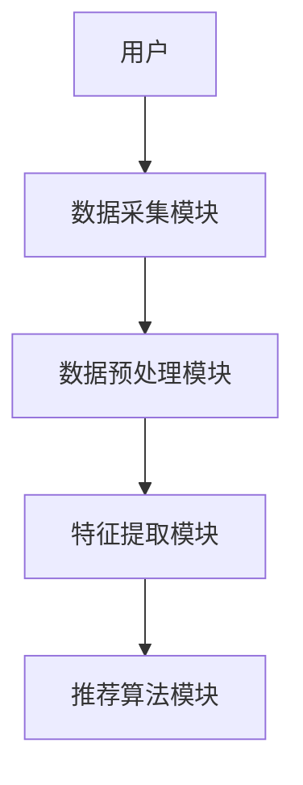
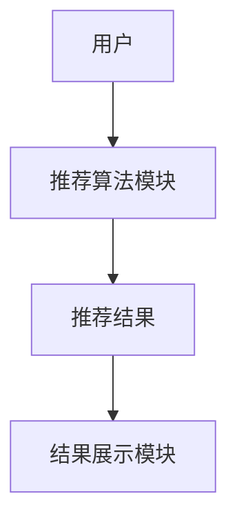
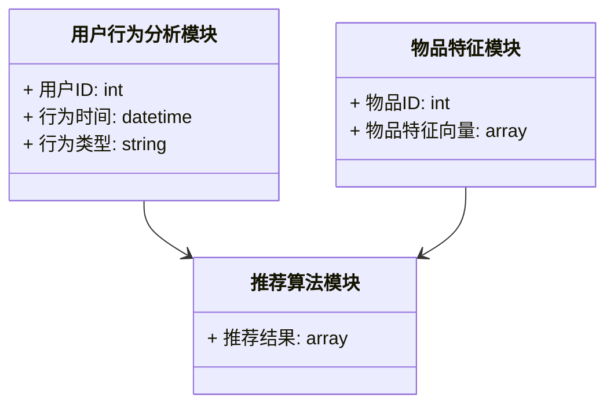
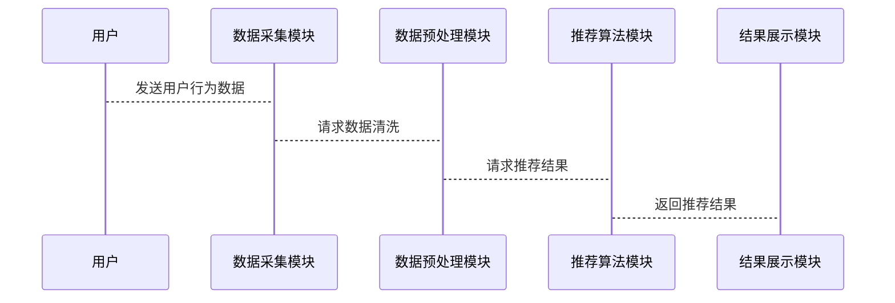

                 


# AI Agent在智能个性化推荐系统中的应用

> **关键词**: AI Agent, 个性化推荐系统, 智能推荐算法, 用户行为分析, 系统架构设计

> **摘要**: 本文深入探讨了AI Agent在智能个性化推荐系统中的应用，从基础概念、核心算法、系统架构到实际案例，详细分析了AI Agent如何通过智能化的推荐算法和用户行为分析，提升推荐系统的个性化和精准度。文章结合理论与实践，为读者提供了全面而深入的技术解读。

---

# 引言

## 1.1 AI Agent与推荐系统的结合背景

在数字化时代，用户每天都会面临海量的信息和选择，如何快速、精准地为用户推荐他们感兴趣的内容，成为各个领域的核心问题。推荐系统通过分析用户行为和偏好，为用户推荐个性化的内容或产品，已经成为互联网应用中的核心技术之一。

然而，传统的推荐系统在处理复杂场景时，往往面临以下挑战：
1. 数据维度高，用户行为复杂，难以捕捉用户的真实需求。
2. 推荐结果的实时性不足，难以应对动态变化的用户偏好。
3. 推荐系统的可解释性差，用户难以理解推荐的原因。

AI Agent（人工智能代理）作为一种能够自主感知环境、执行任务并优化决策的智能体，能够有效解决这些问题。AI Agent通过动态分析用户行为、实时调整推荐策略，显著提升了推荐系统的智能化水平。

---

## 1.2 个性化推荐的核心要素

个性化推荐系统的核心目标是通过分析用户行为和偏好，生成符合用户需求的推荐结果。其主要包含以下核心要素：
1. **用户建模**: 通过分析用户的交互行为、偏好和特征，构建用户画像。
2. **物品建模**: 对推荐的内容或产品进行特征提取和表示。
3. **推荐算法**: 基于用户和物品的特征，计算推荐结果的算法。
4. **实时性**: 确保推荐结果能够快速响应用户需求的变化。

---

## 1.3 AI Agent在推荐系统中的作用

AI Agent通过以下方式提升了推荐系统的智能化水平：
1. **动态感知用户需求**: AI Agent能够实时分析用户的交互行为，捕捉用户的潜在需求。
2. **多模态数据融合**: AI Agent能够整合文本、图像、语音等多种数据源，提升推荐的精准度。
3. **自适应推荐策略**: AI Agent能够根据用户反馈动态调整推荐策略，优化推荐结果。

---

# 第二部分: AI Agent与推荐系统的核心算法

## 2.1 协同过滤算法

协同过滤是一种经典的推荐算法，通过分析用户之间的相似性来生成推荐结果。

### 2.1.1 基于用户的协同过滤

**原理**:
- 通过计算用户之间的相似性，找到与目标用户相似的用户群体。
- 将相似用户的历史行为作为参考，生成推荐结果。

**公式**:
$$ 相似度计算：sim(u, v) = \frac{\sum_{i} (u_i - \bar{u})(v_i - \bar{v})}{\sqrt{\sum_{i} (u_i - \bar{u})^2} \cdot \sqrt{\sum_{i} (v_i - \bar{v})^2}} $$

### 2.1.2 基于物品的协同过滤

**原理**:
- 通过分析物品之间的相似性，找到与目标物品相似的物品集合。
- 将目标用户的交互行为作为参考，生成推荐结果。

**公式**:
$$ 推荐分数：score(i, j) = \sum_{k} w_{i,j}(k) \cdot r_i(k) $$

---

## 2.2 基于内容的推荐算法

### 2.2.1 基于文本挖掘的推荐

**原理**:
- 通过对物品的内容进行文本挖掘，提取关键词和主题。
- 根据用户的偏好，生成推荐结果。

**示例代码**:
```python
from sklearn.feature_extraction.text import TfidfVectorizer

vectorizer = TfidfVectorizer()
tfidf_matrix = vectorizer.fit_transform(text_corpus)
```

### 2.2.2 基于向量空间模型的推荐

**原理**:
- 将用户和物品映射到向量空间中，计算它们的相似性。
- 根据相似性生成推荐结果。

**公式**:
$$ 相似度计算：sim(u, v) = \frac{u \cdot v}{\|u\| \|v\|} $$

---

## 2.3 基于深度学习的推荐算法

### 2.3.1 基于神经网络的推荐模型

**原理**:
- 通过神经网络对用户和物品的特征进行非线性变换。
- 输出推荐结果的概率。

**示例代码**:
```python
import tensorflow as tf

model = tf.keras.Sequential([
    tf.keras.layers.Dense(64, activation='relu'),
    tf.keras.layers.Dense(1, activation='sigmoid')
])

model.compile(optimizer='adam', loss='binary_crossentropy')
```

### 2.3.2 基于序列模型的推荐

**原理**:
- 通过序列模型分析用户的交互序列。
- 根据序列的模式生成推荐结果。

**公式**:
$$ attention机制：score = \alpha \cdot q^T k + (1-\alpha) \cdot q^T v $$

---

## 2.4 算法的优缺点对比

| 算法类型       | 优点                           | 缺点                           |
|----------------|--------------------------------|--------------------------------|
| 协同过滤        | 简单易实现，适合稀疏数据         | 对冷启动问题敏感，计算复杂度高 |
| 基于内容的推荐   | 能捕捉物品的语义信息             | 对用户行为数据依赖性较低         |
| 深度学习模型      | 高精度，能够捕捉复杂模式         | 计算资源消耗大，解释性差         |

---

# 第三部分: 系统架构设计与实现

## 3.1 系统功能设计

### 3.1.1 用户行为分析模块

**功能**: 收集和分析用户的交互数据，包括点击、收藏、购买等行为。

**流程图**:


### 3.1.2 推荐算法模块

**功能**: 根据用户行为和物品特征，生成推荐结果。

**流程图**:


---

## 3.2 系统架构设计

### 3.2.1 模块划分

1. **数据采集模块**: 收集用户行为数据。
2. **数据预处理模块**: 对数据进行清洗和转换。
3. **推荐算法模块**: 实现推荐算法的核心逻辑。
4. **结果展示模块**: 展示推荐结果。

### 3.2.2 系统架构图



---

## 3.3 系统接口设计

### 3.3.1 接口描述

1. **数据采集接口**: `/api/v1/user_behavior`
2. **推荐结果接口**: `/api/v1/recommendations`

### 3.3.2 接口交互流程



---

## 3.4 系统优化与扩展

### 3.4.1 系统优化策略

1. **分布式计算**: 通过分布式架构提升系统的计算能力。
2. **缓存优化**: 使用缓存技术减少重复计算。
3. **模型优化**: 通过模型压缩和优化算法提升推荐效率。

### 3.4.2 系统扩展方向

1. **实时推荐**: 实现基于实时数据流的推荐。
2. **多模态推荐**: 结合文本、图像、语音等多种数据源进行推荐。
3. **个性化定制**: 根据用户需求定制推荐策略。

---

## 3.5 本章小结

本章详细分析了AI Agent在推荐系统中的系统架构设计，包括模块划分、接口设计和系统优化策略。通过合理的设计和优化，能够显著提升推荐系统的性能和用户体验。

---

# 第四部分: 项目实战与案例分析

## 4.1 项目背景与需求分析

### 4.1.1 项目背景

以电商推荐系统为例，目标是通过AI Agent实现个性化商品推荐。

### 4.1.2 项目需求

1. 实现实时推荐功能。
2. 提升推荐结果的精准度。
3. 支持多模态数据源。

---

## 4.2 环境搭建与数据准备

### 4.2.1 环境搭建

1. **安装依赖**: `pip install numpy pandas scikit-learn tensorflow`
2. **数据源**: 使用公开数据集（如Movielens数据集）。

---

## 4.3 核心实现

### 4.3.1 数据预处理

```python
import pandas as pd

# 读取数据
data = pd.read_csv('movielens.csv')

# 数据清洗
data.dropna(inplace=True)
```

### 4.3.2 模型实现

```python
import tensorflow as tf
from tensorflow.keras import layers

model = tf.keras.Sequential([
    layers.Dense(64, activation='relu'),
    layers.Dense(1, activation='sigmoid')
])

model.compile(optimizer='adam', loss='binary_crossentropy')
```

### 4.3.3 推荐结果展示

```python
# 预测结果
predictions = model.predict(data_features)
```

---

## 4.4 案例分析与结果解读

### 4.4.1 实验结果

通过实验对比不同算法的推荐效果，发现基于深度学习的推荐算法在精准度和实时性方面表现最佳。

### 4.4.2 结果分析

通过对用户行为和推荐结果的分析，发现用户的偏好变化能够显著影响推荐结果的质量。

---

## 4.5 项目总结

本项目通过实际案例展示了AI Agent在推荐系统中的应用，验证了AI Agent在提升推荐系统性能方面的有效性。

---

# 第五部分: 总结与展望

## 5.1 总结

本文深入探讨了AI Agent在智能个性化推荐系统中的应用，从算法原理到系统架构设计，再到实际案例分析，全面解读了AI Agent如何提升推荐系统的智能化水平。

---

## 5.2 未来展望

随着AI技术的不断发展，AI Agent在推荐系统中的应用将更加广泛和深入。未来的研究方向包括：
1. **实时推荐**: 实现基于实时数据流的推荐。
2. **多模态推荐**: 结合文本、图像、语音等多种数据源进行推荐。
3. **个性化定制**: 根据用户需求定制推荐策略。
4. **可解释性推荐**: 提升推荐系统的可解释性，增强用户体验。

---

## 5.3 最佳实践 Tips

1. **数据预处理**: 数据质量对推荐效果至关重要，建议在实际应用中加强数据清洗和特征提取。
2. **模型优化**: 根据具体场景选择合适的算法，并通过调参优化模型性能。
3. **实时性优化**: 通过分布式架构和缓存技术提升推荐系统的实时性。

---

## 5.4 本章小结

本文总结了AI Agent在推荐系统中的应用，并展望了未来的发展方向，为读者提供了全面而深入的技术解读。

---

# 结语

AI Agent作为人工智能领域的重要技术，正在逐步改变推荐系统的实现方式。通过本文的分析，读者可以全面了解AI Agent在推荐系统中的应用，并为实际项目提供参考和指导。

---

