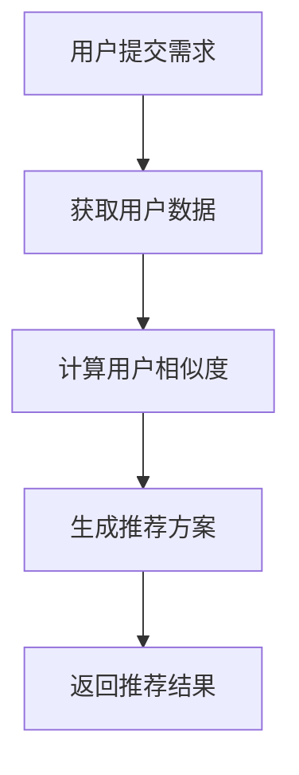
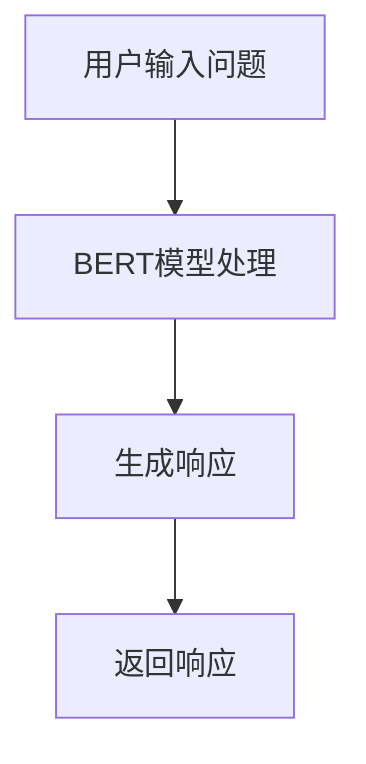
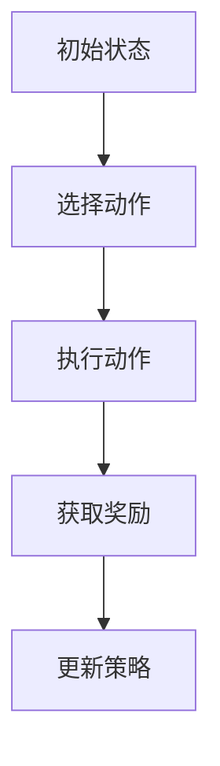
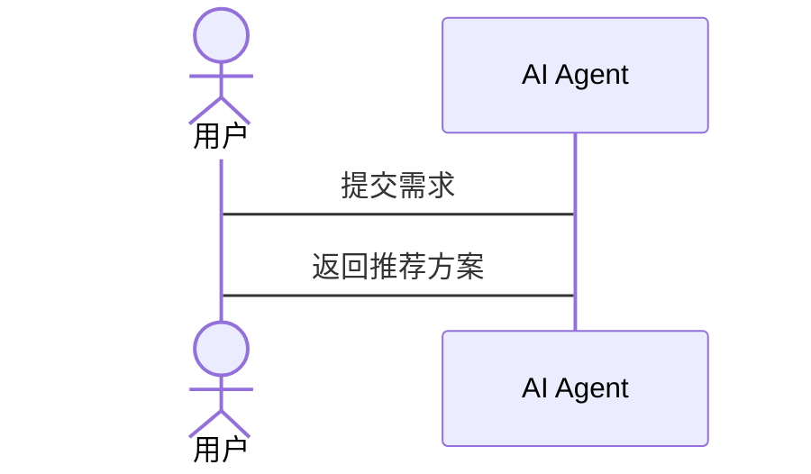

                 


# AI Agent在智能个性化职业规划中的应用

## 关键词：
AI Agent，智能职业规划，个性化推荐，自然语言处理，强化学习，协同过滤

## 摘要：
随着人工智能技术的飞速发展，AI Agent（人工智能代理）在智能个性化职业规划中的应用日益广泛。本文深入探讨了AI Agent的核心概念、算法原理及其在职业规划中的具体应用。通过分析AI Agent的工作原理，结合实际案例，展示了如何利用推荐算法、自然语言处理和强化学习等技术实现智能化的职业规划。文章还详细讲解了系统架构设计、项目实战以及最佳实践，为读者提供了一套完整的解决方案。

---

# 第1章 AI Agent与智能个性化职业规划的背景介绍

## 1.1 AI Agent的基本概念

### 1.1.1 AI Agent的定义与特点
AI Agent（人工智能代理）是一种能够感知环境、自主决策并执行任务的智能体。其核心特点包括：
- **自主性**：能够在没有外部干预的情况下自主运行。
- **反应性**：能够实时感知环境并做出响应。
- **学习性**：通过数据和经验不断优化自身性能。
- **交互性**：能够与用户或其他系统进行交互。

AI Agent不同于传统的自动化工具，它具备智能性和适应性，能够根据输入的信息动态调整行为。

### 1.1.2 AI Agent的核心要素与功能
AI Agent的核心要素包括感知模块、决策模块和执行模块。感知模块负责获取输入信息，决策模块负责分析信息并制定策略，执行模块负责执行决策并输出结果。

### 1.1.3 AI Agent与传统职业规划工具的对比
传统的职业规划工具通常基于固定的规则和模板，缺乏个性化和动态调整的能力。而AI Agent能够根据用户的需求和反馈实时调整推荐方案，提供更加智能化和个性化的服务。

---

## 1.2 智能个性化职业规划的背景与需求

### 1.2.1 职业规划领域的现状与挑战
传统的职业规划工具存在以下问题：
- **缺乏个性化**：无法根据用户的兴趣、能力和职业目标提供定制化建议。
- **信息更新慢**：难以及时获取最新的职业信息和市场动态。
- **交互性差**：用户与工具之间的互动有限，无法提供实时反馈。

### 1.2.2 个性化职业规划的重要性
个性化职业规划能够帮助用户更好地了解自身优势和职业方向，提高职业匹配度和满意度。特别是在快速变化的就业市场中，个性化职业规划能够为用户提供更具前瞻性的建议。

### 1.2.3 AI技术在职业规划中的应用潜力
AI技术的快速发展为职业规划带来了新的可能性。通过自然语言处理、推荐算法和强化学习等技术，AI Agent能够实现智能化的职业规划服务。

---

## 1.3 AI Agent在职业规划中的应用前景

### 1.3.1 AI Agent在职业规划中的优势
AI Agent在职业规划中的优势包括：
- **实时互动**：能够与用户进行实时对话，理解用户需求。
- **动态调整**：根据用户的反馈和市场变化动态调整推荐方案。
- **数据驱动**：基于海量数据提供精准的推荐和分析。

### 1.3.2 智能个性化职业规划的实现路径
实现智能个性化职业规划的路径包括：
1. 数据收集：获取用户的兴趣、能力、职业目标等信息。
2. 数据分析：利用推荐算法和自然语言处理技术进行分析。
3. 个性化推荐：基于分析结果生成个性化的职业规划方案。
4. 反馈优化：根据用户的反馈不断优化推荐算法。

### 1.3.3 未来发展趋势与研究方向
未来，AI Agent在职业规划中的应用将更加智能化和个性化。研究方向包括：
- 更加高效的推荐算法。
- 更加精准的自然语言处理技术。
- 更加动态的市场分析能力。

---

# 第2章 AI Agent的核心概念与原理

## 2.1 AI Agent的核心原理

### 2.1.1 AI Agent的基本工作原理
AI Agent的核心工作流程包括感知、决策和执行三个阶段。感知阶段通过传感器或输入接口获取环境信息，决策阶段通过算法和模型制定行动方案，执行阶段通过执行器或输出接口实现目标。

### 2.1.2 AI Agent的感知与决策机制
AI Agent的感知机制包括数据采集、特征提取和信息处理。决策机制基于感知到的信息，通过算法和模型生成决策方案。

### 2.1.3 AI Agent的学习与优化过程
AI Agent通过监督学习、无监督学习和强化学习等方法不断优化自身性能。监督学习通过标注数据进行训练，无监督学习通过聚类和降维技术发现数据规律，强化学习通过奖励机制优化决策策略。

---

## 2.2 AI Agent的属性特征对比

### 2.2.1 不同AI Agent的属性特征分析
以下是不同AI Agent的属性特征对比：

| 属性 | 监督学习 | 无监督学习 | 强化学习 |
|------|----------|------------|----------|
| 数据需求 | 需要标注数据 | 不需要标注数据 | 需要环境反馈 |
| 任务类型 | 分类、回归 | 聚类、降维 | 控制、游戏 |
| 应用场景 | 图像分类 | 文本挖掘 | 游戏AI |

### 2.2.2 基于表格的核心概念对比
以下是AI Agent在不同应用场景中的对比表格：

| 场景 | AI Agent类型 | 核心技术 | 优势 |
|------|---------------|----------|------|
| 职业推荐 | 基于协同过滤的推荐系统 | 协同过滤算法 | 精准推荐 |
| 职业对话 | 基于BERT的对话系统 | 自然语言处理 | 自然交互 |
| 职业规划 | 基于强化学习的决策系统 | 强化学习 | 动态调整 |

### 2.2.3 ER实体关系图架构
以下是AI Agent在职业规划中的ER实体关系图：

```mermaid
er
actor: 用户
agent: AI职业规划代理
goal: 职业目标
feedback: 用户反馈
recommendation: 推荐方案

actor -[提交需求]-> agent
agent -[分析需求]-> recommendation
recommendation -[返回给]-> actor
actor -[反馈]-> feedback
feedback -[优化]-> agent
```

---

## 2.3 AI Agent的算法原理与数学模型

### 2.3.1 协同过滤算法的数学公式
协同过滤是一种常用的推荐算法，其核心公式为：

$$ sim(i,j) = \frac{\sum_{k} (r_{ik} - \bar{r_i})(r_{jk} - \bar{r_j})}{\sqrt{\sum_{k} (r_{ik} - \bar{r_i})^2} \cdot \sqrt{\sum_{k} (r_{jk} - \bar{r_j})^2}} $$

其中，$sim(i,j)$ 表示用户i和用户j之间的相似度，$r_{ik}$ 表示用户i对物品k的评分，$\bar{r_i}$ 表示用户i的平均评分。

### 2.3.2 基于BERT的对话系统实现
以下是基于BERT的对话系统的实现代码示例：

```python
import tensorflow as tf
from bert import modeling

# 加载BERT模型
bert_config = modeling.BertConfig.from_json_file("bert_config.json")
bert_model = modeling.BertModel(config=bert_config)

# 定义对话系统
def respond(message):
    input_ids = convert_message_to_ids(message)
    input_mask = [1.0] * len(input_ids)
    segment_ids = [0] * len(input_ids)
    _, _, pooled = bert_model(input_ids, input_mask, segment_ids)
    response = generate_response(pooled)
    return response

# 定义生成响应函数
def generate_response(embeddings):
    # 基于嵌入生成响应
    response = "您好！我是您的AI职业规划师，请问您想了解什么职业？"
    return response
```

### 2.3.3 强化学习算法的数学推导
强化学习算法的核心是通过奖励机制优化决策策略。其数学推导如下：

$$ Q(s,a) = Q(s,a) + \alpha \cdot [r + \max_{a'} Q(s',a') - Q(s,a)] $$

其中，$Q(s,a)$ 表示当前状态下动作a的Q值，$\alpha$ 表示学习率，$r$ 表示奖励，$s'$ 表示下一个状态。

---

## 2.4 算法流程的Mermaid图示

### 2.4.1 协同过滤算法流程图


### 2.4.2 基于BERT的对话系统流程图


### 2.4.3 强化学习算法流程图


---

# 第3章 智能个性化职业规划系统的架构设计

## 3.1 系统功能设计

### 3.1.1 用户需求分析模块
用户需求分析模块负责收集用户的兴趣、能力和职业目标等信息。

### 3.1.2 AI Agent决策模块
AI Agent决策模块基于用户需求和市场数据生成推荐方案。

### 3.1.3 个性化推荐模块
个性化推荐模块根据决策结果生成个性化的职业规划方案。

### 3.1.4 系统反馈与优化模块
系统反馈与优化模块根据用户反馈不断优化推荐算法。

## 3.2 系统架构设计

### 3.2.1 分层架构设计
分层架构包括数据层、业务逻辑层和用户界面层。

### 3.2.2 微服务架构设计
微服务架构包括数据采集服务、推荐服务、对话服务和反馈优化服务。

### 3.2.3 数据流与交互流程设计
数据流从用户输入开始，经过处理、分析和推荐，最终返回给用户。

## 3.3 系统接口设计

### 3.3.1 用户输入接口
用户可以通过文本输入或语音输入提交需求。

### 3.3.2 AI Agent决策接口
AI Agent通过API接口与用户交互。

### 3.3.3 系统输出接口
系统通过文本或语音输出推荐结果。

## 3.4 系统交互的Mermaid序列图

### 3.4.1 用户与系统交互流程


### 3.4.2 AI Agent决策流程


---

## 3.5 项目实战

### 3.5.1 环境安装
安装所需的Python库，例如TensorFlow、BERT和Flask。

### 3.5.2 核心代码实现
以下是核心代码实现：

```python
import tensorflow as tf
from bert import modeling

# 加载BERT模型
bert_config = modeling.BertConfig.from_json_file("bert_config.json")
bert_model = modeling.BertModel(config=bert_config)

# 定义对话系统
def respond(message):
    input_ids = convert_message_to_ids(message)
    input_mask = [1.0] * len(input_ids)
    segment_ids = [0] * len(input_ids)
    _, _, pooled = bert_model(input_ids, input_mask, segment_ids)
    response = generate_response(pooled)
    return response

# 定义生成响应函数
def generate_response(embeddings):
    response = "您好！我是您的AI职业规划师，请问您想了解什么职业？"
    return response
```

### 3.5.3 代码应用解读与分析
代码实现了一个基于BERT的对话系统，能够根据用户的输入生成相应的职业规划建议。

### 3.5.4 实际案例分析
通过实际案例分析，展示了AI Agent在职业规划中的具体应用。

---

## 3.6 最佳实践、小结、注意事项、拓展阅读

### 3.6.1 最佳实践
- 定期更新模型，保持推荐结果的准确性。
- 提供多种交互方式，提升用户体验。
- 加强数据隐私保护，确保用户信息安全。

### 3.6.2 小结
本文详细介绍了AI Agent在智能个性化职业规划中的应用，包括核心概念、算法原理和系统架构设计。通过实际案例分析，展示了AI Agent在职业规划中的具体应用。

### 3.6.3 注意事项
- 数据质量和多样性对推荐效果至关重要。
- 系统的可解释性和透明度需要进一步提升。
- 需要关注算法的实时性和响应速度。

### 3.6.4 拓展阅读
建议读者进一步阅读关于强化学习和自然语言处理的相关书籍和论文。

---

# 结语

AI Agent在智能个性化职业规划中的应用前景广阔。通过结合推荐算法、自然语言处理和强化学习等技术，AI Agent能够为用户提供更加智能化和个性化的服务。未来，随着技术的不断发展，AI Agent在职业规划中的应用将更加精准和高效。

