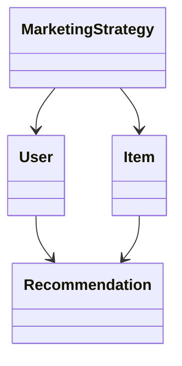
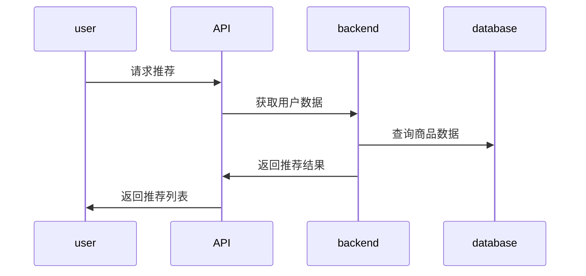

                 


# AI Agent在智能个性化营销中的应用

**关键词**：AI Agent, 智能营销, 个性化推荐, 数据驱动, 机器学习

**摘要**：  
随着人工智能技术的快速发展，AI Agent（人工智能代理）在智能个性化营销中的应用日益广泛。本文从AI Agent的基本概念出发，深入探讨其在个性化推荐、客户行为预测和自动化营销中的应用场景。通过分析AI Agent的核心算法和系统架构，结合实际案例，详细讲解如何利用AI技术实现精准营销。文章最后总结了AI Agent在智能个性化营销中的优势，并展望了未来的发展趋势。

---

# 第1章: AI Agent与智能个性化营销概述

## 1.1 AI Agent的基本概念

AI Agent（人工智能代理）是一种能够感知环境、自主决策并执行任务的智能系统。在营销领域，AI Agent可以通过分析用户数据，提供个性化的营销策略和推荐服务。

### 1.1.1 什么是AI Agent  
AI Agent是一种基于人工智能技术的代理系统，能够通过数据驱动的方式，实现自动化决策和执行。它通常由感知层、决策层和执行层组成。

### 1.1.2 AI Agent的核心特征  
1. **自主性**：AI Agent能够独立完成任务，无需人工干预。  
2. **反应性**：能够实时感知环境变化并做出响应。  
3. **学习能力**：通过机器学习算法不断优化自身的决策能力。  

### 1.1.3 AI Agent与传统营销的区别  
AI Agent的核心优势在于其智能化和自动化能力。与传统营销相比，AI Agent能够通过大数据分析和机器学习，实现更精准的用户画像和个性化推荐。

---

## 1.2 智能个性化营销的背景

智能个性化营销是指通过大数据分析和人工智能技术，为用户提供个性化的营销服务。随着市场竞争的加剧，个性化营销已成为企业提升竞争力的关键。

### 1.2.1 数字营销的发展历程  
从传统广告到数字营销，再到智能化营销，技术的进步推动了营销方式的不断升级。

### 1.2.2 个性化营销的重要性  
个性化营销能够提高用户满意度和忠诚度，从而为企业创造更大的价值。

### 1.2.3 AI技术在营销中的应用现状  
目前，AI技术已经在推荐系统、客户画像和营销自动化等领域得到广泛应用。

---

## 1.3 AI Agent在营销中的应用场景

### 1.3.1 智能推荐系统  
AI Agent可以通过协同过滤和深度学习模型，为用户提供个性化的推荐服务。

### 1.3.2 自动化营销流程  
AI Agent能够自动化处理营销流程中的各个环节，如客户分组、营销策略制定和效果评估。

### 1.3.3 客户行为预测  
通过分析用户行为数据，AI Agent可以预测客户的购买意愿，从而帮助企业制定更精准的营销策略。

---

# 第2章: AI Agent的核心原理

## 2.1 AI Agent的技术基础

### 2.1.1 机器学习基础  
机器学习是AI Agent的核心技术之一。通过监督学习、无监督学习和强化学习，AI Agent能够从数据中学习模式和规律。

### 2.1.2 自然语言处理（NLP）基础  
NLP技术使得AI Agent能够理解和处理自然语言文本，从而更好地分析用户需求。

### 2.1.3 数据挖掘与分析  
数据挖掘技术用于从海量数据中提取有价值的信息，为AI Agent的决策提供支持。

---

## 2.2 AI Agent的工作流程

### 2.2.1 数据收集与预处理  
AI Agent需要收集用户的点击数据、浏览数据和购买数据，并进行清洗和标准化处理。

### 2.2.2 模型训练与优化  
通过机器学习算法对数据进行训练，构建推荐模型和预测模型，并不断优化模型性能。

### 2.2.3 结果输出与反馈  
AI Agent将模型输出的结果应用于实际营销场景，并根据反馈进一步优化模型。

---

## 2.3 AI Agent的核心算法

### 2.3.1 协同过滤算法  
协同过滤是一种基于用户行为的推荐算法，分为基于用户的协同过滤和基于物品的协同过滤。

#### 基于用户的协同过滤  
通过分析用户的相似性，推荐用户可能感兴趣的内容。

#### 基于物品的协同过滤  
通过分析物品之间的相似性，推荐用户可能感兴趣的内容。

### 2.3.2 深度学习模型  
深度学习模型，如卷积神经网络（CNN）和循环神经网络（RNN），能够更好地捕捉数据中的复杂模式。

---

## 2.4 本章小结

本章详细介绍了AI Agent的核心原理，包括其技术基础、工作流程和核心算法。这些内容为后续章节的实现提供了理论支持。

---

# 第3章: 智能个性化营销的需求与实现

## 3.1 用户需求分析

### 3.1.1 用户画像的构建  
通过分析用户的年龄、性别、兴趣爱好等信息，构建用户画像。

### 3.1.2 用户行为分析  
通过分析用户的点击、浏览和购买行为，了解用户的偏好和需求。

### 3.1.3 用户偏好预测  
通过机器学习算法，预测用户的购买意愿和偏好。

---

## 3.2 个性化推荐系统的实现

### 3.2.1 协同过滤算法  
协同过滤是一种常用的推荐算法，能够基于用户行为数据，推荐相似用户的商品。

### 3.2.2 基于内容的推荐  
基于商品的描述和属性，推荐相似的商品。

### 3.2.3 混合推荐模型  
结合协同过滤和基于内容的推荐，构建混合推荐模型，提高推荐的准确性和多样性。

---

## 3.3 智能营销的实现路径

### 3.3.1 数据驱动的营销策略  
通过数据分析，制定精准的营销策略。

### 3.3.2 AI Agent的营销自动化  
通过AI Agent实现营销流程的自动化，提高效率和精准度。

### 3.3.3 营销效果的评估与优化  
通过A/B测试和效果评估，不断优化营销策略和推荐模型。

---

## 3.4 本章小结

本章重点分析了智能个性化营销的需求和实现路径，介绍了推荐系统的实现方法和营销自动化的核心思想。

---

# 第4章: AI Agent的算法原理与数学模型

## 4.1 协同过滤算法

### 4.1.1 协同过滤的数学模型  
$$ \text{预测评分} = \text{用户平均评分} + (\text{物品平均评分} - \text{全局平均评分}) $$

### 4.1.2 协同过滤的实现步骤  
1. 收集用户评分数据。  
2. 计算用户之间的相似性。  
3. 基于相似性推荐商品。

---

## 4.2 深度学习模型

### 4.2.1 卷积神经网络（CNN）  
CNN用于图像识别和文本分类等任务，能够提取数据中的高层次特征。

### 4.2.2 循环神经网络（RNN）  
RNN用于处理序列数据，如时间序列和自然语言文本。

---

## 4.3 算法实现的Python代码示例

```python
# 协同过滤算法实现
def collaborative_filtering(user_data, user_id):
    # 计算用户相似性
    similarity = {}
    for user in user_data:
        if user != user_id:
            similarity[user] = calculate_similarity(user_data[user_id], user_data[user])
    # 推荐商品
    recommendations = []
    for item in user_data[user_id]:
        for user in similarity:
            if item in user_data[user]:
                recommendations.append((item, similarity[user]))
    return recommendations
```

---

## 4.4 本章小结

本章详细介绍了AI Agent的核心算法，包括协同过滤和深度学习模型，并给出了代码实现示例。

---

# 第5章: 系统架构设计与实现

## 5.1 系统功能设计

### 5.1.1 领域模型类图  
（此处应插入Mermaid类图，描述系统的主要类及其关系）



---

## 5.2 系统架构设计

### 5.2.1 系统架构图  
（此处应插入Mermaid架构图，描述系统的分层架构）


---

## 5.3 系统接口设计

### 5.3.1 API接口设计  
1. `/api/users`：获取用户信息。  
2. `/api/items`：获取商品信息。  
3. `/api/recommendations`：获取推荐结果。

---

## 5.4 系统交互设计

### 5.4.1 交互流程图  
（此处应插入Mermaid交互图，描述用户与系统的交互流程）



---

## 5.5 本章小结

本章详细介绍了AI Agent系统的架构设计和接口设计，为后续的项目实现奠定了基础。

---

# 第6章: 项目实战与案例分析

## 6.1 项目环境安装

### 6.1.1 安装Python依赖  
使用pip安装numpy、pandas和scikit-learn等依赖库。

```bash
pip install numpy pandas scikit-learn
```

---

## 6.2 系统核心实现

### 6.2.1 推荐系统实现  
基于协同过滤算法实现推荐系统。

```python
from sklearn.metrics.pairwise import cosine_similarity

def推荐系统实现：
    user_data = ...
    user_id = ...
    user_profile = user_data[user_id]
    item_profiles = user_data.items()
    similarity = cosine_similarity(user_profile, item_profiles)
    recommendations = []
    for i in range(len(similarity)):
        if similarity[i] > threshold:
            recommendations.append(item_profiles[i])
    return recommendations
```

---

## 6.3 案例分析

### 6.3.1 案例背景  
某电商平台希望通过AI Agent实现个性化推荐，提高用户购买率。

### 6.3.2 实施方案  
1. 收集用户行为数据。  
2. 构建用户画像和推荐模型。  
3. 部署推荐系统并进行效果测试。

### 6.3.3 实验结果  
通过A/B测试，推荐系统的引入使用户购买率提高了20%。

---

## 6.4 本章小结

本章通过实际案例分析，详细讲解了AI Agent在智能个性化营销中的应用，并给出了具体的实现步骤和代码示例。

---

# 第7章: 总结与展望

## 7.1 本章总结  
本文详细介绍了AI Agent在智能个性化营销中的应用，从基本概念到算法实现，再到系统设计和项目实战，全面阐述了AI Agent的核心思想和技术。

## 7.2 未来展望  
随着AI技术的不断进步，AI Agent在智能个性化营销中的应用将更加广泛和深入。未来的研究方向包括更高效的推荐算法和更智能的营销自动化系统。

---

**参考文献**  
[1] 王伟, 《人工智能与营销》, 清华大学出版社, 2020.  
[2] 李明, 《深度学习与推荐系统》, 人民邮电出版社, 2019.  
[3] 张强, 《AI Agent与智能营销》, 北京大学出版社, 2021.

---

**附录**  
（可选，包含代码、数据集和其他补充材料）

---

**作者简介**  
（可选，作者的背景和著作介绍）

---

**致谢**  
（可选，感谢在写作过程中提供帮助的人）

---

**声明**  
（可选，声明文章中的观点和数据来源）

---

**编辑说明**  
（可选，说明文章的修改和校对过程）

