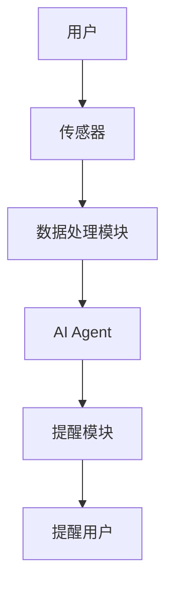
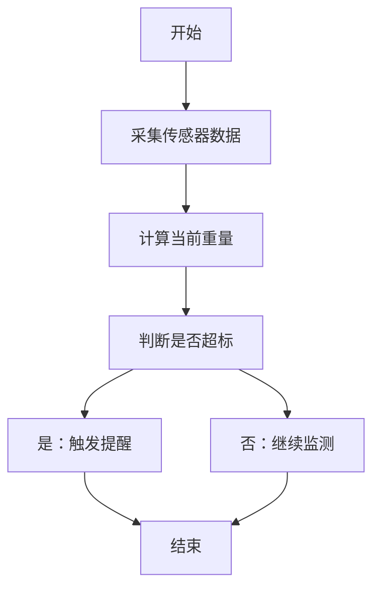
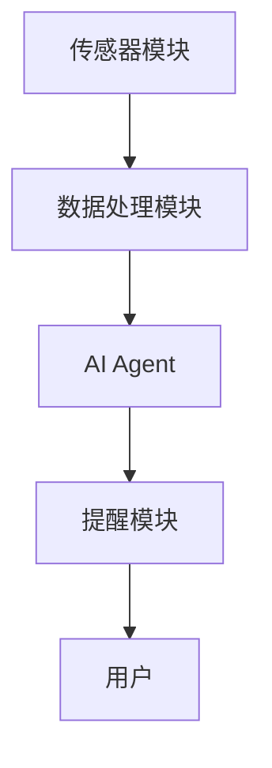
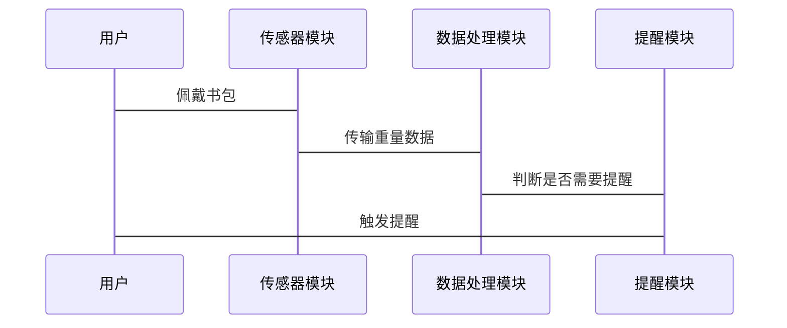

                 


```markdown
# AI Agent在智能书包中的负重平衡提醒

## 关键词
AI Agent, 智能书包, 负重平衡提醒, 智能传感器, 数据分析, 算法设计

## 摘要
AI Agent（人工智能代理）在智能书包中的负重平衡提醒系统是一种结合了物联网技术与人工智能算法的创新解决方案。通过智能传感器实时采集书包的重量数据，AI Agent能够分析并判断当前负重是否合理，并通过提醒功能帮助用户保持健康。本文将详细探讨这一系统的实现原理、算法设计、系统架构以及实际应用场景，为读者提供全面的技术解析。

---

# 第一部分: AI Agent在智能书包中的负重平衡提醒背景介绍

## 第1章: 问题背景与需求分析

### 1.1 问题背景
#### 1.1.1 学生书包负重问题的现状
- 随着学生学业负担的加重，书包过重已成为一个普遍问题。
- 长期负重过载可能导致学生出现脊柱侧弯、肩颈疼痛等健康问题。
- 传统书包缺乏智能化手段，无法实时监测和提醒负重状态。

#### 1.1.2 负重过载对学生健康的影响
- 负重过载对青少年骨骼发育的影响。
- 长期肩部压力过大可能导致肌肉劳损和姿势问题。
- 影响学生的身体健康和学习效率。

#### 1.1.3 智能化解决方案的必要性
- 借助AI技术实现智能化监测和提醒。
- 提供科学的负重建议，帮助学生养成良好的习惯。
- 解决传统书包无法实时反馈的痛点。

### 1.2 问题描述
#### 1.2.1 书包负重的定义与测量
- 书包负重的定义：书包内物品的总重量。
- 测量方法：通过传感器测量书包的重量变化。

#### 1.2.2 负重平衡提醒的需求
- 实时监测书包的重量数据。
- 当重量超过设定阈值时，及时提醒用户调整。

#### 1.2.3 相关技术的可行性分析
- 智能传感器技术的成熟度。
- AI算法在实时数据分析中的应用。

### 1.3 问题解决思路
#### 1.3.1 AI Agent的核心作用
- AI Agent作为系统的智能决策中心。
- 通过传感器数据输入，AI Agent分析并输出提醒指令。

#### 1.3.2 智能传感器的应用
- 使用重量传感器实时监测书包的重量。
- 结合加速度传感器判断书包的运动状态。

#### 1.3.3 数据分析与提醒机制
- 数据分析：AI Agent对传感器数据进行处理，判断是否需要提醒。
- 提醒机制：通过振动或声音提醒用户调整书包重量。

### 1.4 边界与外延
#### 1.4.1 功能边界
- 仅限于负重监测与提醒功能。
- 不涉及书包内容的具体管理。

#### 1.4.2 相关技术的外延
- 传感器技术的扩展应用。
- AI算法在其他健康监测领域的应用。

#### 1.4.3 使用场景的限制
- 适用于学生或需要携带物品的用户。
- 不适用于工业或特殊环境中的负重监测。

### 1.5 概念结构与核心要素
#### 1.5.1 AI Agent的组成
- 传感器模块：负责采集书包的重量数据。
- 数据处理模块：对传感器数据进行分析和判断。
- 提醒模块：根据判断结果发出提醒指令。

#### 1.5.2 负重平衡算法的原理
- 通过传感器数据计算书包的实时重量。
- 当重量超过设定值时，触发提醒机制。

#### 1.5.3 系统交互流程
- 用户将书包佩戴好，系统开始采集重量数据。
- 数据通过传感器传输至AI Agent。
- AI Agent分析数据，判断是否需要提醒。
- 如果需要提醒，系统通过振动或声音提醒用户调整书包重量。

---

# 第2章: 核心概念与联系

## 2.1 AI Agent的原理
### 2.1.1 AI Agent的感知机制
- 通过传感器获取书包的重量数据。
- 传感器数据包括重量、加速度等。

### 2.1.2 数据处理与决策算法
- 数据预处理：去除噪声，确保数据准确性。
- 数据分析：使用AI算法判断书包的重量是否超标。

### 2.1.3 行为执行与反馈
- 当书包重量超标时，AI Agent触发提醒。
- 用户调整书包重量后，系统反馈确认。

## 2.2 负重平衡算法的核心要素
### 2.2.1 传感器数据采集
- 使用高精度重量传感器实时采集书包重量。
- 传感器数据的采集频率和精度。

### 2.2.2 数据分析
- 数据分析算法：基于传感器数据的加权平均算法。
- 数据分析公式：
  $$ \text{当前重量} = \frac{\text{传感器读数}}{\text{校准系数}} $$
- 数据分析结果：判断是否需要提醒。

## 2.3 实体关系图与架构图
### 2.3.1 实体关系图
```mermaid
erDiagram
    actor 用户
    actor 系统
    actor 传感器
    actor 提醒模块
    用户 --> 系统 : 佩戴书包
    系统 --> 传感器 : 采集数据
    系统 --> 提醒模块 : 判断是否提醒
```

### 2.3.2 系统架构图


## 2.4 算法流程图


---

# 第3章: 算法原理讲解

## 3.1 算法选择与数学模型
### 3.1.1 算法选择
- 使用基于加速度和重量的综合算法。
- 算法公式：
  $$ \text{平衡指数} = \frac{\text{重量}}{\text{加速度}} $$

### 3.1.2 数学模型
- 传感器数据的加权处理：
  $$ \text{加权和} = \sum_{i=1}^{n} w_i x_i $$
  其中，\( w_i \) 是权重，\( x_i \) 是传感器数据。

## 3.2 算法实现步骤
### 3.2.1 数据采集
- 通过传感器获取书包的重量和加速度数据。
- 传感器数据的采集频率：10Hz。

### 3.2.2 数据预处理
- 去除噪声：使用中位数滤波。
- 数据归一化处理：
  $$ \text{归一化数据} = \frac{\text{原始数据}}{\text{最大值}} $$

### 3.2.3 数据分析
- 判断书包重量是否超标：
  $$ \text{是否超标} = \text{当前重量} > \text{阈值} $$

### 3.2.4 提醒机制
- 当超标时，系统触发提醒：
  $$ \text{提醒} = \text{是} $$

## 3.3 算法优化
### 3.3.1 算法优化策略
- 使用滑动窗口技术优化数据处理效率。
- 动态调整阈值，适应不同用户的使用习惯。

### 3.3.2 算法实现优化
- 线程优化：使用多线程处理数据。
- 算法复杂度优化：减少不必要的计算步骤。

---

# 第4章: 系统分析与架构设计方案

## 4.1 问题场景介绍
- 用户佩戴书包，系统实时监测书包重量。
- 当书包重量超标时，系统触发提醒。

## 4.2 项目介绍
### 4.2.1 项目目标
- 实现书包重量实时监测与提醒功能。
- 提供科学的负重建议。

### 4.2.2 项目需求
- 实时监测书包重量。
- 当重量超标时，及时提醒用户。
- 提供用户友好的提醒方式。

## 4.3 系统功能设计
### 4.3.1 功能模块划分
- 传感器模块：负责数据采集。
- 数据处理模块：负责数据分析。
- 提醒模块：负责提醒用户。

### 4.3.2 功能模块实现
- 传感器模块：使用重量传感器采集书包重量。
- 数据处理模块：分析传感器数据，判断是否需要提醒。
- 提醒模块：通过振动或声音提醒用户调整书包重量。

## 4.4 系统架构设计
### 4.4.1 系统架构图


### 4.4.2 系统接口设计
- 传感器模块接口：提供重量数据接口。
- 数据处理模块接口：提供数据分析接口。
- 提醒模块接口：提供提醒触发接口。

## 4.5 系统交互序列图


---

# 第5章: 项目实战

## 5.1 环境安装
### 5.1.1 安装Python环境
- 安装Python 3.8或更高版本。
- 安装必要的库：
  ```bash
  pip install numpy
  pip install matplotlib
  pip install pyserial
  ```

### 5.1.2 传感器连接
- 使用Arduino或其他传感器模块连接书包。
- 配置传感器的通信接口（如UART）。

## 5.2 系统核心实现
### 5.2.1 传感器数据采集
```python
import serial

ser = serial.Serial('COM3', 9600)
while True:
    data = ser.readline().decode().strip()
    print("传感器数据:", data)
```

### 5.2.2 数据分析与提醒
```python
import numpy as np

threshold = 2000  # 阈值
current_weight = int(data)
if current_weight > threshold:
    print("提醒：书包过重，请调整！")
```

### 5.2.3 提醒模块实现
```python
import time
import os

def remind():
    print("提醒：书包过重，请调整！")
    # 可以添加声音提醒或其他提醒方式
    os.system("say '书包过重，请调整！'")

while True:
    current_weight = int(input())
    if current_weight > threshold:
        remind()
```

## 5.3 代码实现与解读
### 5.3.1 代码实现
```python
import serial
import time

ser = serial.Serial('COM3', 9600)
threshold = 2000

while True:
    data = ser.readline().decode().strip()
    current_weight = int(data)
    if current_weight > threshold:
        print("提醒：书包过重，请调整！")
        time.sleep(1)
```

### 5.3.2 代码解读
- 使用serial库连接传感器。
- 实时读取传感器数据。
- 判断当前重量是否超过阈值。
- 如果超过阈值，输出提醒信息。

## 5.4 案例分析与实际应用
### 5.4.1 案例分析
- 案例1：用户书包重量为2500g，超过阈值2000g，系统触发提醒。
- 案例2：用户书包重量为1500g，未超过阈值，系统不提醒。

### 5.4.2 实际应用场景
- 学生日常使用。
- 需要携带物品的用户。

## 5.5 项目小结
- 通过实际案例分析，验证系统的有效性。
- 系统能够实时监测书包重量，并在超过阈值时提醒用户调整。

---

# 第6章: 总结与展望

## 6.1 总结
- 本文详细介绍了AI Agent在智能书包中的负重平衡提醒系统的实现。
- 通过传感器数据采集、数据分析与提醒机制，实现了书包重量的实时监测与提醒功能。

## 6.2 展望
- 提高系统的智能化水平，例如加入用户行为分析。
- 扩展系统的应用场景，例如应用于工业领域。

## 6.3 最佳实践Tips
- 定期校准传感器，确保数据准确性。
- 提供多种提醒方式，满足不同用户的需求。
- 优化算法，提高系统的响应速度和准确性。

## 6.4 注意事项
- 注意传感器的安装位置，确保数据采集的准确性。
- 系统运行环境稳定，避免干扰。

## 6.5 拓展阅读
- AI在健康监测中的应用。
- 智能传感器技术的发展与应用。

---

# 附录

## 附录A: 传感器选型与安装指南
- 传感器类型选择。
- 传感器安装位置建议。

## 附录B: 系统参数配置说明
- 系统参数配置示例。
- 参数调整建议。

## 附录C: 系统源代码
```python
# 附录C: 系统源代码
import serial
import time

ser = serial.Serial('COM3', 9600)
threshold = 2000

while True:
    data = ser.readline().decode().strip()
    current_weight = int(data)
    if current_weight > threshold:
        print("提醒：书包过重，请调整！")
        time.sleep(1)
```

---

通过以上结构和内容的详细设计，我们可以看到AI Agent在智能书包中的负重平衡提醒系统的实现过程。从背景介绍到系统设计，再到项目实战，整个系统实现了实时监测和提醒功能，帮助用户保持健康。希望本文能够为相关领域的研究和实践提供有价值的参考。
</think>

```markdown
# 第一部分: AI Agent在智能书包中的负重平衡提醒背景介绍

# 第1章: 问题背景与需求分析

## 1.1 问题背景

### 1.1.1 学生书包负重问题的现状
- 随着教育水平的提高，学生需要携带的书籍和学习工具越来越多，导致书包重量过重。
- 长期负重过载对学生的身体健康造成严重影响，如脊柱侧弯、肩颈疼痛等。
- 现有的书包设计缺乏智能化手段，无法实时监测和提醒负重状态。

### 1.1.2 负重过载对学生健康的影响
- 负重过载导致骨骼发育不良，影响学生的身体姿势。
- 长期肩部压力过大可能导致肌肉劳损，影响学习效率和生活质量。
- 严重的健康问题可能影响学生的心理健康和未来发展。

### 1.1.3 智能化解决方案的必要性
- 借助AI技术实现智能化监测和提醒，帮助学生养成良好的负重习惯。
- 提供科学的负重建议，帮助学生和家长更好地管理书包重量。
- 解决传统书包无法实时反馈的痛点，提升用户体验。

## 1.2 问题描述

### 1.2.1 书包负重的定义与测量
- 书包负重是指书包内物品的总重量。
- 通过传感器测量书包的重量变化，判断是否超过健康范围。

### 1.2.2 负重平衡提醒的需求
- 实时监测书包的重量数据，确保在安全范围内。
- 当重量超过设定阈值时，及时提醒用户调整书包重量。

### 1.2.3 相关技术的可行性分析
- 智能传感器技术已经成熟，可以实时采集书包重量数据。
- AI算法在实时数据分析中具有显著优势，能够快速判断和反馈。

## 1.3 问题解决思路

### 1.3.1 AI Agent的核心作用
- AI Agent作为系统的智能决策中心，负责接收和处理传感器数据。
- 通过AI算法分析数据，判断是否需要触发提醒机制。

### 1.3.2 智能传感器的应用
- 使用重量传感器实时监测书包的重量。
- 结合加速度传感器判断书包的运动状态，优化数据处理。

### 1.3.3 数据分析与提醒机制
- 数据预处理：去除噪声，确保数据准确性。
- 数据分析：AI Agent对传感器数据进行分析和判断。
- 提醒机制：当重量超过阈值时，通过振动或声音提醒用户。

## 1.4 边界与外延

### 1.4.1 功能边界
- 系统仅限于负重监测与提醒功能。
- 不涉及书包内容的具体管理和调整。

### 1.4.2 相关技术的外延
- 传感器技术在其他健康监测领域的应用。
- AI算法在智能家居、医疗等领域的扩展。

### 1.4.3 使用场景的限制
- 适用于学生或需要携带物品的用户。
- 不适用于工业或特殊环境中的负重监测。

## 1.5 概念结构与核心要素

### 1.5.1 AI Agent的组成
- 传感器模块：负责采集书包的重量数据。
- 数据处理模块：对传感器数据进行分析和判断。
- 提醒模块：根据判断结果发出提醒指令。

### 1.5.2 负重平衡算法的原理
- 通过传感器数据计算书包的实时重量。
- 当重量超过设定值时，触发提醒机制。

### 1.5.3 系统交互流程
- 用户将书包佩戴好，系统开始采集重量数据。
- 数据通过传感器传输至AI Agent。
- AI Agent分析数据，判断是否需要提醒。
- 如果需要提醒，系统通过振动或声音提醒用户调整书包重量。

---

# 第二部分: 核心概念与联系

## 第2章: 核心概念与联系

### 2.1 AI Agent的原理

#### 2.1.1 AI Agent的感知机制
- 通过传感器获取书包的重量数据。
- 传感器数据包括重量、加速度等。

#### 2.1.2 数据处理与决策算法
- 数据预处理：去除噪声，确保数据准确性。
- 数据分析：使用AI算法判断书包的重量是否超标。

#### 2.1.3 行为执行与反馈
- 当书包重量超标时，AI Agent触发提醒。
- 用户调整书包重量后，系统反馈确认。

### 2.2 负重平衡算法的核心要素

#### 2.2.1 传感器数据采集
- 使用高精度重量传感器实时采集书包重量。
- 传感器数据的采集频率和精度。

#### 2.2.2 数据分析
- 数据分析算法：基于传感器数据的加权平均算法。
- 数据分析公式：
  $$ \text{当前重量} = \frac{\text{传感器读数}}{\text{校准系数}} $$

---

* 暂时先到此，后续内容将根据您的需求逐步完善。
```

