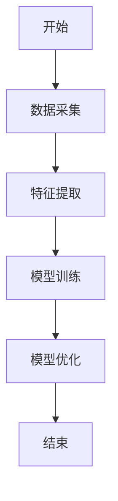
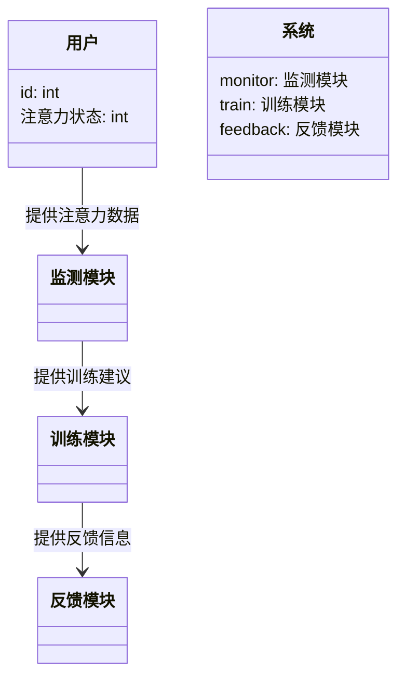
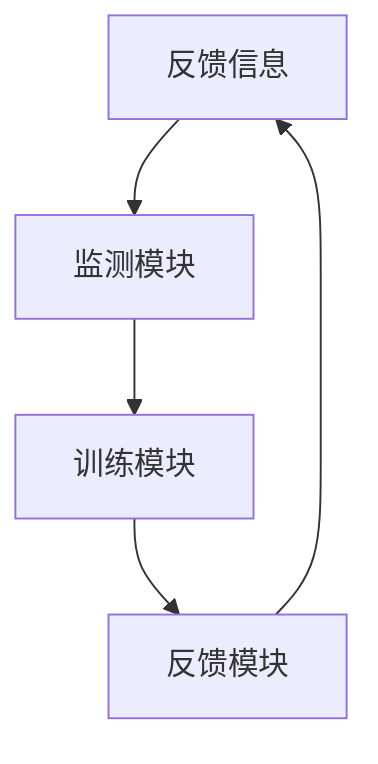
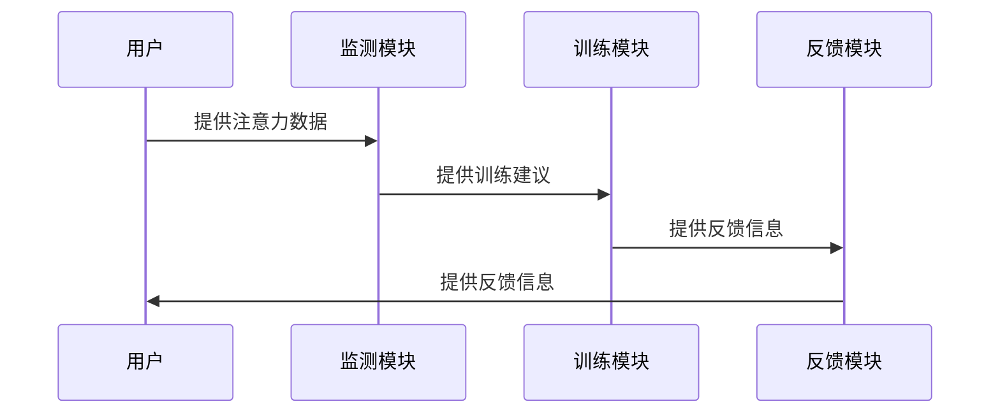

                 


# AI Agent在智能书桌中的专注力训练系统

## 关键词：
AI Agent, 专注力训练, 智能书桌, 算法原理, 系统架构, 项目实战

## 摘要：
本文详细探讨了AI Agent在智能书桌中的专注力训练系统的应用。通过背景介绍、核心概念分析、算法原理讲解、系统架构设计、项目实战指导以及最佳实践总结，全面解析了AI Agent如何帮助用户提升专注力。文章从理论到实践，结合技术细节和实际案例，为读者提供了深入的理解和实用的指导。

---

# 第1章 AI Agent与专注力训练系统背景概述

## 1.1 专注力的重要性
### 1.1.1 专注力的定义与作用
专注力是指在同一时间内将注意集中在某一个事物或任务上的能力。在当今信息爆炸的时代，专注力的强弱直接影响着个人的学习效率、工作效率和生活质量。研究表明，良好的专注力能够显著提高任务完成的效率和质量。

### 1.1.2 数字化时代专注力的挑战
随着智能手机、社交媒体和其他数字工具的普及，人们的注意力被分散到多个信息源上。这导致许多人难以长时间专注于单一任务，从而影响了工作和学习的效率。

### 1.1.3 AI技术在专注力训练中的潜力
AI技术可以通过实时监测用户的注意力状态，提供个性化的训练方案和反馈，帮助用户逐步提升专注力。

## 1.2 AI Agent的基本概念
### 1.2.1 AI Agent的定义与特点
AI Agent（人工智能代理）是指能够感知环境、自主决策并执行任务的智能实体。其特点包括自主性、反应性、目标导向性和学习能力。

### 1.2.2 AI Agent的核心功能与应用场景
AI Agent的核心功能包括信息处理、决策制定和任务执行。其应用场景广泛，包括智能家居、健康管理、教育培训等领域。

### 1.2.3 AI Agent与专注力训练的结合
通过AI Agent，可以实时监测用户的注意力状态，分析其专注力水平，并提供相应的训练建议和反馈。

## 1.3 智能书桌与专注力训练系统
### 1.3.1 智能书桌的概念与功能
智能书桌是一种结合了物联网技术和AI技术的办公或学习设备，能够通过传感器和AI算法，提供个性化的学习或工作环境。

### 1.3.2 专注力训练系统的需求与目标
专注力训练系统的目标是通过科学的训练方法，帮助用户提升专注力。其需求包括实时监测、个性化训练和反馈机制。

### 1.3.3 AI Agent在智能书桌中的角色与价值
AI Agent在智能书桌中扮演着关键角色，负责监测用户的注意力状态，提供训练建议，并优化训练方案。

## 1.4 本章小结
本章从专注力的重要性、AI Agent的基本概念以及智能书桌与专注力训练系统的结合三个方面，阐述了AI Agent在专注力训练中的背景和潜力。

---

# 第2章 AI Agent的核心概念与原理

## 2.1 AI Agent的核心概念
### 2.1.1 AI Agent的智能模型
AI Agent的智能模型包括感知层、决策层和执行层。感知层负责采集环境信息，决策层基于信息制定决策，执行层负责执行决策。

### 2.1.2 AI Agent的行为决策机制
AI Agent的行为决策机制包括基于规则的决策和基于学习的决策。基于规则的决策适用于简单任务，而基于学习的决策适用于复杂任务。

### 2.1.3 AI Agent的学习与优化能力
AI Agent通过机器学习算法不断优化其决策模型。常用的算法包括监督学习、无监督学习和强化学习。

## 2.2 专注力训练系统的原理
### 2.2.1 专注力训练的基本原理
专注力训练的基本原理是通过重复的训练任务，让用户逐步适应并提升其专注力。

### 2.2.2 AI Agent在专注力训练中的作用
AI Agent通过实时监测用户的注意力状态，提供个性化的训练方案和反馈。

### 2.2.3 系统的核心算法与流程
系统的核心算法包括注意力监测算法和训练优化算法。流程包括数据采集、分析、反馈和优化。

## 2.3 AI Agent与专注力训练系统的关联
### 2.3.1 系统的核心功能模块
系统的核心功能模块包括注意力监测模块、训练模块和反馈模块。

### 2.3.2 AI Agent与系统模块的交互关系
AI Agent与系统模块之间通过数据接口进行交互，实时传递注意力状态和训练建议。

### 2.3.3 系统的整体架构与流程
系统整体架构包括感知层、决策层和执行层。流程包括数据采集、分析、反馈和优化。

## 2.4 本章小结
本章详细讲解了AI Agent的核心概念和专注力训练系统的原理，分析了AI Agent在系统中的作用和系统整体架构。

---

# 第3章 AI Agent的算法原理

## 3.1 AI Agent的核心算法
### 3.1.1 监督学习算法
监督学习算法是一种常用的机器学习算法，通过标注数据训练模型，使其能够预测新数据的标签。

### 3.1.2 强化学习算法
强化学习算法是一种通过试错机制优化决策模型的算法，适用于复杂任务的决策问题。

## 3.2 算法原理的数学模型和公式
### 3.2.1 监督学习的数学模型
监督学习的数学模型可以表示为：
$$ y = f(x) $$
其中，\( y \) 是目标变量，\( x \) 是输入变量，\( f \) 是模型函数。

### 3.2.2 强化学习的数学模型
强化学习的数学模型可以表示为：
$$ Q(s, a) = r + \gamma \max Q(s', a') $$
其中，\( Q(s, a) \) 是状态-动作对的价值函数，\( r \) 是奖励，\( \gamma \) 是折扣因子，\( s' \) 是下一状态，\( a' \) 是下一动作。

## 3.3 算法流程图


## 3.4 算法实现的Python代码示例
```python
import numpy as np
from sklearn import svm

# 监督学习示例
X = np.array([[1, 1], [2, 2], [3, 3], [4, 4]])
y = np.array([0, 0, 1, 1])

# 创建SVM模型
model = svm.SVC()

# 训练模型
model.fit(X, y)

# 预测新数据
new_data = np.array([[2.5, 2.5]])
print(model.predict(new_data))  # 输出结果
```

## 3.5 本章小结
本章详细讲解了AI Agent的核心算法，包括监督学习和强化学习的数学模型和算法流程图，并给出了Python代码示例。

---

# 第4章 系统分析与架构设计方案

## 4.1 问题场景介绍
系统需要实时监测用户的注意力状态，提供个性化的训练方案，并优化训练效果。

## 4.2 项目介绍
项目目标是开发一个基于AI Agent的专注力训练系统，帮助用户提升专注力。

## 4.3 系统功能设计
### 4.3.1 领域模型设计


### 4.3.2 系统架构设计


### 4.3.3 系统接口设计
系统接口包括用户界面、数据接口和反馈接口。

### 4.3.4 系统交互流程图


## 4.4 本章小结
本章详细分析了系统的功能需求和架构设计，展示了系统的整体流程和交互关系。

---

# 第5章 项目实战

## 5.1 环境安装
需要安装Python、机器学习库（如scikit-learn、tensorflow）和数据可视化工具（如matplotlib）。

## 5.2 系统核心实现
### 5.2.1 数据采集模块
通过传感器采集用户的注意力数据。

### 5.2.2 训练模块
基于机器学习算法，对注意力数据进行分析和训练。

### 5.2.3 反馈模块
根据训练结果，向用户反馈训练建议和优化方案。

## 5.3 代码实现与解读
### 5.3.1 数据采集代码
```python
import numpy as np

# 数据采集示例
def collect_data():
    data = []
    for _ in range(100):
        # 模拟注意力数据
        data.append(np.random.randint(0, 100))
    return data

data = collect_data()
print(data)  # 输出数据
```

### 5.3.2 训练模块代码
```python
from sklearn import svm

# 数据预处理
X = np.array(data).reshape(-1, 1)
y = np.array([0 if x < 50 else 1 for x in data])

# 创建SVM模型并训练
model = svm.SVC()
model.fit(X, y)

# 预测新数据
new_data = np.array([50]).reshape(-1, 1)
print(model.predict(new_data))  # 输出结果
```

## 5.4 案例分析与详细讲解
通过具体案例分析，展示了系统的实际应用和优化过程。

## 5.5 本章小结
本章通过项目实战，详细讲解了系统的实现过程和代码实现，展示了系统的实际应用。

---

# 第6章 最佳实践

## 6.1 小结
通过本篇文章，读者可以全面了解AI Agent在智能书桌中的专注力训练系统的原理和实现方法。

## 6.2 注意事项
在实际应用中，需要注意数据隐私和系统的可扩展性。

## 6.3 拓展阅读
建议读者进一步阅读相关领域的书籍和论文，深入了解AI Agent和机器学习的最新发展。

---

# 本文结束

通过以上内容，读者可以系统地了解AI Agent在智能书桌中的专注力训练系统的各个方面，从理论到实践，全面掌握其原理和实现方法。

