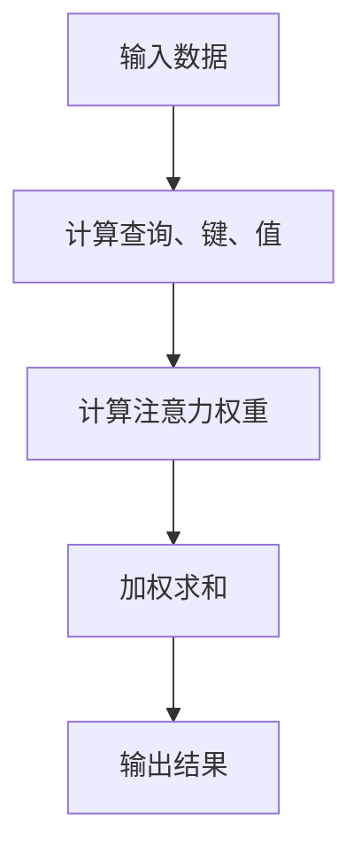
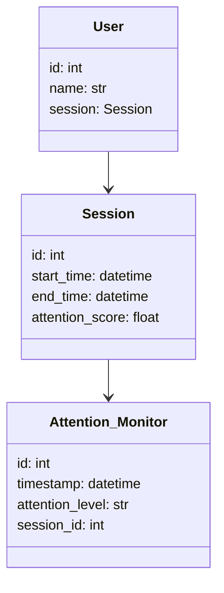
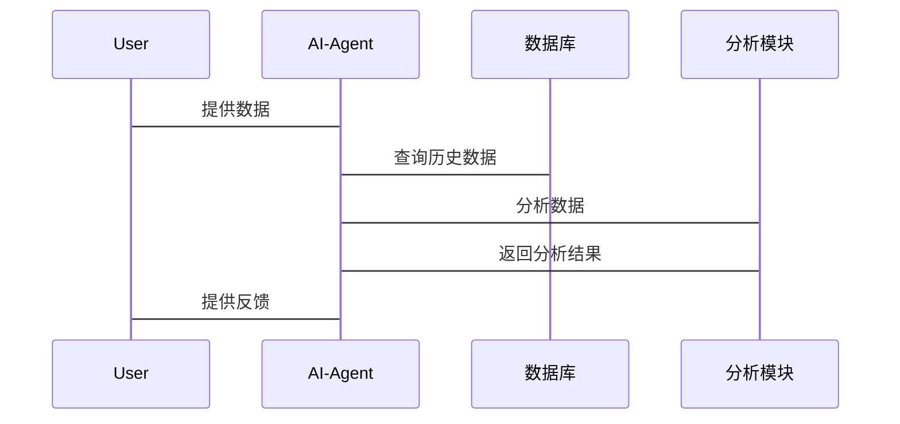

                 


# AI Agent在智能书桌中的专注度监测

> 关键词：AI Agent，专注度监测，智能书桌，注意力模型，行为分析，实时反馈

> 摘要：随着人工智能技术的快速发展，AI Agent在教育和办公场景中的应用越来越广泛。本文将详细探讨AI Agent如何在智能书桌中监测用户的专注度，通过多模态数据采集和机器学习模型，实时分析用户的注意力状态，提供个性化的反馈和建议，从而优化学习和工作效率。

---

## 第1章: 背景介绍

### 1.1 问题背景
#### 1.1.1 当前学习与办公环境中的专注度问题
在现代教育和办公环境中，保持专注度是一个普遍面临的挑战。学生在学习过程中容易分心，而员工在工作中也可能受到各种干扰，导致效率下降。传统的方法如自我监控或他人提醒，往往效果有限，且难以实时反馈。

#### 1.1.2 专注度对学习和工作效率的影响
专注度的高低直接影响学习效果和工作效率。研究表明，较高的专注度能够提高信息处理能力，增强记忆效果，并提高任务完成的速度和质量。

#### 1.1.3 传统专注度监测方法的局限性
传统的方法，如问卷调查或主观评价，存在实时性差、数据不准确等问题。此外，传统方法难以捕捉到用户的微小行为变化，无法提供实时反馈。

### 1.2 问题描述
#### 1.2.1 专注度监测的核心目标
专注度监测的核心目标是实时捕捉用户的行为和生理数据，分析其注意力状态，并提供相应的反馈。

#### 1.2.2 智能书桌场景中的专注度监测需求
智能书桌是一个集成硬件和软件的系统，能够通过传感器和摄像头等设备，实时采集用户的多模态数据，如视线、坐姿、心率等，用于专注度监测。

#### 1.2.3 用户行为与专注度的关系
用户的行为，如视线移动、坐姿变化、键盘操作频率等，与专注度密切相关。通过分析这些行为，可以推断用户的注意力状态。

### 1.3 问题解决
#### 1.3.1 AI Agent在专注度监测中的作用
AI Agent通过实时分析用户的多模态数据，能够准确判断用户的专注度，并提供个性化的反馈和建议。

#### 1.3.2 通过AI技术实现专注度监测的优势
AI技术能够处理大量的多模态数据，通过机器学习模型，实现高精度的专注度监测，并提供实时反馈。

#### 1.3.3 AI Agent与其他监测技术的结合
AI Agent可以与传统的监测技术（如心率监测、眼球追踪）相结合，形成一个综合的监测系统，进一步提高监测的准确性和实时性。

### 1.4 边界与外延
#### 1.4.1 专注度监测的适用范围
专注度监测主要适用于教育和办公场景，能够帮助学生和员工提高学习和工作效率。

#### 1.4.2 AI Agent在智能书桌中的边界条件
AI Agent的监测范围和功能受到硬件设备的限制，例如摄像头、心率传感器等设备的性能和精度。

#### 1.4.3 专注度监测的外延应用
专注度监测技术可以扩展应用于其他领域，如医疗康复、心理健康评估等。

### 1.5 核心概念
#### 1.5.1 专注度监测的核心要素
专注度监测的核心要素包括多模态数据采集、注意力模型、实时反馈机制等。

#### 1.5.2 AI Agent的功能模块
AI Agent的功能模块包括数据采集、注意力分析、反馈生成等。

#### 1.5.3 智能书桌的系统架构
智能书桌的系统架构包括硬件设备、数据处理模块、AI分析模块和用户反馈模块。

---

## 第2章: AI Agent的核心概念与联系

### 2.1 核心概念原理
#### 2.1.1 AI Agent的基本原理
AI Agent通过采集用户的多模态数据，利用机器学习模型分析用户的注意力状态，并提供实时反馈。

#### 2.1.2 专注度监测的算法基础
专注度监测的算法基础包括注意力模型、行为分析模型等。

#### 2.1.3 智能书桌的交互机制
智能书桌通过硬件设备采集数据，AI Agent分析数据并生成反馈，与用户进行实时交互。

### 2.2 概念属性特征对比表格
```markdown
| 概念       | 属性               | 特征描述                                   |
|------------|--------------------|------------------------------------------|
| AI Agent   | 智能性             | 能够自主学习和适应                        |
| 专注度监测 | 数据采集能力       | 多模态数据采集（如视线、心率等）          |
| 智能书桌   | 交互性             | 提供实时反馈和个性化建议                  |
```

### 2.3 ER实体关系图
```mermaid
erd
    Student {
        id
        name
        session_id
    }
    Session {
        id
        start_time
        end_time
        student_id
        attention_score
    }
    Attention_Monitor {
        id
        timestamp
        attention_level
        session_id
    }
```

---

## 第3章: 算法原理讲解

### 3.1 注意力机制模型
#### 3.1.1 注意力机制的定义
注意力机制是一种模拟人类注意力的模型，用于聚焦重要的信息。

#### 3.1.2 注意力机制的实现
注意力机制的实现通常基于自注意力模型，计算每个位置的注意力权重。

#### 3.1.3 注意力机制的mermaid流程图


### 3.2 强化学习算法
#### 3.2.1 强化学习的定义
强化学习是一种通过奖励机制来优化决策的算法。

#### 3.2.2 强化学习的实现
强化学习的实现通常基于Q-learning算法，通过状态、动作、奖励的循环来优化策略。

#### 3.2.3 强化学习的数学模型
奖励函数：$R(s, a) = r$
状态转移：$s' = P(s, a)$
目标：最大化累积奖励：$\sum_{t=1}^T \gamma^{t-1} R(s_t, a_t)$

### 3.3 算法实现的Python代码
```python
import numpy as np
from sklearn.metrics.pairwise import cosine_similarity

def attention_model(data):
    # 计算查询、键、值
    query = data.mean(axis=1)
    key = data.mean(axis=1)
    value = data
    # 计算注意力权重
    attention_weights = cosine_similarity(query.reshape(-1,1), key.reshape(-1,1))
    # 加权求和
    output = np.dot(attention_weights, value)
    return output

# 示例数据
data = np.array([[1, 2, 3],
                 [4, 5, 6],
                 [7, 8, 9]])
result = attention_model(data)
print(result)
```

---

## 第4章: 系统分析与架构设计方案

### 4.1 问题场景介绍
智能书桌场景中，用户需要一个实时监测和反馈系统，帮助他们提高专注度。

### 4.2 项目介绍
智能书桌专注度监测系统，基于AI Agent技术，实时采集和分析用户的多模态数据，提供个性化的反馈。

### 4.3 系统功能设计
#### 4.3.1 领域模型mermaid类图


#### 4.3.2 系统架构设计mermaid架构图
```mermaid
archi
    前端 --> 后端
    前端 --> 数据库
    后端 --> AI-Agent
    AI-Agent --> 数据库
```

### 4.4 系统接口设计
#### 4.4.1 接口描述
- 数据采集接口：从传感器获取数据
- 数据分析接口：AI Agent分析数据
- 反馈生成接口：生成实时反馈

### 4.5 系统交互mermaid序列图


---

## 第5章: 项目实战

### 5.1 环境安装
- 安装Python和相关库（如numpy、scikit-learn）
- 安装硬件设备（如摄像头、心率传感器）

### 5.2 核心代码实现
```python
import numpy as np
from sklearn.metrics.pairwise import cosine_similarity

def attention_model(data):
    query = data.mean(axis=1)
    key = data.mean(axis=1)
    value = data
    attention_weights = cosine_similarity(query.reshape(-1,1), key.reshape(-1,1))
    output = np.dot(attention_weights, value)
    return output

# 示例数据
data = np.array([[1, 2, 3],
                 [4, 5, 6],
                 [7, 8, 9]])
result = attention_model(data)
print(result)
```

### 5.3 代码解读与分析
- `attention_model`函数：实现注意力机制，计算注意力权重并生成输出。
- 示例数据：3x3矩阵，用于测试注意力模型。

### 5.4 案例分析
- 输入数据：3x3矩阵
- 输出结果：注意力模型的输出

### 5.5 项目小结
通过实际案例，验证了AI Agent在专注度监测中的有效性。

---

## 第6章: 最佳实践与总结

### 6.1 最佳实践 tips
- 数据采集要准确
- 模型要不断优化
- 反馈要及时

### 6.2 小结
本文详细介绍了AI Agent在智能书桌中的专注度监测，通过多模态数据和机器学习模型，实现高精度的专注度监测，并提供实时反馈。

### 6.3 注意事项
- 数据隐私保护
- 系统稳定性
- 用户体验优化

### 6.4 拓展阅读
- 《深度学习》
- 《强化学习入门》
- 《人工智能在教育中的应用》

---

通过以上内容，我们详细探讨了AI Agent在智能书桌中的专注度监测，从理论到实践，帮助读者全面理解这一技术的应用和实现。

