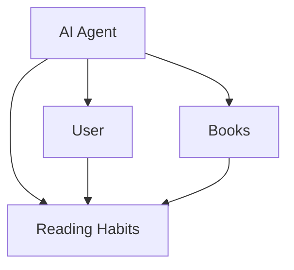
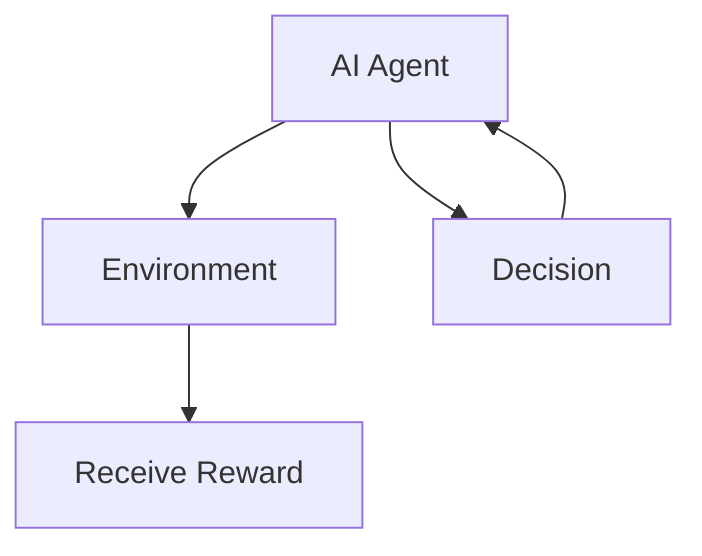
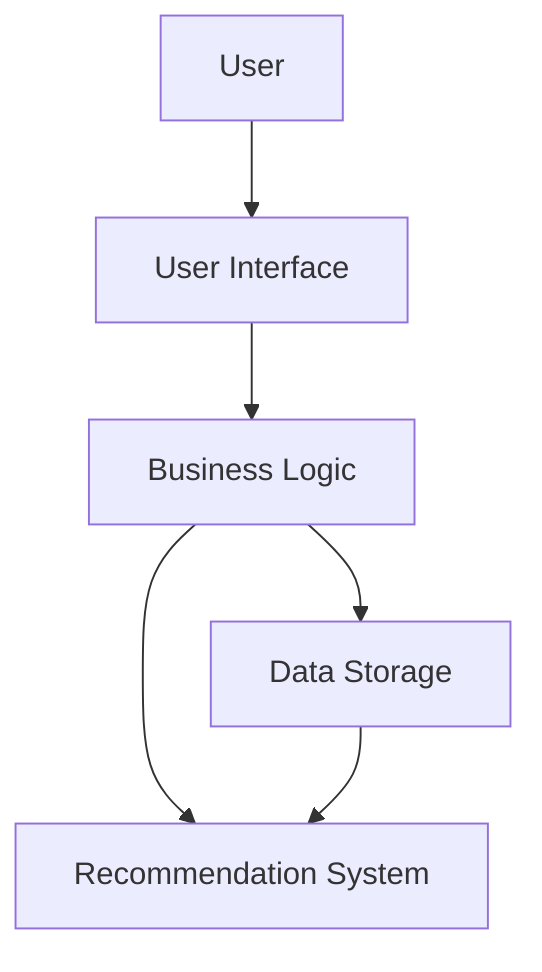

                 


# AI Agent在智能书立中的阅读习惯培养

## 关键词：AI Agent，智能书架，阅读习惯，机器学习，自然语言处理，个性化推荐，知识图谱

## 摘要：本文探讨AI Agent在智能书架中如何通过数据分析和机器学习技术，帮助用户培养良好的阅读习惯。文章详细介绍了AI Agent的核心原理、算法模型、系统架构设计，以及在实际应用中的项目实现和最佳实践，为读者提供全面的技术指导。

---

## 第一部分：AI Agent与智能书架的背景介绍

### 第1章：AI Agent的基本概念与背景

#### 1.1 AI Agent的定义与核心概念
AI Agent（人工智能代理）是一种智能实体，能够感知环境并采取行动以实现目标。在智能书架中，AI Agent通过分析用户的阅读行为，推荐书籍并跟踪阅读进度，从而帮助用户培养阅读习惯。

#### 1.2 智能书架的定义与特点
智能书架利用AI技术和物联网设备，将传统书架数字化，具备智能化推荐、自动管理书籍和个性化服务的特点。与传统书架相比，智能书架能够通过数据驱动的方式优化用户的阅读体验。

#### 1.3 阅读习惯培养的重要性
阅读习惯是个人持续学习和知识积累的关键。AI Agent通过智能化手段，能够有效帮助用户制定阅读计划、克服拖延，并推荐符合用户兴趣的书籍。

#### 1.4 问题背景与问题描述
在信息爆炸的时代，用户面临海量书籍选择，容易产生选择困难和阅读拖延。本文旨在探讨如何通过AI Agent解决这些问题，培养用户的阅读习惯。

#### 1.5 问题的边界与外延
AI Agent在阅读习惯培养中的应用边界包括书籍推荐和阅读进度跟踪，外延则涉及用户行为分析和个性化服务优化。

#### 1.6 核心概念的结构与组成
AI Agent由感知层、决策层和执行层组成，分别负责数据采集、模型推理和行动执行。在智能书架中，感知层通过传感器收集用户行为数据，决策层基于机器学习模型生成推荐，执行层通过书架和应用程序实现服务。

---

## 第二部分：AI Agent的核心概念与联系

### 第2章：AI Agent的核心原理

#### 2.1 AI Agent的核心原理
AI Agent通过感知环境、分析数据、制定策略和执行动作来实现目标。在智能书架中，AI Agent主要利用机器学习算法分析用户的阅读行为，生成个性化的书籍推荐。

#### 2.2 AI Agent与相关技术的联系
- **机器学习**：AI Agent依赖于监督学习和无监督学习技术，从用户数据中提取特征并训练模型。
- **自然语言处理**：通过NLP技术，AI Agent能够理解和生成自然语言文本，优化书籍推荐的准确性和用户体验。
- **数据挖掘**：数据挖掘技术帮助AI Agent从海量数据中提取有价值的信息，支持决策过程。

#### 2.3 核心概念的对比分析
- AI Agent与传统算法的对比：AI Agent具备自适应性和学习能力，能够根据反馈不断优化推荐策略，而传统算法通常基于固定的规则。
- AI Agent与规则引擎的对比：AI Agent能够处理复杂和动态的环境，而规则引擎主要依赖预定义的规则。
- AI Agent与知识图谱的对比：AI Agent结合知识图谱进行推理和决策，能够提供更精准的服务。

#### 2.4 ER实体关系图
以下是AI Agent与智能书架的实体关系图：



---

## 第三部分：AI Agent的算法原理讲解

### 第3章：AI Agent的算法原理

#### 3.1 AI Agent的主要算法
AI Agent常用的算法包括强化学习（Reinforcement Learning）、监督学习（Supervised Learning）和无监督学习（Unsupervised Learning）。在阅读习惯培养中，强化学习常用于推荐系统的优化。

#### 3.2 强化学习算法的原理
强化学习是一种通过试错机制来优化决策策略的算法。AI Agent通过与环境交互，获得奖励或惩罚，逐步优化推荐策略。

#### 3.3 基于强化学习的书籍推荐算法
以下是基于强化学习的书籍推荐算法的流程图：



#### 3.4 Python实现示例
以下是强化学习算法的Python代码示例：

```python
import numpy as np

class AIAgent:
    def __init__(self, actions):
        self.actions = actions
        self.learning_rate = 0.1
        self.discount_factor = 0.9
        self.q_table = np.zeros(len(actions))

    def choose_action(self, state):
        return np.argmax(self.q_table)

    def learn(self, state, action, reward):
        self.q_table[action] += self.learning_rate * (reward + self.discount_factor * np.max(self.q_table))

# 示例应用
agent = AIAgent(actions=['推荐书籍', '跟踪进度', '提供反馈'])
state = 0  # 当前状态
action = agent.choose_action(state)
agent.learn(state, action, reward=1)
```

#### 3.5 数学模型与公式
强化学习的数学模型如下：

$$ Q(s, a) = Q(s, a) + \alpha (r + \gamma \max Q(s', a') - Q(s, a)) $$

其中：
- \( Q(s, a) \) 表示状态 \( s \) 下采取行动 \( a \) 的价值
- \( \alpha \) 是学习率
- \( r \) 是奖励
- \( \gamma \) 是折扣因子
- \( s' \) 是下一个状态

---

## 第四部分：智能书架的系统分析与架构设计

### 第4章：系统分析与架构设计

#### 4.1 智能书架的系统架构
智能书架的系统架构包括用户界面层、业务逻辑层和数据存储层。用户界面层负责与用户交互，业务逻辑层处理书籍推荐和阅读习惯跟踪，数据存储层存储用户数据和书籍信息。

#### 4.2 系统功能设计
系统功能包括：
- 用户管理：注册、登录和个人信息管理
- 书籍推荐：基于用户行为的个性化推荐
- 阅读习惯跟踪：记录阅读进度和习惯分析

#### 4.3 系统架构图
以下是系统架构图：



#### 4.4 接口设计与交互流程
系统接口包括：
- 获取书籍推荐接口
- 更新阅读进度接口
- 用户反馈接口

交互流程：
1. 用户在界面上选择书籍类型。
2. 系统调用推荐算法生成推荐列表。
3. 用户选择书籍并开始阅读。
4. 系统记录阅读进度并更新数据库。

---

## 第五部分：项目实战与应用

### 第5章：项目实战

#### 5.1 环境安装与配置
需要安装Python、TensorFlow、Scikit-learn等库，并配置开发环境。

#### 5.2 核心代码实现
以下是核心代码实现：

```python
from sklearn.metrics.pairwise import cosine_similarity

def recommend_books(user_id):
    # 获取用户行为数据
    user_behavior = data[user_id]
    # 计算相似用户
    similar_users = cosine_similarity(user_behavior, all_users).flatten()
    # 获取推荐书籍
    recommendations = []
    for i in range(len(similar_users)):
        if similar_users[i] > 0.8:
            recommendations.extend(all_books[i])
    return recommendations

# 示例调用
recommendations = recommend_books(1)
print(recommendations)
```

#### 5.3 代码解读与分析
上述代码基于余弦相似度计算用户间的相似性，并推荐相似用户的书籍。这种方法简单有效，适用于中小规模数据。

#### 5.4 实际案例分析
通过实际案例分析，验证算法的有效性。例如，分析用户A的行为数据，推荐相关书籍，并跟踪用户的阅读进度，评估推荐算法的效果。

#### 5.5 项目小结
项目实战部分验证了AI Agent在智能书架中的应用可行性，展示了如何通过技术手段实现个性化的阅读习惯培养。

---

## 第六部分：最佳实践与总结

### 第6章：最佳实践

#### 6.1 小结
本文详细介绍了AI Agent在智能书架中的应用，探讨了其核心原理、算法模型和系统架构设计，并通过项目实战展示了具体实现方法。

#### 6.2 注意事项
- 数据隐私保护：确保用户数据的安全性
- 算法优化：不断优化推荐算法，提升推荐准确率
- 用户体验：注重界面设计，提升用户体验

#### 6.3 拓展阅读
建议读者深入学习强化学习、自然语言处理等技术，探索AI Agent在其他领域的应用。

---

## 附录：参考文献与工具

- 机器学习相关书籍：《Hands-On Machine Learning with Scikit-Learn and TensorFlow》
- 强化学习相关书籍：《Deep Reinforcement Learning》
- 开源工具：TensorFlow、PyTorch、Scikit-learn

---

以上是《AI Agent在智能书立中的阅读习惯培养》的完整目录大纲和详细内容。通过逐步分析和详细阐述，本文为读者提供了从理论到实践的全面指导，帮助他们理解并应用AI Agent技术在智能书架中的实际应用。

