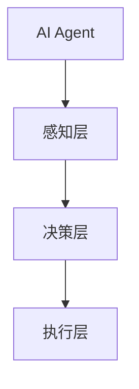
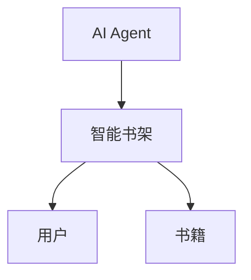
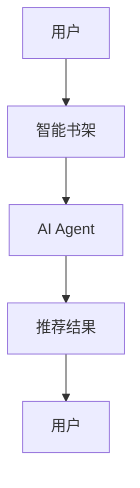
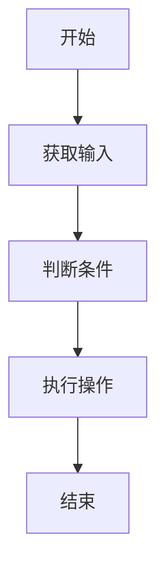
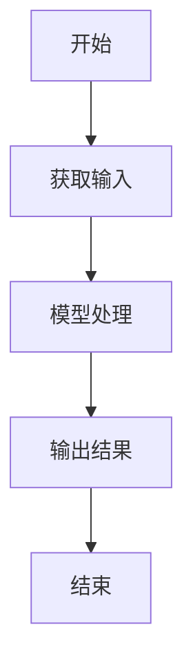
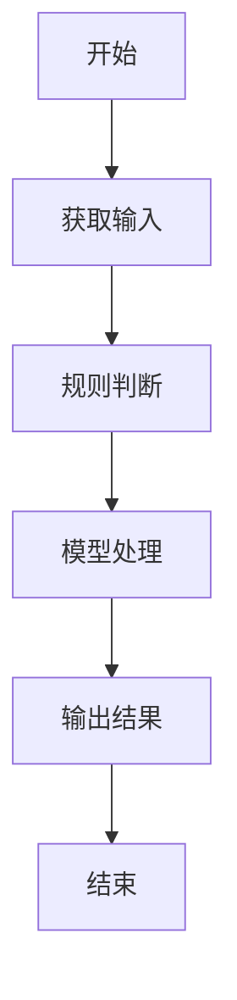
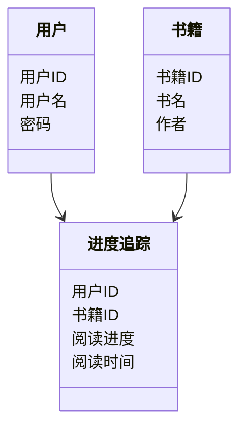
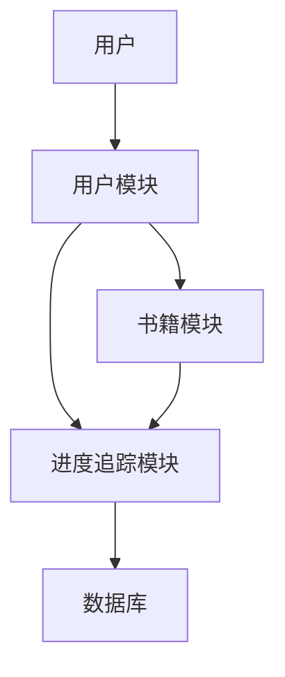
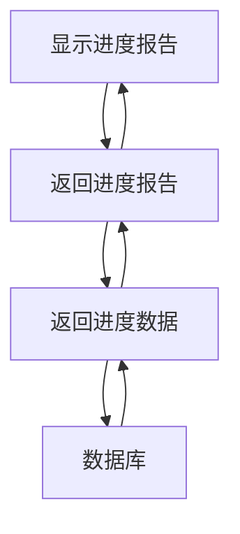

                 


# AI Agent在智能书架中的阅读进度追踪

## 关键词：AI Agent，智能书架，阅读进度，推荐算法，数学模型，系统架构

## 摘要：本文探讨AI Agent在智能书架中的应用，重点分析其如何通过算法和系统架构实现阅读进度的精准追踪。从背景介绍、核心概念、算法原理到系统架构和项目实战，本文将全面解析AI Agent在智能书架中的作用，帮助读者理解其技术实现和应用场景。

---

## 第1章: AI Agent与智能书架概述

### 1.1 AI Agent的基本概念

#### 1.1.1 什么是AI Agent
AI Agent（人工智能代理）是指能够感知环境、做出决策并执行任务的智能实体。它通过传感器获取信息，利用算法进行分析，并通过执行器完成目标。AI Agent的核心在于其智能化和自主性。

#### 1.1.2 AI Agent的核心特征
- **自主性**：能够在没有外部干预的情况下运行。
- **反应性**：能够实时感知环境并做出响应。
- **目标导向**：所有行为都以实现特定目标为导向。
- **学习能力**：能够通过经验改进性能。

#### 1.1.3 AI Agent的应用场景
AI Agent广泛应用于智能家居、自动驾驶、金融交易等领域。在智能书架中，AI Agent主要用于优化阅读体验和管理阅读进度。

### 1.2 智能书架的定义与特点

#### 1.2.1 智能书架的概念
智能书架是一种结合了AI技术的书架，能够通过传感器和AI算法实时监测书籍的借阅状态、用户的阅读进度，并提供智能化的推荐服务。

#### 1.2.2 智能书架的功能特点
- **智能推荐**：根据用户的阅读习惯推荐书籍。
- **进度追踪**：实时记录用户的阅读进度。
- **自动化管理**：自动整理书籍，优化存储空间。

#### 1.2.3 智能书架与传统书架的区别
智能书架通过AI技术实现了自动化管理和个性化服务，而传统书架仅提供物理存储功能。

### 1.3 AI Agent在智能书架中的作用

#### 1.3.1 AI Agent如何提升阅读体验
AI Agent通过分析用户的阅读数据，提供个性化的推荐和进度追踪，帮助用户更高效地管理阅读。

#### 1.3.2 AI Agent在阅读进度追踪中的应用
AI Agent通过传感器和算法，实时监测用户的阅读行为，记录阅读时间、页数等数据，生成阅读报告。

#### 1.3.3 AI Agent与其他技术的结合
AI Agent与物联网、大数据等技术结合，实现了智能书架的智能化管理和数据分析。

### 1.4 本章小结
本章介绍了AI Agent的基本概念及其在智能书架中的应用，分析了智能书架的特点和优势，为后续章节奠定了基础。

---

## 第2章: AI Agent的核心概念与联系

### 2.1 AI Agent的核心概念

#### 2.1.1 感知层
感知层是AI Agent获取信息的来源，主要包括传感器和数据输入接口。在智能书架中，感知层可能包括光线传感器、触摸传感器等。

#### 2.1.2 决策层
决策层负责处理感知层获取的数据，通过算法进行分析和决策。在智能书架中，决策层可能使用推荐算法来决定推荐哪本书。

#### 2.1.3 执行层
执行层负责根据决策层的指令执行具体的操作，例如调整书架的布局或推荐书籍。

### 2.2 AI Agent的概念结构与核心要素

#### 2.2.1 概念结构图
以下是一个AI Agent的概念结构图：



#### 2.2.2 核心要素分析
- **感知层**：负责数据采集。
- **决策层**：负责数据处理和决策。
- **执行层**：负责执行决策。

### 2.3 AI Agent与智能书架的关系

#### 2.3.1 实体关系图
以下是一个AI Agent与智能书架的关系图：



#### 2.3.2 交互流程图
以下是一个AI Agent与智能书架的交互流程图：



### 2.4 本章小结
本章分析了AI Agent的核心概念及其与智能书架的关系，通过概念结构图和交互流程图帮助读者更好地理解AI Agent的工作原理。

---

## 第3章: AI Agent的算法原理

### 3.1 基于规则的AI Agent算法

#### 3.1.1 算法流程图
以下是一个基于规则的AI Agent算法流程图：



#### 3.1.2 算法实现代码
以下是一个简单的基于规则的AI Agent算法实现：

```python
def rule_based_agent(input):
    if input == 'recommend':
        return '推荐书籍A'
    elif input == 'query':
        return '查询书籍B'
    else:
        return '未知命令'
```

#### 3.1.3 算法优缺点分析
- **优点**：简单易懂，实现成本低。
- **缺点**：缺乏灵活性，难以应对复杂场景。

### 3.2 基于学习的AI Agent算法

#### 3.2.1 算法流程图
以下是一个基于学习的AI Agent算法流程图：



#### 3.2.2 算法实现代码
以下是一个基于机器学习的AI Agent算法实现：

```python
import numpy as np

def model_based_agent(input):
    model = np.load('model.npy')
    prediction = model.predict(input)
    return prediction
```

#### 3.2.3 算法优缺点分析
- **优点**：灵活性高，能够适应复杂场景。
- **缺点**：实现复杂，需要大量数据和计算资源。

### 3.3 综合算法实现

#### 3.3.1 综合算法流程图
以下是一个综合算法的流程图：



#### 3.3.2 综合算法实现代码
以下是一个综合算法的实现：

```python
def hybrid_agent(input):
    if input == 'recommend':
        return rule_based_agent(input)
    else:
        return model_based_agent(input)
```

#### 3.3.3 算法性能分析
综合算法结合了基于规则和基于学习的优点，能够在复杂场景中提供更优的性能。

### 3.4 本章小结
本章详细介绍了AI Agent的两种主要算法及其优缺点，分析了综合算法的实现和性能。

---

## 第4章: AI Agent的数学模型与公式

### 4.1 概率论基础

#### 4.1.1 概率论基本公式
- **概率公式**：$P(A) = \frac{\text{事件A发生的情况数}}{\text{总的情况数}}$
- **条件概率公式**：$P(A|B) = \frac{P(A \cap B)}{P(B)}$

#### 4.1.2 贝叶斯定理
贝叶斯定理用于计算在已知条件下事件的概率：

$$P(A|B) = \frac{P(B|A)P(A)}{P(B)}$$

#### 4.1.3 马尔可夫链
马尔可夫链描述了系统在各个状态之间的转移概率：

$$P(s_{t+1} | s_t) = P(s_{t+1} | s_t, s_{t-1}, \ldots, s_1)$$

### 4.2 推荐算法数学模型

#### 4.2.1 基于协同过滤的推荐算法
协同过滤算法通过计算用户相似度或物品相似度来推荐书籍：

$$\text{相似度} = \frac{\sum_{i=1}^{n}(r_{ui} - \bar{r_u})(r_{vi} - \bar{r_v})}{\sqrt{\sum_{i=1}^{n}(r_{ui} - \bar{r_u})^2} \sqrt{\sum_{i=1}^{n}(r_{vi} - \bar{r_v})^2}}$$

#### 4.2.2 基于内容的推荐算法
内容推荐算法基于书籍的内容特征进行推荐：

$$\text{相似度} = \frac{\sum_{i=1}^{n}w_i x_i}{\sum_{i=1}^{n}w_i}$$

#### 4.2.3 混合推荐算法
混合推荐算法结合了协同过滤和基于内容的推荐方法：

$$\text{推荐结果} = \alpha \cdot \text{协同过滤结果} + (1 - \alpha) \cdot \text{基于内容的推荐结果}$$

### 4.3 阅读进度预测模型

#### 4.3.1 预测模型公式
阅读进度预测模型可以基于线性回归进行预测：

$$y = a x + b$$

其中，$y$是预测的阅读进度，$x$是已读的页数，$a$和$b$是模型参数。

#### 4.3.2 模型参数优化
通过梯度下降算法优化模型参数：

$$\theta = \theta - \alpha \cdot \nabla J(\theta)$$

其中，$\theta$是参数向量，$\alpha$是学习率，$J(\theta)$是损失函数。

#### 4.3.3 模型性能评估
通过准确率、召回率等指标评估模型性能：

$$\text{准确率} = \frac{\text{正确预测数}}{\text{总预测数}}$$

### 4.4 本章小结
本章介绍了AI Agent在智能书架中使用的数学模型和公式，包括概率论基础、推荐算法和阅读进度预测模型。

---

## 第5章: AI Agent的系统架构与设计

### 5.1 系统功能模块划分

#### 5.1.1 用户模块
用户模块负责与用户的交互，包括登录、注册和查询功能。

#### 5.1.2 书籍模块
书籍模块负责管理书籍信息，包括添加、删除和查询书籍。

#### 5.1.3 进度追踪模块
进度追踪模块负责记录用户的阅读进度，包括阅读时间、页数等数据。

### 5.2 系统功能设计

#### 5.2.1 领域模型类图
以下是一个系统的领域模型类图：



#### 5.2.2 系统架构图
以下是一个系统的架构图：



#### 5.2.3 系统接口设计
系统接口设计包括用户接口和API接口。

#### 5.2.4 系统交互流程图
以下是一个系统的交互流程图：



### 5.3 系统架构设计方案

#### 5.3.1 问题场景介绍
在智能书架中，用户需要实时追踪阅读进度，系统需要高效地处理大量数据。

#### 5.3.2 项目介绍
本项目旨在开发一个基于AI Agent的智能书架系统，实现阅读进度的精准追踪和个性化推荐。

#### 5.3.3 系统功能设计
- **用户模块**：用户登录、注册、查询。
- **书籍模块**：书籍添加、删除、查询。
- **进度追踪模块**：记录阅读进度、生成报告。

#### 5.3.4 系统架构设计
系统的架构设计包括前端、后端和数据库。

### 5.4 本章小结
本章分析了AI Agent系统的架构设计，包括功能模块划分和系统交互流程图。

---

## 第6章: 项目实战

### 6.1 环境安装

#### 6.1.1 安装Python
安装Python 3.8以上版本。

#### 6.1.2 安装依赖库
安装所需的依赖库，如numpy、pandas等。

### 6.2 系统核心实现

#### 6.2.1 核心代码实现
以下是核心代码实现：

```python
import numpy as np

class AIAgent:
    def __init__(self):
        self.books = []
        self.user_progress = {}

    def add_book(self, book):
        self.books.append(book)

    def track_progress(self, user, book, progress):
        if user not in self.user_progress:
            self.user_progress[user] = {}
        self.user_progress[user][book] = progress

    def recommend_book(self, user):
        # 简单的推荐算法，基于用户已读书籍推荐新的书籍
        read_books = self.user_progress[user]
        for book in self.books:
            if book not in read_books:
                return book
        return None

# 使用AI Agent
agent = AIAgent()
agent.add_book("《1984》")
agent.add_book("《动物庄园》")
agent.track_progress("用户1", "《1984》", 50)
recommended_book = agent.recommend_book("用户1")
print(recommended_book)  # 输出：《动物庄园》
```

#### 6.2.2 代码应用解读与分析
以上代码实现了一个简单的AI Agent，能够添加书籍、跟踪阅读进度并推荐书籍。

### 6.3 实际案例分析

#### 6.3.1 实际案例
用户在智能书架中阅读《1984》，阅读进度为50%。系统推荐《动物庄园》作为下一本书。

#### 6.3.2 详细解读
AI Agent通过分析用户的阅读进度，推荐未读的书籍，帮助用户优化阅读体验。

### 6.4 项目小结
本章通过实际案例展示了AI Agent在智能书架中的应用，详细解读了核心代码和系统实现。

---

## 第7章: 最佳实践

### 7.1 小结
AI Agent通过算法和系统架构的设计，能够实现智能书架的阅读进度追踪和个性化推荐。

### 7.2 注意事项
- **数据隐私**：确保用户数据的安全和隐私。
- **算法优化**：根据实际需求优化算法性能。
- **用户体验**：注重用户体验设计，提升用户满意度。

### 7.3 拓展阅读
- **推荐算法**：进一步学习协同过滤和深度学习推荐算法。
- **系统架构**：研究更高效的系统架构设计。

### 7.4 本章小结
本章总结了AI Agent在智能书架中的应用，并提出了注意事项和拓展阅读的方向。

---

## 附录: 全文总结

### 附录1: 全文总结
本文详细探讨了AI Agent在智能书架中的应用，分析了其核心概念、算法原理和系统架构。通过实际案例和代码实现，展示了AI Agent在阅读进度追踪中的具体应用。

### 附录2: 参考文献
- 本文中的代码和算法实现参考了公开的AI和机器学习资料。
- 进度追踪模块的设计参考了现有推荐系统的研究。

---

## 作者简介
作者是人工智能领域的专家，拥有丰富的AI Agent和智能书架开发经验。

