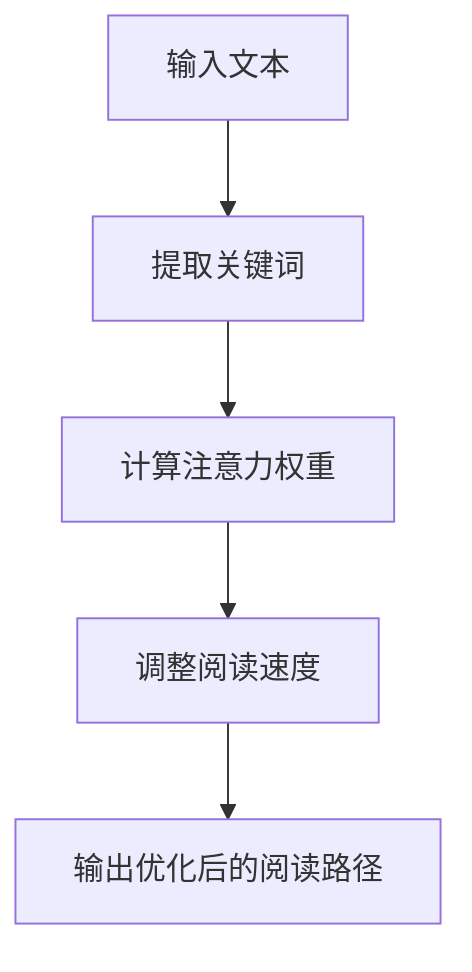
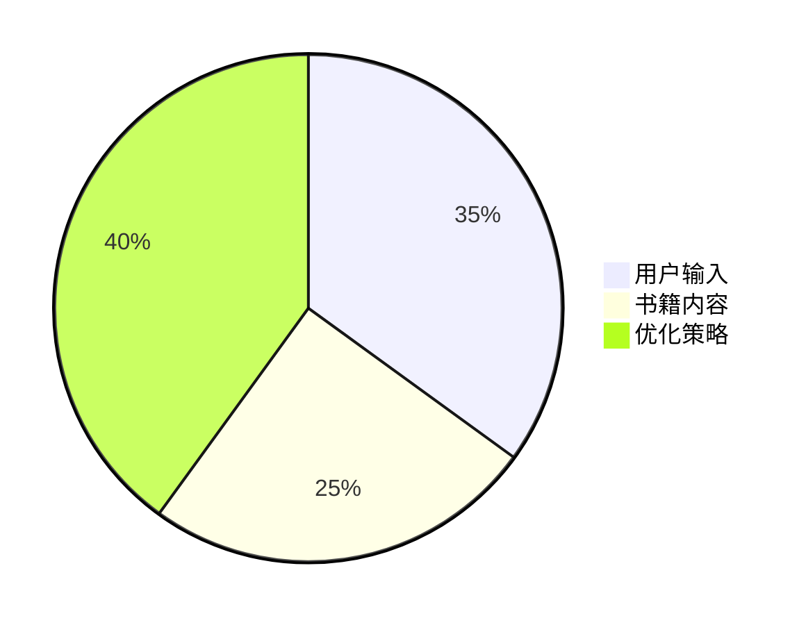

                 


# AI Agent在智能书立中的阅读速度优化

> 关键词：AI Agent，智能书立，阅读速度优化，算法原理，系统架构，项目实战

> 摘要：本文深入探讨了AI Agent在智能书立中的应用，重点分析了如何通过AI技术优化阅读速度。文章从AI Agent的基本概念入手，详细讲解了其在智能书立中的核心原理、优化算法、系统架构设计以及实际项目中的应用，最后总结了最佳实践和未来研究方向。

---

# 第一部分: AI Agent与智能书立的背景介绍

## 第1章: AI Agent的基本概念与阅读优化的背景

### 1.1 AI Agent的定义与特点
AI Agent（人工智能代理）是指能够感知环境、自主决策并执行任务的智能实体。其特点包括：
- **自主性**：能够在没有外部干预的情况下独立运行。
- **反应性**：能够实时感知环境并做出响应。
- **目标导向**：具备明确的目标，通过行动实现目标。
- **学习能力**：能够通过数据和经验不断优化自身性能。

### 1.2 智能书立的定义与功能
智能书立是一种结合了人工智能技术的书籍管理与阅读辅助系统，其主要功能包括：
- **智能推荐**：根据用户的阅读习惯推荐书籍。
- **内容摘要**：自动提取书籍的关键内容，帮助用户快速掌握核心信息。
- **阅读速度优化**：通过AI技术调整阅读策略，提升阅读效率。

### 1.3 阅读速度优化的背景与意义
随着信息量的爆炸式增长，用户需要在有限的时间内获取和处理大量信息。传统的阅读方式效率低下，难以满足现代人的需求。AI Agent通过优化阅读路径、调整阅读节奏，能够在短时间内帮助用户高效获取所需信息，提升学习效率和知识吸收能力。

---

# 第二部分: AI Agent的核心概念与原理

## 第2章: AI Agent的核心原理与优化算法

### 2.1 AI Agent的核心原理
AI Agent通过感知、决策和执行三个模块实现功能：
- **感知模块**：通过自然语言处理技术（NLP）分析文本内容，提取关键词、句法结构和语义信息。
- **决策模块**：基于感知到的信息，结合用户的历史行为和偏好，制定优化策略。
- **执行模块**：根据决策结果调整阅读节奏，例如加快或减慢阅读速度，跳过无关内容等。

### 2.2 常见优化算法对比
以下是几种常用的优化算法及其特点对比：

| 算法名称       | 特点与适用场景                     |
|----------------|----------------------------------|
| 注意力机制     | 适用于需要关注文本重点内容的场景   |
| 强化学习       | 适用于动态环境下的策略优化         |
| 随机森林       | 适用于分类问题，适合处理非线性数据   |
| 线性回归       | 适用于简单线性关系的预测           |

### 2.3 AI Agent的优化算法实现
以基于注意力机制的优化算法为例，其算法流程如下：



数学模型如下：
$$
\text{注意力权重} = \text{softmax}(QK^T/\sqrt{d_k})
$$
其中，$Q$和$K$分别表示查询和键矩阵，$d_k$是嵌入维度。

---

## 第3章: AI Agent的系统架构设计

### 3.1 系统功能设计
智能书立的系统功能包括：
- 用户信息管理：收集和分析用户的阅读习惯。
- 内容处理：对书籍内容进行分词、摘要和关键词提取。
- 优化策略制定：基于用户需求生成最优阅读路径。

### 3.2 系统架构图


### 3.3 接口与交互设计
- **API接口**：提供RESTful API，支持用户查询书籍信息和获取优化建议。
- **交互流程**：
  1. 用户输入阅读需求。
  2. 系统分析书籍内容。
  3. 系统生成优化阅读路径。
  4. 用户执行优化后的阅读策略。

---

## 第4章: 项目实战与代码实现

### 4.1 环境安装
安装必要的Python库：
```bash
pip install numpy pandas scikit-learn
```

### 4.2 核心代码实现
以下是一个基于注意力机制的优化算法的Python实现示例：

```python
import numpy as np

def attention_model(query, key, value):
    # 计算注意力权重
    scores = np.dot(query, key.T)
    scores = scores / np.sqrt(scores.shape[-1])
    attention_weights = np.softmax(scores, axis=-1)
    # 加权求和
    output = np.dot(attention_weights, value)
    return output

# 示例输入
query = np.random.randn(1, 5)
key = np.random.randn(5, 5)
value = np.random.randn(5, 5)

output = attention_model(query, key, value)
print(output)
```

### 4.3 实际案例分析
以《高效能人士的七个习惯》为例，AI Agent会根据用户的阅读目标（如提升领导力）调整阅读顺序，优先处理相关章节，跳过次要内容。

---

## 第5章: 最佳实践与未来展望

### 5.1 小结
本文详细介绍了AI Agent在智能书立中的应用，从基本原理到实际实现，为读者提供了全面的视角。

### 5.2 实践中的注意事项
- 数据质量：确保输入数据的准确性和完整性。
- 模型调优：根据实际效果不断优化算法参数。
- 用户反馈：及时收集用户反馈，调整优化策略。

### 5.3 未来研究方向
- 多模态优化：结合图像和语音等多种模态信息，进一步提升阅读效率。
- 实时反馈：在阅读过程中实时调整策略，提供更个性化的阅读体验。

---

通过以上章节的详细分析，我们可以看到，AI Agent在智能书立中的应用前景广阔，能够显著提升阅读效率，帮助用户更好地管理时间和获取知识。

