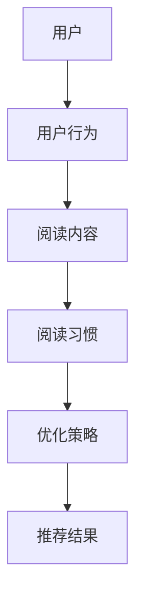
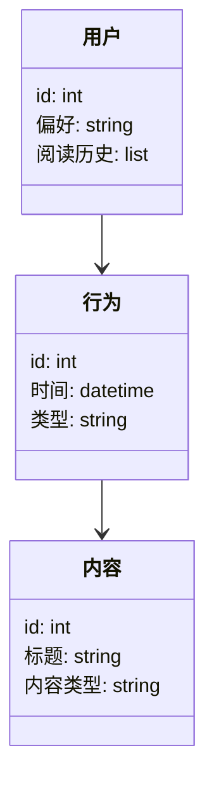
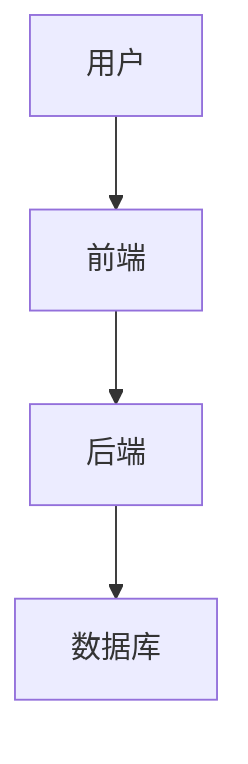
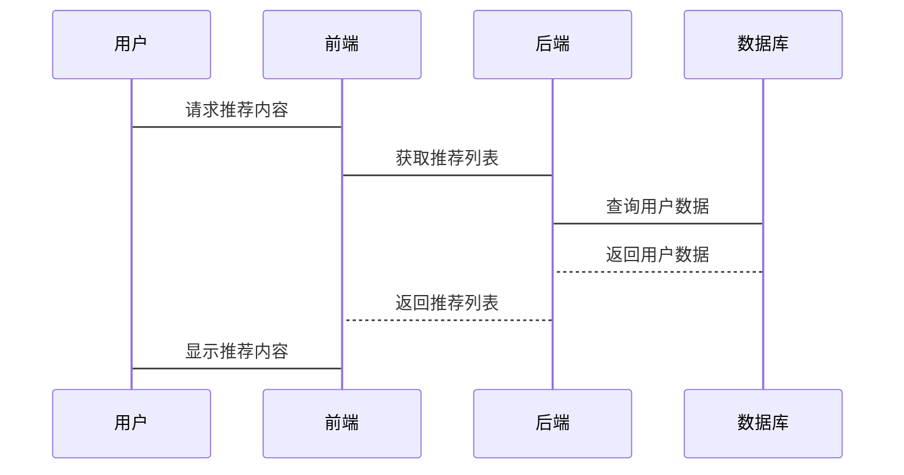

                 


# AI Agent在智能书签中的阅读习惯优化

> 关键词：AI Agent, 智能书签, 阅读习惯, 优化算法, 推荐系统

> 摘要：本文深入探讨AI Agent在智能书签中的应用，分析其如何通过个性化推荐和行为分析优化用户的阅读习惯。文章从背景介绍、核心概念、算法原理、系统架构到项目实战，全面解析AI Agent在阅读习惯优化中的作用，并结合实际案例展示其应用场景和实现方式。

---

## 第一部分: AI Agent在智能书签中的阅读习惯优化背景介绍

### 第1章: AI Agent与阅读习惯优化概述

#### 1.1 AI Agent的基本概念
- **1.1.1 AI Agent的定义与特点**  
  AI Agent（人工智能代理）是一种能够感知环境、执行任务以满足目标的智能实体。其特点包括自主性、反应性、目标导向和学习能力。  
  - 自主性：AI Agent能够在没有外部干预的情况下独立运行。  
  - 反应性：能够根据环境输入做出实时反应。  
  - 目标导向：通过实现目标来提供服务。  
  - 学习能力：通过数据和反馈不断优化自身行为。

- **1.1.2 AI Agent的核心功能与应用场景**  
  AI Agent的核心功能包括数据采集、分析、决策和执行。其应用场景广泛，例如个性化推荐、智能助手、自动化服务等。

- **1.1.3 阅读习惯优化的背景与意义**  
  随着信息量的爆炸式增长，用户每天面对海量信息，如何有效管理阅读时间和内容成为一大挑战。AI Agent通过分析用户的阅读行为和偏好，帮助用户优化阅读习惯，提升阅读效率和质量。

#### 1.2 智能书签的概念与功能
- **1.2.1 智能书签的基本定义**  
  智能书签是一种结合AI技术的工具，用于记录和管理用户的阅读内容，同时提供个性化推荐和行为分析。

- **1.2.2 智能书签的核心功能与优势**  
  - **记录与管理**：智能书签能够记录用户的阅读历史、笔记和标记。  
  - **个性化推荐**：基于用户的行为数据，智能推荐相关内容。  
  - **行为分析**：通过分析用户的阅读习惯，提供优化建议。

- **1.2.3 智能书签在阅读习惯优化中的作用**  
  智能书签通过AI技术帮助用户发现感兴趣的内容，避免信息过载，同时优化用户的阅读计划和时间管理。

#### 1.3 本章小结  
本章介绍了AI Agent的基本概念及其在阅读习惯优化中的应用，强调了智能书签在现代信息管理中的重要性。

---

## 第二部分: AI Agent的核心概念与原理

### 第2章: AI Agent的核心概念与联系

#### 2.1 AI Agent的感知层
- **2.1.1 用户行为数据的采集与分析**  
  AI Agent通过收集用户的阅读行为数据（如阅读时间、阅读速度、停留时长等），分析用户的阅读偏好和习惯。

- **2.1.2 文本内容的理解与解析**  
  利用自然语言处理技术，AI Agent能够理解文本内容的主题、情感和关键信息。

- **2.1.3 阅读习惯的特征提取**  
  通过数据挖掘技术，提取用户的阅读习惯特征，例如阅读频率、内容偏好和注意力分布。

#### 2.2 AI Agent的决策层
- **2.2.1 推荐算法的选择与优化**  
  AI Agent根据用户的阅读习惯和内容特征，选择合适的推荐算法（如协同过滤、基于内容的推荐）并进行优化。

- **2.2.2 阅读习惯的预测与评估**  
  基于历史数据，AI Agent预测用户的阅读行为，并通过评估指标（如准确率、召回率）优化推荐策略。

- **2.2.3 个性化推荐策略的制定**  
  根据用户的个性化需求，制定差异化的推荐策略，例如偏好深度阅读的用户推荐长篇文章，偏好快速浏览的用户推荐摘要。

#### 2.3 AI Agent的执行层
- **2.3.1 推荐结果的呈现方式**  
  AI Agent将推荐结果以用户友好的形式呈现，例如列表、标签或视觉化图表。

- **2.3.2 用户反馈的收集与处理**  
  收集用户的反馈（如点赞、收藏、跳过），并将其作为优化推荐策略的依据。

- **2.3.3 系统的自适应优化机制**  
  系统根据用户反馈不断调整推荐策略，实现动态优化。

#### 2.4 核心概念对比分析
- **2.4.1 基于规则的AI Agent与基于学习的AI Agent对比**  
  - 基于规则的AI Agent依赖预定义的规则，适用于规则明确的场景。  
  - 基于学习的AI Agent通过机器学习算法自适应优化，适用于复杂场景。



- **2.4.2 阅读习惯优化中的实体关系图**  
  通过Mermaid图展示用户、行为、内容、习惯和策略之间的关系，帮助读者理解系统的整体架构。

#### 2.5 本章小结  
本章深入分析了AI Agent的核心概念，包括感知层、决策层和执行层，并通过对比分析和实体关系图，明确了各部分的功能与联系。

---

## 第三部分: AI Agent的算法原理与数学模型

### 第3章: AI Agent的推荐算法原理

#### 3.1 基于协同过滤
- **3.1.1 协同过滤的基本原理**  
  协同过滤通过寻找与用户相似的用户群体，推荐这些用户喜欢的内容。

- **3.1.2 用户-物品矩阵的构建与分析**  
  通过矩阵分解技术，构建用户-物品的关联矩阵，并分析其特征。

- **3.1.3 基于用户的协同过滤算法实现**  
  使用Python实现基于用户的协同过滤算法，并通过代码示例展示其数学模型。

#### 3.2 基于内容的推荐
- **3.2.1 内容特征提取与相似度计算**  
  利用文本挖掘技术提取内容特征，并计算内容之间的相似度。

- **3.2.2 基于内容的推荐算法实现**  
  展示基于内容的推荐算法的实现过程，包括特征提取和相似度计算。

#### 3.3 强化学习在阅读习惯优化中的应用
- **3.3.1 强化学习的基本原理**  
  强化学习通过智能体与环境的交互，学习最优策略。

- **3.3.2 阅读习惯优化的强化学习模型**  
  构建强化学习模型，用于优化用户的阅读路径和内容选择。

#### 3.4 算法流程图与代码实现
- **3.4.1 协同过滤算法的流程图**  
  使用Mermaid绘制协同过滤算法的执行流程图。

- **3.4.2 协同过滤算法的Python实现**  
  ```python
  import numpy as np
  from sklearn.metrics.pairwise import cosine_similarity

  # 示例数据：用户-物品评分矩阵
  ratings = np.array([[4,3,0],
                      [2,0,4],
                      [1,5,2]])

  # 计算余弦相似度
  similarity = cosine_similarity(ratings)
  print(similarity)
  ```

#### 3.5 数学模型与公式
- **3.5.1 协同过滤的数学模型**  
  协同过滤的相似度计算公式：
  $$ \text{similarity}(u, v) = \frac{\sum_{i=1}^{n} (r_{u,i} - \bar{r}_u)(r_{v,i} - \bar{r}_v)}{\sqrt{\sum_{i=1}^{n} (r_{u,i} - \bar{r}_u)^2} \sqrt{\sum_{i=1}^{n} (r_{v,i} - \bar{r}_v)^2}} $$  
  其中，$r_{u,i}$表示用户u对物品i的评分，$\bar{r}_u$表示用户u的平均评分。

---

## 第四部分: AI Agent的系统分析与架构设计

### 第4章: AI Agent的系统架构设计方案

#### 4.1 问题场景介绍
- **用户需求分析**  
  用户希望获得个性化的内容推荐，并优化自己的阅读习惯。

#### 4.2 系统功能设计
- **用户行为分析模块**  
  收集和分析用户的阅读行为数据。

- **阅读推荐模块**  
  根据用户行为和内容特征，生成个性化推荐列表。

- **阅读习惯反馈模块**  
  收集用户的反馈，优化推荐策略。

- **效果评估模块**  
  评估推荐系统的性能，如准确率、召回率。

#### 4.3 系统架构设计
- **领域模型设计**  
  使用Mermaid类图展示系统的领域模型，包括用户、内容、行为和策略等实体。



- **系统架构设计**  
  使用Mermaid架构图展示系统的整体架构，包括前端、后端和数据库。



- **系统交互设计**  
  使用Mermaid序列图展示系统的交互流程，包括用户请求、后端处理和反馈。



#### 4.4 本章小结  
本章从系统架构的角度，详细分析了AI Agent在智能书签中的实现方式，包括功能设计和架构设计。

---

## 第五部分: 项目实战与应用

### 第5章: 项目实战: AI Agent在智能书签中的实现

#### 5.1 环境安装与配置
- **Python环境搭建**  
  安装Python和相关库（如scikit-learn、pandas、numpy）。

#### 5.2 系统核心实现源代码
- **用户行为分析模块**  
  ```python
  import pandas as pd

  # 示例数据：用户行为日志
  logs = pd.DataFrame({
      '用户ID': [1, 1, 2, 2],
      '时间': ['2023-10-01', '2023-10-02', '2023-10-01', '2023-10-03'],
      '内容ID': [1, 2, 3, 4]
  })
  ```

- **推荐算法实现模块**  
  ```python
  from sklearn.neighbors import NearestNeighbors

  # 示例数据：用户-内容评分矩阵
  ratings = pd.DataFrame({
      '用户ID': [1, 2, 3],
      '内容ID': [1, 2, 3],
      '评分': [5, 3, 4]
  })

  # 训练最近邻模型
  model = NearestNeighbors(n_neighbors=2).fit(ratings[['用户ID', '内容ID', '评分']])
  ```

#### 5.3 代码实现与应用解读
- **用户行为分析**  
  解读如何通过数据分析提取用户的阅读习惯特征。

- **推荐算法实现**  
  详细解释协同过滤算法的实现过程，并展示如何通过代码实现推荐功能。

#### 5.4 实际案例分析
- **案例背景**  
  某用户的阅读习惯分析，包括阅读速度、内容偏好和注意力分布。

- **推荐结果展示**  
  根据用户的阅读习惯，推荐相关文章，并展示推荐结果。

#### 5.5 项目小结  
本章通过实际项目展示AI Agent在智能书签中的实现过程，帮助读者理解理论与实践的结合。

---

## 第六部分: 最佳实践与总结

### 第6章: 最佳实践与总结

#### 6.1 最佳实践
- **数据质量管理**  
  确保数据的准确性和完整性，避免噪声干扰。

- **算法选择与优化**  
  根据具体场景选择合适的算法，并进行参数调优。

- **用户体验设计**  
  注重用户体验，确保推荐结果的可解释性和易用性。

#### 6.2 小结
本文从理论到实践，全面解析了AI Agent在智能书签中的阅读习惯优化应用，帮助读者理解其工作原理和实现方式。

#### 6.3 注意事项
- **数据隐私保护**  
  在处理用户数据时，必须遵守相关法律法规，保护用户隐私。

- **系统性能优化**  
  针对大规模数据场景，优化系统的计算效率和响应速度。

#### 6.4 拓展阅读
推荐相关领域的书籍和论文，帮助读者进一步深入学习。

---

# 结语

通过本文的详细讲解，读者可以系统地理解AI Agent在智能书签中的阅读习惯优化应用，并掌握其实现方法。未来，随着AI技术的不断发展，智能书签将更加智能化，为用户提供更优质的阅读体验。

