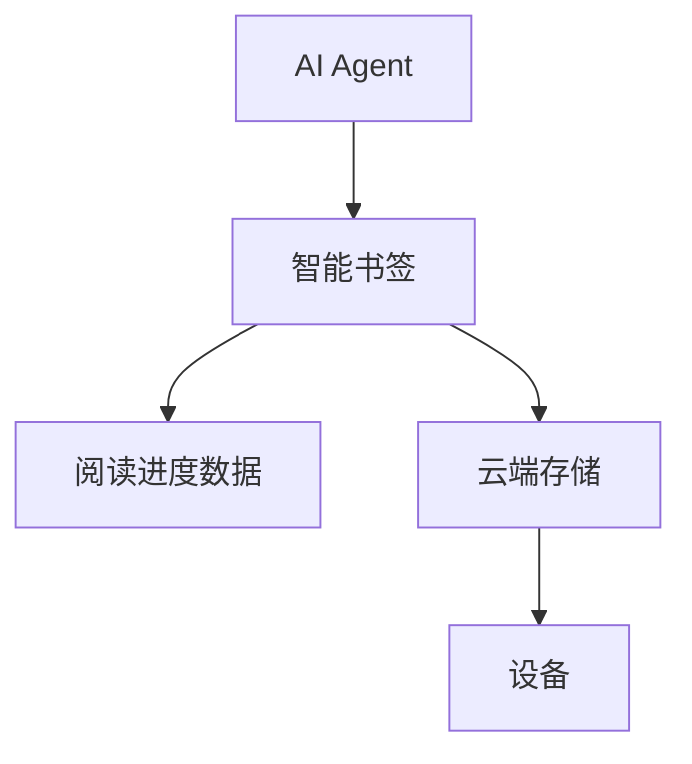
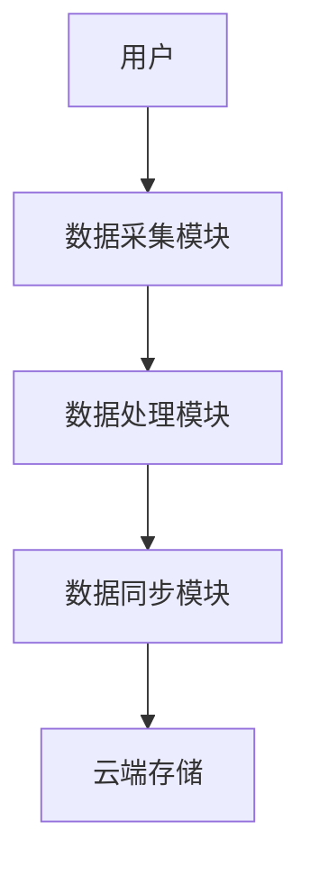

                 


# AI Agent在智能书签中的阅读进度同步

## 关键词：AI Agent、智能书签、阅读进度同步、自然语言处理、系统架构设计

## 摘要：  
本文详细探讨了AI Agent在智能书签中的应用，特别是如何通过AI技术实现阅读进度的同步。文章从AI Agent的基本概念出发，分析其在智能书签中的工作原理，包括同步算法和自然语言处理技术。通过系统架构设计和项目实战，展示了如何实现跨平台的阅读进度同步。最后，讨论了系统优化、实际应用中的挑战与解决方案，并展望了未来的发展方向。

---

## 第一章：AI Agent与智能书签概述

### 1.1 问题背景与描述

#### 1.1.1 阅读进度同步的痛点  
在数字化阅读时代，用户常常在多个设备上阅读同一本书，如手机、平板和电脑。由于缺乏有效的同步机制，用户的阅读进度（如书签位置、笔记和阅读历史）往往无法在不同设备间同步，导致阅读体验碎片化。  

#### 1.1.2 AI Agent的概念与作用  
AI Agent（人工智能代理）是一种能够执行任务的智能程序，通过与用户交互或环境感知，实现自动化服务。在智能书签中，AI Agent负责分析文本内容、识别关键信息，并协调设备间的同步操作。  

#### 1.1.3 智能书签的定义与目标  
智能书签是一种结合了AI技术的数字工具，旨在通过自动化方式管理用户的阅读进度和偏好。其目标是实现跨平台的无缝阅读体验，提升用户的阅读效率和愉悦感。

### 1.2 核心概念与联系

#### 1.2.1 AI Agent的核心概念  
AI Agent具备以下核心特征：  
- **自主性**：能够独立执行任务，无需人工干预。  
- **反应性**：实时感知环境变化并做出响应。  
- **目标导向**：基于用户需求制定行动计划。  

#### 1.2.2 智能书签的功能特点  
智能书签的主要功能包括：  
- 自动记录阅读进度（书签位置、阅读时间）。  
- 智能笔记管理（自动摘要、关键词提取）。  
- 跨平台同步（支持多设备间的进度共享）。  

#### 1.2.3 两者结合的逻辑结构  
通过AI Agent，智能书签能够实现以下功能：  
1. **内容分析**：利用NLP技术提取文本中的关键信息。  
2. **进度同步**：将阅读进度实时同步到云端或多个设备。  
3. **个性化推荐**：基于阅读历史推荐相关内容。  

---

## 第二章：AI Agent的工作原理

### 2.1 核心算法与流程

#### 2.1.1 同步算法的数学模型  
AI Agent通过以下数学模型实现阅读进度的同步：  
$$ \text{同步速度} = \frac{\text{数据传输速率}}{\text{设备间延迟}} $$  
该公式描述了在不同设备间同步数据的效率，设备间的延迟越小，同步速度越快。  

#### 2.1.2 数据处理流程  
以下是AI Agent的阅读进度同步流程：  
1. **数据采集**：从设备中获取阅读进度数据。  
2. **数据解析**：识别文本内容的关键信息。  
3. **数据传输**：将数据传输到云端或目标设备。  
4. **数据存储**：在云端或目标设备中存储数据。  

### 2.2 自然语言处理技术

#### 2.2.1 文本分析方法  
AI Agent采用以下文本分析方法：  
- **关键词提取**：识别文本中的重要词汇。  
- **情感分析**：判断文本的情感倾向。  
- **实体识别**：提取文本中的实体信息。  

#### 2.2.2 关键词提取与匹配  
关键词提取是智能书签的核心功能之一，通过以下步骤实现：  
1. **分词**：将文本分割成词语或短语。  
2. **权重计算**：利用TF-IDF算法计算关键词的重要性。  
3. **匹配**：将关键词与用户需求匹配，提取相关内容。  

---

## 第三章：系统分析与架构设计

### 3.1 领域模型设计

#### 3.1.1 实体关系图  
以下是AI Agent与智能书签之间的实体关系图：  


#### 3.1.2 功能模块划分  
系统主要功能模块包括：  
- **数据采集模块**：负责采集用户的阅读数据。  
- **数据处理模块**：对数据进行分析和处理。  
- **数据同步模块**：实现数据的跨平台同步。  

### 3.2 系统架构设计

#### 3.2.1 分层架构图  
以下是系统的分层架构图：  


#### 3.2.2 接口设计与交互流程  
AI Agent与智能书签之间的交互流程如下：  
1. 用户在设备上进行阅读操作。  
2. 数据采集模块捕获用户的阅读数据。  
3. 数据处理模块对数据进行分析和处理。  
4. 数据同步模块将数据传输到云端或目标设备。  

---

## 第四章：项目实战

### 4.1 环境安装与配置

#### 4.1.1 环境要求  
- **操作系统**：Windows/Mac/Linux  
- **Python版本**：3.6+  
- **依赖库**：numpy、pandas、spacy  

#### 4.1.2 安装步骤  
1. 安装Python和必要的依赖库。  
2. 安装spaCy并下载中文模型：  
   ```bash
   python -m spacy download zh
   ```

### 4.2 核心代码实现

#### 4.2.1 数据采集模块  
以下是数据采集模块的代码示例：  
```python
import spacy

# 加载中文模型
nlp = spacy.load("zh")

# 文本示例
text = "这本书非常有趣，我强烈推荐给所有喜欢人工智能的人。"
doc = nlp(text)

# 提取关键词
keywords = []
for token in doc:
    if token.pos_ in ["NOUN", "ADJ"]:
        keywords.append(token.text)

print(keywords)
```

#### 4.2.2 数据处理模块  
以下是数据处理模块的代码示例：  
```python
import requests
import json

# 提交数据到云端
url = "https://api.example.com/progress"
data = {
    "user_id": "123",
    "book_id": "456",
    "progress": 50
}

response = requests.post(url, json=data)
print(response.status_code)
```

### 4.3 项目小结

通过上述代码示例，我们可以看到AI Agent如何在智能书签中实现阅读进度的同步。数据采集模块负责捕获用户的阅读数据，数据处理模块对数据进行分析和处理，数据同步模块将数据传输到云端或目标设备。整个过程高效且自动化，确保了用户的阅读体验。

---

## 第五章：系统优化与扩展

### 5.1 系统优化

#### 5.1.1 提高同步效率  
通过优化数据传输协议和减少数据冗余，可以提高同步效率。  

#### 5.1.2 处理大规模数据  
使用分布式存储和并行计算技术，可以处理大规模数据。  

### 5.2 功能扩展

#### 5.2.1 多语言支持  
通过集成多语言NLP模型，可以实现多语言阅读进度的同步。  

#### 5.2.2 个性化推荐  
基于用户的阅读历史和偏好，可以实现个性化的内容推荐。  

---

## 第六章：实际应用中的挑战与解决方案

### 6.1 数据隐私与安全  
- **挑战**：用户数据的隐私和安全问题。  
- **解决方案**：采用加密技术和访问控制机制，确保数据的安全性。  

### 6.2 用户体验优化  
- **挑战**：如何提高用户体验。  
- **解决方案**：通过用户反馈和A/B测试，不断优化系统功能。  

---

## 第七章：总结与展望

### 7.1 总结  
通过本文的探讨，我们可以看到AI Agent在智能书签中的应用潜力。AI Agent不仅可以实现阅读进度的同步，还可以通过自然语言处理技术提升用户的阅读体验。  

### 7.2 展望  
未来，随着AI技术的不断发展，智能书签将具备更多功能，如智能化的阅读推荐和个性化的内容生成。  

---

## 最佳实践 Tips  
- 在实现AI Agent时，建议使用高效的算法和优化的数据结构，以提高系统的性能。  
- 在处理大规模数据时，可以采用分布式计算和存储技术，确保系统的可扩展性。  
- 在保护用户隐私方面，建议采用加密技术和访问控制机制，确保数据的安全性。  

---

通过本文的详细探讨，我们可以看到AI Agent在智能书签中的应用前景广阔。希望本文能为读者提供有价值的参考和启发，帮助他们在实际应用中更好地利用AI技术提升阅读体验。

