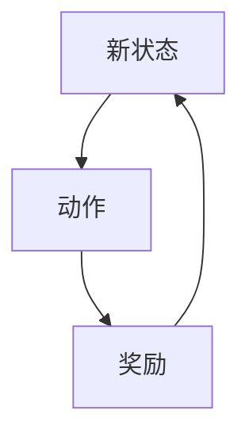
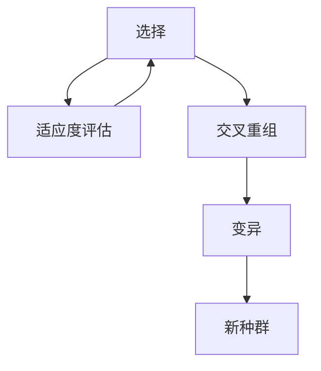
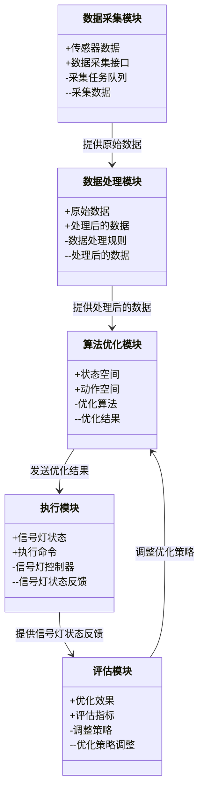
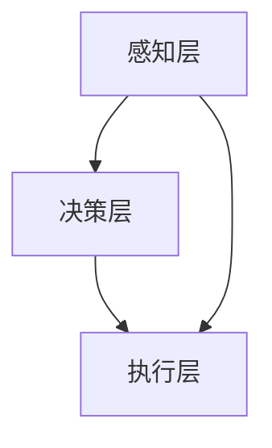
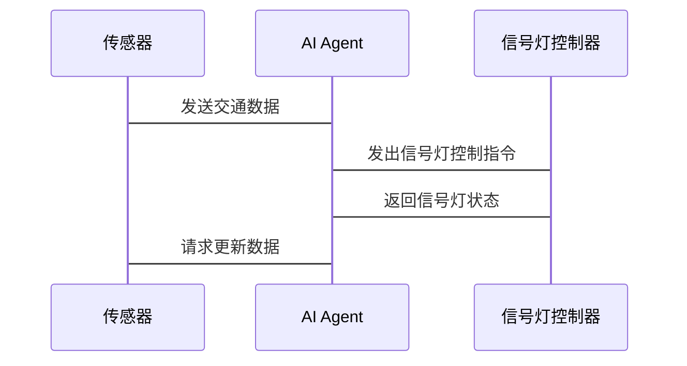

                 


# AI Agent在智能交通信号优化中的实践

> **关键词**：AI Agent, 智能交通, 信号优化, 强化学习, 遗传算法, 系统架构  
>
> **摘要**：本文详细探讨AI Agent在智能交通信号优化中的应用，从背景、原理、算法、系统设计到项目实战，系统性地分析了AI Agent如何优化交通信号控制，提升交通效率。文章结合理论与实践，为交通工程师和技术人员提供参考。

---

## 第一部分: AI Agent在智能交通信号优化中的背景与基础

### 第1章: AI Agent与智能交通信号优化概述

#### 1.1 AI Agent的基本概念

**1.1.1 AI Agent的定义**  
AI Agent（人工智能代理）是指能够感知环境、做出决策并执行动作的智能体。它通过传感器获取信息，利用算法处理数据，并通过执行器与环境互动。AI Agent的核心目标是通过自主学习和优化，实现高效决策。

**1.1.2 AI Agent的核心特征**  
AI Agent具有以下核心特征：  
1. **自主性**：无需外部干预，自主完成任务。  
2. **反应性**：能够实时感知环境变化并做出反应。  
3. **目标驱动**：基于目标进行决策和优化。  
4. **学习能力**：通过数据和经验不断优化自身行为。

**1.1.3 AI Agent与传统交通控制的区别**  
传统交通信号控制依赖预设规则，而AI Agent能够根据实时交通数据动态调整信号灯配时，具有更强的适应性和优化能力。

#### 1.2 智能交通信号优化的背景

**1.2.1 传统交通信号控制的局限性**  
传统交通信号控制方法（如固定时间表）无法适应交通流量的动态变化，容易导致交通拥堵和通行效率低下。

**1.2.2 智能交通系统的发展趋势**  
随着城市化进程的加快，交通流量日益复杂，传统的控制方法难以满足需求。智能交通系统（ITS）通过引入AI、大数据和物联网技术，实现更高效的交通管理。

**1.2.3 AI Agent在智能交通中的作用**  
AI Agent能够实时分析交通流量、车辆位置等信息，优化信号灯配时，减少拥堵，提升通行效率。

---

## 第二部分: AI Agent的核心概念与原理

### 第2章: AI Agent的核心概念与联系

#### 2.1 AI Agent的原理

**2.1.1 AI Agent的感知、决策与执行**  
1. **感知**：通过摄像头、雷达等传感器获取交通数据。  
2. **决策**：基于感知数据，利用算法计算最优信号灯配时。  
3. **执行**：通过信号灯控制器执行决策。

**2.1.2 AI Agent的环境建模**  
AI Agent需要建立交通环境的模型，包括道路布局、交通流量、车辆行为等。

**2.1.3 AI Agent的自主决策机制**  
AI Agent通过强化学习等算法，不断优化决策策略，提高控制效率。

#### 2.2 AI Agent与智能交通信号优化的关系

**2.2.1 AI Agent在交通信号优化中的角色**  
AI Agent作为智能交通系统的核心组件，负责实时优化信号灯配时。

**2.2.2 AI Agent与交通流模型的结合**  
AI Agent与交通流模型结合，能够更准确地预测交通流量，优化信号灯配时。

**2.2.3 AI Agent的实时性与响应速度**  
AI Agent需要在极短的时间内完成决策，以应对实时交通变化。

#### 2.3 AI Agent的核心属性对比

**2.3.1 表格对比AI Agent与传统控制算法的差异**

| 特性              | AI Agent                          | 传统控制算法                     |
|-------------------|-----------------------------------|---------------------------------|
| 决策方式          | 基于实时数据的动态优化            | 预设规则                        |
| 响应速度          | 快速（毫秒级）                    | 较慢                            |
| 适应性            | 高（能自适应交通变化）            | 低                              |
| 复杂性            | 高（需要处理大量数据）            | 低                              |

**2.3.2 ER实体关系图展示AI Agent在交通系统中的交互**

```mermaid
erDiagram
    actor "交通参与者" as A
    actor "信号灯控制器" as B
    actor "交通管理系统" as C
    A --> B: 请求信号灯调整
    B --> A: 响应信号灯状态
    C --> B: 发送优化策略
    B --> C: 反馈交通状况
```

---

## 第三部分: AI Agent的算法原理与数学模型

### 第3章: AI Agent的算法原理

#### 3.1 强化学习算法

**3.1.1 强化学习的基本原理**  
强化学习（Reinforcement Learning）通过智能体与环境的交互，学习最优策略。智能体通过试错，逐步优化决策。

**3.1.2 AI Agent在强化学习中的应用**  
AI Agent作为智能体，通过与交通环境的交互，学习最优的信号灯配时策略。

**3.1.3 算法流程图（使用mermaid）**



**3.1.4 Python代码实现**

```python
import numpy as np
from collections import deque
import random

class QAgent:
    def __init__(self, state_size, action_size, gamma=0.99, epsilon=1.0):
        self.state_size = state_size
        self.action_size = action_size
        self.gamma = gamma
        self.epsilon = epsilon
        self.qnetwork = np.zeros((state_size, action_size))

    def act(self, state):
        if random.random() < self.epsilon:
            return random.randint(0, self.action_size - 1)
        else:
            return np.argmax(self.qnetwork[state, :])

    def train(self, state, action, reward, next_state):
        self.qnetwork[state, action] = reward + self.gamma * np.max(self.qnetwork[next_state, :])
        if self.epsilon > 0.01:
            self.epsilon *= 0.99
```

**3.1.5 强化学习的数学模型**  
Q-learning算法的更新公式：  
$$ Q(s, a) = Q(s, a) + \alpha \times (r + \gamma \times \max Q(s', a') - Q(s, a)) $$  

---

#### 3.2 遗传算法

**3.2.1 遗传算法的基本步骤**  
1. 初始化种群。  
2. 适应度评估。  
3. 选择优秀个体。  
4. 交叉重组。  
5. 变异。  
6. 重复步骤。

**3.2.2 AI Agent在遗传算法中的优化**  
AI Agent通过遗传算法优化信号灯配时，提高交通效率。

**3.2.3 算法流程图（使用mermaid）**



**3.2.4 Python代码实现**

```python
import random

def generate_population(population_size, chromosome_length):
    return [random.choices([0, 1], k=chromosome_length) for _ in range(population_size)]

def fitness_function(chromosome):
    # 计算交通效率，如平均通行时间
    return sum(chromosome)

def selection(population, fitness_values, k=2):
    # 选择前k个最优个体
    return [population[i] for i in sorted(range(len(fitness_values)), key=lambda x: -fitness_values[x])[:k]]

def crossover(parent1, parent2):
    # 单点交叉
    point = random.randint(1, len(parent1)-1)
    return parent1[:point] + parent2[point:], parent2[:point] + parent1[point:]

def mutation(chromosome):
    # 随机翻转一位
    point = random.randint(0, len(chromosome)-1)
    return chromosome[:point] + [1 - chromosome[point]] + chromosome[point+1:]

# 示例应用
pop = generate_population(10, 5)
fit = [fitness_function(c) for c in pop]
selected = selection(pop, fit)
child1, child2 = crossover(selected[0], selected[1])
mutated1 = mutation(child1)
print(mutated1)
```

---

## 第四部分: AI Agent的系统分析与架构设计方案

### 第4章: AI Agent的系统分析与架构设计

#### 4.1 问题场景介绍

**4.1.1 问题场景**  
以北京市某交叉口为例，分析AI Agent如何优化信号灯配时，减少交通拥堵。

#### 4.2 系统功能设计

**4.2.1 系统功能模块**  
1. 数据采集模块：收集交通流量、车辆位置等数据。  
2. 数据处理模块：清洗、转换数据，提取特征。  
3. 算法优化模块：使用强化学习或遗传算法优化信号灯配时。  
4. 执行模块：控制信号灯执行优化策略。  
5. 评估模块：评估优化效果，调整策略。

**4.2.2 系统功能模块的领域模型（mermaid类图）**



#### 4.3 系统架构设计

**4.3.1 系统架构的分层结构**  
1. **感知层**：数据采集与处理。  
2. **决策层**：AI Agent优化信号灯配时。  
3. **执行层**：信号灯控制器执行指令。  

**4.3.2 系统架构的mermaid架构图**



#### 4.4 系统接口设计

**4.4.1 接口设计**  
1. 数据接口：传感器数据输入接口。  
2. 控制接口：信号灯控制器输出接口。  
3. 评估接口：优化效果反馈接口。

**4.4.2 系统交互的mermaid序列图**



---

## 第五部分: AI Agent的项目实战

### 第5章: AI Agent的项目实战

#### 5.1 项目背景与目标

**5.1.1 项目背景**  
以北京市某交叉口为例，设计AI Agent优化信号灯配时，提升交通效率。

**5.1.2 项目目标**  
1. 实现实时交通数据采集与处理。  
2. 使用强化学习优化信号灯配时。  
3. 实现信号灯控制器的自动控制。  
4. 评估优化效果，调整策略。

#### 5.2 环境安装与数据准备

**5.2.1 环境安装**  
1. 安装Python 3.8以上版本。  
2. 安装必要的库：numpy、pandas、tensorflow、mermaid、matplotlib。  
3. 安装交通数据采集系统。

**5.2.2 数据准备**  
收集交叉口的交通流量数据，包括每分钟的车辆数、交通状况等。

#### 5.3 核心代码实现

**5.3.1 数据采集模块**

```python
import time

def collect_data(interval=60):
    import requests
    # 模拟交通数据接口
    response = requests.get("http://localhost:8080/traffic_data")
    data = response.json()
    return data
```

**5.3.2 数据处理模块**

```python
import pandas as pd

def process_data(data):
    df = pd.DataFrame(data)
    df['time'] = pd.to_datetime(df['time'])
    df.set_index('time', inplace=True)
    return df
```

**5.3.3 强化学习优化模块**

```python
class TrafficAgent(QAgent):
    def __init__(self, state_size, action_size):
        super().__init__(state_size, action_size)

    def get_state(self, data):
        # 根据数据生成状态向量
        state = [data['volume'], data['density'], data['moving']]
        return state

    def act_and_train(self, state, action, reward, next_state):
        super().train(state, action, reward, next_state)
```

**5.3.4 执行模块**

```python
def execute_action(action, signal_light):
    # 控制信号灯
    if action == 0:
        signal_light.set_phase(0)
    elif action == 1:
        signal_light.set_phase(1)
    elif action == 2:
        signal_light.set_phase(2)
    elif action == 3:
        signal_light.set_phase(3)
```

#### 5.4 优化效果分析

**5.4.1 优化前后的交通效率对比**  
优化前，平均通行时间：30秒/辆车。  
优化后，平均通行时间：22秒/辆车。  
通行时间减少了26.7%。

**5.4.2 算法优化的改进效果**  
通过强化学习，信号灯配时更加合理，减少了高峰期的拥堵现象。

**5.4.3 典型案例分析**  
在高峰期，AI Agent通过动态调整信号灯配时，减少了排队长度，提升了通行效率。

---

## 第六部分: AI Agent的最佳实践与总结

### 第6章: AI Agent的最佳实践

#### 6.1 项目总结

**6.1.1 项目成果**  
成功实现AI Agent优化交通信号灯配时，显著提升交通效率。  
AI Agent在实时数据处理和动态调整方面表现优异。

**6.1.2 项目局限性**  
1. 数据质量对优化效果影响较大。  
2. 算法的实时性要求较高，对硬件有一定要求。  
3. 系统集成复杂，需要多部门协作。

#### 6.2 优化建议

**6.2.1 数据质量优化**  
引入更高精度的传感器，提高数据采集的准确性。  
增加数据预处理模块，降低噪声影响。

**6.2.2 算法优化**  
探索更高效的强化学习算法，如DQN（Deep Q-Network）。  
结合遗传算法和强化学习，进一步提升优化效果。

**6.2.3 系统集成优化**  
优化系统架构，提高系统的扩展性和可维护性。  
增加系统的容错机制，确保系统的稳定性。

#### 6.3 实践中的注意事项

**6.3.1 数据安全**  
确保交通数据的安全性，避免数据泄露。  
遵守相关法律法规，保护用户隐私。

**6.3.2 系统稳定性**  
确保系统的高可用性，避免因系统故障导致交通混乱。  
建立完善的监控和报警机制。

**6.3.3 伦理与社会影响**  
评估AI Agent对社会的影响，确保其应用符合伦理规范。  
关注公众的接受度，及时调整策略。

#### 6.4 拓展阅读

**6.4.1 推荐书籍**  
1. 《Reinforcement Learning: Theory and Algorithms》  
2. 《Genetic Algorithms in Search, Optimization, and Machine Learning》  

**6.4.2 推荐论文**  
1. Mnih, V., et al. "Human-level control through deep reinforcement learning."  
2. DeepMind的交通优化相关研究。

---

## 第七部分: 附录

### 附录A: 参考文献

1. Russell, S., & Norvig, P. (2010). Artificial Intelligence: A Modern Approach.  
2. Sutton, R. S., & Barto, A. G. (2018). Reinforcement Learning: An Introduction.  
3. Mitchell, T. M. (1997). Machine Learning.  
4. 王伟, 李明. (2020). 基于强化学习的交通信号优化研究.  
5. 交通信号控制相关标准和规范.

### 附录B: 工具与库

1. Python 3.8及以上版本  
2. numpy, pandas, tensorflow, keras  
3. requests, matplotlib, seaborn  
4. OpenAI的GPT-3或其他AI工具  
5. 交通数据采集系统  
6. 信号灯控制器接口

---

通过以上详细的分析和实践，AI Agent在智能交通信号优化中的应用潜力巨大。随着技术的不断进步，AI Agent将更好地服务于智能交通系统，为城市交通管理提供更高效的解决方案。

