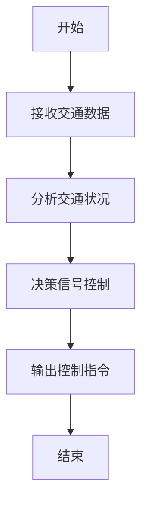

                 


# AI Agent在智能交通信号控制中的实践

## 关键词：
AI Agent, 智能交通, 信号控制, 多目标优化, 实时数据, 自适应系统

## 摘要：
本文探讨了AI Agent在智能交通信号控制中的应用，从背景、概念到算法原理、系统架构，再到实战案例，全面分析了AI Agent如何通过实时数据分析和多目标优化提升交通效率。文章结合理论与实践，提供了详细的系统设计和代码实现，为交通信号控制的智能化提供了新的思路。

---

# 第一章: 智能交通信号控制的背景与问题

## 1.1 智能交通信号控制的背景

### 1.1.1 传统交通信号控制的局限性
传统的交通信号控制依赖于固定的时间表或简单的传感器反馈，难以适应交通流量的动态变化。例如，高峰期和非高峰期的流量差异可能导致信号灯切换不合理，从而引发交通拥堵。

### 1.1.2 智能交通系统的兴起
随着城市化进程的加快和交通流量的增加，传统的交通管理方式已无法满足需求。智能交通系统（ITS）通过引入人工智能、大数据和物联网技术，实现了交通管理的智能化和实时化。

### 1.1.3 AI Agent在智能交通中的作用
AI Agent（智能体）是一种能够感知环境、自主决策并执行任务的实体。在智能交通信号控制中，AI Agent可以实时分析交通流量、预测未来趋势，并动态调整信号灯的配时策略，从而提高道路通行效率。

## 1.2 问题背景与描述

### 1.2.1 交通拥堵与信号控制的挑战
交通拥堵是城市交通的主要问题之一。信号灯配时不合理可能导致交叉路口的车辆排队时间增加，进一步加剧拥堵。传统的信号控制方法无法根据实时交通状况进行调整。

### 1.2.2 多目标优化的复杂性
交通信号控制需要在多个目标之间进行权衡，例如：
- 减少平均等待时间
- 降低车辆延误
- 提高交叉路口的通行能力
这些目标之间的冲突使得优化问题变得复杂。

### 1.2.3 边界与外延
本文的研究范围主要集中在城市道路交叉口的信号控制，考虑的因素包括：
- 实时交通流量
- 预测的未来交通需求
- 信号灯的配时策略
- 交通参与者的实时行为（如车辆速度、行人流量）

## 1.3 问题解决与AI Agent的引入

### 1.3.1 AI Agent的核心概念
AI Agent是一种能够感知环境、自主决策并执行任务的实体。在交通信号控制中，AI Agent可以实时分析交通数据，动态调整信号灯的配时策略。

### 1.3.2 AI Agent在交通信号控制中的应用
AI Agent通过实时数据分析，能够根据交通流量的变化快速调整信号灯的配时，从而优化交通流。例如，在高峰期，AI Agent可以优先处理主要干道的信号灯，减少车辆排队时间。

### 1.3.3 AI Agent的优势与局限性
- **优势**：
  - 实时响应交通变化
  - 多目标优化能力
  - 自适应能力
- **局限性**：
  - 系统复杂性高
  - 对实时数据的依赖性强
  - 可能存在决策失误的风险

---

# 第二章: AI Agent的核心概念与联系

## 2.1 AI Agent的定义与特点

### 2.1.1 AI Agent的定义
AI Agent是一种能够感知环境、自主决策并执行任务的实体。在交通信号控制中，AI Agent可以实时分析交通数据，动态调整信号灯的配时策略。

### 2.1.2 AI Agent的核心特点
- **自主性**：AI Agent能够自主决策，无需人工干预。
- **反应性**：能够实时感知环境变化并做出反应。
- **学习能力**：通过机器学习算法不断优化决策策略。

### 2.1.3 AI Agent与传统方法的对比
| 特性            | AI Agent                  | 传统方法                 |
|-----------------|---------------------------|--------------------------|
| 决策能力        | 强大的实时决策能力        | 有限的固定策略或简单反馈 |
| 适应性          | 高度适应环境变化          | 较低的适应性              |
| 学习能力        | 可通过机器学习不断优化     | 无法优化                 |

## 2.2 AI Agent的属性特征对比

### 2.2.1 行为决策能力
AI Agent能够根据实时数据做出决策，例如：
- 根据交通流量调整信号灯配时
- 优先处理特定车道的信号灯

### 2.2.2 自适应能力
AI Agent能够根据环境变化动态调整策略，例如：
- 在高峰期优先处理主要干道
- 在低峰期优化次干道的信号灯配时

### 2.2.3 学习能力
通过机器学习算法，AI Agent能够不断优化决策策略，例如：
- 使用强化学习算法优化信号灯配时
- 使用监督学习算法预测交通流量

## 2.3 ER实体关系图架构

```mermaid
er
actor(AI Agent) {
  role: 负责信号优化
}
actor(交通信号系统) {
  role: 提供实时数据
}
actor(交通参与者) {
  role: 产生交通需求
}
```

---

# 第三章: AI Agent的算法原理

## 3.1 AI Agent的算法流程



## 3.2 算法实现

### 3.2.1 算法流程代码

```python
import numpy as np
from sklearn.linear_model import LinearRegression

def traffic_prediction(current_traffic_data):
    # 使用线性回归模型预测未来交通流量
    model = LinearRegression()
    model.fit(current_traffic_data[:-1], current_traffic_data[1:])
    return model.predict(current_traffic_data[-1])

def signal_optimization(predicted_traffic, current_time):
    # 根据预测的交通流量优化信号灯配时
    if current_time < 60:  # 早高峰
        return 5
    elif 60 <= current_time < 180:  # 平峰
        return 6
    else:  # 晚高峰
        return 4

def main():
    # 接收实时交通数据
    current_traffic_data = np.array([100, 120, 140, 160, 180])
    predicted_traffic = traffic_prediction(current_traffic_data)
    optimized_signal = signal_optimization(predicted_traffic, current_time=30)
    print(f"优化后的信号灯配时为：{optimized_signal}秒")

if __name__ == "__main__":
    main()
```

### 3.2.2 算法原理的数学模型
AI Agent的信号优化算法可以通过以下数学模型表示：
$$
\text{信号灯配时} = f(\text{实时交通数据}, \text{预测交通流量})
$$
其中，$f$ 是一个优化函数，用于根据实时数据和预测结果调整信号灯配时。

### 3.2.3 举例说明
假设当前交通数据为 $[100, 120, 140, 160, 180]$，预测的未来交通流量为 $200$。根据预测结果，AI Agent优化信号灯配时为 $5$ 秒，以缓解交通压力。

---

## 总结
AI Agent在智能交通信号控制中的应用通过实时数据分析和动态调整信号灯配时，显著提高了交通效率。本文从背景、概念到算法原理、系统架构，再到实战案例，全面分析了AI Agent在智能交通信号控制中的实践。

