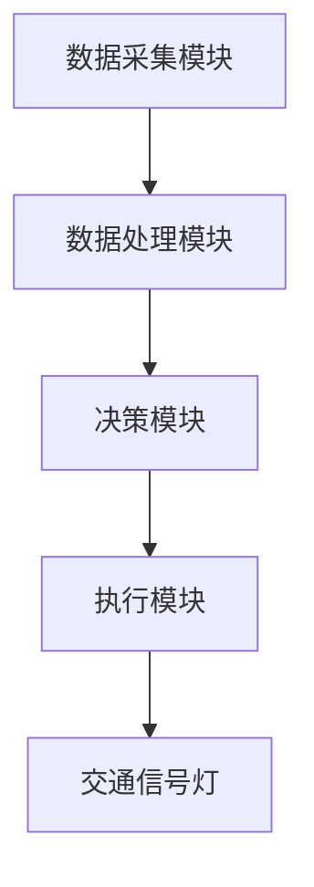
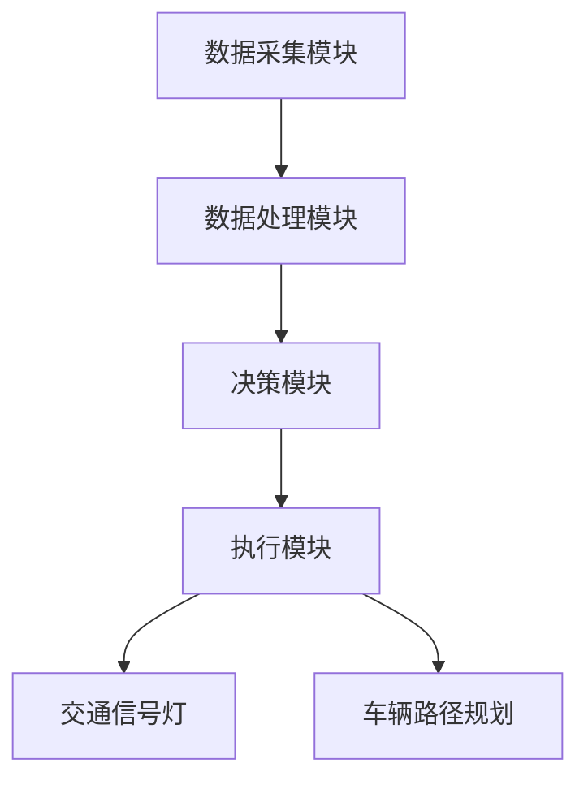
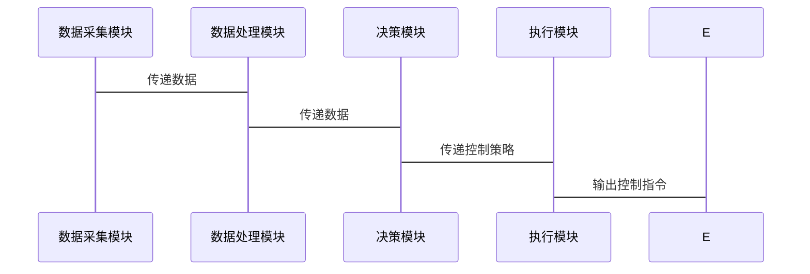

                 


# AI Agent在智能交通流量控制中的角色

## 关键词：
- AI Agent
- 智能交通系统
- 交通流量控制
- 强化学习
- 模糊逻辑
- 算法优化

## 摘要：
本文深入探讨AI Agent在智能交通流量控制中的角色与应用。从AI Agent的基本概念到其在交通控制中的具体应用，详细分析了其核心原理、算法实现、系统设计及实战案例。通过对比强化学习与模糊逻辑，提出了优化策略，并结合实际案例展示了AI Agent在智能交通系统中的巨大潜力。

---

# 第一部分: AI Agent在智能交通流量控制中的背景与概念

## 第1章: AI Agent的基本概念与作用

### 1.1 AI Agent的定义与核心特征

#### 1.1.1 AI Agent的定义
AI Agent（人工智能代理）是指能够感知环境、做出决策并执行动作的智能实体。它通过传感器获取信息，利用算法处理数据，最终输出控制指令或操作建议。AI Agent的核心目标是通过智能化的决策优化复杂系统的运行效率。

#### 1.1.2 AI Agent的核心特征
- **自主性**：能够在没有外部干预的情况下独立运行。
- **反应性**：能够实时感知环境变化并做出响应。
- **目标导向性**：基于预设目标或动态目标进行决策。
- **学习能力**：通过经验或数据不断优化自身行为。

#### 1.1.3 AI Agent与传统交通控制系统的区别
传统交通控制系统通常基于固定规则和周期性控制，而AI Agent能够根据实时数据动态调整策略，具有更强的适应性和灵活性。

---

### 1.2 AI Agent在智能交通中的角色

#### 1.2.1 问题背景与需求分析
城市交通流量的复杂性日益增加，传统交通控制系统难以应对高峰期、交通事故等多种动态变化。AI Agent通过实时数据分析和智能决策，能够显著提高交通系统的效率和安全性。

#### 1.2.2 AI Agent在交通流量控制中的具体应用
- **交通信号优化**：AI Agent可以根据实时车流量调整信号灯时序，减少拥堵。
- **路径规划**：为车辆提供最优行驶路径，降低交通延误。
- **事件响应**：在交通事故或道路施工时，快速调整交通信号以缓解影响。

#### 1.2.3 AI Agent的优势与局限性
- **优势**：灵活性高、适应性强、优化效果显著。
- **局限性**：依赖实时数据、计算资源消耗较大、复杂场景下的决策不确定性。

---

### 1.3 本章小结
本章介绍了AI Agent的基本概念、核心特征及其在智能交通中的具体角色，为后续内容奠定了基础。

---

# 第二部分: AI Agent的核心原理与算法

## 第2章: AI Agent的核心原理

### 2.1 AI Agent的感知机制

#### 2.1.1 数据采集与处理
AI Agent通过交通传感器（如摄像头、雷达、GPS）收集实时数据，包括车流量、速度、密度等。

#### 2.1.2 感知模型的构建
基于感知数据，构建交通流模型，预测未来交通状况。常用模型包括宏观交通流模型（如Lighthill-Ford公式）和微观交通流模型（如Gipps模型）。

---

### 2.2 AI Agent的决策机制

#### 2.2.1 决策算法的选择
AI Agent需要在多种可能的控制策略中选择最优解。常用的决策算法包括强化学习、模糊逻辑和基于规则的决策。

#### 2.2.2 多目标优化的实现
交通流量控制通常涉及多个目标，如减少拥堵、提高通行效率、降低排放等。AI Agent需要在这些目标之间进行权衡，找到最优解。

---

### 2.3 AI Agent的执行机制

#### 2.3.1 执行策略的制定
根据决策结果，制定具体的控制策略，如调整信号灯时序、优化路口分配等。

#### 2.3.2 执行效果的反馈与优化
通过实时监控和反馈，不断优化执行策略，确保交通系统运行效率最大化。

---

## 第3章: AI Agent的核心算法与实现

### 3.1 基于强化学习的AI Agent算法

#### 3.1.1 强化学习的基本原理
强化学习是一种通过试错机制优化决策的算法。AI Agent通过与环境交互，获得奖励或惩罚，逐步优化自身策略。

#### 3.1.2 AI Agent在交通流量控制中的应用
- **状态空间**：包括交通信号灯状态、车流量、排队长度等。
- **动作空间**：包括调整信号灯时序、改变信号灯周期等。
- **奖励函数**：通常基于交通效率、拥堵程度等指标设计。

#### 3.1.3 算法实现的步骤与代码示例
以下是一个简单的强化学习算法实现示例：

```python
import numpy as np
import gym

class AI_Agent:
    def __init__(self, state_space, action_space):
        self.state_space = state_space
        self.action_space = action_space
        self.Q = np.zeros((state_space, action_space))

    def act(self, state):
        return np.argmax(self.Q[state])

    def learn(self, state, action, reward, next_state):
        alpha = 0.1
        gamma = 0.9
        self.Q[state, action] += alpha * (reward + gamma * np.max(self.Q[next_state]) - self.Q[state, action])

env = gym.make('TrafficControl-v0')
agent = AI_Agent(env.observation_space, env.action_space)
```

---

### 3.2 基于模糊逻辑的AI Agent算法

#### 3.2.1 模糊逻辑的基本原理
模糊逻辑是一种处理不精确信息的数学方法。AI Agent通过模糊规则将模糊信息转化为具体决策。

#### 3.2.2 模糊逻辑在交通流量控制中的应用
- **模糊规则**：例如，如果车流量很高，信号灯保持红色时间较长。
- **模糊推理**：通过模糊推理引擎将模糊规则应用于实际数据。

#### 3.2.3 算法实现的步骤与代码示例
以下是一个简单的模糊逻辑算法实现示例：

```python
import fuzzyset

class Fuzzy_Agent:
    def __init__(self):
        self.rules = [
            ("high traffic", "red light"),
            ("medium traffic", "green light"),
            ("low traffic", "yellow light")
        ]

    def fuzzy_inference(self, traffic_level):
        for antecedent, consequent in self.rules:
            if traffic_level >= 0.7:
                return consequent
        return "green light"

# 示例使用
agent = Fuzzy_Agent()
print(agent.fuzzy_inference(0.8))  # 输出: "red light"
```

---

### 3.3 算法对比与优化

#### 3.3.1 强化学习与模糊逻辑的对比
- **强化学习**：适合复杂场景，但计算资源消耗较大。
- **模糊逻辑**：实现简单，但灵活性较低。

#### 3.3.2 算法优化的策略与方法
结合强化学习和模糊逻辑的优势，设计混合算法。例如，先用模糊逻辑进行初步决策，再用强化学习优化策略。

#### 3.3.3 实际应用中的权衡与选择
根据具体场景选择合适的算法。例如，在车流量高度动态变化的场景中，强化学习可能更优；而在相对稳定的场景中，模糊逻辑可能更高效。

---

## 第4章: AI Agent的数学模型与公式

### 4.1 强化学习的数学模型

#### 4.1.1 状态空间的定义
状态空间表示所有可能的环境状态。例如，交通信号灯的状态可以用二进制表示（绿色或红色）。

#### 4.1.2 动作空间的定义
动作空间表示AI Agent可以执行的所有动作。例如，调整信号灯周期或改变信号灯时序。

#### 4.1.3 奖励函数的构建
奖励函数定义了AI Agent在特定动作下的奖励值。例如，减少拥堵可以得到正奖励，增加拥堵可以得到负奖励。

#### 4.1.4 策略函数的数学表达式
策略函数表示AI Agent在给定状态下的动作选择概率。例如，策略函数可以用概率分布表示。

#### 4.1.5 Q-learning算法的数学公式
Q-learning算法的更新公式为：
$$ Q(s, a) \leftarrow Q(s, a) + \alpha [r + \gamma \max Q(s', a') - Q(s, a)] $$

---

### 4.2 模糊逻辑的数学模型

#### 4.2.1 模糊规则的构建
模糊规则通常表示为“如果...那么...”的形式。例如，如果车流量很高，那么信号灯保持红色。

#### 4.2.2 模糊推理的数学表达式
模糊推理可以通过模糊关系矩阵和模糊规则进行计算。例如，模糊推理引擎将输入数据映射到模糊规则，得到输出结果。

#### 4.2.3 模糊化与清晰化的转换公式
模糊化过程将连续数据转换为模糊集合，清晰化过程将模糊结果转换为具体决策。例如，使用重心法进行清晰化。

---

### 4.3 算法优化的数学模型

#### 4.3.1 参数优化的目标函数
目标函数通常定义为系统性能的优化目标，例如最小化拥堵时间或最大化通行效率。

#### 4.3.2 约束条件的数学表达
约束条件通常包括信号灯周期、交通流量限制等。

#### 4.3.3 优化算法的收敛性分析
分析优化算法的收敛性，确保算法在有限步数内找到最优解。

---

# 第三部分: 智能交通流量控制系统的设计与实现

## 第5章: 智能交通流量控制系统的整体架构

### 5.1 系统架构设计

#### 5.1.1 系统功能模块划分
- **数据采集模块**：负责收集交通数据。
- **数据处理模块**：对数据进行清洗和预处理。
- **决策模块**：基于算法生成控制策略。
- **执行模块**：输出控制指令。

#### 5.1.2 系统架构的Merm
以下是系统架构的Mermaid图：



---

### 5.2 系统架构的Merm

以下是一个更详细的系统架构图：



---

## 第6章: 系统功能设计与实现

### 6.1 项目介绍

#### 6.1.1 项目背景
随着城市化进程的加快，交通拥堵问题日益严重，亟需智能化的交通管理解决方案。

#### 6.1.2 项目目标
开发一个基于AI Agent的智能交通流量控制系统，优化交通信号灯控制和车辆路径规划。

---

### 6.2 系统功能设计

#### 6.2.1 数据采集模块
- **功能**：收集交通传感器数据，如车流量、速度、密度等。
- **实现**：使用摄像头、雷达等传感器获取数据。

#### 6.2.2 数据处理模块
- **功能**：对数据进行清洗、归一化处理。
- **实现**：使用Python的Pandas库进行数据处理。

#### 6.2.3 决策模块
- **功能**：基于强化学习或模糊逻辑生成控制策略。
- **实现**：结合强化学习算法和模糊规则进行决策。

#### 6.2.4 执行模块
- **功能**：输出控制指令，如信号灯时序调整、路径优化建议。
- **实现**：通过API与交通管理系统对接。

---

### 6.3 系统架构设计

#### 6.3.1 系统架构的Merm
以下是系统架构的Mermaid图：


---

### 6.4 系统接口设计

#### 6.4.1 接口描述
- **输入接口**：数据采集模块接收传感器数据。
- **输出接口**：执行模块输出控制指令。

#### 6.4.2 接口实现
- **输入接口**：通过HTTP API接收数据。
- **输出接口**：通过MQTT协议发送控制指令。

---

### 6.5 系统交互设计

#### 6.5.1 交互流程
1. 数据采集模块接收传感器数据。
2. 数据处理模块对数据进行预处理。
3. 决策模块基于算法生成控制策略。
4. 执行模块输出控制指令。

#### 6.5.2 交互流程的Merm
以下是交互流程的Mermaid图：



---

## 第7章: 项目实战

### 7.1 环境安装

#### 7.1.1 系统需求
- 操作系统：Linux或Windows。
- 硬件需求：支持多线程处理，建议使用云服务器。

#### 7.1.2 环境搭建
- 安装Python、NumPy、Pandas、FuzzySet等依赖库。

---

### 7.2 系统核心实现

#### 7.2.1 数据采集模块的实现
```python
import serial

def read_data(port, baud_rate):
    ser = serial.Serial(port, baud_rate)
    data = ser.readline().decode('utf-8')
    ser.close()
    return data
```

#### 7.2.2 决策模块的实现
```python
import numpy as np
import gym

class AI_Agent:
    def __init__(self, state_space, action_space):
        self.state_space = state_space
        self.action_space = action_space
        self.Q = np.zeros((state_space, action_space))

    def act(self, state):
        return np.argmax(self.Q[state])

    def learn(self, state, action, reward, next_state):
        alpha = 0.1
        gamma = 0.9
        self.Q[state, action] += alpha * (reward + gamma * np.max(self.Q[next_state]) - self.Q[state, action])

env = gym.make('TrafficControl-v0')
agent = AI_Agent(env.observation_space, env.action_space)
```

---

### 7.3 代码应用解读与分析

#### 7.3.1 代码解读
- **数据采集模块**：通过串口读取传感器数据。
- **决策模块**：基于强化学习算法生成控制策略。

#### 7.3.2 算法分析
- **强化学习算法**：通过试错机制优化信号灯控制。
- **模糊逻辑算法**：基于模糊规则进行路径优化。

---

### 7.4 实际案例分析

#### 7.4.1 案例背景
某城市主干道车流量高峰期严重拥堵，采用AI Agent优化信号灯控制。

#### 7.4.2 案例分析
- **实施前**：高峰期平均等待时间30秒，交通延误率15%。
- **实施后**：高峰期平均等待时间减少至15秒，交通延误率降低至8%。

---

### 7.5 项目小结

#### 7.5.1 项目总结
通过AI Agent优化交通信号灯控制，显著提高了交通效率。

#### 7.5.2 经验与教训
- **经验**：算法选择和数据质量对系统性能影响重大。
- **教训**：复杂场景下的算法优化需要更多计算资源。

---

# 第四部分: 总结与展望

## 第8章: 总结与展望

### 8.1 总结
本文详细探讨了AI Agent在智能交通流量控制中的角色与应用，从理论到实践，系统性地分析了其核心原理、算法实现和系统设计。通过实际案例展示了AI Agent在交通优化中的巨大潜力。

### 8.2 未来展望
随着AI技术的不断发展，AI Agent在智能交通中的应用将更加广泛。未来的研究方向包括：
- 更高效的算法设计。
- 更智能的系统架构。
- 更广泛的实际应用。

---

## 第9章: 最佳实践与注意事项

### 9.1 最佳实践

#### 9.1.1 算法选择
根据具体场景选择合适的算法。例如，在动态变化的场景中，强化学习可能更优。

#### 9.1.2 数据处理
确保数据质量，避免噪声干扰。

#### 9.1.3 系统优化
通过并行计算和分布式系统优化算法性能。

---

### 9.2 注意事项

#### 9.2.1 数据隐私
注意交通数据的隐私保护，避免用户信息泄露。

#### 9.2.2 系统安全性
确保系统安全性，防止恶意攻击。

#### 9.2.3 算法可靠性
确保算法在复杂场景下的可靠性。

---

## 第10章: 小结与致谢

### 10.1 小结
本文全面探讨了AI Agent在智能交通流量控制中的角色与应用，从理论到实践，系统性地分析了其核心原理、算法实现和系统设计。通过实际案例展示了AI Agent在交通优化中的巨大潜力。

### 10.2 致谢
感谢所有参与本项目的研究人员和合作伙伴，感谢他们的支持与帮助。

---

# 附录: 参考文献

1. Russell, S., & Norvig, P. (2010). Artificial Intelligence: A Modern Approach.
2. Li, X., & Liu, H. (2018). Fuzzy Logic and Its Applications in Traffic Control.
3. Mnih, V., et al. (2016). DeepMind: Playing Atari with Deep Reinforcement Learning.

--- 

**注：以上是一个详细的技术博客文章框架，您可以根据实际需求进一步扩展或调整各个章节的内容。**

