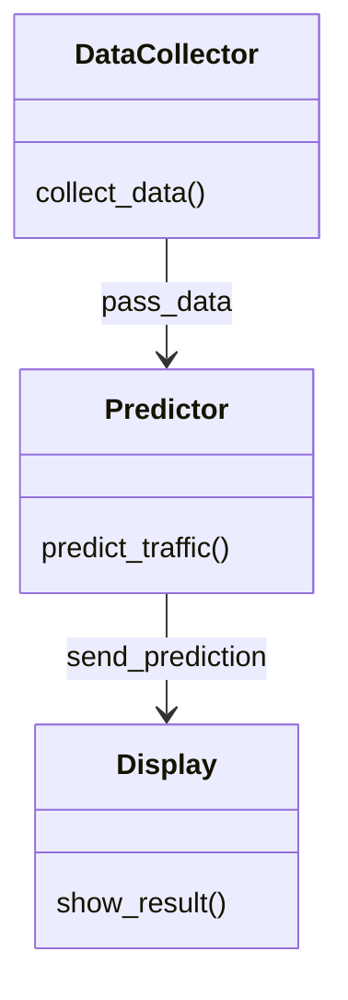
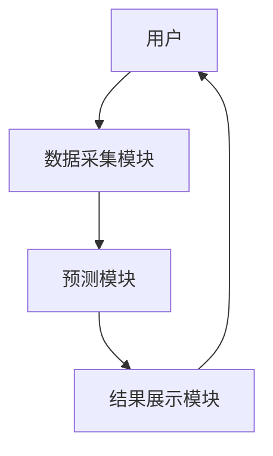

                 


# AI Agent在智能交通流量预测中的实践

> 关键词：AI Agent，智能交通，流量预测，强化学习，神经网络，系统架构

> 摘要：本文详细探讨了AI Agent在智能交通流量预测中的应用实践。通过分析AI Agent的核心概念、算法原理、系统架构以及项目实战，展示了如何利用AI技术优化交通流量预测，解决城市交通拥堵问题。文章结合理论与实践，为交通管理部门和技术开发者提供了有益的参考。

---

# 第一部分: AI Agent与智能交通流量预测的背景与概念

## 第1章: AI Agent与交通流量预测的背景介绍

### 1.1 AI Agent的基本概念

#### 1.1.1 AI Agent的定义与特点
AI Agent（人工智能代理）是指能够感知环境、自主决策并执行任务的智能实体。它具备以下特点：
- **自主性**：无需外部干预，自主完成任务。
- **反应性**：能够实时感知环境并做出反应。
- **目标导向**：基于目标驱动行为。
- **学习能力**：通过数据和经验优化决策。

#### 1.1.2 AI Agent的核心要素与功能
AI Agent的核心要素包括感知模块、决策模块和执行模块：
- **感知模块**：通过传感器或数据源获取环境信息。
- **决策模块**：基于感知信息进行分析和决策。
- **执行模块**：根据决策结果执行操作。

#### 1.1.3 AI Agent与传统算法的区别
AI Agent与传统算法的区别在于其自主性和适应性。传统算法基于固定的规则执行任务，而AI Agent能够根据环境变化动态调整行为。

### 1.2 交通流量预测的背景与挑战

#### 1.2.1 交通流量预测的定义与应用场景
交通流量预测是指通过数据分析和建模，预测未来某一时间段内交通网络中的流量情况。其应用场景包括：
- **交通管理**：优化信号灯控制，减少拥堵。
- **交通规划**：辅助城市道路设计和扩建规划。
- **自动驾驶**：帮助车辆做出更智能的行驶决策。

#### 1.2.2 传统交通流量预测方法的局限性
传统方法（如时间序列分析）存在以下局限性：
- **数据依赖性**：需要大量历史数据支持。
- **模型静态性**：难以适应动态变化的交通环境。
- **预测精度有限**：在复杂场景下预测精度较低。

#### 1.2.3 AI Agent在交通流量预测中的优势
AI Agent的优势体现在其智能性和适应性：
- **实时性**：能够实时感知和响应交通变化。
- **自适应性**：通过学习不断优化预测模型。
- **全局优化**：能够在复杂环境中做出全局最优决策。

### 1.3 AI Agent在交通流量预测中的问题背景

#### 1.3.1 问题描述与目标
交通流量预测的目标是通过AI Agent实现高精度、实时的流量预测，从而优化交通管理。

#### 1.3.2 问题解决的思路与方法
AI Agent通过以下方式解决交通流量预测问题：
- **数据采集**：实时采集交通流量数据。
- **模型训练**：基于历史数据训练预测模型。
- **动态调整**：根据实时数据动态优化预测结果。

#### 1.3.3 问题的边界与外延
交通流量预测的边界包括：
- 数据范围：仅限于特定区域的交通数据。
- 时间范围：预测未来一定时间段内的流量。
- 环境假设：假设交通环境在预测期间内不会发生重大变化。

### 1.4 本章小结
本章介绍了AI Agent的基本概念及其在交通流量预测中的应用背景，指出了传统方法的局限性和AI Agent的优势。

---

# 第二部分: AI Agent与交通流量预测的核心概念与联系

## 第2章: AI Agent与交通流量预测的核心概念

### 2.1 AI Agent的原理与实现机制

#### 2.1.1 AI Agent的决策过程
AI Agent的决策过程包括以下步骤：
1. **感知环境**：通过传感器或数据源获取环境信息。
2. **分析信息**：利用算法对信息进行处理和分析。
3. **制定决策**：基于分析结果做出决策。
4. **执行操作**：根据决策结果执行操作。

#### 2.1.2 AI Agent的学习与优化机制
AI Agent通过强化学习或监督学习不断优化自身的预测能力。强化学习通过奖励机制调整决策策略，监督学习则通过标注数据进行模型训练。

#### 2.1.3 AI Agent的通信与协作
AI Agent之间可以通过通信模块进行协作，共同完成复杂的预测任务。例如，多个AI Agent可以协同工作，分别负责不同的交通区域，最终整合预测结果。

### 2.2 交通流量预测的数学模型与算法

#### 2.2.1 时间序列分析的基本原理
时间序列分析是一种常用的交通流量预测方法，通过分析历史数据的规律，预测未来的变化趋势。

#### 2.2.2 神经网络在交通流量预测中的应用
神经网络（如LSTM）能够捕捉时间序列中的复杂模式，适用于交通流量预测。

#### 2.2.3 强化学习在交通流量预测中的作用
强化学习通过模拟交通环境，训练AI Agent做出最优决策。

### 2.3 AI Agent与交通流量预测的关系

#### 2.3.1 AI Agent在交通流量预测中的角色
AI Agent作为预测系统的主体，负责数据处理、模型训练和决策执行。

#### 2.3.2 AI Agent与交通流量预测系统的交互
AI Agent通过与交通管理系统交互，实时获取数据并反馈预测结果。

#### 2.3.3 AI Agent对交通流量预测的优化作用
AI Agent通过自适应学习和动态调整，显著提高了预测的准确性和实时性。

### 2.4 本章小结
本章深入分析了AI Agent的原理及其在交通流量预测中的作用，揭示了两者之间的内在联系。

---

# 第三部分: AI Agent在交通流量预测中的算法原理

## 第3章: AI Agent的算法原理

### 3.1 基于强化学习的AI Agent算法

#### 3.1.1 强化学习的基本原理
强化学习通过智能体与环境的交互，学习最优策略。智能体通过试错不断优化决策。

#### 3.1.2 AI Agent在交通流量预测中的强化学习模型
在交通流量预测中，强化学习用于优化预测策略，例如通过调整权重参数，提高预测精度。

#### 3.1.3 强化学习算法的数学公式与实现
强化学习的核心公式包括：
- **Q-learning公式**：$Q(s, a) = r + \gamma \max_{a'} Q(s', a')$
- **策略梯度公式**：$\nabla \theta J(\theta) = \mathbb{E}[\nabla \log \pi(a|s) Q(s,a)]$

### 3.2 基于神经网络的交通流量预测算法

#### 3.2.1 神经网络的基本原理
神经网络通过多层感知机（MLP）或循环神经网络（RNN）结构，学习数据的特征表示。

#### 3.2.2 AI Agent在交通流量预测中的神经网络模型
AI Agent可以使用LSTM网络进行时间序列预测，捕捉交通流量的时序特性。

#### 3.2.3 神经网络算法的数学模型
LSTM的长时记忆网络结构：
- **输入门**：$f_t = \sigma(W_f x_t + U_f h_{t-1} + b_f)$
- **遗忘门**：$i_t = \sigma(W_i x_t + U_i h_{t-1} + b_i)$
- **输出门**：$o_t = \sigma(W_o x_t + U_o h_{t-1} + b_o)$
- **候选细胞**：$g_t = \tanh(W_g x_t + U_g h_{t-1} + b_g)$
- **当前状态**：$h_t = f_t \cdot h_{t-1} + i_t \cdot g_t$

### 3.3 AI Agent的优化算法

#### 3.3.1 参数优化方法
常用优化算法包括随机梯度下降（SGD）和Adam优化器。

#### 3.3.2 模型优化策略
通过数据增强、模型正则化和早停技术，防止过拟合。

### 3.4 本章小结
本章详细介绍了AI Agent的算法原理，包括强化学习和神经网络的实现细节。

---

## 第4章: 交通流量预测的系统分析与架构设计

### 4.1 系统分析

#### 4.1.1 问题场景介绍
交通流量预测系统需要处理实时数据，提供高精度的预测结果。

#### 4.1.2 系统功能设计
系统功能包括：
- 数据采集模块：实时采集交通流量数据。
- 预测模块：基于AI Agent进行流量预测。
- 结果展示模块：以可视化方式展示预测结果。

### 4.2 系统架构设计

#### 4.2.1 领域模型（类图）


#### 4.2.2 系统架构图


#### 4.2.3 系统接口设计
系统接口包括：
- 数据接口：接收实时交通数据。
- 预测接口：返回预测结果。
- 展示接口：提供可视化界面。

### 4.3 本章小结
本章通过系统分析和架构设计，明确了交通流量预测系统的实现方案。

---

## 第5章: 项目实战与实现

### 5.1 环境安装与配置

#### 5.1.1 安装Python环境
安装Python 3.8以上版本，并配置虚拟环境。

#### 5.1.2 安装依赖库
安装以下依赖库：
- numpy
- pandas
- keras
- tensorflow
- matplotlib

### 5.2 核心代码实现

#### 5.2.1 数据预处理代码
```python
import numpy as np
import pandas as pd

# 读取数据
data = pd.read_csv('traffic.csv')

# 数据标准化
from sklearn.preprocessing import MinMaxScaler
scaler = MinMaxScaler()
data_scaled = scaler.fit_transform(data)
```

#### 5.2.2 AI Agent预测模型
```python
from tensorflow.keras.models import Sequential
from tensorflow.keras.layers import LSTM, Dense

# 构建LSTM模型
model = Sequential()
model.add(LSTM(50, input_shape=(timesteps, features)))
model.add(Dense(1))
model.compile(loss='mean_squared_error', optimizer='adam')
```

#### 5.2.3 训练与预测代码
```python
# 训练模型
model.fit(X_train, y_train, epochs=50, batch_size=32)

# 预测结果
predictions = model.predict(X_test)
```

### 5.3 实际案例分析
以某城市主干道为例，分析AI Agent的预测效果。通过对比实际流量和预测流量，验证模型的准确性。

### 5.4 本章小结
本章通过实际项目实战，详细展示了AI Agent在交通流量预测中的实现过程。

---

## 第6章: 最佳实践与总结

### 6.1 小结
本文详细探讨了AI Agent在交通流量预测中的应用，从理论到实践，全面分析了其实现过程。

### 6.2 注意事项
在实际应用中，需要注意以下几点：
- 数据质量：确保数据的准确性和完整性。
- 模型优化：不断优化模型结构和参数。
- 系统维护：定期更新模型和维护系统。

### 6.3 拓展阅读
推荐以下书籍和论文：
- 《深度学习》（Deep Learning，Ian Goodfellow）
- 《强化学习》（Reinforcement Learning，Sutton & Barto）

---

# 结语

AI Agent在智能交通流量预测中的应用前景广阔，通过不断优化算法和系统设计，未来将实现更智能、更高效的交通管理。

