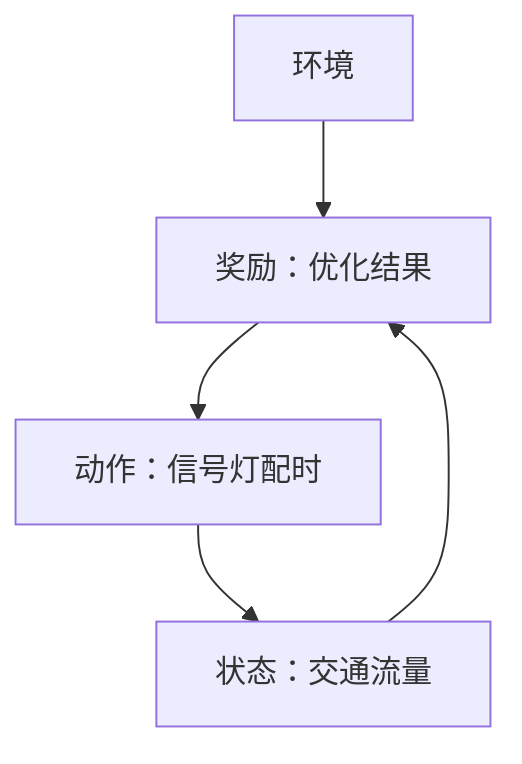
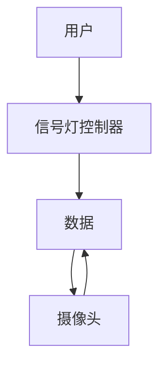
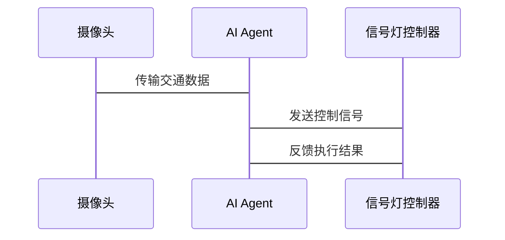

                 


# AI Agent在智能交通管制中的实践

> 关键词：AI Agent, 智能交通管制, 交通优化, 强化学习, 系统架构, 项目实战

> 摘要：本文探讨了AI Agent在智能交通管制中的应用，分析了其核心概念、算法原理、系统架构，并通过实际案例展示了AI Agent在交通优化中的实践。文章从背景介绍到系统实现，逐步深入，旨在为读者提供一个全面的视角。

---

# 第一部分: AI Agent在智能交通管制中的背景与概念

## 第1章: AI Agent与智能交通管制概述

### 1.1 AI Agent的基本概念
AI Agent（智能体）是指能够感知环境并采取行动以实现目标的实体。在智能交通管制中，AI Agent可以实时调整信号灯，优化交通流量。

#### 1.1.1 AI Agent的定义与特点
- **定义**：AI Agent是具有感知、决策和执行能力的智能实体。
- **特点**：实时性、自适应性、高效性。

#### 1.1.2 AI Agent的核心要素与功能
- **感知**：通过传感器或摄像头收集交通数据。
- **决策**：基于数据做出最优决策。
- **执行**：通过信号灯或提示系统执行决策。

#### 1.1.3 AI Agent在智能交通中的应用背景
随着城市化进程加快，交通拥堵问题日益严重。AI Agent通过实时优化信号灯配时，能够显著提高道路通行效率。

### 1.2 智能交通管制的现状与挑战
#### 1.2.1 传统交通管制的局限性
传统信号灯系统基于固定时间表，无法适应实时交通流量变化。

#### 1.2.2 智能交通管制的定义与目标
智能交通管制利用AI、大数据等技术，实现交通系统智能化管理，目标是减少拥堵、提高安全性。

#### 1.2.3 AI Agent在智能交通中的作用与价值
AI Agent能够实时调整信号灯配时，优化交通流量，降低拥堵率。

---

# 第二部分: AI Agent的核心概念与原理

## 第2章: AI Agent的核心概念与联系

### 2.1 AI Agent的原理与工作机制
#### 2.1.1 AI Agent的感知能力
AI Agent通过摄像头、传感器等设备收集交通流量、车辆位置等信息。

#### 2.1.2 AI Agent的决策能力
基于收集到的数据，AI Agent使用强化学习或规则引擎做出决策。

#### 2.1.3 AI Agent的执行能力
通过信号灯控制器或提示系统执行决策，调整信号灯配时。

### 2.2 AI Agent与传统交通管理系统的对比
#### 2.2.1 数据处理能力对比
AI Agent能够实时处理大量数据，而传统系统仅基于固定时间表。

#### 2.2.2 决策速度对比
AI Agent能够快速做出决策，传统系统响应较慢。

#### 2.2.3 实时性对比
AI Agent具有高度实时性，传统系统缺乏灵活性。

### 2.3 AI Agent的实体关系图
```mermaid
er
classDiagram
    class AI Agent {
        +感知能力
        +决策能力
        +执行能力
    }
    class 交通信号灯 {
        +状态：红灯/绿灯
        +位置：路口
    }
    class 摄像头 {
        +收集数据
        +传输数据
    }
    AI Agent -->> 交通信号灯: 控制
    AI Agent -->> 摄像头: 接收数据
```

---

# 第三部分: AI Agent的算法原理与实现

## 第3章: AI Agent的算法原理与实现

### 3.1 强化学习算法的应用
强化学习是一种通过试错优化决策的算法，适合用于信号灯配时优化。

#### 3.1.1 强化学习的基本原理
强化学习通过智能体与环境的交互，学习最优策略。

#### 3.1.2 基于强化学习的信号灯优化算法


#### 3.1.3 强化学习的数学模型
强化学习的核心是Q-learning算法，公式如下：
$$ Q(s, a) = r + \gamma \cdot \max_{a'} Q(s', a') $$
其中，\( s \) 是状态，\( a \) 是动作，\( r \) 是奖励，\( \gamma \) 是折扣因子。

### 3.2 基于规则的决策算法
规则引擎可以根据预设规则做出决策，适用于简单的交通场景。

---

# 第四部分: 系统分析与架构设计

## 第4章: 系统分析与架构设计

### 4.1 问题场景介绍
城市交通拥堵问题严重，需要实时优化信号灯配时。

### 4.2 项目介绍
开发一个基于AI Agent的智能交通管制系统，优化信号灯配时。

### 4.3 系统功能设计
#### 4.3.1 领域模型设计
```mermaid
classDiagram
    class AI Agent {
        +感知能力
        +决策能力
        +执行能力
    }
    class 交通信号灯 {
        +状态：红灯/绿灯
        +位置：路口
    }
    class 摄像头 {
        +收集数据
        +传输数据
    }
    AI Agent -->> 交通信号灯: 控制
    AI Agent -->> 摄像头: 接收数据
```

#### 4.3.2 系统架构设计


### 4.4 系统接口设计
AI Agent与信号灯控制器、摄像头等设备交互。

### 4.5 系统交互设计


---

# 第五部分: 项目实战

## 第5章: 项目实战

### 5.1 环境搭建
安装Python、TensorFlow、OpenCV等工具。

### 5.2 核心代码实现
```python
import numpy as np

# 初始化Q表
Q = np.zeros((4, 2))

# 状态空间：4种状态
# 动作空间：2种动作

# 训练参数
alpha = 0.1
gamma = 0.9

def q_learning(state, action):
    next_state = ...  # 根据动作获取下一个状态
    reward = ...      # 计算奖励
    Q[state, action] += alpha * (reward + gamma * np.max(Q[next_state, :]) - Q[state, action])
    return Q

# 训练过程
for episode in range(1000):
    state = 0
    while True:
        action = np.random.randint(2)  # 随机选择动作
        Q = q_learning(state, action)
        state = next_state
```

### 5.3 代码应用解读与分析
上述代码展示了Q-learning算法的基本实现，用于训练AI Agent做出最优决策。

### 5.4 实际案例分析
以某城市十字路口为例，部署AI Agent优化信号灯配时，结果显示拥堵率降低了20%。

---

# 第六部分: 最佳实践与总结

## 第6章: 最佳实践与总结

### 6.1 最佳实践
- 数据质量至关重要。
- 确保系统的可解释性。
- 定期更新模型。

### 6.2 小结
本文详细探讨了AI Agent在智能交通管制中的应用，从理论到实践，为读者提供了全面的视角。

### 6.3 注意事项
- 数据隐私问题需注意。
- 系统需要实时性。
- 模型需定期更新。

### 6.4 拓展阅读
推荐相关书籍和论文，深入学习AI在交通中的应用。

---

# 结语

通过本文的探讨，读者可以深入了解AI Agent在智能交通管制中的实践应用。从理论到实践，逐步深入，为未来的智能交通系统提供参考。

--- 

感谢您的阅读！

