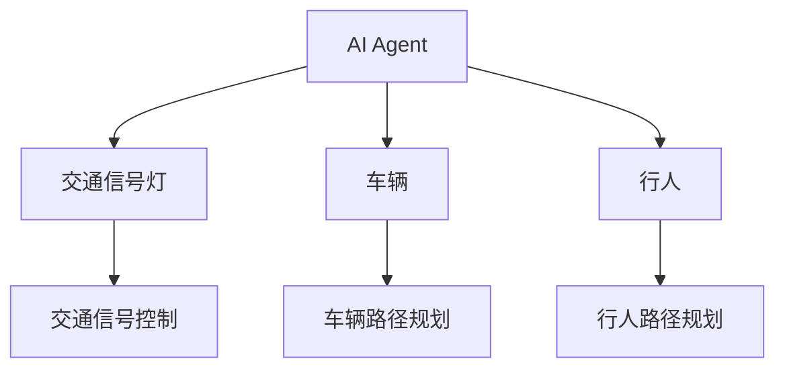

                 


# AI Agent在智能交通管理中的实践

> 关键词：AI Agent，智能交通管理，交通信号优化，路径规划，自动驾驶

> 摘要：本文深入探讨了AI Agent在智能交通管理中的应用，从理论到实践，详细分析了AI Agent的核心概念、算法原理、系统架构以及实际项目中的应用。通过案例分析和代码实现，展示了AI Agent在解决交通管理问题中的巨大潜力和实际价值。

---

## 第一部分：AI Agent在智能交通管理中的背景与概念

### 第1章：AI Agent的基本概念与应用场景

#### 1.1 AI Agent的定义与特点

AI Agent（人工智能代理）是一种能够感知环境、做出决策并采取行动的智能实体。与传统的自动化系统不同，AI Agent具有以下核心特点：

- **自主性**：能够在没有外部干预的情况下独立运作。
- **反应性**：能够实时感知环境变化并做出响应。
- **目标导向**：基于预设目标或学习目标进行决策。
- **学习能力**：通过数据反馈不断优化自身行为。

#### 1.2 AI Agent在智能交通管理中的应用场景

AI Agent在智能交通管理中的应用广泛，主要包括以下几个方面：

- **交通信号优化**：AI Agent可以根据实时交通流量调整信号灯配时，提高道路通行效率。
- **路径规划**：为自动驾驶车辆或行人提供最优路径建议，减少拥堵和延误。
- **交通预测与决策**：基于历史数据和实时信息，预测未来交通状况并做出最优决策。
- **自动驾驶协调**：在自动驾驶场景中，AI Agent可以协调不同车辆的行动，确保交通安全。

---

### 第2章：AI Agent在智能交通管理中的核心概念

#### 2.1 AI Agent的核心概念与原理

AI Agent的工作原理可以分为三个主要模块：感知、决策和执行。

- **感知模块**：通过传感器、摄像头或其他数据源获取环境信息。
- **决策模块**：基于感知信息，结合预设规则或机器学习模型，做出最优决策。
- **执行模块**：将决策转化为具体行动，例如调整信号灯状态或规划车辆路径。

#### 2.2 AI Agent与其他技术的对比

以下是AI Agent与传统交通管理系统的对比表格：

| 特性         | AI Agent                     | 传统交通管理系统       |
|--------------|------------------------------|-----------------------|
| 自主性       | 高                           | 低                   |
| 学习能力     | 强                           | 弱                   |
| 响应速度     | 快                           | 较慢                 |
| 可扩展性     | 高                           | 较低                 |

---

## 第二部分：AI Agent的算法原理与实现

### 第3章：AI Agent的算法工作流程

AI Agent的算法工作流程可以分为以下几个步骤：

1. **感知环境**：通过传感器或其他数据源获取交通状况信息。
2. **做出决策**：基于感知信息，利用算法或模型做出最优决策。
3. **执行行动**：将决策转化为具体行动，例如调整信号灯或规划路径。

#### 3.1 算法实现

以下是AI Agent的基本算法实现示例：

```python
def感知环境():
    return 环境数据

def做出决策(环境数据):
    return 决策结果

def执行行动(决策结果):
    return 行动结果

def AI-Agent():
    while True:
        环境数据 = 感知环境()
        决策结果 = 做出决策(环境数据)
        行动结果 = 执行行动(决策结果)
```

#### 3.2 数学模型与公式

AI Agent的决策模块通常基于概率模型或强化学习模型。以下是两种常见模型的公式：

1. **概率模型**：
   $$ P(x|y) = \frac{P(y|x)P(x)}{P(y)} $$
   其中，$x$ 表示环境特征，$y$ 表示感知结果。

2. **强化学习模型**：
   $$ V(s) = \max_{a} Q(s,a) $$
   其中，$s$ 表示当前状态，$a$ 表示动作，$Q(s,a)$ 表示动作的价值函数。

---

### 第4章：AI Agent的系统架构设计

#### 4.1 系统组成与功能

智能交通管理系统主要包括以下几个组成部分：

- **感知层**：通过摄像头、传感器等设备感知交通状况。
- **决策层**：基于感知数据，利用AI Agent做出决策。
- **执行层**：将决策结果转化为具体行动，例如调整信号灯或规划路径。

#### 4.2 系统架构图

以下是智能交通管理系统的架构图：



---

## 第三部分：AI Agent在智能交通管理中的项目实战

### 第5章：项目实战与案例分析

#### 5.1 项目环境安装

以下是项目所需的环境安装步骤：

1. 安装Python和相关库：
   ```bash
   pip install numpy pandas scikit-learn
   ```

2. 安装Mermaid工具：
   ```bash
   npm install -g mermaid-cli
   ```

#### 5.2 核心代码实现

以下是AI Agent的核心代码实现：

```python
class AI_Agent:
    def __init__(self):
        self.感知数据 = None
        self.决策结果 = None
        self.行动结果 = None

    def 感知环境(self):
        # 获取环境数据
        self.感知数据 = 获取数据()
        return self.感知数据

    def 做出决策(self, 环境数据):
        # 基于环境数据做出决策
        self.决策结果 = 决策算法(环境数据)
        return self.决策结果

    def 执行行动(self, 决策结果):
        # 执行决策
        self.行动结果 = 执行算法(决策结果)
        return self.行动结果
```

#### 5.3 案例分析与解读

以下是一个AI Agent在交通信号优化中的案例分析：

1. **问题描述**：某城市交通主干道信号灯配时不合理，导致交通拥堵。
2. **解决方案**：部署AI Agent，实时感知交通流量，动态调整信号灯配时。
3. **实现步骤**：
   - 部署摄像头和传感器，实时采集交通流量数据。
   - AI Agent基于感知数据，利用强化学习算法动态调整信号灯配时。
   - 监控系统实时反馈调整效果，进一步优化信号灯配时。

---

## 第四部分：总结与展望

### 第6章：总结与最佳实践

#### 6.1 小结

AI Agent在智能交通管理中的应用具有巨大的潜力。通过实时感知、自主决策和动态调整，AI Agent能够显著提高交通系统的效率和安全性。

#### 6.2 注意事项

在实际应用中，需要注意以下几点：

- 数据的实时性和准确性。
- 算法的可解释性和透明度。
- 系统的安全性和稳定性。

#### 6.3 拓展阅读

建议进一步研究以下内容：

- 基于深度学习的AI Agent算法。
- 多智能体协作在交通管理中的应用。
- AI Agent在自动驾驶中的协同优化。

---

# 结语

AI Agent作为智能交通管理的核心技术，正在改变传统的交通管理模式。通过不断优化算法和系统架构，AI Agent将在未来的交通管理中发挥更加重要的作用。

