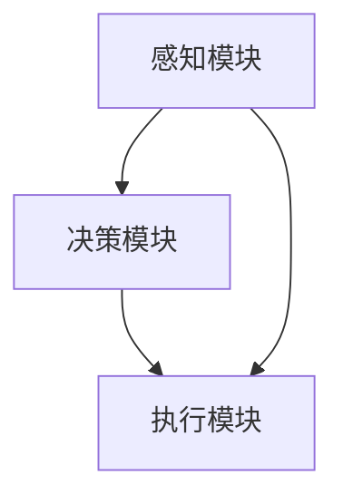
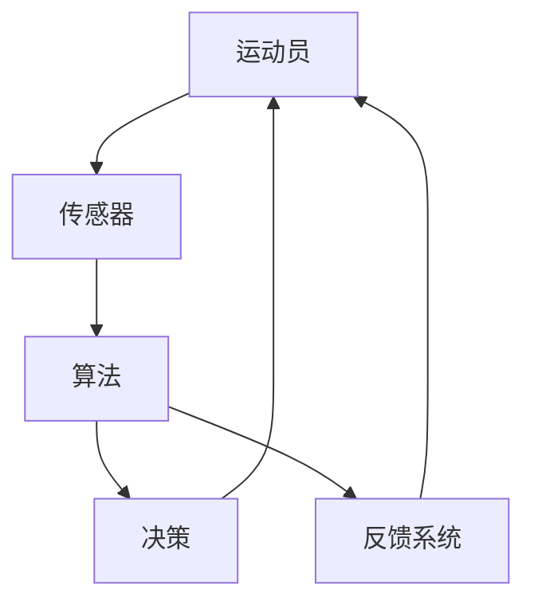
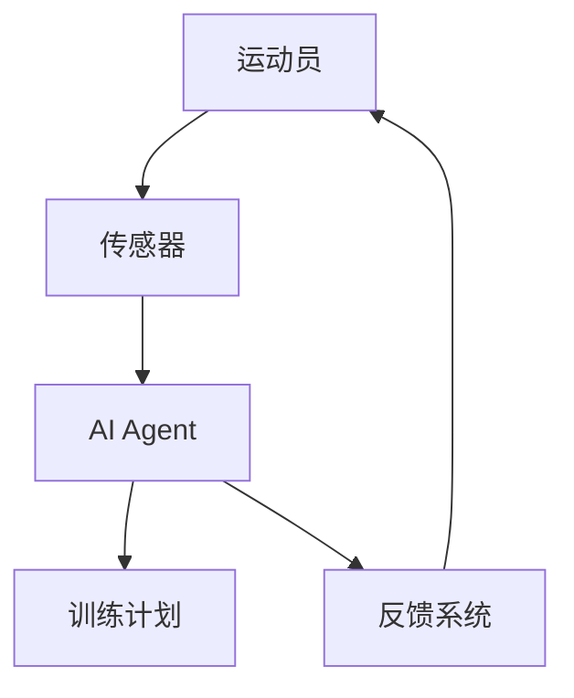
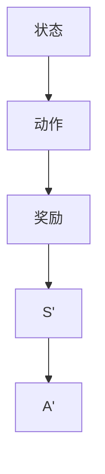

                 


# AI Agent在智能体育训练中的实践

## 关键词：
AI Agent, 智能体育训练, 强化学习, DQN算法, 体育训练优化

## 摘要：
本文将详细探讨AI Agent在智能体育训练中的应用与实践。首先，我们从AI Agent的基本概念和智能体育训练的需求出发，分析两者之间的关系与结合点。接着，我们深入讲解AI Agent的核心算法原理，包括强化学习和监督学习，并通过具体的数学模型和公式进行详细阐述。随后，我们将从系统架构设计的角度，分析智能体育训练系统的实现方案，包括系统功能设计、架构设计和接口设计。最后，我们通过实际项目案例，展示AI Agent在智能体育训练中的应用场景，并总结经验与教训，为读者提供切实可行的实践指南。

---

## 第一部分: AI Agent与智能体育训练的背景介绍

### 第1章: AI Agent的基本概念与核心原理

#### 1.1 AI Agent的定义与特点
##### 1.1.1 AI Agent的基本概念
AI Agent（人工智能代理）是指能够感知环境、自主决策并执行任务的智能实体。它通过传感器获取信息，利用算法处理数据，并通过执行器与环境交互。AI Agent的核心目标是通过智能化的决策和行动，优化任务完成的效果。

##### 1.1.2 AI Agent的核心特点
- **自主性**：AI Agent能够在没有外部干预的情况下独立运行。
- **反应性**：能够实时感知环境变化并做出相应的反应。
- **学习能力**：通过数据和经验不断优化自身的决策能力。
- **适应性**：能够根据环境变化调整策略和行为。

##### 1.1.3 AI Agent与传统AI的区别
传统的AI系统通常是基于规则的，而AI Agent具有更强的自主性和适应性。例如，AI Agent可以实时调整训练计划，而传统的AI系统则需要手动重新编程。

---

#### 1.2 智能体育训练的背景与需求
##### 1.2.1 体育训练的智能化趋势
随着科技的发展，体育训练也在向智能化方向迈进。传统的体育训练依赖教练的经验和运动员的主观感受，而智能化训练可以通过数据分析和AI技术，提供更科学、更个性化的训练方案。

##### 1.2.2 智能体育训练的核心需求
- **个性化训练计划**：根据运动员的体能、技术特点和健康状况，制定个性化的训练方案。
- **实时反馈与优化**：在训练过程中实时监测运动员的表现，并根据数据动态调整训练计划。
- **数据驱动的决策**：通过分析大量的运动数据，为教练和运动员提供科学的决策依据。

##### 1.2.3 AI Agent在体育训练中的应用潜力
AI Agent可以在体育训练中扮演多种角色，例如实时监测运动员的表现、分析数据并提供建议、优化训练计划等。

---

#### 1.3 AI Agent在智能体育训练中的概念结构
##### 1.3.1 概念构成要素
AI Agent在智能体育训练中的概念结构包括以下要素：
- **感知模块**：通过传感器采集运动员的动作、心率、位置等数据。
- **决策模块**：基于感知数据和训练目标，制定最优的训练策略。
- **执行模块**：通过反馈系统指导运动员执行训练计划。

##### 1.3.2 概念之间的关系
- 感知模块为决策模块提供数据支持。
- 决策模块根据感知数据生成训练计划。
- 执行模块负责将训练计划转化为实际的训练行为。

##### 1.3.3 概念结构图


---

## 第2章: AI Agent与智能体育训练的关系

### 2.1 AI Agent在体育训练中的核心作用
#### 2.1.1 数据采集与分析
AI Agent可以通过传感器和摄像头采集运动员的运动数据，并通过算法分析这些数据，识别运动员的技术问题和体能瓶颈。

#### 2.1.2 训练计划优化
AI Agent可以根据运动员的个人特点和训练目标，优化训练计划，例如调整训练强度、训练时间和训练内容。

#### 2.1.3 实时反馈与调整
AI Agent可以在训练过程中实时监测运动员的表现，并根据数据动态调整训练计划，帮助运动员在训练中不断进步。

---

### 2.2 智能体育训练的场景与边界
#### 2.2.1 常见体育训练场景
- **力量训练**：通过AI Agent优化力量训练的强度和频率。
- **技能训练**：通过AI Agent分析运动员的动作，提供针对性的改进建议。
- **耐力训练**：通过AI Agent实时监测心率和运动数据，优化训练计划。

#### 2.2.2 AI Agent在体育训练中的边界
- **技术限制**：AI Agent的能力受限于传感器的精度和算法的准确性。
- **伦理问题**：AI Agent的应用需要考虑隐私保护和数据安全。
- **用户体验**：AI Agent的设计需要考虑运动员和教练的使用习惯和接受度。

#### 2.2.3 智能体育训练的外延
智能体育训练不仅包括训练过程，还包括训练前的准备和训练后的恢复。AI Agent可以在整个训练周期中提供支持。

---

### 2.3 AI Agent在智能体育训练中的概念结构
#### 2.3.1 概念构成要素
- **运动员**：AI Agent的核心服务对象。
- **传感器**：数据采集的工具。
- **算法**：数据处理和决策的核心。
- **反馈系统**：运动员与AI Agent之间的交互界面。

#### 2.3.2 概念之间的关系
- 运动员通过传感器与AI Agent交互。
- AI Agent通过算法处理数据并生成决策。
- 决策通过反馈系统传递给运动员。

#### 2.3.3 概念结构图


---

## 第3章: AI Agent的核心概念与联系

### 3.1 AI Agent的核心原理
#### 3.1.1 知识表示
知识表示是AI Agent理解环境的基础。在体育训练中，知识表示可以包括运动员的技术动作、生理指标和训练目标等。

#### 3.1.2 行为决策
行为决策是AI Agent的核心功能。通过分析感知数据，AI Agent可以制定最优的训练计划。

#### 3.1.3 交互与反馈
AI Agent需要与运动员和教练进行实时交互，并根据反馈调整自己的决策策略。

---

### 3.2 AI Agent与智能体育训练的联系
#### 3.2.1 数据流分析
- **输入**：运动员的运动数据、训练目标。
- **处理**：AI Agent分析数据并生成训练计划。
- **输出**：优化后的训练计划和实时反馈。

#### 3.2.2 系统交互流程
1. 运动员通过传感器发送数据到AI Agent。
2. AI Agent分析数据并生成训练计划。
3. AI Agent通过反馈系统将训练计划传递给运动员。
4. 运动员执行训练计划并反馈执行结果。
5. AI Agent根据反馈调整训练计划。

#### 3.2.3 实体关系图


---

## 第4章: AI Agent的算法原理

### 4.1 强化学习算法
#### 4.1.1 Q-learning算法
Q-learning是一种经典的强化学习算法，通过更新Q值表来学习最优策略。

##### Q值更新公式
$$ Q(s, a) = Q(s, a) + \alpha (r + \gamma \max Q(s', a') - Q(s, a)) $$

##### 算法流程图


##### 代码实现
```python
import numpy as np

class QLearning:
    def __init__(self, state_size, action_size, alpha=0.1, gamma=0.9):
        self.state_size = state_size
        self.action_size = action_size
        self.alpha = alpha
        self.gamma = gamma
        self.q_table = np.zeros((state_size, action_size))
    
    def choose_action(self, state):
        if np.random.random() < 0.5:
            return np.random.randint(self.action_size)
        else:
            return np.argmax(self.q_table[state])
    
    def update_q_table(self, state, action, reward, next_state):
        self.q_table[state][action] = self.q_table[state][action] + self.alpha * (reward + self.gamma * np.max(self.q_table[next_state]) - self.q_table[state][action])
```

---

### 4.2 监督学习算法
#### 4.2.1 回归分析
回归分析是一种监督学习算法，用于预测连续型输出。

##### 回归模型公式
$$ y = \beta_0 + \beta_1 x + \epsilon $$

##### 代码实现
```python
import sklearn.linear_model as linear_model

class LinearRegression:
    def __init__(self):
        self.model = linear_model.LinearRegression()
    
    def fit(self, X, y):
        self.model.fit(X, y)
    
    def predict(self, X):
        return self.model.predict(X)
```

---

### 4.3 算法实现代码
#### 4.3.1 Q-learning实现代码
```python
# 初始化Q表
qlearning = QLearning(state_size=10, action_size=5)
# 训练过程
for episode in range(100):
    state = get_state()
    action = qlearning.choose_action(state)
    next_state, reward = step(action)
    qlearning.update_q_table(state, action, reward, next_state)
```

#### 4.3.2 DQN实现代码
```python
# 初始化DQN
dqn = DQN(state_size=10, action_size=5)
# 训练过程
for episode in range(100):
    state = get_state()
    action = dqn.choose_action(state)
    next_state, reward = step(action)
    dqn.remember(state, action, reward, next_state)
    dqn.replay()
```

---

## 第5章: 数学模型与公式

### 5.1 Q-learning算法的数学模型
##### Q值更新公式
$$ Q(s, a) = Q(s, a) + \alpha (r + \gamma \max Q(s', a') - Q(s, a)) $$

### 5.2 DQN算法的数学模型
##### 损失函数
$$ \text{损失} = \mathbb{E}[(r + \gamma Q(s', a') - Q(s, a))^2] $$

---

## 总结
通过本文的介绍，我们详细探讨了AI Agent在智能体育训练中的应用与实践。从AI Agent的基本概念到算法原理，再到系统设计和实际案例，我们为读者提供了一个全面的视角。希望本文能够为体育训练的智能化发展提供一些启发和参考。

---

**注意事项**：
- 本文中的代码和算法仅为示例，实际应用中需要根据具体场景进行调整和优化。
- AI Agent的应用需要结合实际需求，避免技术滥用和过度依赖技术。
- 在实际应用中，建议结合领域专家的知识，确保AI Agent的决策更加科学和合理。

