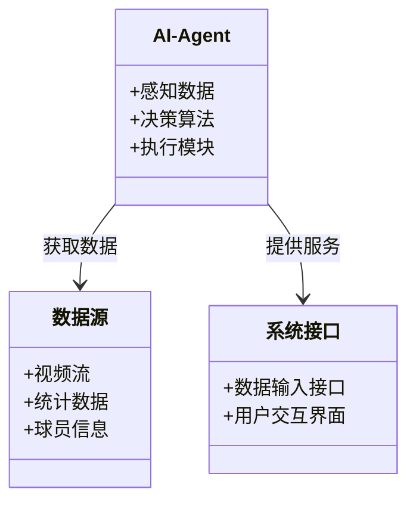
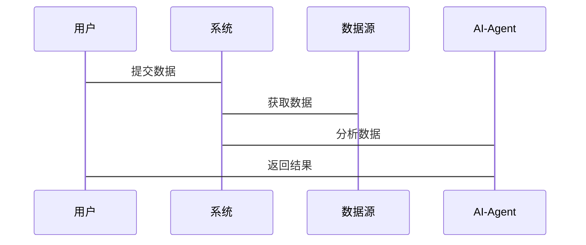

                 


# AI Agent在智能体育赛事分析中的角色

> 关键词：AI Agent，智能体育，体育赛事分析，数据分析，人工智能

> 摘要：本文探讨了AI Agent在智能体育赛事分析中的核心作用，详细分析了其在战术分析、运动员表现评估和伤病预测中的应用。通过结合实际案例和系统设计，展示了AI Agent如何提升体育数据分析的效率和准确性。

---

## 目录大纲：《AI Agent在智能体育赛事分析中的角色》

1. 引言
2. AI Agent的基本概念与背景
3. AI Agent的核心原理与技术实现
4. 体育赛事数据分析与特征提取
5. AI Agent在体育赛事分析中的具体应用
6. 系统设计与架构
7. 项目实战
8. 总结与展望

---

## 1. 引言

AI Agent（人工智能代理）作为智能体育赛事分析的核心技术，正在改变传统体育数据分析的方式。通过结合大数据、机器学习和自然语言处理，AI Agent能够实时分析比赛数据，为教练和运动员提供决策支持。

---

## 2. AI Agent的基本概念与背景

### 2.1 AI Agent的基本概念

AI Agent是一种智能体，能够感知环境并采取行动以实现目标。在体育赛事分析中，AI Agent可以实时处理视频、统计数据和球员信息，帮助教练制定战术。

### 2.2 发展历程

从简单的数据统计到复杂的智能分析，AI Agent在体育领域的应用经历了数据采集、特征提取和智能决策三个阶段。

### 2.3 在体育中的应用现状

当前，AI Agent被广泛应用于战术分析、运动员表现评估和伤病预测。例如，AI Agent可以通过分析球员的运动轨迹，优化比赛策略。

---

## 3. AI Agent的核心原理与技术实现

### 3.1 感知机制

AI Agent通过多种传感器和数据源感知比赛环境，包括视频流、统计数据和球员位置。

#### 3.1.1 数据采集与处理

数据采集包括视频流和传感器数据，处理步骤包括数据清洗、特征提取和数据增强。

### 3.2 决策机制

基于感知数据，AI Agent采用强化学习和决策树算法，生成最优决策。

#### 3.2.1 强化学习算法

通过奖励机制，AI Agent学习最优策略。例如，在足球比赛中，AI Agent可以学习何时传球和射门。

### 3.3 执行机制

AI Agent根据决策结果执行动作，如调整战术或提供实时反馈。

### 3.4 多智能体协作

多个AI Agent协同工作，模拟球队整体策略。例如，在篮球比赛中，AI Agent可以协调防守策略。

---

## 4. 体育赛事数据分析与特征提取

### 4.1 数据来源

#### 4.1.1 比赛数据

包括比赛结果、比分和时间戳。例如，足球比赛中的进球时间。

#### 4.1.2 球员数据

包括球员的位置、速度和加速度。例如，通过加速度数据判断球员是否受伤。

#### 4.1.3 观众数据

包括观众情绪和社交媒体评论，帮助分析比赛氛围。

### 4.2 数据特征提取

#### 4.2.1 基本统计特征

如平均速度、射门次数和传球成功率。

#### 4.2.2 高级统计特征

如xG（预期进球数）、xA（预期助攻数）和Dribble Rate（控球率）。

#### 4.2.3 时间序列特征

如比赛节奏、进攻频率和关键球员状态。

### 4.3 数据预处理

#### 4.3.1 数据清洗

处理缺失值和异常值，确保数据准确性。

#### 4.3.2 数据标准化

统一数据格式，方便后续分析。

#### 4.3.3 数据增强

通过数据增强技术，增加数据多样性，提升模型泛化能力。

---

## 5. AI Agent在体育赛事分析中的具体应用

### 5.1 战术分析与优化

AI Agent通过分析比赛录像，识别对手弱点，制定最优战术。例如，在足球比赛中，AI Agent可以分析对手的防守漏洞，建议最佳传球路线。

### 5.2 运动员表现评估

AI Agent基于统计数据和运动轨迹，评估运动员表现。例如，通过分析篮球运动员的投篮命中率，判断其状态。

### 5.3 伤病预测与管理

AI Agent通过分析球员的历史数据，预测伤病风险。例如，通过分析马拉松运动员的训练强度，预测肌肉劳损风险。

---

## 6. 系统设计与架构

### 6.1 问题场景介绍

在体育赛事分析中，AI Agent需要处理大量异构数据，实时分析并生成决策。

### 6.2 项目介绍

本项目旨在开发一个AI Agent系统，用于智能体育赛事分析。

### 6.3 系统功能设计

#### 6.3.1 领域模型（Mermaid类图）



### 6.4 系统架构设计（Mermaid架构图）


### 6.5 系统接口设计

#### 6.5.1 数据输入接口

接收视频流和统计数据，格式为JSON或CSV。

#### 6.5.2 用户交互界面

提供可视化界面，供用户查看分析结果。

### 6.6 系统交互流程（Mermaid序列图）



---

## 7. 项目实战

### 7.1 环境安装

安装Python、TensorFlow和OpenCV等依赖包。

### 7.2 核心实现代码

```python
import tensorflow as tf
from tensorflow.keras import models
import cv2

# 数据预处理
def preprocess_data(data):
    # 处理视频流和统计数据
    pass

# 感知模块
class PerceptionModule:
    def __init__(self):
        self.model = self.build_model()
    
    def build_model(self):
        model = models.Sequential()
        # 添加卷积层和全连接层
        return model
    
    def process(self, input_data):
        # 处理输入数据
        pass

# 决策模块
class DecisionModule:
    def __init__(self):
        self.model = self.build_model()
    
    def build_model(self):
        model = models.Sequential()
        # 添加决策层
        return model
    
    def decide(self, input_data):
        # 生成决策
        pass

# 执行模块
class ExecutionModule:
    def execute(self, decision):
        # 执行决策
        pass
```

### 7.3 案例分析

以足球比赛为例，AI Agent分析比赛录像，识别对手弱点，制定进攻策略。

### 7.4 项目小结

通过实际案例，展示了AI Agent在体育赛事分析中的强大能力。

---

## 8. 总结与展望

### 8.1 核心价值

AI Agent通过高效的数据分析和智能决策，显著提升了体育赛事分析的效率和准确性。

### 8.2 挑战与展望

尽管AI Agent在体育分析中取得了显著成果，但仍面临数据隐私和模型实时性等挑战。未来，随着技术进步，AI Agent将在体育领域发挥更大作用。

### 8.3 总结

AI Agent作为智能体育赛事分析的核心技术，正在改变传统体育数据分析的方式。通过结合大数据和机器学习，AI Agent为教练和运动员提供了强大的决策支持工具。

---

## 最佳实践 tips

- 数据采集是关键，确保数据的完整性和准确性。
- 在决策模块中，强化学习算法能够有效优化策略。
- 系统设计时，需考虑数据隐私和系统实时性。

---

以上是《AI Agent在智能体育赛事分析中的角色》的技术博客文章的详细内容，涵盖了AI Agent在体育赛事分析中的核心作用、技术实现和实际应用，为读者提供了全面的了解和深入的分析。

