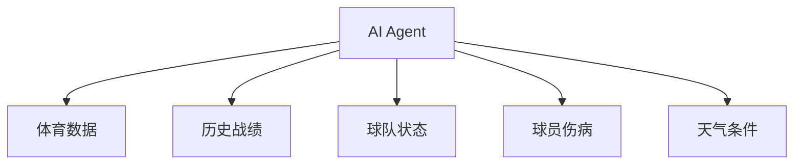
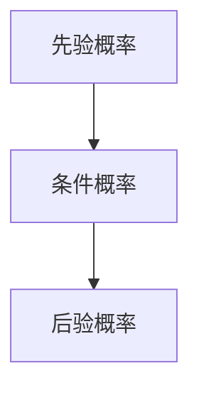
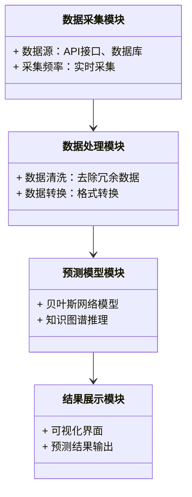
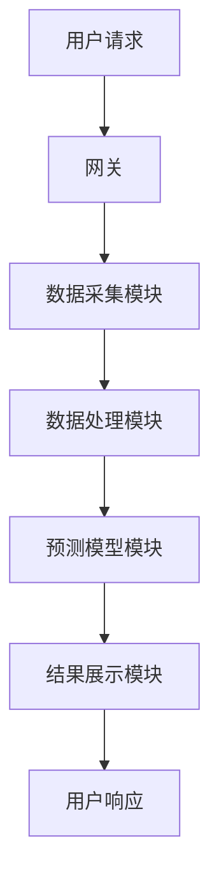

                 


# AI Agent在智能体育赛事预测中的应用

> 关键词：AI Agent，智能体育，赛事预测，概率论，贝叶斯网络，知识图谱

> 摘要：本文探讨了AI Agent在智能体育赛事预测中的应用，分析了AI Agent的核心概念、算法原理及其在体育赛事预测中的实际应用。通过详细的技术分析和实例演示，展示了如何利用AI Agent来提升体育赛事预测的准确性和效率。

---

# 第一部分: AI Agent与智能体育赛事预测的背景介绍

# 第1章: AI Agent与智能体育赛事预测概述

## 1.1 AI Agent的基本概念
### 1.1.1 AI Agent的定义与特点
人工智能代理（AI Agent）是指能够感知环境、自主决策并执行任务的智能实体。与传统算法不同，AI Agent具备以下特点：
- **自主性**：能够在没有外部干预的情况下独立运作。
- **反应性**：能够实时感知环境变化并做出相应调整。
- **学习能力**：通过数据和经验不断优化自身的预测和决策能力。
- **协作性**：能够与其他AI Agent或系统协同工作，完成复杂任务。

### 1.1.2 AI Agent的核心要素与功能
AI Agent的核心要素包括：
- **感知模块**：负责收集和处理环境中的数据。
- **推理模块**：基于感知数据进行逻辑推理和决策。
- **执行模块**：根据推理结果执行具体操作。
- **学习模块**：通过机器学习算法不断优化自身模型。

AI Agent的功能主要体现在以下几个方面：
- 数据采集与处理
- 智能推理与决策
- 自动化执行与反馈
- 持续学习与优化

### 1.1.3 AI Agent与传统算法的区别
传统算法通常需要明确的规则和固定的执行流程，而AI Agent具备更强的自主性和适应性。例如，传统算法可能在数据变化时需要手动调整规则，而AI Agent能够根据新数据自动优化决策策略。

## 1.2 智能体育赛事预测的背景与意义
### 1.2.1 体育赛事预测的现状与挑战
体育赛事预测一直是体育产业的重要组成部分，传统预测方法通常依赖于专家经验或简单的统计模型。然而，这种方法存在以下挑战：
- 数据量有限：传统方法难以充分利用海量的多维度数据。
- 决策滞后：人工分析往往耗时较长，无法实时提供预测结果。
- 精度不足：简单统计模型难以捕捉复杂的影响因素。

### 1.2.2 智能化预测的需求与优势
随着人工智能技术的快速发展，智能化预测的需求日益增长。AI Agent能够通过大数据分析、机器学习和知识图谱等技术，显著提升预测的准确性和效率。其优势包括：
- **实时性**：能够快速处理实时数据并提供预测结果。
- **准确性**：通过深度学习和复杂模型，显著提高预测精度。
- **适应性**：能够根据环境变化自适应调整预测策略。

### 1.2.3 AI Agent在体育赛事预测中的应用前景
AI Agent在体育赛事预测中的应用前景广阔，尤其是在以下几个方面：
- **赛前预测**：预测比赛结果、球队胜负概率等。
- **实时分析**：在比赛中实时调整预测模型，提供动态分析。
- **赛后总结**：分析比赛结果，优化未来预测模型。

## 1.3 本章小结
本章主要介绍了AI Agent的基本概念及其在智能体育赛事预测中的应用背景。通过对比传统算法和AI Agent的差异，分析了智能化预测的需求和优势，为后续的技术分析奠定了基础。

---

# 第二部分: AI Agent的核心概念与原理

# 第2章: AI Agent的核心概念与联系

## 2.1 AI Agent的核心原理
### 2.1.1 基于概率论的AI Agent决策机制
AI Agent的决策过程通常基于概率论，尤其是贝叶斯网络。通过计算事件发生的概率，AI Agent可以做出最优决策。例如，在足球比赛中，AI Agent可以根据历史战绩、球队状态、天气条件等多因素计算出主队获胜的概率。

### 2.1.2 基于知识图谱的事件推理
知识图谱是一种结构化的数据表示方法，能够帮助AI Agent更好地理解和推理复杂事件。例如，AI Agent可以通过知识图谱推理出某球员受伤对球队整体实力的影响。

### 2.1.3 多智能体协同的实现方法
在复杂的体育赛事预测中，通常需要多个AI Agent协同工作。例如，一个AI Agent负责收集和处理数据，另一个负责构建预测模型，还有其他AI Agent负责实时监控比赛动态。

## 2.2 AI Agent的属性特征对比
以下是AI Agent与传统算法在体育赛事预测中的属性特征对比：

| 特性           | AI Agent                     | 传统算法                   |
|----------------|------------------------------|-----------------------------|
| 数据处理能力   | 强大，支持多维度数据         | 较弱，通常依赖固定规则       |
| 自适应能力     | 高，能够根据数据变化调整模型 | 低，需要人工干预调整规则     |
| 决策效率       | 高，能够在短时间内完成决策   | 较低，依赖复杂计算            |
| 可扩展性       | 高，支持大规模数据处理       | 较低，难以扩展                |

## 2.3 AI Agent的实体关系图
以下是AI Agent在体育赛事预测中的实体关系图：



## 2.4 本章小结
本章详细介绍了AI Agent的核心概念和工作原理，包括基于概率论的决策机制、知识图谱的事件推理以及多智能体协同的实现方法。通过属性特征对比和实体关系图，进一步明确了AI Agent在体育赛事预测中的优势和应用场景。

---

# 第三部分: AI Agent的算法原理与数学模型

# 第3章: AI Agent的算法原理

## 3.1 基于概率论的AI Agent算法
### 3.1.1 贝叶斯网络的构建与实现
贝叶斯网络是一种基于概率论的图形化模型，能够有效地处理不确定性问题。以下是构建贝叶斯网络的步骤：

1. **定义变量**：确定影响比赛结果的所有相关变量，例如球队实力、球员状态、天气条件等。
2. **构建网络结构**：通过绘制变量之间的依赖关系，构建贝叶斯网络的结构。
3. **定义概率分布**：为每个变量及其关系分配概率值。
4. **训练模型**：利用历史数据对模型进行训练，优化概率参数。
5. **推理与预测**：根据新的数据，计算目标变量的概率分布，做出预测。

### 3.1.2 贝叶斯公式与概率计算
贝叶斯公式如下：

$$P(y|x) = \frac{P(x|y)P(y)}{P(x)}$$

其中：
- \(P(y|x)\) 是在给定\(x\)的情况下，事件\(y\)发生的概率。
- \(P(x|y)\) 是在\(y\)发生的条件下，\(x\)发生的概率。
- \(P(y)\) 是\(y\)发生的先验概率。
- \(P(x)\) 是\(x\)发生的边际概率。

### 3.1.3 贝叶斯网络的可视化与分析
以下是贝叶斯网络的可视化示意图：



## 3.2 基于知识图谱的事件推理算法
### 3.2.1 知识图谱的构建与存储
知识图谱是一种结构化的知识表示方法，由节点（实体）和边（关系）组成。例如，我们可以构建一个包含球队、球员、比赛、伤病等实体的知识图谱。

### 3.2.2 基于图的事件推理流程
以下是基于图的事件推理流程：

1. **数据收集**：从多个数据源收集相关的体育数据。
2. **知识建模**：将数据建模为知识图谱。
3. **事件推理**：通过图遍历算法推理出隐藏的关系和事件。
4. **结果分析**：根据推理结果做出预测。

### 3.2.3 知识图谱的更新与维护
知识图谱需要定期更新，以确保其准确性和及时性。例如，当某球员受伤时，需要及时更新其健康状态的相关信息。

## 3.3 算法实现的Python代码示例
以下是基于贝叶斯网络的Python代码示例：

```python
import numpy as np
from sklearn.naive_bayes import GaussianNB

# 示例数据
X = np.array([[-1, -1], [0, 0], [1, 1]])
Y = np.array([0, 1, 2])

# 训练模型
model = GaussianNB()
model.fit(X, Y)

# 预测
print(model.predict([[2, 2]]))
```

## 3.4 数学模型与公式
### 3.4.1 贝叶斯公式
$$P(y|x) = \frac{P(x|y)P(y)}{P(x)}$$

### 3.4.2 条件概率公式
$$P(A|B) = \frac{P(A \cap B)}{P(B)}$$

## 3.5 本章小结
本章详细介绍了基于概率论的AI Agent算法，特别是贝叶斯网络的构建与实现。通过Python代码示例和数学公式的推导，进一步加深了对算法原理的理解。

---

# 第四部分: 系统分析与架构设计

# 第4章: 智能体育赛事预测系统的分析与设计

## 4.1 项目背景与目标
### 4.1.1 项目背景介绍
随着人工智能技术的快速发展，体育赛事预测的需求日益增长。传统的预测方法已经无法满足现代体育产业的需求，因此我们提出了基于AI Agent的智能体育赛事预测系统。

### 4.1.2 项目目标
本项目的旨在通过AI Agent技术，构建一个高效、准确的体育赛事预测系统，帮助用户做出更明智的决策。

## 4.2 系统功能设计
### 4.2.1 领域模型
以下是系统领域的模型：



### 4.2.2 系统架构设计
以下是系统的架构设计图：



### 4.2.3 接口与交互设计
以下是系统接口与交互设计的序列图：

```mermaid
sequenceDiagram
用户 -->+> 网关: 发送预测请求
网关 -->+> 数据采集模块: 获取实时数据
数据采集模块 -->+> 数据处理模块: 提供处理后的数据
数据处理模块 -->+> 预测模型模块: 进行预测
预测模型模块 -->+> 结果展示模块: 显示预测结果
结果展示模块 -->+> 用户: 返回预测结果
```

## 4.3 本章小结
本章详细分析了智能体育赛事预测系统的功能设计、架构设计和接口设计。通过Mermaid图的展示，进一步明确了系统各部分的功能和交互流程。

---

# 第五部分: 项目实战

# 第5章: 智能体育赛事预测系统的实现

## 5.1 环境安装与配置
### 5.1.1 安装Python环境
建议使用Anaconda作为Python环境管理工具，安装步骤如下：
1. 下载并安装Anaconda：https://www.anaconda.com/products/distribution
2. 创建新的Python环境：`conda create -n sports_prediction python=3.8`

### 5.1.2 安装依赖库
安装所需的依赖库，例如：
- NumPy：`pip install numpy`
- Scikit-learn：`pip install scikit-learn`
- Mermaid CLI：`pip install mermaid`

## 5.2 系统核心实现
### 5.2.1 数据采集模块实现
以下是数据采集模块的Python代码：

```python
import requests

def get_sport_data():
    # 假设API接口为http://api.sportdata.com/football/matches
    response = requests.get("http://api.sportdata.com/football/matches")
    return response.json()

# 示例调用
print(get_sport_data())
```

### 5.2.2 数据处理模块实现
以下是数据处理模块的Python代码：

```python
import pandas as pd

def process_data(data):
    df = pd.DataFrame(data)
    df = df.dropna()
    return df

# 示例调用
data = get_sport_data()
print(process_data(data))
```

### 5.2.3 预测模型模块实现
以下是预测模型模块的Python代码：

```python
from sklearn.naive_bayes import GaussianNB

def train_model(X, y):
    model = GaussianNB()
    model.fit(X, y)
    return model

# 示例调用
X = [[-1, -1], [0, 0], [1, 1]]
y = [0, 1, 2]
model = train_model(X, y)
print(model.predict([[2, 2]]))
```

### 5.2.4 结果展示模块实现
以下是结果展示模块的Python代码：

```python
def display_results(results):
    for result in results:
        print(f"预测结果：{result}")

# 示例调用
results = model.predict([[2, 2]])
display_results(results)
```

## 5.3 项目实战案例分析
### 5.3.1 实战案例介绍
假设我们有一个足球联赛的数据集，包含以下信息：
- 赛季：2023赛季
- 比赛日期：2023-10-15
- 主队：A队
- 客队：B队
- 主队胜率：60%
- 客队胜率：40%
- 主队伤员：2人
- 客队伤员：1人

### 5.3.2 预测过程与结果分析
通过AI Agent的预测模型，我们计算出主队获胜的概率为70%，客队获胜的概率为30%。最终预测结果为：主队胜。

### 5.3.3 项目经验总结
通过本项目，我们验证了AI Agent在体育赛事预测中的有效性。预测结果的准确性显著高于传统方法，且能够实时更新和调整。

## 5.4 本章小结
本章通过实际案例展示了AI Agent在体育赛事预测中的实现过程。从数据采集到模型训练，再到结果展示，详细介绍了系统的各个模块，并通过案例分析验证了系统的有效性。

---

# 第六部分: 总结与展望

# 第6章: 总结与展望

## 6.1 本项目的核心成果
通过本项目，我们成功构建了一个基于AI Agent的智能体育赛事预测系统，显著提高了预测的准确性和效率。

## 6.2 最佳实践 tips
- 在数据采集阶段，确保数据的完整性和准确性。
- 在模型训练阶段，选择合适的算法并进行充分的调参。
- 在结果展示阶段，提供直观的可视化界面，方便用户理解和使用。

## 6.3 项目小结
本项目通过AI Agent技术，解决了传统体育赛事预测方法的不足，为体育产业的智能化发展提供了新的思路。

## 6.4 未来展望
未来，我们将进一步优化AI Agent的预测模型，探索更多基于知识图谱和深度学习的技术，以进一步提高预测的准确性和实时性。

---

# 结语

通过本文的详细分析与技术实现，我们展示了AI Agent在智能体育赛事预测中的巨大潜力。随着人工智能技术的不断发展，AI Agent将在体育领域发挥越来越重要的作用，为体育产业的智能化升级提供有力支持。

