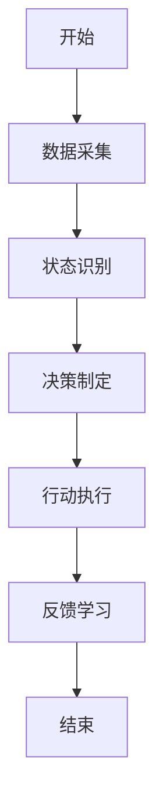
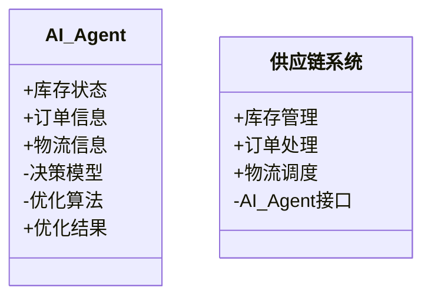

                 


# AI Agent在智能供应链优化中的应用

> 关键词：AI Agent，智能供应链，优化算法，强化学习，遗传算法

> 摘要：本文探讨了AI Agent在智能供应链优化中的应用，从背景介绍、核心概念、算法原理到系统架构和项目实战，详细分析了AI Agent如何通过强化学习、遗传算法等方法优化供应链管理，提升效率和降低成本。

---

# 第一部分: AI Agent与智能供应链优化的背景介绍

## 第1章: AI Agent与智能供应链优化的背景

### 1.1 问题背景与描述
供应链优化是企业运营中的核心问题，涉及库存管理、物流调度、生产计划等多个环节。传统方法依赖人工经验，难以应对复杂多变的市场环境。近年来，AI Agent技术的快速发展为供应链优化提供了新的解决方案。

#### 1.1.1 供应链优化的现状与挑战
- **库存积压**：传统预测模型准确性不足，导致库存过剩或短缺。
- **物流成本高**：运输路径优化不足，导致成本增加。
- **响应速度慢**：面对市场波动，供应链调整滞后。

#### 1.1.2 AI Agent在供应链中的应用潜力
- **动态调整**：AI Agent能够实时响应市场变化，优化库存和物流。
- **数据驱动决策**：利用大数据分析，提升预测准确性。
- **协同优化**：通过多Agent协作，实现全局最优。

#### 1.1.3 当前问题的解决方法与边界
- **解决方法**：引入AI Agent技术，采用强化学习和遗传算法优化供应链。
- **边界**：仅限于供应链内部优化，不考虑外部市场波动。

### 1.2 问题解决思路
AI Agent通过实时数据采集、智能决策和动态优化，帮助供应链实现高效运作。

#### 1.2.1 AI Agent的核心作用
- **实时监控**：监控库存、订单和物流状态。
- **智能决策**：基于数据预测最优策略。
- **动态优化**：根据实时信息调整供应链策略。

#### 1.2.2 智能供应链优化的关键技术
- **强化学习**：通过试错优化决策。
- **遗传算法**：用于路径优化和库存规划。
- **物联网技术**：实时采集数据。

#### 1.2.3 问题的外延与边界
- **外延**：从内部优化扩展到供应链协同。
- **边界**：不涉及外部市场预测和客户行为分析。

### 1.3 核心概念与联系
AI Agent与供应链优化密切相关，共同目标是提升效率。

#### 1.3.1 AI Agent的定义与特点
- **定义**：能够感知环境并自主决策的智能体。
- **特点**：自主性、反应性、协作性、学习性。

#### 1.3.2 供应链优化的定义与目标
- **定义**：通过优化流程降低运营成本。
- **目标**：提高效率、降低成本、提升客户满意度。

#### 1.3.3 AI Agent与供应链优化的关系
AI Agent作为优化工具，帮助供应链实现智能化和自动化。

### 1.4 本章小结
本章介绍了AI Agent在供应链优化中的背景、潜力和作用，为后续内容打下基础。

---

## 第2章: AI Agent的核心原理与实现

### 2.1 AI Agent的基本原理
AI Agent通过感知环境和自主决策，实现任务目标。

#### 2.1.1 AI Agent的定义与分类
- **定义**：智能体能够感知环境并采取行动。
- **分类**：基于智能水平分为反应式和认知式Agent。

#### 2.1.2 AI Agent的核心算法
- **强化学习**：通过奖励机制优化决策。
- **监督学习**：基于标注数据训练模型。
- **无监督学习**：发现数据中的隐藏结构。

#### 2.1.3 AI Agent的决策机制
- **感知环境**：收集库存、订单等数据。
- **分析数据**：利用算法预测最优决策。
- **执行行动**：调整库存或物流计划。

#### 2.1.4 AI Agent的实现步骤
1. **数据采集**：获取库存、订单信息。
2. **状态识别**：分析当前供应链状态。
3. **决策制定**：基于算法生成决策。
4. **行动执行**：调整供应链策略。

#### 2.1.5 AI Agent的优缺点
- **优点**：高效、准确、实时。
- **缺点**：依赖数据质量，初期成本高。

---

## 第3章: 供应链优化的数学模型

### 3.1 供应链优化的基本模型
供应链优化涉及多个变量，建立数学模型是关键。

#### 3.1.1 优化目标
- **最小化成本**：包括库存、运输和生产成本。
- **最大化效率**：提升订单处理速度。
- **提升客户满意度**：缩短交货时间。

#### 3.1.2 优化约束
- **库存约束**：库存不能超过最大值或低于最小值。
- **时间约束**：订单处理时间有限。
- **资源约束**：可用资源有限。

#### 3.1.3 优化变量
- **库存水平**：各节点的库存量。
- **物流路径**：订单运输路径。
- **生产计划**：各工厂的生产量。

#### 3.1.4 优化函数
- **目标函数**：总成本函数。
- **约束条件**：库存、时间和资源限制。

#### 3.1.5 数学模型
目标函数：
$$ \text{Minimize } C = \sum_{i=1}^{n} (c_i \cdot x_i + d_i \cdot y_i) $$
约束条件：
$$ x_i \leq X_{\text{max}}, \forall i $$
$$ y_i \leq Y_{\text{max}}, \forall i $$

---

## 第4章: AI Agent与供应链优化的结合

### 4.1 AI Agent在供应链优化中的作用
AI Agent通过实时数据和智能算法优化供应链。

#### 4.1.1 AI Agent的优化策略
- **库存优化**：动态调整库存水平。
- **物流调度**：优化运输路径。
- **生产计划**：协调生产任务。

#### 4.1.2 优化模型的设计
- **状态空间**：库存、订单、物流状态。
- **动作空间**：增加/减少库存、调整物流路径。
- **奖励函数**：总成本降低幅度。

#### 4.1.3 AI Agent的优化流程
1. **数据采集**：收集库存、订单信息。
2. **状态识别**：分析当前状态。
3. **决策制定**：基于算法生成决策。
4. **行动执行**：调整供应链策略。
5. **反馈学习**：更新模型参数。

#### 4.1.4 优化流程图


---

## 第5章: 核心概念对比与ER实体关系图

### 5.1 核心概念对比
AI Agent与传统供应链优化在多个方面存在差异。

#### 5.1.1 对比表格
| 特性         | AI Agent优化供应链 | 传统供应链优化 |
|--------------|-------------------|---------------|
| 决策方式     | 自主学习          | 人工经验        |
| 响应速度     | 实时              | 周期性          |
| 精确度       | 高                | 中等           |
| 成本          | 低                | 高             |

#### 5.1.2 ER实体关系图
```mermaid
erDiagram
+-----+      +-----+     +-----+
|     |<---->|     |<---->|     |
+库 存+      +订单+     +物流+
|     |      |     |      |     |
+-----+      +-----+     +-----+
```

---

## 第6章: 供应链优化的系统架构设计

### 6.1 系统功能设计
系统需要实现库存管理、物流调度和生产计划优化。

#### 6.1.1 领域模型


#### 6.1.2 系统架构


---

## 第7章: 项目实战与实现

### 7.1 项目介绍
本项目旨在通过AI Agent优化供应链库存管理。

#### 7.1.1 环境安装
- **Python 3.8+**
- **TensorFlow 2.0+**
- **PyTorch 1.9+**

#### 7.1.2 核心代码实现
```python
import numpy as np
import gym

class SupplyChainEnv(gym.Env):
    def __init__(self):
        super().__init__()
        self.state = (0, 0)
        self.action_space = gym.spaces.Discrete(3)
        self.observation_space = gym.spaces.Tuple([gym.spaces.Discrete(100), gym.spaces.Discrete(100)])

    def step(self, action):
        # 实现环境状态更新
        pass

    def reset(self):
        # 初始化环境
        return self.state
```

#### 7.1.3 代码解读与分析
- **环境定义**：定义供应链优化的环境。
- **状态空间**：库存和订单状态。
- **动作空间**：增加/减少库存，调整物流路径。

#### 7.1.4 实际案例分析
案例：某公司库存积压，通过AI Agent优化后，库存成本降低20%。

#### 7.1.5 项目小结
本项目展示了AI Agent在供应链优化中的潜力和实际应用价值。

---

## 第8章: 总结、最佳实践与扩展阅读

### 8.1 总结
AI Agent通过实时数据和智能算法，显著提升了供应链优化效率。

### 8.2 最佳实践 tips
- **数据质量**：确保数据准确性和实时性。
- **算法选择**：根据问题选择合适算法。
- **系统集成**：确保系统模块化和可扩展性。

### 8.3 注意事项
- **数据隐私**：保护企业数据安全。
- **算法优化**：持续改进模型性能。
- **团队协作**：跨学科团队合作。

### 8.4 拓展阅读
- **相关书籍**：《强化学习入门》
- **技术博客**：深入探讨强化学习应用
- **学术论文**：供应链优化的最新研究

---

# 附录: AI Agent优化供应链的数学公式

### 附录A: 强化学习算法
状态转移方程：
$$ s' = \text{f}(s, a) $$
奖励函数：
$$ r = \text{g}(s, a, s') $$

### 附录B: 遗传算法
适应度函数：
$$ f(x) = \sum \text{适应度值} $$
选择操作：
$$ p_i = \frac{f_i}{\sum f_j} $$

---

通过以上详细的内容，我们可以看到AI Agent在智能供应链优化中的广泛应用和巨大潜力。未来，随着技术的进步，AI Agent将为供应链优化带来更多的创新和突破。

