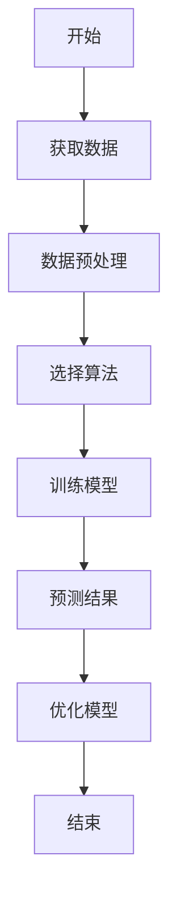
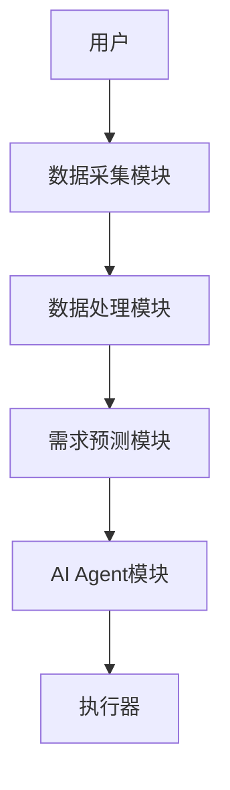

                 


# AI Agent在智能供应链需求预测中的应用

**关键词**：AI Agent，智能供应链，需求预测，时间序列预测，机器学习，深度学习

**摘要**：本文深入探讨了AI Agent在智能供应链需求预测中的应用，分析了AI Agent的核心概念、算法原理、系统架构设计以及实际应用案例。通过详细的技术分析和实际案例解读，展示了AI Agent如何提升供应链需求预测的准确性、实时性和智能化水平，为供应链优化提供了新的思路和解决方案。

---

# 第一部分: AI Agent与智能供应链需求预测的背景

# 第1章: AI Agent与智能供应链需求预测的背景

## 1.1 AI Agent的基本概念

### 1.1.1 AI Agent的定义

AI Agent（人工智能代理）是一种能够感知环境、自主决策并执行任务的智能实体。它通过传感器获取数据，利用算法进行分析和推理，并通过执行器与环境交互。AI Agent的核心目标是通过智能化手段解决复杂问题，优化决策过程。

### 1.1.2 AI Agent的核心特征

- **自主性**：AI Agent能够在没有外部干预的情况下自主完成任务。
- **反应性**：能够实时感知环境变化并做出响应。
- **学习能力**：通过数据和经验不断优化自身的预测和决策能力。
- **协作性**：能够与其他AI Agent或系统协同工作，实现更复杂的任务。

### 1.1.3 AI Agent与传统供应链的区别

传统供应链依赖于人工分析和固定规则，而AI Agent能够通过机器学习和大数据分析，实时优化供应链的各个环节，提升预测精度和效率。

---

## 1.2 智能供应链的需求预测挑战

### 1.2.1 供应链需求预测的复杂性

供应链需求预测需要考虑市场波动、生产成本、库存管理、客户需求等多种因素，传统方法往往难以准确预测。

### 1.2.2 传统需求预测方法的局限性

- **数据不足**：传统方法依赖历史数据，但在动态市场中数据可能不够充分。
- **模型单一**：传统方法通常采用单一模型，难以捕捉复杂的市场变化。
- **实时性差**：传统方法难以实现实时预测和快速响应。

### 1.2.3 AI Agent在需求预测中的优势

- **数据驱动**：AI Agent能够利用大数据分析，提高预测的准确性。
- **实时性**：AI Agent能够实现实时数据处理和预测，快速响应市场变化。
- **自我优化**：AI Agent通过不断学习和优化算法，提升预测精度。

---

## 1.3 AI Agent在供应链中的应用场景

### 1.3.1 需求预测的主要场景

- **库存管理**：通过预测需求优化库存水平，避免过剩或短缺。
- **生产计划**：根据需求预测制定生产计划，提高生产效率。
- **供应链协同**：通过AI Agent实现供应链上下游的协同优化。

### 1.3.2 AI Agent在供应链中的具体应用

- **需求预测优化**：利用AI Agent进行实时需求预测，提高预测准确性。
- **库存优化**：通过AI Agent优化库存管理，降低库存成本。
- **供应链协同**：实现供应链上下游的信息共享和协同决策。

### 1.3.3 AI Agent的优势与潜力

- **提升效率**：AI Agent能够快速处理大量数据，提高供应链的运行效率。
- **降低成本**：通过优化库存和生产计划，降低供应链成本。
- **增强灵活性**：AI Agent能够快速适应市场变化，增强供应链的灵活性。

---

## 1.4 本章小结

本章介绍了AI Agent的基本概念和核心特征，分析了传统供应链需求预测的挑战和局限性，探讨了AI Agent在供应链中的应用场景及其优势。通过这些分析，我们为后续章节的深入探讨奠定了基础。

---

# 第二部分: AI Agent的核心概念与原理

# 第2章: AI Agent的核心概念与原理

## 2.1 AI Agent的特征对比

### 2.1.1 AI Agent与传统算法的对比

| 特征       | 传统算法                | AI Agent               |
|------------|------------------------|-------------------------|
| 数据依赖性  | 依赖少量规则和历史数据  | 依赖大量实时数据        |
| 自主性      | 依赖人工干预            | 自主决策和执行          |
| 学习能力    | 无法学习                | 具备学习能力            |
| 实时性      | 无法实现实时响应        | 能够实现实时响应        |

### 2.1.2 AI Agent与其他AI技术的对比

- **与传统机器学习的对比**：AI Agent具有更强的自主性和实时性，能够动态调整模型参数。
- **与深度学习的对比**：AI Agent结合了深度学习的特征提取能力，同时具备实时决策的优势。

---

## 2.2 AI Agent的实体关系图

```mermaid
er
actor AI Agent
actor 供应链系统
actor 需求预测模块
actor 数据源
actor 执行器
```

### 2.2.1 ER实体关系图的构建

- AI Agent作为核心实体，与其他模块和数据源交互。
- 需求预测模块负责数据处理和预测模型的运行。
- 数据源包括历史销售数据、市场数据、生产数据等。
- 执行器负责根据预测结果执行实际操作，如调整库存或生产计划。

---

## 2.3 AI Agent的算法流程图



---

## 2.4 本章小结

本章通过对比分析和实体关系图，深入探讨了AI Agent的核心概念和原理，为后续章节的算法和系统设计奠定了基础。

---

# 第三部分: AI Agent的算法原理与数学模型

# 第3章: AI Agent的算法原理与数学模型

## 3.1 AI Agent的核心算法

### 3.1.1 基于时间序列的预测算法

#### 3.1.1.1 ARIMA模型

ARIMA（自回归积分滑动平均模型）是一种广泛应用于时间序列预测的算法。

- **数学模型**：
  $$ ARIMA(p, d, q) = y_t = \phi_1 y_{t-1} + \dots + \phi_p y_{t-p} + \theta_1 \epsilon_{t-1} + \dots + \theta_q \epsilon_{t-q} + \epsilon_t $$

#### 3.1.1.2 LSTM模型

LSTM（长短期记忆网络）是一种基于深度学习的时间序列预测算法。

- **数学模型**：
  $$ f(t, h_{t-1}, c_{t-1}) = (\sigma(g(t, h_{t-1})) + 1) \cdot c_{t-1} + \sigma(i(t, h_{t-1})) \cdot tanh(l(t, h_{t-1})) $$

#### 3.1.1.3 Prophet模型

Prophet是一种由Facebook开源的时间序列预测算法。

- **数学模型**：
  $$ Prophet(t) = g(t) + h(t) $$

### 3.1.2 基于机器学习的需求预测算法

#### 3.1.2.1 线性回归

- **数学模型**：
  $$ y = \beta_0 + \beta_1 x + \epsilon $$

#### 3.1.2.2 支持向量回归

- **数学模型**：
  $$ y = sign(w \cdot x + b) $$

### 3.1.3 基于深度学习的需求预测算法

#### 3.1.3.1 卷积神经网络（CNN）

- **数学模型**：
  $$ y = f(x, w) $$

---

## 3.2 AI Agent的改进算法

### 3.2.1 基于强化学习的预测算法

强化学习通过奖励机制优化预测模型。

- **数学模型**：
  $$ R(s, a) = \text{奖励} $$

### 3.2.2 基于协同过滤的预测算法

协同过滤通过用户行为数据进行预测。

- **数学模型**：
  $$ \hat{y}_{ij} = \mu + b_i + b_j + p_i q_j $$

### 3.2.3 基于图神经网络的预测算法

图神经网络通过图结构数据进行预测。

- **数学模型**：
  $$ y = G(x) $$

---

## 3.3 本章小结

本章详细介绍了AI Agent的核心算法及其数学模型，探讨了如何通过改进算法提升需求预测的精度和效率。

---

# 第四部分: 智能供应链需求预测的系统分析与架构设计

# 第4章: 智能供应链需求预测的系统分析与架构设计

## 4.1 问题场景介绍

供应链需求预测的典型场景包括库存管理、生产计划和供应链协同。AI Agent通过实时数据处理和预测优化，帮助供应链实现高效运作。

---

## 4.2 系统功能设计

### 4.2.1 需求预测模块的功能设计

- 数据采集与处理
- 模型训练与预测
- 预测结果输出

### 4.2.2 数据处理模块的功能设计

- 数据清洗与预处理
- 数据存储与管理
- 数据可视化

### 4.2.3 AI Agent模块的功能设计

- 数据感知与分析
- 模型选择与优化
- 决策与执行

---

## 4.3 系统架构设计

### 4.3.1 系统架构的总体设计



### 4.3.2 系统架构的详细设计

- 用户通过数据采集模块输入数据。
- 数据处理模块对数据进行清洗和预处理。
- 需求预测模块选择合适的算法进行预测。
- AI Agent模块优化模型并输出决策结果。
- 执行器根据决策结果执行实际操作。

---

## 4.4 系统接口设计

### 4.4.1 系统接口的定义

- 数据接口：数据采集模块与数据处理模块之间的接口。
- 预测接口：需求预测模块与AI Agent模块之间的接口。
- 执行接口：AI Agent模块与执行器之间的接口。

### 4.4.2 系统接口的实现

- 数据接口：使用JSON格式进行数据传递。
- 预测接口：通过API实现预测结果的输出。
- 执行接口：通过命令或API实现执行器的操作。

---

## 4.5 系统交互设计

### 4.5.1 系统交互的流程

1. 用户输入数据。
2. 数据采集模块获取数据。
3. 数据处理模块对数据进行清洗和预处理。
4. 需求预测模块选择合适的算法进行预测。
5. AI Agent模块优化模型并输出决策结果。
6. 执行器根据决策结果执行实际操作。

### 4.5.2 系统交互的优化

- 实时交互：通过实时数据流进行预测和决策。
- 反馈机制：根据执行结果反馈优化模型。

---

## 4.6 本章小结

本章通过系统分析与架构设计，详细介绍了智能供应链需求预测的实现过程，为后续的项目实战奠定了基础。

---

# 第五部分: 项目实战

# 第5章: 项目实战

## 5.1 环境安装与配置

### 5.1.1 安装Python

- 使用Anaconda安装Python 3.8及以上版本。

### 5.1.2 安装依赖库

- 安装NumPy、Pandas、Scikit-learn、Keras、TensorFlow等库。

### 5.1.3 安装AI Agent框架

- 安装所需的AI Agent框架（如强化学习库、深度学习框架等）。

---

## 5.2 系统核心实现源代码

### 5.2.1 数据处理代码

```python
import pandas as pd
import numpy as np

# 读取数据
data = pd.read_csv('demand.csv')

# 数据清洗
data.dropna(inplace=True)
data = data[~data['date'].isna()]
data['date'] = pd.to_datetime(data['date'])
data.set_index('date', inplace=True)
```

### 5.2.2 预测模型代码

```python
from sklearn.model_selection import train_test_split
from sklearn.linear_model import LinearRegression
from sklearn.metrics import mean_squared_error

# 数据分割
train, test = train_test_split(data, test_size=0.2)

# 模型训练
model = LinearRegression()
model.fit(train[['feature']], train['target'])

# 模型预测
predict = model.predict(test[['feature']])
print(mean_squared_error(test['target'], predict))
```

### 5.2.3 AI Agent代码

```python
import keras
from keras.models import Sequential
from keras.layers import LSTM, Dense

# 模型定义
model = Sequential()
model.add(LSTM(64, input_shape=(timesteps, features)))
model.add(Dense(1))
model.compile(loss='mean_squared_error', optimizer='adam')

# 模型训练
model.fit(X_train, y_train, epochs=100, batch_size=32)
```

---

## 5.3 代码应用解读与分析

### 5.3.1 数据处理模块的实现

- 数据清洗：删除缺失值，处理无效数据。
- 数据转换：将日期转换为时间索引，便于后续分析。

### 5.3.2 预测模型的实现

- 线性回归模型：用于简单的线性预测。
- LSTM模型：用于复杂的时间序列预测。

### 5.3.3 AI Agent的实现

- 模型定义：定义LSTM和 Dense层，构建预测模型。
- 模型训练：使用训练数据优化模型参数。
- 模型预测：利用训练好的模型进行需求预测。

---

## 5.4 实际案例分析

### 5.4.1 案例背景

假设我们有一个零售企业的销售数据，需要预测未来三个月的销售量。

### 5.4.2 数据分析

- 数据来源：历史销售数据、市场数据、促销活动数据等。
- 数据预处理：清洗、转换和标准化。

### 5.4.3 预测结果与优化

- 使用LSTM模型进行预测，预测结果与实际数据进行对比。
- 根据预测误差优化模型参数，提升预测精度。

---

## 5.5 项目总结

通过项目实战，我们验证了AI Agent在供应链需求预测中的有效性，展示了如何通过代码实现预测模型，并通过实际案例分析优化预测结果。

---

# 第六部分: 最佳实践与总结

# 第6章: 最佳实践与总结

## 6.1 最佳实践

### 6.1.1 数据质量管理

- 确保数据的完整性和准确性。
- 定期更新和维护数据。

### 6.1.2 模型优化

- 根据实际需求选择合适的算法。
- 定期重新训练模型，保持模型的准确性。

### 6.1.3 系统维护

- 定期检查系统运行状态。
- 及时修复系统故障，确保系统的稳定性。

---

## 6.2 小结

AI Agent通过实时数据处理和智能预测，显著提升了供应链需求预测的准确性和效率，为企业的供应链优化提供了新的思路和解决方案。

---

## 6.3 注意事项

- **数据隐私**：确保数据的安全性和隐私性。
- **模型更新**：定期更新模型，避免模型过时。
- **系统容错**：设计容错机制，确保系统在异常情况下的稳定性。

---

## 6.4 拓展阅读

- 《机器学习实战》
- 《深度学习入门》
- 《供应链管理》

---

# 附录

## 附录A: 术语表

- AI Agent：人工智能代理
- 时间序列预测：基于时间序列的数据进行预测
- 强化学习：通过奖励机制优化决策

---

## 附录B: 参考文献

1. Bishop, C. M. (2006). Pattern Recognition and Machine Learning.
2. Goodfellow, I., Bengio, Y., & Courville, A. (2016). Deep Learning.
3. Box, G. E., Jenkins, G. M., & Reinsel, G. C. (2015). Time Series Forecasting: Forecasting Methods and Applications.

---

**结束语**：通过本文的详细分析和实际案例解读，我们展示了AI Agent在智能供应链需求预测中的应用价值。未来，随着AI技术的不断发展，AI Agent将在供应链管理中发挥更加重要的作用。

