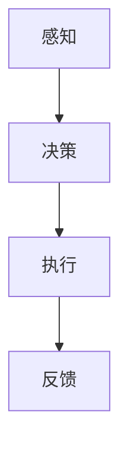
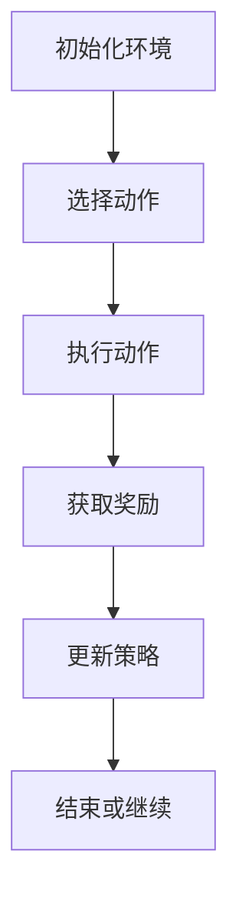
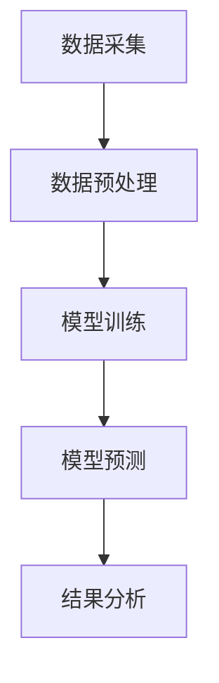
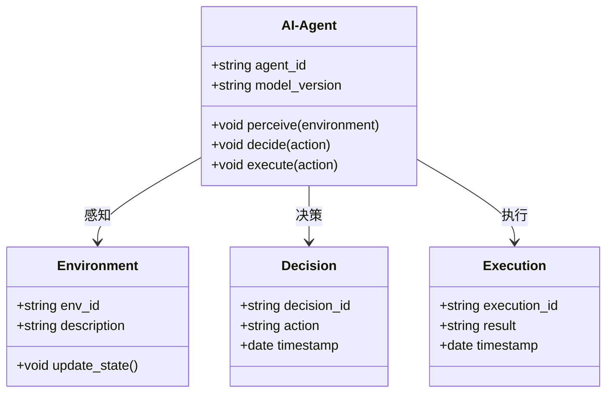
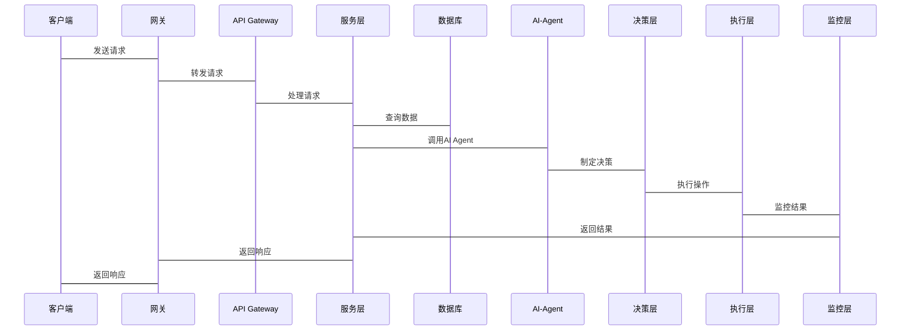

                 


```markdown
# AI Agent在智能供应链风险管理中的应用

> 关键词：AI Agent, 供应链风险管理, 智能供应链, 供应链管理, 人工智能

> 摘要：本文深入探讨了AI Agent在智能供应链风险管理中的应用，从AI Agent的基本概念、核心原理到在供应链风险管理中的具体应用，详细分析了AI Agent如何通过感知、决策和执行机制优化供应链风险管理。文章还结合实际案例，介绍了AI Agent在供应链风险管理中的算法实现、系统架构设计以及项目实战，为读者提供了全面的技术指导。

---

# 第一部分: AI Agent与智能供应链风险管理概述

## 第1章: AI Agent与供应链风险管理概述

### 1.1 AI Agent的基本概念

#### 1.1.1 什么是AI Agent
AI Agent（人工智能代理）是指能够感知环境、做出决策并执行操作的智能实体。AI Agent通过与环境交互，实现特定目标，具有自主性、反应性和社会性等特征。

#### 1.1.2 AI Agent的核心特征
- **自主性**：AI Agent能够在没有外部干预的情况下自主运行。
- **反应性**：AI Agent能够实时感知环境并做出响应。
- **社会性**：AI Agent能够与其他系统、设备或人进行交互和协作。

#### 1.1.3 AI Agent与传统供应链管理的区别
AI Agent能够通过自主学习和优化，实时调整供应链管理策略，而传统供应链管理更多依赖于人工决策和固定流程。

### 1.2 智能供应链风险管理的定义与特点

#### 1.2.1 供应链风险管理的定义
供应链风险管理是指识别、评估和应对影响供应链稳定性和效率的各种风险，如供应链中断、成本波动等。

#### 1.2.2 智能供应链风险管理的核心特征
- **智能化**：通过AI技术实现风险的自动识别和预测。
- **实时性**：能够实时监控供应链的运行状态并做出响应。
- **自适应性**：能够根据环境变化动态调整风险管理策略。

#### 1.2.3 智能供应链风险管理与传统供应链管理的区别
智能供应链风险管理通过AI技术实现了风险管理的智能化和实时化，而传统供应链管理更多依赖于事后处理和人工干预。

### 1.3 AI Agent在智能供应链风险管理中的作用

#### 1.3.1 AI Agent如何优化供应链风险管理
AI Agent能够通过实时感知供应链的状态，快速识别潜在风险，并通过决策算法制定最优应对策略。

#### 1.3.2 AI Agent在供应链风险管理中的优势
- **高效性**：AI Agent能够快速处理大量数据，提高风险管理的效率。
- **准确性**：通过机器学习算法，AI Agent能够更准确地预测和评估风险。
- **自适应性**：AI Agent能够根据环境变化动态调整风险管理策略。

#### 1.3.3 AI Agent在供应链风险管理中的挑战
- **数据依赖性**：AI Agent的性能依赖于数据的质量和数量。
- **算法复杂性**：复杂的算法可能增加系统的实现难度和计算成本。
- **安全性和隐私性**：AI Agent的广泛应用可能带来数据安全和隐私保护的问题。

### 1.4 本章小结
本章介绍了AI Agent的基本概念和核心特征，探讨了智能供应链风险管理的定义和特点，并分析了AI Agent在智能供应链风险管理中的作用、优势和挑战。

---

# 第二部分: AI Agent的核心概念与原理

## 第2章: AI Agent的核心概念与原理

### 2.1 AI Agent的感知机制

#### 2.1.1 感知的定义与作用
感知是指AI Agent通过传感器或其他数据源获取环境信息的能力。感知的作用是为决策提供数据支持。

#### 2.1.2 感知的数据来源
- **环境数据**：如供应链中的库存数据、物流数据等。
- **用户输入**：如用户的操作指令或反馈。
- **外部数据源**：如天气数据、市场数据等。

#### 2.1.3 感知的实现方法
- **数据采集**：通过传感器或API接口获取数据。
- **数据处理**：对采集到的数据进行清洗、转换和分析。
- **数据存储**：将处理后的数据存储在数据库中。

### 2.2 AI Agent的决策机制

#### 2.2.1 决策的定义与作用
决策是指AI Agent根据感知到的信息，选择最优行动方案的过程。决策的作用是指导AI Agent的行为。

#### 2.2.2 决策的算法模型
常用的决策算法包括：
- **规则引擎**：基于预定义的规则进行决策。
- **机器学习模型**：如随机森林、支持向量机等。
- **强化学习模型**：通过试错和奖励机制优化决策。

#### 2.2.3 决策的实现方法
- **规则引擎**：通过编写规则脚本实现决策。
- **机器学习模型**：训练模型并对输入数据进行预测。
- **强化学习模型**：通过与环境交互，优化决策策略。

### 2.3 AI Agent的执行机制

#### 2.3.1 执行的定义与作用
执行是指AI Agent根据决策结果采取具体行动的过程。执行的作用是将决策转化为实际操作。

#### 2.3.2 执行的实现方法
- **自动化操作**：如自动调整库存、下单采购等。
- **人机协作**：AI Agent与人类操作员协同完成任务。
- **远程控制**：通过网络远程控制设备或系统。

#### 2.3.3 执行的监控与反馈
- **实时监控**：通过监控系统实时跟踪执行过程。
- **反馈机制**：将执行结果反馈给AI Agent，用于优化未来的决策。

### 2.4 AI Agent的核心要素对比分析

#### 2.4.1 核心要素对比表格
| 核心要素 | 自主性 | 反应性 | 社会性 |
|----------|--------|--------|--------|
| AI Agent | 是     | 是     | 是     |
| 传统系统 | 否     | 否     | 部分    |

#### 2.4.2 核心要素的ER实体关系图
```mermaid
erDiagram
    actor User {
        string username
        string password
    }
    actor AI-Agent {
        string agent_id
        string model_version
    }
    class Environment {
        string env_id
        string description
    }
    class Decision {
        string decision_id
        string action
        date timestamp
    }
    AI-Agent --> Environment:感知
    AI-Agent --> Decision:决策
    AI-Agent --> Execution:执行
```

#### 2.4.3 核心要素的Mermaid流程图


### 2.5 本章小结
本章详细介绍了AI Agent的核心概念与原理，包括感知、决策和执行机制，并通过对比分析和图形化工具展示了AI Agent的核心要素及其关系。

---

# 第三部分: AI Agent在供应链风险管理中的算法原理

## 第3章: AI Agent的算法原理

### 3.1 基于强化学习的供应链风险

#### 3.1.1 强化学习的基本概念
强化学习是一种机器学习方法，通过试错和奖励机制优化决策策略。

#### 3.1.2 强化学习在供应链风险管理中的应用
- **状态空间**：供应链中的库存、需求、供应商等状态。
- **动作空间**：调整订单量、优化物流路线等动作。
- **奖励函数**：根据供应链的运行效率和成本计算奖励值。

#### 3.1.3 基于强化学习的风险评估模型
```python
import numpy as np
import gym

class SupplyChainEnv(gym.Env):
    def __init__(self):
        super().__init__()
        self.state = np.array([0, 0, 0])  # 库存、需求、供应商状态
        self.action_space = gym.spaces.Discrete(3)  # 调整订单量：0（减少）、1（保持）、2（增加）
        self.observation_space = gym.spaces.Box(low=0, high=100, shape=self.state.shape)

    def step(self, action):
        # 更新状态
        # 返回新的状态、奖励、是否结束、信息
        pass

    def reset(self):
        # 初始化状态
        pass
```

#### 3.1.4 强化学习算法的数学模型
- **损失函数**：衡量预测值与真实值之间的差距。
  $$ \text{损失函数} = \frac{1}{2}(y_{\text{真实}} - y_{\text{预测}})^2 $$
- **优化目标**：最小化损失函数，提高模型的预测准确率。
  $$ \min \text{损失函数} $$

#### 3.1.5 强化学习算法的实现步骤


### 3.2 基于机器学习的风险预测模型

#### 3.2.1 机器学习的基本概念
机器学习是一种通过数据训练模型，实现预测和分类的技术。

#### 3.2.2 机器学习在供应链风险管理中的应用
- **风险预测**：预测供应链中断的可能性。
- **成本预测**：预测供应链运营成本。
- **需求预测**：预测市场需求变化。

#### 3.2.3 基于机器学习的风险预测模型
```python
from sklearn.ensemble import RandomForestRegressor

class RiskPredictionModel:
    def __init__(self):
        self.model = RandomForestRegressor(n_estimators=100)

    def train(self, X, y):
        self.model.fit(X, y)

    def predict(self, X):
        return self.model.predict(X)
```

#### 3.2.4 机器学习算法的数学模型
- **随机森林模型**：通过构建多个决策树，集成预测结果。
  $$ y = \sum_{i=1}^{n} \text{树预测结果}_i $$

### 3.3 AI Agent在供应链风险管理中的算法实现

#### 3.3.1 算法实现的步骤


#### 3.3.2 算法实现的代码示例
```python
import pandas as pd
from sklearn.model_selection import train_test_split
from sklearn.metrics import mean_squared_error

# 数据采集
data = pd.read_csv('supply_chain_data.csv')

# 数据预处理
X = data.drop('risk_level', axis=1)
y = data['risk_level']

# 数据分割
X_train, X_test, y_train, y_test = train_test_split(X, y, test_size=0.2)

# 模型训练
model = RandomForestRegressor(n_estimators=100)
model.fit(X_train, y_train)

# 模型预测
y_pred = model.predict(X_test)

# 结果分析
mse = mean_squared_error(y_test, y_pred)
print(f"均方误差：{mse}")
```

### 3.4 本章小结
本章详细介绍了AI Agent在供应链风险管理中的算法原理，包括基于强化学习和机器学习的算法实现，并通过代码示例展示了如何利用这些算法优化供应链风险管理。

---

# 第四部分: 系统分析与架构设计方案

## 第4章: 系统分析与架构设计方案

### 4.1 问题场景介绍

#### 4.1.1 供应链风险管理的常见问题
- **库存积压**：库存过多导致资金占用。
- **供应链中断**：供应商延迟或物流问题导致供应链中断。
- **成本上升**：原材料价格上涨或物流成本增加。

#### 4.1.2 AI Agent如何解决这些问题
- **库存优化**：通过预测需求，优化库存管理。
- **风险预警**：实时监控供应链状态，提前预警潜在风险。
- **成本控制**：通过优化采购和物流，降低运营成本。

### 4.2 项目介绍

#### 4.2.1 项目目标
开发一个基于AI Agent的智能供应链风险管理系统，实现风险的实时监测和优化管理。

#### 4.2.2 项目范围
- **数据采集**：整合供应链相关的数据，如库存、物流、市场等。
- **模型开发**：开发AI Agent的核心算法，实现风险预测和优化。
- **系统集成**：将AI Agent集成到现有的供应链管理系统中。

### 4.3 系统功能设计

#### 4.3.1 领域模型设计


#### 4.3.2 系统架构设计


### 4.4 系统接口设计

#### 4.4.1 系统接口的设计
- **API接口**：提供RESTful API，供其他系统调用。
- **数据接口**：与数据库或其他数据源进行交互。

#### 4.4.2 系统接口的交互流程


### 4.5 本章小结
本章通过对供应链风险管理的常见问题进行分析，提出了基于AI Agent的智能供应链风险管理系统的解决方案，并详细设计了系统的功能模块和架构。

---

# 第五部分: 项目实战与应用

## 第5章: 项目实战与应用

### 5.1 项目实战

#### 5.1.1 环境安装
```bash
pip install numpy pandas scikit-learn gym matplotlib
```

#### 5.1.2 系统核心实现源代码

##### 5.1.2.1 AI-Agent类实现
```python
class AI-Agent:
    def __init__(self):
        self.environment = None
        self.decision_model = None
        self.execution_model = None

    def perceive(self, environment):
        self.environment = environment

    def decide(self, action_space):
        # 使用决策模型选择最优动作
        self.decision_model.predict(action_space)

    def execute(self, action):
        # 执行选定的动作
        pass
```

##### 5.1.2.2 决策模型实现
```python
class DecisionModel:
    def __init__(self):
        self.model = RandomForestRegressor(n_estimators=100)

    def train(self, X, y):
        self.model.fit(X, y)

    def predict(self, X):
        return self.model.predict(X)
```

##### 5.1.2.3 执行层实现
```python
class ExecutionLayer:
    def __init__(self):
        pass

    def execute_action(self, action):
        # 执行选定的动作
        pass
```

#### 5.1.3 代码应用解读与分析
- **AI-Agent类**：负责感知环境、决策和执行。
- **决策模型**：使用随机森林回归模型进行风险预测。
- **执行层**：根据决策结果执行具体操作。

#### 5.1.4 实际案例分析
假设我们有一个供应链系统，包括库存、需求和供应商三个核心要素。通过AI Agent实时感知这三个要素的状态，并根据状态变化调整供应链管理策略。

### 5.2 项目小结
本章通过实际项目实战，展示了如何利用AI Agent优化供应链风险管理。通过具体的代码实现和案例分析，帮助读者更好地理解AI Agent在供应链风险管理中的应用。

---

# 第六部分: 最佳实践与总结

## 第6章: 最佳实践与总结

### 6.1 最佳实践

#### 6.1.1 数据质量管理
确保数据的准确性和完整性，是AI Agent发挥效

