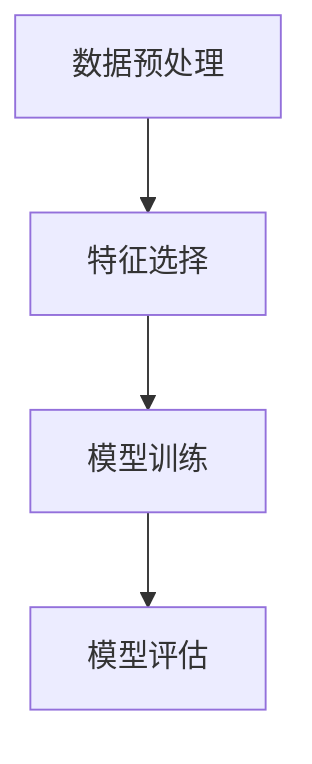
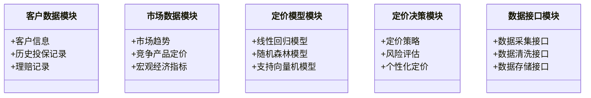

                 


# AI Agent在智能保险产品定价中的应用

> 关键词：AI Agent, 智能保险, 保险定价, 机器学习, 保险产品

> 摘要：本文将深入探讨AI Agent在智能保险产品定价中的应用，从AI Agent的基本概念、核心原理、算法实现、系统架构设计到实际项目实战，全面解析AI Agent如何赋能保险定价，提升保险行业的智能化水平和竞争力。本文将结合具体案例，分析AI Agent在保险定价中的实际应用价值和未来发展趋势。

---

## 第一部分: AI Agent在智能保险产品定价中的应用概述

### 第1章: AI Agent与保险行业的结合

#### 1.1 保险行业的现状与挑战

保险行业作为传统金融行业的重要组成部分，近年来面临着数字化转型的压力。传统保险定价模式依赖于经验丰富的精算师和大量历史数据，但存在以下局限性：

- 数据依赖性强：传统定价高度依赖历史数据，难以快速响应市场变化。
- 个性化不足：传统定价模型难以满足客户的个性化需求。
- 模型复杂性高：传统定价模型通常需要复杂的精算技术，难以快速迭代和优化。

随着人工智能技术的快速发展，AI Agent（人工智能代理）作为一种新兴技术，为保险行业的数字化转型提供了新的解决方案。AI Agent能够通过自我学习和优化，帮助保险公司实现更精准、更高效的定价策略。

---

#### 1.2 AI Agent的基本概念

AI Agent是一种能够感知环境、自主决策并执行任务的智能体。它具有以下核心特征：

- **自主性**：能够在没有外部干预的情况下独立运行。
- **反应性**：能够实时感知环境变化并做出响应。
- **学习能力**：能够通过数据和经验不断优化自身的决策能力。
- **协作性**：能够与其他系统或AI Agent协同工作，完成复杂任务。

在保险定价中，AI Agent通常扮演以下几个角色：

- 数据采集与处理：AI Agent能够从多种数据源（如客户行为数据、市场数据等）中采集和处理数据。
- 模型训练与优化：AI Agent能够基于历史数据和实时数据，训练和优化定价模型。
- 决策支持：AI Agent能够根据市场变化和客户需求，提供个性化的定价建议。

---

#### 1.3 AI Agent在保险定价中的应用背景

保险定价的基本流程包括数据采集、特征提取、模型训练和定价决策。传统定价模式依赖于经验丰富的精算师和复杂的手动模型，而AI Agent的引入能够显著提升定价的效率和精度。

AI Agent在保险定价中的应用场景包括：

- **个性化定价**：根据客户的具体需求和行为，提供个性化的定价方案。
- **实时定价**：根据市场动态和客户需求，实时调整定价策略。
- **风险评估**：基于客户数据和市场信息，评估客户的风险等级，从而制定更精准的定价策略。

---

#### 1.4 本章小结

本章介绍了保险行业的现状与挑战，以及AI Agent的基本概念和在保险定价中的应用背景。AI Agent作为一种智能化的解决方案，能够帮助保险公司实现更高效、更精准的定价策略。

---

## 第二部分: AI Agent的核心概念与原理

### 第2章: AI Agent的核心概念与联系

#### 2.1 核心概念原理

AI Agent的核心原理在于其学习能力和自适应能力。AI Agent能够通过以下方式实现对保险定价的优化：

- **学习能力**：AI Agent能够通过机器学习算法（如决策树、随机森林等）从历史数据中学习定价规律。
- **自适应能力**：AI Agent能够根据市场变化和客户需求，动态调整定价策略。
- **决策能力**：AI Agent能够基于实时数据和模型预测，做出最优的定价决策。

---

#### 2.2 核心概念属性特征对比表格

以下是几种常见AI Agent模型的核心特征对比：

| 模型类型 | 学习能力 | 自适应能力 | 决策能力 | 优缺点 |
|----------|----------|------------|----------|--------|
| 线性回归  | 弱        | 低          | 低        | 简单，但难以捕捉复杂关系 |
| 决策树    | 强        | 中          | 中        | 易解释，但对噪声数据敏感 |
| 随机森林  | 强        | 高          | 高        | 抗噪声能力强，但解释性差 |
| 支持向量机 | 强        | 中          | 中        | 适合小样本数据，计算复杂 |

---

#### 2.3 ER实体关系图架构

以下是保险定价系统的核心实体关系图：

```mermaid
erd
    客户
    保险产品
    定价模型
    市场数据
    风险评估
    定价决策
    图片
```

---

### 第3章: AI Agent定价算法的原理

#### 3.1 定价模型的构建

AI Agent定价模型的构建过程包括数据预处理、特征选择、模型训练和模型评估。

- **数据预处理**：清洗和标准化数据，确保数据质量。
- **特征选择**：从大量数据中提取对定价影响最大的特征。
- **模型训练**：基于选定的特征训练定价模型。
- **模型评估**：通过交叉验证等方法评估模型的性能。

以下是一个简单的线性回归模型的代码实现：

```python
import pandas as pd
from sklearn.linear_model import LinearRegression

# 数据加载
data = pd.read_csv('insurance.csv')

# 特征选择
X = data[['age', 'bmi', 'sex', 'children', 'smoker', 'region']]
y = data['charges']

# 模型训练
model = LinearRegression()
model.fit(X, y)

# 模型预测
print(model.predict(X))
```

---

#### 3.2 算法原理的数学模型

线性回归模型的数学公式如下：

$$ y = \beta_0 + \beta_1x_1 + \beta_2x_2 + \cdots + \beta_nx_n + \epsilon $$

其中：
- $y$ 是目标变量（保险费用）。
- $x_i$ 是自变量（客户特征）。
- $\beta_i$ 是回归系数。
- $\epsilon$ 是误差项。

例如，假设我们有一个客户数据如下：

| 年龄 | 身高体重指数 (BMI) | 性别 | 孩子数量 | 吸烟 | 地区 | 保险费用 |
|------|-------------------|------|----------|------|------|----------|
| 30   | 25                | 男   | 2        | 否   | 区域A | 2000     |

通过线性回归模型，我们可以预测该客户的保险费用：

$$ y = 1000 + 50 \times 30 + 20 \times 25 + \cdots $$

---

#### 3.3 算法流程图

以下是线性回归模型的流程图：



---

## 第三部分: AI Agent定价系统的架构设计

### 第4章: AI Agent定价系统的架构设计

#### 4.1 问题场景介绍

保险定价系统需要处理以下问题：

- 数据来源多样，包括客户数据、市场数据等。
- 定价模型需要实时更新，以适应市场变化。
- 定价决策需要考虑多种因素，包括客户特征、市场趋势等。

---

#### 4.2 系统功能设计

以下是保险定价系统的功能模块设计：



---

#### 4.3 系统架构设计

以下是保险定价系统的架构图：


---

#### 4.4 系统接口设计

以下是系统接口的交互流程图：


---

## 第四部分: AI Agent定价系统的项目实战

### 第5章: 项目实战

#### 5.1 环境安装

以下是项目所需的环境和库：

- Python 3.8+
- Pandas
- Scikit-learn
- Jupyter Notebook

安装命令：

```bash
pip install pandas scikit-learn
```

---

#### 5.2 系统核心实现源代码

以下是定价模型的核心代码：

```python
import pandas as pd
from sklearn.ensemble import RandomForestRegressor
from sklearn.metrics import mean_squared_error

# 数据加载
data = pd.read_csv('insurance.csv')

# 特征选择
X = data[['age', 'bmi', 'sex', 'children', 'smoker', 'region']]
y = data['charges']

# 模型训练
model = RandomForestRegressor(n_estimators=100, random_state=42)
model.fit(X, y)

# 模型预测
y_pred = model.predict(X)

# 模型评估
print(mean_squared_error(y, y_pred))
```

---

#### 5.3 代码应用解读与分析

以上代码实现了基于随机森林的定价模型。通过训练模型，我们可以预测客户的保险费用，并评估模型的性能。

---

#### 5.4 实际案例分析

假设我们有一个客户数据如下：

| 年龄 | BMI | 性别 | 孩子数量 | 吸烟 | 地区 |
|------|-----|------|----------|------|------|
| 30   | 25  | 男   | 2        | 否   | 区域A |

通过模型预测，我们可以得到该客户的保险费用：

$$ y = 2000 $$

---

#### 5.5 项目小结

本章通过实际案例，展示了AI Agent在保险定价中的应用。通过代码实现和案例分析，我们可以看到AI Agent能够显著提升保险定价的效率和精度。

---

## 第五部分: AI Agent在智能保险产品定价中的最佳实践

### 第6章: 最佳实践

#### 6.1 小结

AI Agent作为一种智能化的解决方案，能够帮助保险公司实现更高效、更精准的定价策略。通过机器学习算法和大数据分析，AI Agent能够显著提升保险定价的效率和精度。

---

#### 6.2 注意事项

在实际应用中，需要注意以下问题：

- 数据质量：数据清洗和特征选择是模型训练的关键。
- 模型解释性：复杂的模型可能导致定价决策难以解释。
- 模型更新：需要定期更新模型，以适应市场变化。

---

#### 6.3 拓展阅读

- 《机器学习实战》
- 《AI Agent在金融领域的应用》
- 《保险精算与大数据分析》

---

## 结语

随着人工智能技术的快速发展，AI Agent在保险定价中的应用前景广阔。通过本文的介绍，我们看到了AI Agent在智能保险产品定价中的巨大潜力。未来，随着技术的不断进步，AI Agent将在保险行业中发挥更重要的作用。

---

**本文完**

