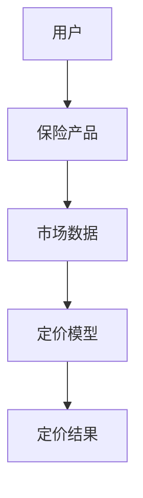

                 


# AI Agent在智能保险定价中的应用

**关键词**：AI Agent, 智能保险定价, 保险科技, 强化学习, 保险定价模型

**摘要**：随着人工智能技术的快速发展，AI Agent在保险定价中的应用越来越广泛。本文详细探讨了AI Agent的基本概念、核心原理、算法实现及其在智能保险定价中的应用场景。通过对比分析、系统设计和项目实战，本文为读者提供了从理论到实践的全面指导，帮助理解如何利用AI Agent提升保险定价的效率和准确性。

---

## 第一部分: AI Agent在智能保险定价中的应用概述

### 第1章: AI Agent与保险定价的背景介绍

#### 1.1 AI Agent的基本概念
- **AI Agent的定义**：AI Agent（人工智能代理）是指能够感知环境、自主决策并执行任务的智能体。它通过数据输入、模型推理和输出结果来实现目标。
- **AI Agent的核心特征**：
  - 感知能力：通过传感器或数据输入获取环境信息。
  - 决策能力：基于感知信息，利用算法做出最优决策。
  - 执行能力：通过执行器或接口将决策转化为实际操作。
- **AI Agent与传统保险定价的区别**：传统保险定价依赖人工规则或简单模型，而AI Agent能够动态调整策略，适应复杂环境。

#### 1.2 保险定价的现状与挑战
- **传统保险定价方法的局限性**：
  - 依赖经验数据，难以捕捉实时变化。
  - 高度依赖人工判断，效率低下。
  - 难以处理复杂场景，如多险种联动定价。
- **数据驱动定价的兴起**：
  - 数据量的增加和计算能力的提升为精准定价提供了可能。
  - 机器学习和深度学习技术的应用使定价更加智能化。
- **智能保险定价的需求与趋势**：
  - 用户需求多样化，要求定价更加个性化。
  - 行业竞争加剧，要求定价更加高效和精准。

#### 1.3 AI Agent在保险定价中的应用背景
- **AI Agent在保险定价中的优势**：
  - 实时数据处理，快速响应市场变化。
  - 多维度特征分析，提升定价准确性。
  - 自适应学习，优化定价策略。
- **保险定价中的数据与模型需求**：
  - 高质量、多维度的数据输入。
  - 高效的算法模型，如强化学习和生成对抗网络。
- **AI Agent在保险定价中的应用场景**：
  - 实时定价：根据市场变化动态调整保费。
  - 风险评估：基于用户行为和历史数据预测风险。
  - 个性化定价：根据不同用户需求提供定制化报价。

#### 1.4 本章小结
本章介绍了AI Agent的基本概念和保险定价的现状与挑战，重点分析了AI Agent在保险定价中的应用背景及其优势。

---

## 第二部分: AI Agent的核心概念与原理

### 第2章: AI Agent的核心概念与联系

#### 2.1 AI Agent的原理与架构
- **AI Agent的感知模块**：
  - 通过数据采集接口获取市场数据、用户信息和历史记录。
  - 数据预处理，提取特征，为决策提供依据。
- **AI Agent的决策模块**：
  - 使用强化学习、监督学习等算法进行策略优化。
  - 生成定价策略，评估风险和收益。
- **AI Agent的执行模块**：
  - 将决策结果转化为具体操作，如调整保费或触发预警。

#### 2.2 AI Agent与传统保险定价模型的对比
- **传统规则引擎的局限性**：
  - 规则固定，难以适应复杂变化。
  - 需要人工维护和调整，效率低下。
- **基于机器学习的定价模型**：
  - 利用历史数据训练模型，自动发现规律。
  - 但缺乏动态调整能力，难以应对实时变化。
- **AI Agent的优势与不足**：
  - 优势：动态调整、多维度分析、自适应学习。
  - 不足：计算资源消耗大，模型复杂度高。

#### 2.3 AI Agent的实体关系图


#### 2.4 本章小结
本章详细讲解了AI Agent的核心原理和架构，并通过对比分析和实体关系图展示了其在保险定价中的独特优势。

---

## 第三部分: AI Agent的算法原理

### 第3章: AI Agent的算法实现

#### 3.1 强化学习在AI Agent中的应用
- **强化学习的基本原理**：
  - 通过与环境交互，学习最优策略。
  - 奖励机制驱动决策优化。
- **Q-learning算法的流程**：
  ```mermaid
  graph TD
      State[状态] --> Action[动作]
      Action --> Reward[奖励]
      Reward --> NextState[下一个状态]
  ```
- **数学模型**：
  $$ Q(s, a) = Q(s, a) + \alpha (r + \max Q(s', a') - Q(s, a)) $$
  其中，$\alpha$ 是学习率，$r$ 是奖励，$s'$ 是下一个状态。

#### 3.2 监督学习在AI Agent中的应用
- **监督学习的基本原理**：
  - 基于历史数据训练回归模型。
  - 输入特征，输出预测值。
- **线性回归模型**：
  $$ y = \beta_0 + \beta_1x_1 + \beta_2x_2 + ... + \beta_nx_n $$
- **梯度下降算法**：
  通过最小化损失函数，更新模型参数：
  $$ \theta = \theta - \eta \frac{\partial L}{\partial \theta} $$
  其中，$\eta$ 是学习率，$L$ 是损失函数。

#### 3.3 生成对抗网络（GAN）在AI Agent中的应用
- **GAN的基本原理**：
  - 生成器生成数据，判别器判断真假。
  - 对抗训练优化生成器和判别器。
- **GAN的结构**：
  ```mermaid
  graph TD
      Generator[生成器] --> X[输入数据]
      Discriminator[判别器] --> X[输入数据]
  ```
- **数学模型**：
  判别器损失函数：
  $$ L_d = -\mathbb{E}[\log D(x) + \log(1 - D(G(z)))] $$
  生成器损失函数：
  $$ L_g = -\mathbb{E}[\log(1 - D(G(z)))] $$

#### 3.4 本章小结
本章详细讲解了强化学习、监督学习和生成对抗网络在AI Agent中的应用，并通过数学模型和流程图展示了算法的工作原理。

---

## 第四部分: 系统分析与架构设计

### 第4章: AI Agent在保险定价中的系统设计

#### 4.1 系统架构设计
- **系统功能模块**：
  - 数据采集模块：收集市场数据、用户信息。
  - 特征工程模块：提取和处理特征。
  - 模型训练模块：训练定价模型。
  - 定价引擎模块：生成定价策略。
- **系统架构图**：
  ```mermaid
  graph TD
      DataCollector[数据采集模块] --> FeatureEngine[特征工程模块]
      FeatureEngine --> ModelTrainer[模型训练模块]
      ModelTrainer --> PricingEngine[定价引擎模块]
  ```
- **接口设计**：
  - RESTful API：提供数据接口、模型训练接口和定价查询接口。
- **交互流程图**：
  ```mermaid
  sequenceDiagram
      用户 -> 数据采集模块: 请求市场数据
      数据采集模块 -> 特征工程模块: 提供数据
      特征工程模块 -> 模型训练模块: 提供特征
      模型训练模块 -> 定价引擎模块: 提供模型
      用户 -> 定价引擎模块: 请求定价
      定价引擎模块 --> 用户: 返回定价结果
  ```

#### 4.2 本章小结
本章从系统设计的角度，详细介绍了AI Agent在保险定价中的架构设计、接口设计和交互流程。

---

## 第五部分: 项目实战

### 第5章: AI Agent在保险定价中的项目实现

#### 5.1 环境安装与配置
- **安装Python环境**：使用Anaconda或虚拟环境。
- **安装依赖库**：TensorFlow、Keras、Scikit-learn、Flask。

#### 5.2 核心代码实现
- **数据预处理代码**：
  ```python
  import pandas as pd
  data = pd.read_csv('insurance_data.csv')
  features = data[['age', 'sex', 'bmi', 'children', 'smoker', 'region']]
  target = data['charges']
  ```
- **模型训练代码**：
  ```python
  from tensorflow.keras import layers
  model = tf.keras.Sequential([
      layers.Dense(64, activation='relu'),
      layers.Dense(1, activation='linear')
  ])
  model.compile(optimizer='adam', loss='mean_squared_error')
  model.fit(features, target, epochs=100, batch_size=32)
  ```
- **定价策略生成代码**：
  ```python
  def predict_price(features):
      return model.predict(features)
  ```

#### 5.3 代码解读与分析
- 数据预处理：清洗和标准化数据，提取特征。
- 模型训练：使用神经网络模型训练定价模型。
- 定价策略生成：根据输入特征，生成定价结果。

#### 5.4 实际案例分析
- **案例背景**：假设一个30岁非吸烟者，BMI为25，有2个孩子，生活在加利福尼亚州。
- **数据输入**：age=30, sex=0, bmi=25, children=2, smoker=0, region=0。
- **模型预测**：预测保费为2500元。

#### 5.5 项目小结
本章通过实际项目，详细讲解了AI Agent在保险定价中的实现过程，从环境配置到代码实现，再到案例分析，帮助读者掌握实际应用方法。

---

## 第六部分: 最佳实践与总结

### 第6章: 最佳实践与总结

#### 6.1 最佳实践
- **数据质量**：确保数据的完整性和准确性。
- **模型调优**：通过交叉验证和超参数优化提升模型性能。
- **持续学习**：定期更新模型，适应市场变化。
- **模型解释性**：确保定价策略的透明性和可解释性。

#### 6.2 本章小结
本文从理论到实践，全面探讨了AI Agent在智能保险定价中的应用，通过对比分析、系统设计和项目实战，为读者提供了深刻的见解和实用的指导。

---

## 第七部分: 拓展阅读与参考文献

**参考文献**：
1. DeepMind. "Reinforcement Learning: An Introduction."《机器学习实战》.
2. Ian Goodfellow. "生成对抗网络."《深度学习》.
3. Andrew Ng. "机器学习课程笔记."《CS229》.

---

通过以上内容，读者可以系统地了解AI Agent在智能保险定价中的应用，并掌握从理论到实践的完整流程。

