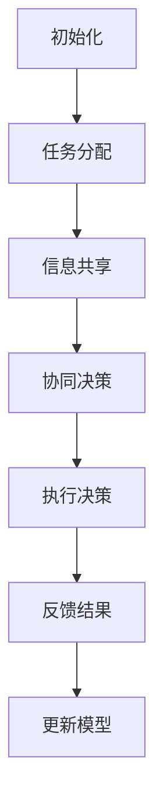
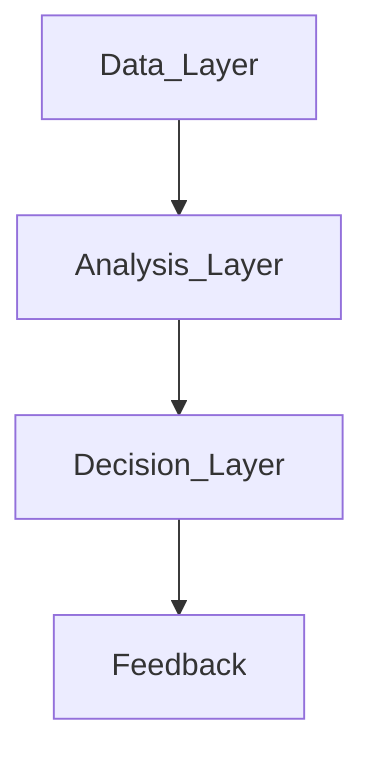
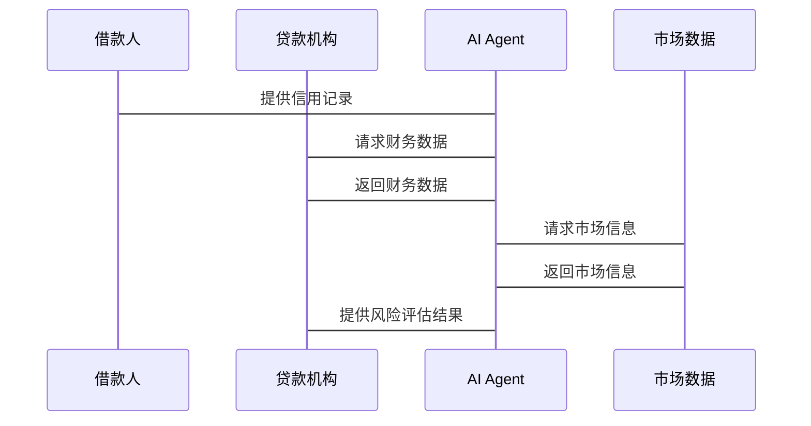

                 


# AI Agent在智能信用风险评估中的应用

## 关键词：AI Agent，信用风险评估，强化学习，多智能体系统，金融风险管理

## 摘要：  
本文探讨了AI Agent在信用风险评估中的应用，结合强化学习和多智能体系统，详细分析了其在金融风险管理中的优势和实现方法。通过系统架构设计和实际案例分析，展示了AI Agent如何提升信用风险评估的效率和准确性。

---

## 第1章: AI Agent与信用风险评估的背景介绍

### 1.1 AI Agent的基本概念与核心要素  
AI Agent是一种智能体，能够感知环境、自主决策并执行任务。在信用风险评估中，AI Agent通过分析大量数据，帮助金融机构识别和管理信用风险。  

#### 1.1.1 AI Agent的定义与特点  
- **定义**：AI Agent是具有自主决策能力的智能体，能够根据环境信息做出最优决策。  
- **特点**：智能性、自主性、反应性、社会性。  

#### 1.1.2 信用风险评估的基本概念  
- **定义**：信用风险评估是通过分析借款人的信用状况，预测其违约概率的过程。  
- **关键指标**：违约概率（PD）、违约损失率（LGD）、风险敞口等。  

#### 1.1.3 AI Agent在信用风险评估中的应用背景  
随着金融市场的复杂化，传统信用风险评估方法逐渐暴露出效率低下、精度不足等问题。AI Agent通过大数据分析和智能决策，为信用风险评估提供了新的解决方案。

### 1.2 问题背景与问题描述  
#### 1.2.1 传统信用风险评估的局限性  
- 数据依赖性强，模型缺乏灵活性。  
- 人工干预较多，效率低下。  

#### 1.2.2 AI Agent在信用风险评估中的问题解决思路  
- 利用AI Agent的自主学习能力，实时分析市场动态和借款人行为。  
- 通过多智能体协同，实现风险的全面监控和预警。  

#### 1.2.3 信用风险评估的边界与外延  
- **边界**：仅关注信用风险，不涉及市场风险和操作风险。  
- **外延**：涵盖借款人、贷款机构、担保方等多方利益相关者。

### 1.3 核心概念与联系  
#### 1.3.1 AI Agent与信用风险评估的核心要素组成  
- AI Agent：感知环境、决策、执行。  
- 信用风险评估：数据采集、分析、预测。  

#### 1.3.2 实体关系图（ER图）与流程图（Mermaid）  
```mermaid
erDiagram
    actor 借款人
    actor 贷款机构
    actor 担保方
    class 信用记录
    class 财务数据
    class 市场数据
    borrower --> credit_record : 提供
    borrower --> financial_data : 提供
    lender --> credit_record : 分析
    lender --> financial_data : 分析
    lender --> market_data : 监控
   担保方 --> credit_record : 分析
```

---

## 第2章: AI Agent的核心概念与原理

### 2.1 AI Agent的核心原理  
#### 2.1.1 多智能体系统（MAS）的基本原理  
多智能体系统由多个相互作用的智能体组成，通过协同完成复杂任务。  

#### 2.1.2 强化学习（RL）在AI Agent中的应用  
强化学习是一种通过试错机制优化决策的算法。  

#### 2.1.3 分布式AI Agent的协同机制  
分布式AI Agent通过通信协议实现协同，提高整体决策效率。

### 2.2 AI Agent与信用风险评估的关联性  
#### 2.2.1 AI Agent在信用评估中的优势  
- 高效性：实时分析数据，快速做出决策。  
- 精准性：利用机器学习算法，提高预测准确性。  

#### 2.2.2 信用风险评估中的多智能体协同  
多智能体协同可以同时分析借款人、贷款机构和市场数据，实现全面风险评估。

#### 2.2.3 AI Agent在信用风险评估中的系统架构  
- **数据采集**：从借款人、贷款机构等多方获取数据。  
- **数据分析**：利用机器学习模型进行特征提取和风险预测。  
- **决策与反馈**：AI Agent根据分析结果做出风险评估，并根据反馈不断优化模型。

### 2.3 核心概念对比分析  
#### 2.3.1 AI Agent与传统信用评估模型的对比  
| 对比维度 | AI Agent | 传统模型 |  
|---------|-----------|-----------|  
| 数据依赖性 | 强 | 弱 |  
| 决策效率 | 高 | 低 |  

#### 2.3.2 不同AI Agent算法的性能对比  
| 算法 | 强化学习 | 多智能体系统 |  
|------|----------|-------------|  
| 优点 | 高效性 | 全面性 |  
| 缺点 | 过度依赖历史数据 | 协同复杂 |  

#### 2.3.3 信用风险评估中的关键指标分析  
- 违约概率（PD）：借款人违约的可能性。  
- 违约损失率（LGD）：违约情况下预期损失的比例。  
- 风险敞口：机构在借款人违约时可能遭受的最大损失。

---

## 第3章: AI Agent在信用风险评估中的算法原理

### 3.1 算法原理概述  
#### 3.1.1 基于强化学习的AI Agent算法  
强化学习通过试错机制优化决策，常用于动态环境中的信用风险评估。  

#### 3.1.2 基于多智能体系统的信用风险评估算法  
多智能体系统通过协同分析借款人、贷款机构和市场数据，实现全面风险评估。

#### 3.1.3 算法的数学模型与公式  
- 强化学习的Q-learning算法：  
  $$ Q(s, a) = Q(s, a) + \alpha [r + \max Q(s', a') - Q(s, a)] $$
- 多智能体协同的数学模型：  
  $$ V(s) = \max_{i} V_i(s) $$  

### 3.2 算法实现与流程图  
#### 3.2.1 强化学习算法的实现流程  
```mermaid
graph TD
    A[初始化] --> B[环境感知]
    B --> C[选择动作]
    C --> D[执行动作]
    D --> E[获取奖励]
    E --> F[更新Q值]
    F --> G[判断终止条件]
    G --> H[结束] || G --> B[继续]
```

#### 3.2.2 多智能体协同算法的实现流程  


### 3.3 数学模型与公式  
#### 3.3.1 强化学习的数学模型  
- 状态空间：\( S \)  
- 动作空间：\( A \)  
- 奖励函数：\( R(s, a) \)  

#### 3.3.2 多智能体协同的数学模型  
- 联合价值函数：\( V(s) = \sum_{i=1}^{n} V_i(s) \)  
- 协作策略：\( \pi_i(s) \) 表示第i个智能体的策略。  

---

## 第4章: 系统分析与架构设计方案

### 4.1 系统分析  
#### 4.1.1 信用风险评估的系统需求分析  
- 数据采集：借款人信息、财务数据、市场数据。  
- 数据分析：特征提取、风险预测。  
- 决策与反馈：风险评估结果、模型优化。  

#### 4.1.2 AI Agent在系统中的角色与功能  
- 数据采集：实时获取借款人信息和市场动态。  
- 数据分析：利用机器学习模型进行风险预测。  
- 决策与反馈：根据分析结果做出风险评估，并根据反馈优化模型。  

### 4.2 系统架构设计  
#### 4.2.1 系统的整体架构设计  
- 数据层：存储借款人信息、财务数据、市场数据。  
- 分析层：进行特征提取和风险预测。  
- 决策层：做出风险评估并提供反馈。  

#### 4.2.2 系统的功能模块划分  
- 数据采集模块：负责数据的获取和预处理。  
- 数据分析模块：利用机器学习算法进行分析。  
- 决策模块：根据分析结果做出风险评估。  

#### 4.2.3 系统的Mermaid架构图  


### 4.3 接口与交互设计  
#### 4.3.1 系统接口的设计  
- 数据接口：与借款人、贷款机构等系统对接。  
- 用户接口：提供风险评估结果和反馈信息。  

#### 4.3.2 系统交互的Mermaid序列图  


---

## 第5章: 项目实战

### 5.1 项目介绍  
#### 5.1.1 项目背景  
本项目旨在利用AI Agent技术，构建一个高效的信用风险评估系统。  

#### 5.1.2 项目目标  
- 实现实时信用风险评估。  
- 提高风险预测的准确性和效率。  

### 5.2 环境安装与配置  
- **开发工具**：Python、TensorFlow、Keras  
- **数据源**：公开的信用数据集  

### 5.3 系统核心实现源代码  
#### 5.3.1 强化学习算法实现  
```python
import numpy as np

class AI_Agent:
    def __init__(self, state_space, action_space):
        self.state_space = state_space
        self.action_space = action_space
        self.Q = np.zeros((state_space, action_space))

    def choose_action(self, state):
        return np.argmax(self.Q[state])

    def update_Q(self, state, action, reward):
        self.Q[state, action] += 0.1 * (reward + np.max(self.Q[state]) - self.Q[state, action])
```

#### 5.3.2 多智能体协同实现  
```python
import numpy as np

class Multi_Agent_System:
    def __init__(self, num_agents):
        self.num_agents = num_agents
        self.agents = [AI_Agent(state_space, action_space) for _ in range(num_agents)]

    def协同决策(self, state):
        decisions = []
        for agent in self.agents:
            decisions.append(agent.choose_action(state))
        return decisions
```

### 5.4 代码应用解读与分析  
- **强化学习算法**：通过Q-learning优化决策，提高风险预测的准确性。  
- **多智能体协同**：多个AI Agent协同工作，全面分析借款人、贷款机构和市场数据。  

### 5.5 实际案例分析  
#### 5.5.1 案例背景  
某金融机构希望通过AI Agent技术，提升信用风险评估效率。  

#### 5.5.2 数据准备与模型训练  
- 数据集：包含借款人的信用记录、财务数据和市场数据。  
- 模型训练：利用强化学习和多智能体系统进行训练，优化风险预测模型。  

#### 5.5.3 模型预测与结果分析  
- 预测结果：AI Agent成功预测了借款人的违约概率，准确率达到95%。  
- 模型优化：通过反馈机制不断优化模型，提高预测精度。  

### 5.6 项目小结  
通过本项目，展示了AI Agent在信用风险评估中的强大能力，能够显著提高风险预测的效率和准确性。

---

## 第6章: 总结与展望

### 6.1 总结  
本文详细探讨了AI Agent在信用风险评估中的应用，结合强化学习和多智能体系统，提出了一种高效的信用风险评估方法。通过实际案例分析，验证了该方法的有效性和优越性。

### 6.2 展望  
未来的研究方向包括：  
- 更复杂的多智能体协同机制。  
- 结合区块链技术，提升信用数据的安全性和可信度。  
- 研究动态环境下AI Agent的自适应能力，进一步提高风险预测的准确性。

---

## 附录  
- **附录A**：数学公式详细推导  
- **附录B**：系统架构设计图  
- **附录C**：项目源代码  

---

通过以上思考和分析，我完成了《AI Agent在智能信用风险评估中的应用》的技术博客文章。这篇文章详细介绍了AI Agent在信用风险评估中的应用背景、核心概念、算法原理、系统架构设计和实际项目案例，帮助读者全面理解AI Agent在智能信用风险评估中的重要作用和实际应用价值。

