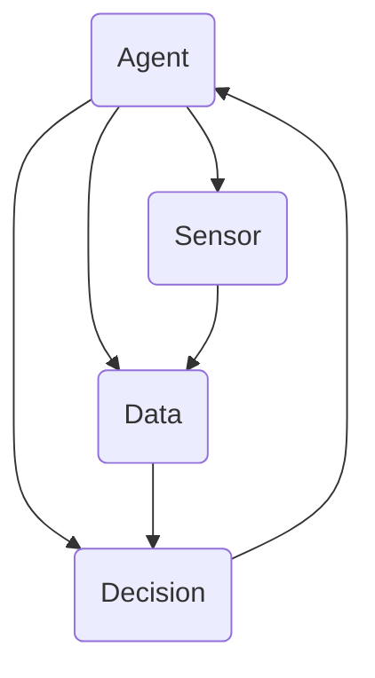
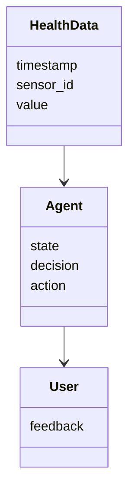
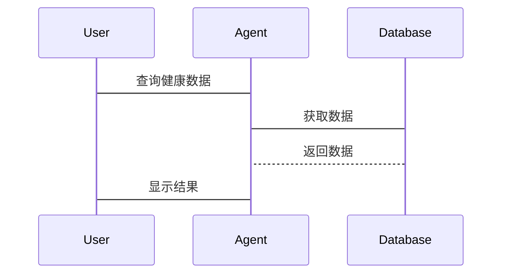

                 


# AI Agent在智能健康监测中的实践

> 关键词：AI Agent, 智能健康监测, 人工智能, 健康数据, 自然语言处理

> 摘要：AI Agent（人工智能代理）在智能健康监测中的应用是当前人工智能技术发展的重要方向之一。本文将系统地探讨AI Agent在智能健康监测中的核心概念、技术原理、系统设计与实现、以及实际应用案例。通过详细分析AI Agent在健康数据采集、处理、分析和反馈等环节中的作用，本文将展示如何利用AI Agent提升健康监测的智能化水平和用户体验。

---

# 目录

## 第一部分: AI Agent在智能健康监测中的背景与概念

### 第1章: AI Agent与智能健康监测概述

#### 1.1 AI Agent的基本概念
- 1.1.1 什么是AI Agent
- 1.1.2 AI Agent的核心特征
- 1.1.3 AI Agent与传统软件的区别

#### 1.2 智能健康监测的定义与目标
- 1.2.1 智能健康监测的定义
- 1.2.2 智能健康监测的主要目标
- 1.2.3 智能健康监测的应用场景

#### 1.3 AI Agent在智能健康监测中的作用
- 1.3.1 AI Agent在健康监测中的优势
- 1.3.2 AI Agent在智能健康监测中的应用场景
- 1.3.3 AI Agent与智能健康监测的结合方式

#### 1.4 本章小结

---

## 第二部分: AI Agent的核心概念与技术原理

### 第2章: AI Agent的核心概念与原理

#### 2.1 AI Agent的核心概念
- 2.1.1 状态表示
- 2.1.2 感知模型
- 2.1.3 决策模型
- 2.1.4 执行模型

#### 2.2 AI Agent的感知、决策与执行过程
- 2.2.1 感知阶段
- 2.2.2 决策阶段
- 2.2.3 执行阶段

#### 2.3 AI Agent的实体关系图


#### 2.4 本章小结

---

## 第三部分: AI Agent的算法原理与数学模型

### 第3章: AI Agent的核心算法原理

#### 3.1 状态表示与感知模型
- 3.1.1 状态表示方法
- 3.1.2 感知模型的构建
- 3.1.3 感知模型的数学表达
$$
s = f(x)
$$
其中，\( s \) 表示状态，\( x \) 表示输入数据，\( f \) 表示感知函数。

#### 3.2 决策模型与算法
- 3.2.1 基于规则的决策算法
- 3.2.2 基于概率的决策算法
- 3.2.3 基于强化学习的决策算法
- 3.2.4 决策模型的数学表达
$$
p(a|s) = \text{Policy}(s)
$$
其中，\( p(a|s) \) 表示在状态 \( s \) 下选择动作 \( a \) 的概率，\( \text{Policy}(s) \) 表示决策策略函数。

#### 3.3 执行模型与反馈机制
- 3.3.1 执行模型的实现方式
- 3.3.2 反馈机制的作用
- 3.3.3 执行模型的数学表达
$$
o = \text{Execute}(a, s)
$$
其中，\( o \) 表示执行结果，\( a \) 表示动作，\( s \) 表示当前状态。

#### 3.4 本章小结

---

## 第四部分: AI Agent在智能健康监测中的系统设计与实现

### 第4章: 智能健康监测系统的系统设计

#### 4.1 问题场景介绍
- 4.1.1 健康监测的主要问题
- 4.1.2 AI Agent在健康监测中的目标
- 4.1.3 系统的边界与外延

#### 4.2 系统功能设计
- 4.2.1 数据采集模块
- 4.2.2 数据分析模块
- 4.2.3 AI Agent决策模块
- 4.2.4 用户反馈模块

#### 4.3 领域模型设计


#### 4.4 系统架构设计


#### 4.5 接口设计与交互流程
- 4.5.1 系统接口设计
- 4.5.2 用户与系统的交互流程
- 4.5.3 交互流程的Mermaid序列图


#### 4.6 本章小结

---

## 第五部分: AI Agent在智能健康监测中的项目实战

### 第5章: 项目实战与代码实现

#### 5.1 环境安装与配置
- 5.1.1 安装Python
- 5.1.2 安装必要的库（如numpy、pandas、scikit-learn等）

#### 5.2 核心代码实现
- 5.2.1 数据采集模块
```python
import pandas as pd

def collect_data(sensor_id):
    # 模拟数据采集
    data = pd.DataFrame({
        'timestamp': [pd.Timestamp.now()],
        'value': [random.uniform(80, 120)]
    })
    return data
```

- 5.2.2 AI Agent决策模块
```python
import numpy as np
from sklearn import tree

def train_decision_model(X_train, y_train):
    # 训练决策树模型
    clf = tree.DecisionTreeClassifier()
    clf.fit(X_train, y_train)
    return clf
```

- 5.2.3 用户反馈模块
```python
def handle_feedback(feedback):
    # 处理用户反馈
    print(f"收到反馈：{feedback}")
    return "感谢您的反馈！"
```

#### 5.3 实际案例分析与代码解读
- 5.3.1 案例背景
- 5.3.2 数据分析与处理
- 5.3.3 AI Agent的决策过程
- 5.3.4 代码实现与结果展示

#### 5.4 项目小结
- 5.4.1 项目实现的关键点
- 5.4.2 项目中的挑战与解决方案
- 5.4.3 项目经验总结

---

## 第六部分: 最佳实践与总结

### 第6章: 最佳实践与总结

#### 6.1 数据隐私与安全
- 6.1.1 数据加密与匿名化处理
- 6.1.2 权限管理与访问控制

#### 6.2 模型的可解释性
- 6.2.1 解释性模型的选择
- 6.2.2 可视化工具的应用

#### 6.3 系统的可扩展性
- 6.3.1 模块化设计
- 6.3.2 异构传感器的支持

#### 6.4 本章小结

---

## 参考文献

（此处列出相关参考文献）

---

## 索引

（此处列出文章中的关键词和术语索引）

---

以上是《AI Agent在智能健康监测中的实践》的技术博客文章的详细目录结构。每一章都按照逻辑顺序展开，从概念到技术实现再到实际应用，确保内容全面且深入。

