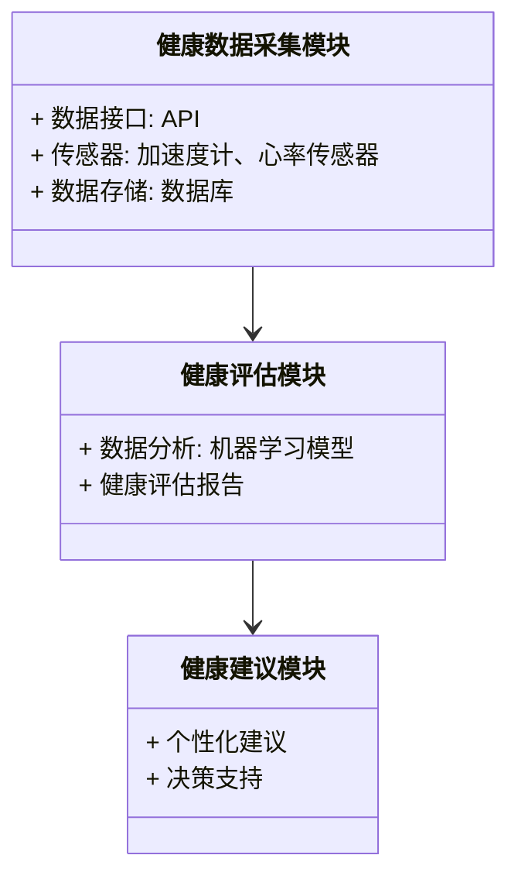
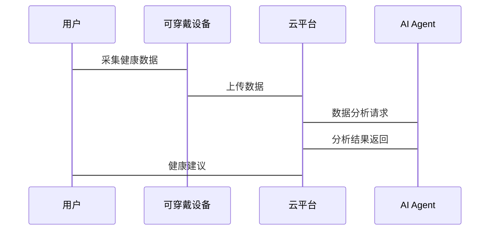

                 


# AI Agent在智能健康管理中的角色

## 关键词：AI Agent，智能健康管理，人工智能，健康管理，数据驱动决策

## 摘要：本文探讨AI Agent在智能健康管理中的角色，分析其在数据采集、分析、决策和执行中的应用，结合实际案例展示其优势，提出优化建议和未来发展方向。

---

# 第1章 AI Agent的基本概念与原理

## 1.1 AI Agent的定义与特点

### 1.1.1 AI Agent的定义
AI Agent是能够感知环境、自主决策并执行任务的智能体，具备学习和适应能力。

### 1.1.2 AI Agent的核心特点
- **自主性**：无需外部干预，自主决策。
- **反应性**：实时感知环境变化并做出反应。
- **学习能力**：通过数据和经验优化决策模型。
- **交互性**：与用户和其他系统进行有效沟通。

### 1.1.3 AI Agent与传统软件的区别
| 特性         | AI Agent                  | 传统软件                 |
|--------------|---------------------------|--------------------------|
| 智能性       | 高                         | 低                       |
| 自主性       | 高                         | 低                       |
| 学习能力     | 强                         | 无                       |
| 适应性       | 强                         | 低                       |

## 1.2 智能健康管理的背景与需求

### 1.2.1 健康管理的定义与目标
健康管理是通过预防、监测和干预来维护和促进个人健康状态。

### 1.2.2 智能健康管理的发展现状
随着可穿戴设备和大数据技术的普及，智能健康管理逐渐成为趋势。

### 1.2.3 AI Agent在健康管理中的应用前景
AI Agent能够高效处理健康数据，提供个性化建议，优化健康管理流程。

## 1.3 AI Agent在智能健康管理中的角色

### 1.3.1 AI Agent在健康管理中的功能定位
- 数据采集与处理
- 健康评估与分析
- 个性化建议与干预

### 1.3.2 AI Agent与健康管理系统的交互方式
通过可穿戴设备、移动应用和云平台实现数据交互和反馈。

### 1.3.3 AI Agent在健康管理中的优势与挑战
优势：高效、精准、个性化；挑战：数据隐私、模型准确性和用户信任。

---

# 第2章 AI Agent的核心概念与原理

## 2.1 AI Agent的基本组成

### 2.1.1 感知模块
通过传感器和数据接口获取健康数据，如心率、血压和运动数据。

### 2.1.2 决策模块
基于机器学习模型分析数据，生成健康建议。

### 2.1.3 执行模块
通过智能设备执行健康计划，如调整温控或提醒用药。

## 2.2 AI Agent的感知机制

### 2.2.1 数据采集与特征提取
使用可穿戴设备采集数据，提取关键特征如心率变异性和步频。

### 2.2.2 感知模型的构建与优化
利用深度学习模型，如卷积神经网络（CNN）进行数据分类。

### 2.2.3 感知数据的预处理与分析
数据清洗、标准化和特征工程，确保模型输入质量。

## 2.3 AI Agent的决策机制

### 2.3.1 知识表示与推理
使用知识图谱和逻辑推理，建立健康知识体系。

### 2.3.2 决策算法的选择与实现
基于贝叶斯网络和强化学习，评估决策风险和收益。

### 2.3.3 决策结果的评估与优化
通过A/B测试优化决策策略，确保效果最大化。

## 2.4 AI Agent的执行机制

### 2.4.1 动作规划与执行
根据决策结果，制定执行计划并启动智能设备。

### 2.4.2 执行过程中的反馈机制
实时收集执行结果，动态调整决策策略。

### 2.4.3 执行结果的监控与调整
通过反馈机制，持续优化执行策略，提高健康管理效果。

---

# 第3章 AI Agent的数学模型与算法原理

## 3.1 感知模块的数学模型

### 3.1.1 数据预处理的数学方法
使用主成分分析（PCA）进行特征降维。

### 3.1.2 数据分类的算法实现
利用支持向量机（SVM）进行健康状态分类。

## 3.2 决策模块的算法原理

### 3.2.1 知识表示与推理
构建健康知识图谱，使用逻辑推理进行健康评估。

### 3.2.2 决策算法的数学模型
贝叶斯网络模型用于健康风险评估。

## 3.3 执行模块的算法优化

### 3.3.1 动作规划的优化方法
使用强化学习优化执行策略。

### 3.3.2 执行结果的反馈机制
通过回归分析评估执行效果并进行调整。

---

# 第4章 系统分析与架构设计

## 4.1 问题场景介绍

### 4.1.1 健康数据采集场景
通过可穿戴设备和智能终端收集健康数据。

### 4.1.2 健康评估与建议场景
AI Agent分析数据并提供个性化健康建议。

## 4.2 系统功能设计

### 4.2.1 领域模型设计


### 4.2.2 系统架构设计


## 4.3 系统接口设计

### 4.3.1 数据接口设计
API接口定义数据传输格式和交互协议。

### 4.3.2 交互流程设计


---

# 第5章 项目实战

## 5.1 环境安装

```bash
pip install numpy scikit-learn tensorflow
```

## 5.2 核心代码实现

### 5.2.1 数据预处理
```python
import numpy as np
from sklearn.decomposition import PCA

# 示例数据
X = np.array([[1, 2, 3], [4, 5, 6], [7, 8, 9]])

# PCA降维
pca = PCA(n_components=2)
X_pca = pca.fit_transform(X)
print(X_pca)
```

### 5.2.2 健康评估模型
```python
import tensorflow as tf
from tensorflow.keras import layers

model = tf.keras.Sequential([
    layers.Dense(64, activation='relu'),
    layers.Dense(1, activation='sigmoid')
])

model.compile(optimizer='adam', loss='binary_crossentropy')
model.fit(X_train, y_train, epochs=10)
```

## 5.3 实际案例分析

### 5.3.1 糖尿病患者健康管理
通过AI Agent分析血糖数据，制定个性化饮食和运动计划，定期评估和调整。

## 5.4 代码解读与分析
解释每段代码的功能，展示AI Agent在健康管理中的具体应用。

---

# 第6章 总结与展望

## 6.1 本章小结
AI Agent在智能健康管理中的潜力巨大，能够显著提升健康管理的效率和精准度。

## 6.2 最佳实践 tips
- 确保数据隐私和安全
- 定期更新模型和知识库
- 提供多模态数据支持

## 6.3 未来展望
多模态数据融合、边缘计算和可解释性AI将是未来发展的重点方向。

---

# 结语
AI Agent在智能健康管理中的应用前景广阔，随着技术的进步，其在医疗和健康管理领域的价值将更加凸显。

