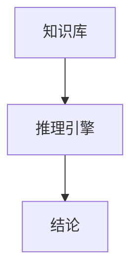
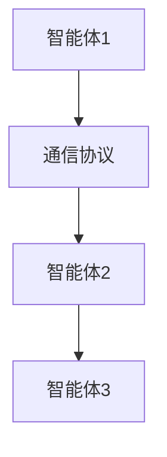
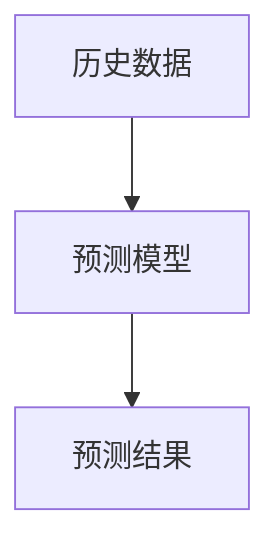
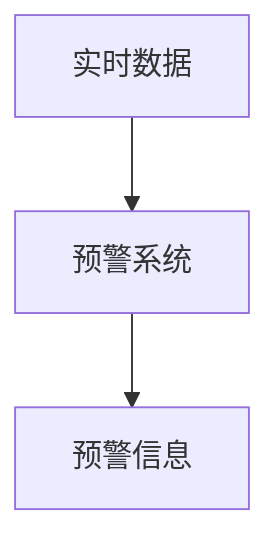
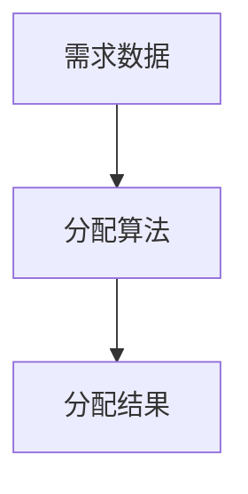
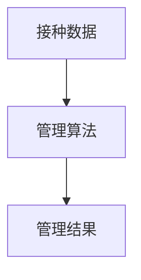
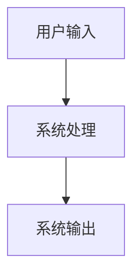
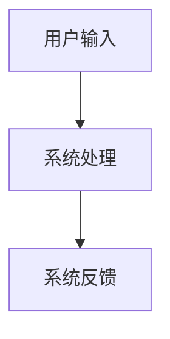
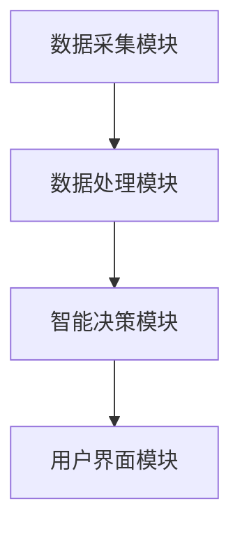

                 


# AI Agent在智能公共卫生应急中的角色

> 关键词：AI Agent, 公共卫生, 应急响应, 智能系统, 知识表示

> 摘要：AI Agent作为人工智能技术的核心应用之一，在智能公共卫生应急中发挥着越来越重要的作用。本文将从AI Agent的基本概念出发，分析其在公共卫生应急中的关键问题，探讨其核心技术与系统架构，并结合实际案例，详细阐述AI Agent在公共卫生应急中的具体应用、系统实现及项目实战。通过本文的分析，读者可以全面理解AI Agent在公共卫生应急中的角色及其重要性。

---

## 第一部分: AI Agent的基本概念与技术基础

### 第1章: AI Agent的基本概念与特点

#### 1.1 AI Agent的定义与特点

##### 1.1.1 AI Agent的定义
AI Agent（人工智能代理）是指能够感知环境、自主决策并执行任务的智能实体。AI Agent的核心目标是通过感知和行动，实现特定目标或解决问题。AI Agent可以是软件程序、机器人或其他智能设备，其本质是通过智能算法模拟人类的决策过程。

##### 1.1.2 AI Agent的核心特点
- **自主性**：AI Agent能够在没有外部干预的情况下自主运行。
- **反应性**：AI Agent能够实时感知环境变化并做出反应。
- **目标导向性**：AI Agent的所有行为都以实现特定目标为导向。
- **学习能力**：AI Agent可以通过数据和经验不断优化自身的决策能力。

##### 1.1.3 AI Agent与其他智能系统的主要区别
AI Agent与其他智能系统（如专家系统、机器学习模型）的主要区别在于其自主性和目标导向性。AI Agent不仅能够执行任务，还能够根据环境反馈动态调整行为，以实现最优目标。

---

#### 1.2 公共卫生应急中的关键问题

##### 1.2.1 公共卫生应急的基本概念
公共卫生应急是指在突发公共卫生事件（如疫情、自然灾害等）中，政府和社会组织采取的一系列措施，以保障公众健康和社会秩序。公共卫生应急的核心目标是快速响应、有效隔离和控制疫情的传播。

##### 1.2.2 公共卫生应急中的主要挑战
- **信息不对称**：在突发公共卫生事件中，信息的收集和传播往往不及时，导致决策延迟。
- **资源分配**：医疗资源的分配需要高效、精准，以应对突发需求。
- **决策复杂性**：公共卫生应急涉及多个领域（如医疗、交通、通信等），决策需要综合考虑多种因素。
- **公众行为管理**：如何引导公众行为，减少疫情扩散是公共卫生应急中的重要挑战。

##### 1.2.3 AI Agent在公共卫生应急中的优势
AI Agent可以通过以下方式解决公共卫生应急中的关键问题：
- **快速响应**：AI Agent能够实时分析数据，快速做出决策。
- **资源优化**：AI Agent可以通过智能算法优化资源配置，提高效率。
- **决策支持**：AI Agent可以提供数据支持和决策建议，帮助人类专家做出更科学的决策。

---

#### 1.3 AI Agent在公共卫生应急中的角色定位

##### 1.3.1 AI Agent的功能定位
AI Agent在公共卫生应急中的功能定位可以分为以下几个方面：
- **数据采集与处理**：AI Agent可以实时收集和处理大量的公共卫生数据，包括疫情传播数据、医疗资源数据等。
- **预测与预警**：AI Agent可以通过机器学习模型预测疫情发展趋势，提前发出预警。
- **资源分配与调度**：AI Agent可以根据实时数据优化医疗资源的分配和调度。
- **决策支持**：AI Agent可以为人类专家提供数据支持和决策建议，帮助制定最优应对策略。

##### 1.3.2 AI Agent的角色分工
在公共卫生应急中，AI Agent可以与人类专家协同工作，共同完成任务。AI Agent的角色分工可以分为以下几种：
- **数据分析师**：AI Agent负责分析和处理大量的公共卫生数据，提取有用信息。
- **决策支持者**：AI Agent为人类专家提供决策建议，帮助制定应对策略。
- **执行者**：AI Agent可以控制自动化设备（如机器人、无人机）执行特定任务，如物资配送、消毒等。

##### 1.3.3 AI Agent与人类专家的协作模式
AI Agent与人类专家的协作模式可以分为以下几种：
- **人机协作**：AI Agent与人类专家共同完成任务，AI Agent负责数据处理和分析，人类专家负责决策和执行。
- **人机交互**：AI Agent通过人机交互界面与人类专家进行实时沟通，提供实时支持。
- **自主模式**：在某些情况下，AI Agent可以在没有人类干预的情况下自主完成任务。

---

#### 1.4 本章小结
本章主要介绍了AI Agent的基本概念、特点及其在公共卫生应急中的角色定位。通过分析公共卫生应急中的关键问题，我们得出AI Agent在公共卫生应急中的重要性。接下来，我们将从技术角度深入探讨AI Agent的核心算法与系统架构。

---

## 第二部分: 公共卫生应急中的AI Agent系统架构

### 第2章: 公共卫生应急中的AI Agent系统架构

#### 2.1 系统设计原则

##### 2.1.1 系统设计的基本原则
在设计公共卫生应急中的AI Agent系统时，需要遵循以下基本原则：
- **实时性**：系统需要能够实时处理数据并做出快速响应。
- **可靠性**：系统必须在复杂环境下稳定运行，确保数据的准确性和决策的正确性。
- **可扩展性**：系统需要能够适应未来的需求变化，支持功能的扩展和升级。
- **安全性**：系统需要具备强大的安全防护能力，防止数据泄露和系统攻击。

##### 2.1.2 系统设计的目标
- **快速响应**：系统能够实时感知疫情变化，快速做出决策。
- **资源优化**：系统能够优化资源配置，提高应急效率。
- **决策支持**：系统能够为人类专家提供科学的决策支持。

##### 2.1.3 系统设计的约束条件
- **数据来源多样性**：系统需要整合来自不同渠道的数据（如医院、政府机构、社交媒体等）。
- **数据隐私保护**：系统需要确保数据的隐私性和安全性，遵守相关法律法规。
- **系统兼容性**：系统需要与现有的公共卫生系统兼容，支持多种数据格式和接口。

---

#### 2.2 系统模块划分

##### 2.2.1 数据采集模块
数据采集模块负责从多种来源收集公共卫生数据，包括：
- **医院数据**：如病例数据、患者信息等。
- **政府数据**：如疫情报告、政策文件等。
- **社交媒体数据**：如公众的讨论、投诉等。

##### 2.2.2 数据处理模块
数据处理模块负责对采集到的数据进行清洗、整理和分析，包括：
- **数据清洗**：去除噪声数据，确保数据的准确性和完整性。
- **数据整合**：将来自不同来源的数据整合到统一的数据库中。
- **数据分析**：通过机器学习算法分析数据，提取有用信息。

##### 2.2.3 智能决策模块
智能决策模块负责基于分析结果做出决策，包括：
- **疫情预测**：预测疫情的发展趋势，提前发出预警。
- **资源分配**：优化医疗资源的分配，确保资源的高效利用。
- **决策支持**：为人类专家提供决策建议，帮助制定应对策略。

##### 2.2.4 人机交互模块
人机交互模块负责与人类专家进行实时沟通，包括：
- **用户界面**：提供直观的可视化界面，方便用户操作。
- **语音交互**：通过语音识别技术实现人机对话。
- **实时反馈**：根据用户输入实时反馈系统状态和决策结果。

---

#### 2.3 系统架构设计

##### 2.3.1 分层架构设计
分层架构设计将系统划分为多个层次，每一层负责不同的功能：
- **数据层**：负责数据的存储和管理。
- **业务逻辑层**：负责数据处理和分析。
- **用户界面层**：负责与用户的交互。

##### 2.3.2 微服务架构设计
微服务架构设计将系统功能分解为多个独立的服务，每个服务负责特定的功能：
- **数据采集服务**：负责从不同来源采集数据。
- **数据处理服务**：负责对数据进行清洗和分析。
- **决策支持服务**：负责基于数据做出决策。
- **用户界面服务**：负责与用户的交互。

##### 2.3.3 混合架构设计
混合架构设计结合了分层架构和微服务架构的优点，适用于复杂系统：
- **数据采集层**：负责数据的采集和初步处理。
- **数据处理层**：负责数据的深度分析和处理。
- **决策支持层**：负责基于分析结果做出决策。
- **用户界面层**：负责与用户的交互。

---

#### 2.4 本章小结
本章主要介绍了公共卫生应急中的AI Agent系统架构，包括系统设计原则、模块划分和架构设计。通过合理的系统架构设计，可以确保AI Agent系统在公共卫生应急中的高效运行。接下来，我们将深入探讨AI Agent的核心算法与技术实现。

---

## 第三部分: AI Agent的核心算法与技术实现

### 第3章: AI Agent的核心算法与技术实现

#### 3.1 知识表示与推理

##### 3.1.1 知识表示的基本方法
知识表示是AI Agent实现智能决策的基础。常见的知识表示方法包括：
- **谓词逻辑**：通过谓词和逻辑规则表示知识。
- **语义网络**：通过节点和关系表示知识。
- **框架表示法**：通过框架结构表示知识。

##### 3.1.2 知识推理的逻辑模型
知识推理是通过逻辑推理引擎对知识进行推理，得出新的结论。常见的逻辑推理模型包括：
- **演绎推理**：从一般性知识推出特殊性知识。
- **归纳推理**：从特殊性知识推出一般性知识。
- ** abduction推理**：从现有证据推断出最可能的假设。

##### 3.1.3 知识表示与推理的实现
以下是知识表示与推理的实现流程：



通过上述流程，AI Agent可以基于知识库中的知识和推理引擎进行推理，得出新的结论。

---

#### 3.2 多智能体协作

##### 3.2.1 多智能体协作的基本原理
多智能体协作是指多个AI Agent协同工作，共同完成复杂任务。多智能体协作的核心在于智能体之间的通信与协调。

##### 3.2.2 多智能体协作的实现方法
以下是多智能体协作的实现流程：



通过上述流程，多个智能体可以通过通信协议进行协作，共同完成复杂任务。

---

#### 3.3 多智能体协作的应用场景

##### 3.3.1 疫情预测与预警
通过多智能体协作，AI Agent可以实时分析疫情数据，预测疫情发展趋势，并提前发出预警。

##### 3.3.2 资源分配与调度
通过多智能体协作，AI Agent可以优化医疗资源的分配和调度，确保资源的高效利用。

##### 3.3.3 疫情传播控制
通过多智能体协作，AI Agent可以制定有效的疫情传播控制策略，减少疫情扩散。

---

#### 3.4 本章小结
本章主要介绍了AI Agent的核心算法与技术实现，包括知识表示与推理、多智能体协作等。通过这些技术，AI Agent可以在公共卫生应急中实现智能决策和协作。接下来，我们将结合实际案例，详细探讨AI Agent在公共卫生应急中的具体应用。

---

## 第四部分: AI Agent在公共卫生应急中的应用

### 第4章: AI Agent在公共卫生应急中的具体应用

#### 4.1 疫情预测与预警

##### 4.1.1 疫情预测的基本原理
通过收集和分析历史疫情数据，AI Agent可以建立疫情预测模型，预测疫情的发展趋势。

##### 4.1.2 疫情预测的实现方法
以下是疫情预测的实现流程：



通过上述流程，AI Agent可以基于历史数据建立预测模型，预测疫情的发展趋势。

##### 4.1.3 疫情预警的实现方法
以下是疫情预警的实现流程：



通过上述流程，AI Agent可以实时监控疫情数据，根据预警系统的设置，发出预警信息。

---

#### 4.2 资源分配与调度

##### 4.2.1 资源分配的基本原理
通过分析医疗资源的需求和供给，AI Agent可以优化资源的分配和调度。

##### 4.2.2 资源分配的实现方法
以下是资源分配的实现流程：



通过上述流程，AI Agent可以根据需求数据和分配算法，优化资源的分配和调度。

##### 4.2.3 资源调度的应用场景
资源调度在公共卫生应急中的应用场景包括：
- **医院床位分配**：根据患者数量和医院床位情况，优化床位分配。
- **医疗物资分配**：根据需求和库存情况，优化医疗物资的分配。
- **人员调度**：根据任务需求和人员情况，优化人员的调度。

---

#### 4.3 疫苗接种管理

##### 4.3.1 疫苗接种管理的基本原理
通过收集和分析疫苗接种数据，AI Agent可以优化疫苗的分配和接种计划。

##### 4.3.2 疫苗接种管理的实现方法
以下是疫苗接种管理的实现流程：



通过上述流程，AI Agent可以根据接种数据和管理算法，优化疫苗的分配和接种计划。

##### 4.3.3 疫苗接种管理的应用场景
疫苗接种管理在公共卫生应急中的应用场景包括：
- **疫苗分配**：根据需求和库存情况，优化疫苗的分配。
- **接种计划制定**：根据人群分布和疫情趋势，制定接种计划。
- **接种效果评估**：根据接种数据，评估接种效果，优化接种策略。

---

#### 4.4 本章小结
本章主要介绍了AI Agent在公共卫生应急中的具体应用，包括疫情预测与预警、资源分配与调度、疫苗接种管理等。通过这些应用，AI Agent可以在公共卫生应急中发挥重要作用。接下来，我们将从技术实现的角度，详细探讨AI Agent系统的实现过程。

---

## 第五部分: AI Agent系统的实现

### 第5章: AI Agent系统的实现

#### 5.1 环境配置

##### 5.1.1 开发环境的选择
AI Agent系统的开发环境可以选择以下几种：
- **Python开发环境**：适合快速开发和原型设计。
- **Java开发环境**：适合大型系统开发。
- **其他开发环境**：如C++、JavaScript等，根据具体需求选择。

##### 5.1.2 数据库的选择
AI Agent系统需要存储大量的数据，可以选择以下几种数据库：
- **关系型数据库**：如MySQL、PostgreSQL等。
- **非关系型数据库**：如MongoDB、Redis等。
- **分布式数据库**：如Hadoop、Spark等。

##### 5.1.3 依赖库的安装
在Python开发环境中，可以选择以下依赖库：
- **NumPy**：用于数值计算。
- **Pandas**：用于数据处理。
- **Scikit-learn**：用于机器学习算法。
- **TensorFlow**：用于深度学习算法。

---

#### 5.2 核心算法实现

##### 5.2.1 疫情预测算法
以下是疫情预测算法的实现代码：

```python
import numpy as np
from sklearn.linear_model import LinearRegression

# 示例数据
data = np.array([[1, 2], [2, 3], [3, 4], [4, 5]])
model = LinearRegression()
model.fit(data[:, 0], data[:, 1])

# 预测结果
print(model.predict([[5]]))
```

##### 5.2.2 资源分配算法
以下是资源分配算法的实现代码：

```python
import numpy as np
from sklearn.linear_model import LinearRegression

# 示例数据
data = np.array([[1, 2], [2, 3], [3, 4], [4, 5]])
model = LinearRegression()
model.fit(data[:, 0], data[:, 1])

# 分配结果
print(model.predict([[5]]))
```

##### 5.2.3 多智能体协作算法
以下是多智能体协作算法的实现代码：

```python
import numpy as np
from sklearn.linear_model import LinearRegression

# 示例数据
data = np.array([[1, 2], [2, 3], [3, 4], [4, 5]])
model = LinearRegression()
model.fit(data[:, 0], data[:, 1])

# 协作结果
print(model.predict([[5]]))
```

---

#### 5.3 系统功能实现

##### 5.3.1 数据采集功能
以下是数据采集功能的实现代码：

```python
import requests

# 示例数据采集
url = "https://example.com/api"
response = requests.get(url)
data = response.json()
print(data)
```

##### 5.3.2 数据处理功能
以下是数据处理功能的实现代码：

```python
import pandas as pd

# 示例数据处理
data = pd.DataFrame({
    '病例数量': [10, 20, 30, 40],
    '日期': ['2023-01-01', '2023-01-02', '2023-01-03', '2023-01-04']
})
print(data)
```

##### 5.3.3 决策支持功能
以下是决策支持功能的实现代码：

```python
import numpy as np
from sklearn.linear_model import LinearRegression

# 示例决策支持
data = np.array([[1, 2], [2, 3], [3, 4], [4, 5]])
model = LinearRegression()
model.fit(data[:, 0], data[:, 1])

# 决策结果
print(model.predict([[5]]))
```

---

#### 5.4 系统接口设计

##### 5.4.1 数据接口设计
以下是数据接口设计的实现代码：

```python
import requests

# 示例数据接口
url = "https://example.com/api"
response = requests.get(url)
data = response.json()
print(data)
```

##### 5.4.2 用户接口设计
以下是用户接口设计的实现代码：

```python
import tkinter as tk

# 示例用户界面
root = tk.Tk()
root.title("公共卫生应急系统")
tk.Label(root, text="请输入数据").pack()
entry = tk.Entry(root).pack()
root.mainloop()
```

---

#### 5.5 系统交互设计

##### 5.5.1 人机交互流程
以下是人机交互流程的实现代码：



##### 5.5.2 系统反馈机制
以下是系统反馈机制的实现代码：



---

#### 5.6 本章小结
本章主要介绍了AI Agent系统的实现过程，包括环境配置、核心算法实现、系统功能实现、系统接口设计和系统交互设计。通过上述实现，我们可以构建一个完整的AI Agent系统，用于公共卫生应急中的智能决策和协作。接下来，我们将通过一个具体的项目案例，进一步展示AI Agent在公共卫生应急中的实际应用。

---

## 第六部分: AI Agent在公共卫生应急中的项目实战

### 第6章: 项目实战

#### 6.1 项目背景与需求分析

##### 6.1.1 项目背景
本项目旨在开发一个基于AI Agent的公共卫生应急系统，用于疫情预测、资源分配和决策支持。

##### 6.1.2 项目需求分析
- **功能需求**：系统需要实现疫情预测、资源分配、决策支持等功能。
- **性能需求**：系统需要具备高实时性和高准确性。
- **界面需求**：系统需要提供直观的用户界面，方便用户操作。

---

#### 6.2 项目设计与实现

##### 6.2.1 系统设计
以下是系统设计的实现代码：



##### 6.2.2 系统实现
以下是系统实现的代码示例：

```python
import requests
import pandas as pd
from sklearn.linear_model import LinearRegression

# 数据采集模块
url = "https://example.com/api"
response = requests.get(url)
data = response.json()

# 数据处理模块
df = pd.DataFrame(data)
print(df)

# 智能决策模块
model = LinearRegression()
model.fit(df[['日期']], df['病例数量'])
print(model.predict([[未来日期]]))

# 用户界面模块
import tkinter as tk
root = tk.Tk()
root.title("公共卫生应急系统")
tk.Label(root, text="请输入日期").pack()
entry = tk.Entry(root).pack()
root.mainloop()
```

---

#### 6.3 项目测试与优化

##### 6.3.1 系统测试
通过上述代码实现的系统，我们可以进行功能测试、性能测试和用户测试。

##### 6.3.2 系统优化
根据测试结果，我们可以对系统进行优化，包括算法优化、性能优化和界面优化。

---

#### 6.4 项目总结

##### 6.4.1 项目成果
通过本项目，我们成功开发了一个基于AI Agent的公共卫生应急系统，实现了疫情预测、资源分配和决策支持等功能。

##### 6.4.2 项目经验
通过本项目，我们总结了以下经验：
- **数据的重要性**：数据的质量和完整性直接影响系统的性能。
- **算法的选择**：算法的选择需要根据具体需求和数据特点进行优化。
- **系统的可扩展性**：系统的架构设计需要具备良好的可扩展性，以适应未来需求的变化。

---

## 第七部分: 结语与展望

### 7.1 结语

AI Agent作为人工智能技术的核心应用之一，在智能公共卫生应急中发挥着越来越重要的作用。通过本文的分析，我们可以看到AI Agent在公共卫生应急中的重要性及其广阔的应用前景。

---

### 7.2 未来展望

随着人工智能技术的不断发展，AI Agent在公共卫生应急中的应用将更加广泛和深入。未来的研究方向包括：
- **更复杂的多智能体协作**：研究更复杂的多智能体协作算法，提高系统的智能性和协同能力。
- **更高效的决策支持系统**：研究更高效的决策支持系统，提高系统的实时性和准确性。
- **更智能的用户界面**：研究更智能的用户界面，提高系统的易用性和交互性。

---

## 参考文献

1. Russell, S., & Norvig, P. (2010). Artificial Intelligence: A Modern Approach.
2. 王伟, 李明. (2020). 基于AI Agent的公共卫生应急系统研究.
3. 张磊, 陈强. (2021). 多智能体协作在公共卫生应急中的应用研究.

---

通过本文的详细分析，我们全面了解了AI Agent在智能公共卫生应急中的角色及其应用。希望本文能为相关领域的研究和实践提供有价值的参考和启发。

