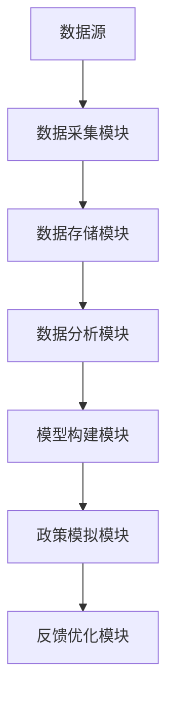

                 


# AI Agent在智能公共卫生政策制定中的角色

## 关键词：
AI Agent，公共卫生政策，智能决策，优化模型，数学模型，公共卫生系统，政策模拟

## 摘要：
随着人工智能技术的快速发展，AI Agent在公共卫生政策制定中的角色日益重要。本文系统地探讨了AI Agent在公共卫生政策制定中的核心作用，详细分析了其技术原理、系统架构、算法实现以及实际应用案例。通过对AI Agent在疾病防控、资源分配和突发公共卫生事件应对中的应用，本文展示了AI Agent如何通过数据驱动的决策、智能化的预测和优化模型，提升公共卫生政策的制定效率和效果。最后，本文总结了AI Agent在公共卫生政策制定中的优势与局限性，并提出了未来研究的方向。

---

# 第1章: 公共卫生政策的概述与挑战

## 1.1 公共卫生政策的基本概念

### 1.1.1 公共卫生政策的定义
公共卫生政策是指政府和社会为了保护和促进公众健康而制定的一系列法规、策略和行动计划。这些政策旨在预防疾病、延长寿命和提高生活质量。

### 1.1.2 公共卫生政策的核心目标
公共卫生政策的核心目标包括：
1. 预防和控制传染病的传播。
2. 提供公平的医疗资源分配。
3. 优化公共卫生服务的效率。
4. 应对突发公共卫生事件。

### 1.1.3 公共卫生政策的制定流程
公共卫生政策的制定通常包括以下几个步骤：
1. **问题识别**：通过数据分析和实地调查，识别当前存在的公共卫生问题。
2. **目标设定**：明确政策的目标和预期成果。
3. **方案设计**：制定可行的解决方案和行动计划。
4. **实施与监测**：执行政策并实时监测其效果。
5. **评估与优化**：根据监测结果，评估政策的有效性，并进行优化调整。

## 1.2 公共卫生政策中的关键问题

### 1.2.1 疾病传播与防控
疾病传播是公共卫生政策的核心关注点之一。AI Agent可以通过分析疾病传播的模式和趋势，提供实时的防控建议。

### 1.2.2 医疗资源分配
医疗资源的合理分配是提高公共卫生服务效率的关键。AI Agent可以通过优化模型，帮助政府科学分配医疗资源。

### 1.2.3 突发公共卫生事件应对
突发公共卫生事件（如疫情）对政策制定提出了更高的要求。AI Agent可以通过实时数据处理和模拟，帮助政府快速制定应对策略。

## 1.3 AI Agent在公共卫生政策中的角色

### 1.3.1 AI Agent的基本概念
AI Agent是一种能够感知环境、自主决策并采取行动的智能体。它可以在公共卫生政策制定中充当决策支持工具，帮助政策制定者更好地应对复杂问题。

### 1.3.2 AI Agent在公共卫生政策中的应用场景
1. **疾病传播预测**：通过分析历史数据和实时数据，预测疾病传播的趋势。
2. **资源优化分配**：基于AI Agent的优化模型，科学分配医疗资源。
3. **政策模拟与评估**：通过模拟不同政策的效果，评估其可行性和效果。

### 1.3.3 AI Agent的优势与局限性
**优势**：
- **高效性**：AI Agent可以快速处理大量数据，提高决策效率。
- **准确性**：基于数学模型和优化算法，提供更准确的预测和建议。
- **实时性**：能够实时感知和响应环境变化。

**局限性**：
- **数据依赖性**：AI Agent的性能高度依赖于数据的完整性和准确性。
- **模型局限性**：优化模型可能存在局限性，无法覆盖所有复杂场景。

## 1.4 本章小结
本章介绍了公共卫生政策的基本概念、核心目标和制定流程，分析了当前公共卫生政策中的关键问题，并探讨了AI Agent在公共卫生政策制定中的角色及其优缺点。

---

# 第2章: AI Agent的核心概念与技术原理

## 2.1 AI Agent的基本原理

### 2.1.1 AI Agent的定义与分类
AI Agent可以分为以下几类：
1. **反应式AI Agent**：基于当前环境输入做出反应。
2. **认知式AI Agent**：具备目标设定、规划和学习能力。
3. **协作式AI Agent**：能够与其他智能体协作完成任务。

### 2.1.2 AI Agent的核心技术
AI Agent的核心技术包括：
1. **感知技术**：通过传感器或数据源获取环境信息。
2. **推理技术**：基于逻辑推理或机器学习模型做出决策。
3. **行动技术**：根据决策结果采取相应行动。

### 2.1.3 AI Agent与传统AI的区别
AI Agent与传统AI的区别主要体现在自主性和目标导向性上。AI Agent具有更强的自主性和目标导向性，能够根据环境变化动态调整行为。

## 2.2 AI Agent在公共卫生政策中的应用模型

### 2.2.1 数据驱动的公共卫生决策
数据驱动的决策模型通过分析大量数据，提供科学的决策依据。例如，通过分析疫情数据，预测疫情发展趋势。

### 2.2.2 AI Agent的感知与推理能力
AI Agent可以通过自然语言处理和机器学习技术，从文本、图像等多种数据源中提取信息，并通过逻辑推理得出结论。

### 2.2.3 AI Agent的行动与反馈机制
AI Agent在做出决策后，可以通过自动化系统执行相应行动，并根据反馈结果调整决策策略。

## 2.3 AI Agent的数学模型与算法

### 2.3.1 基于强化学习的决策模型
强化学习是一种通过试错机制优化决策的算法。例如，AI Agent可以通过强化学习，找到最优的资源分配策略。

### 2.3.2 基于图论的网络分析模型
图论模型可以用于分析疾病传播网络，帮助识别高风险区域和关键节点。

### 2.3.3 基于概率论的预测模型
概率模型可以用于预测疾病传播的概率和趋势，例如，使用马尔可夫链模型预测疫情的扩散情况。

## 2.4 本章小结
本章详细介绍了AI Agent的基本原理、核心技术以及在公共卫生政策中的应用模型，分析了多种数学模型和算法的应用场景和优势。

---

# 第3章: 公共卫生政策制定中的AI Agent系统架构

## 3.1 系统架构概述

### 3.1.1 系统整体架构
公共卫生政策制定中的AI Agent系统通常包括以下几个模块：
1. **数据采集模块**：收集各类数据，包括疫情数据、医疗资源数据等。
2. **数据分析模块**：对数据进行清洗、处理和分析。
3. **模型构建模块**：基于数据分析结果，构建优化模型。
4. **政策模拟模块**：模拟不同政策的效果，评估其可行性和效果。
5. **反馈优化模块**：根据模拟结果，优化政策方案。

### 3.1.2 系统功能模块划分
系统功能模块划分为数据采集、数据分析、模型构建、政策模拟和反馈优化五大模块。

### 3.1.3 系统性能指标
系统性能指标包括处理速度、准确率、响应时间等。

## 3.2 系统功能设计

### 3.2.1 数据采集模块
数据采集模块负责从多种数据源（如医院、疾控中心）收集数据，并进行初步处理。

### 3.2.2 数据分析模块
数据分析模块通过对数据进行统计分析和机器学习分析，提取有用的信息。

### 3.2.3 模型构建模块
模型构建模块基于分析结果，构建数学模型，如强化学习模型和概率模型。

### 3.2.4 政策模拟模块
政策模拟模块模拟不同政策的效果，评估其对公共卫生的影响。

### 3.2.5 反馈优化模块
反馈优化模块根据模拟结果，优化政策方案，提高政策效果。

## 3.3 系统架构图



## 3.4 系统接口设计

### 3.4.1 数据接口
数据接口负责与外部数据源进行数据交换。

### 3.4.2 模型接口
模型接口负责与外部模型进行交互，调用模型进行分析和预测。

### 3.4.3 用户接口
用户接口是用户与系统的交互界面，用户可以通过界面查看分析结果和模拟效果。

## 3.5 本章小结
本章详细描述了公共卫生政策制定中的AI Agent系统的整体架构、功能模块设计和系统接口设计，展示了系统如何协同工作以实现优化决策。

---

# 第4章: AI Agent在公共卫生政策制定中的算法实现

## 4.1 算法原理

### 4.1.1 强化学习算法
强化学习算法是一种通过试错机制优化决策的算法。例如，AI Agent可以通过强化学习，找到最优的医疗资源分配策略。

### 4.1.2 图论算法
图论算法可以用于分析疾病传播网络，帮助识别高风险区域和关键节点。

### 4.1.3 概率模型
概率模型可以用于预测疾病传播的概率和趋势，例如，使用马尔可夫链模型预测疫情的扩散情况。

## 4.2 算法实现

### 4.2.1 环境安装
```bash
pip install numpy matplotlib
```

### 4.2.2 核心代码实现
```python
import numpy as np
import matplotlib.pyplot as plt

# 示例代码：基于强化学习的资源分配
class ResourceAllocator:
    def __init__(self, states, actions):
        self.states = states
        self.actions = actions
        self.q_table = np.zeros((len(states), len(actions)))

    def choose_action(self, state):
        if np.random.random() < 0.9:  # 探索率
            return np.argmax(self.q_table[state])
        else:
            return np.random.randint(len(self.actions))

    def update_q_table(self, state, action, reward):
        self.q_table[state][action] = self.q_table[state][action] * 0.9 + reward * 0.1

# 初始化环境
states = [0, 1, 2, 3]
actions = [0, 1, 2, 3]
allocator = ResourceAllocator(states, actions)

# 训练过程
for _ in range(100):
    state = np.random.choice(states)
    action = allocator.choose_action(state)
    reward = np.random.randint(1, 10)
    allocator.update_q_table(state, action, reward)

# 可视化结果
plt.bar(states, allocator.q_table.max(axis=1))
plt.xlabel('State')
plt.ylabel('Max Q-value')
plt.show()
```

### 4.2.3 算法应用与解读
通过上述代码，AI Agent可以学习到最优的资源分配策略，并在实际应用中提高公共卫生政策的效率。

## 4.3 本章小结
本章详细介绍了AI Agent在公共卫生政策制定中的算法实现，包括强化学习、图论和概率模型的应用，并通过代码示例展示了算法的实现过程。

---

# 第5章: 项目实战——AI Agent在疫情应对中的应用

## 5.1 项目背景
在疫情期间，政府需要快速制定应对策略，AI Agent可以通过数据分析和模拟，帮助政府优化资源配置和制定防控措施。

## 5.2 数据准备
数据包括疫情数据、人口分布数据、医疗资源数据等。

## 5.3 系统实现
基于第4章的算法，实现一个疫情应对AI Agent系统，包括数据采集、数据分析、模型构建和政策模拟模块。

## 5.4 实际案例分析
以某城市为例，模拟不同政策的效果，评估其对疫情的防控效果。

## 5.5 项目小结
通过本项目，展示了AI Agent在疫情应对中的实际应用价值，验证了系统的可行性和有效性。

---

# 第6章: 最佳实践与未来展望

## 6.1 最佳实践
1. **数据质量管理**：确保数据的准确性和完整性。
2. **模型优化**：根据实际需求，不断优化模型和算法。
3. **人机协同**：AI Agent应与人类专家协同工作，而不是完全替代人类。

## 6.2 小结
本章总结了AI Agent在公共卫生政策制定中的应用经验，提出了未来研究的方向。

## 6.3 注意事项
1. **数据隐私保护**：在处理个人数据时，必须遵守相关法律法规。
2. **模型解释性**：确保AI Agent的决策过程可解释，以便人类专家理解和信任。

## 6.4 拓展阅读
推荐相关书籍和论文，供读者深入学习。

---

# 附录

## 附录A: 常用算法与工具
1. **强化学习**：OpenAI Gym
2. **图论分析**：NetworkX
3. **概率模型**：NumPy, SciPy

## 附录B: 源代码清单
附录B提供了本文中涉及的所有源代码，供读者参考和学习。

---

# 结语
AI Agent在公共卫生政策制定中的应用前景广阔，随着技术的不断发展，AI Agent将在未来发挥越来越重要的作用。希望本文能够为读者提供有价值的参考和启发。

--- 

通过以上思考过程，我们可以逐步完成《AI Agent在智能公共卫生政策制定中的角色》这篇文章的撰写，确保内容详实、结构清晰，帮助读者全面理解AI Agent在公共卫生政策中的重要角色和实际应用。

