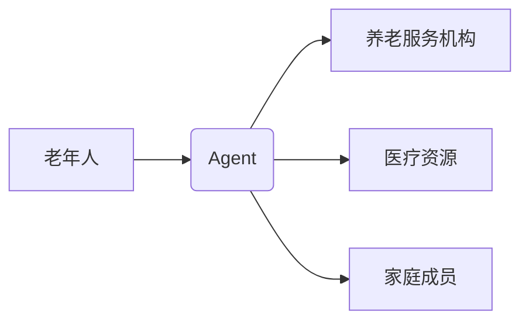
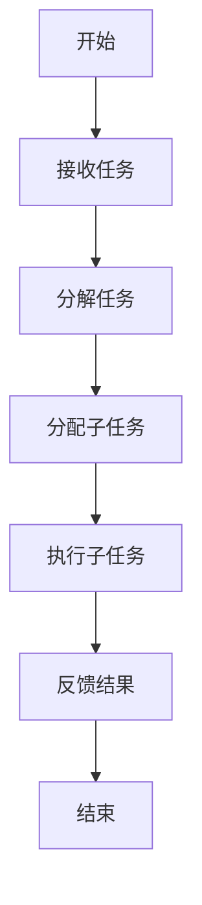
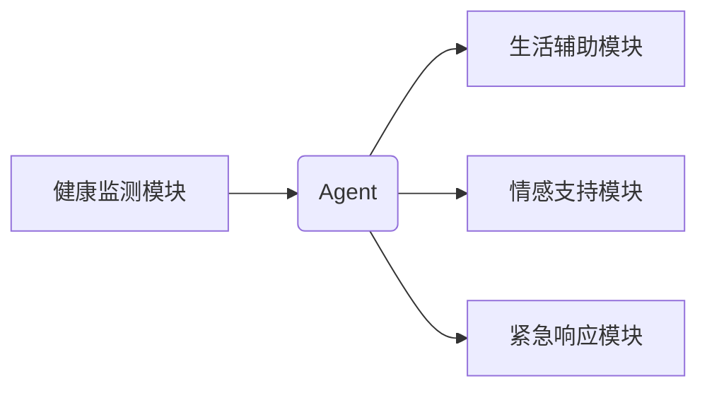
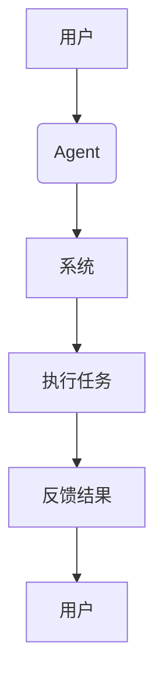

                 


# 第一部分: AI Agent与智能养老服务的背景介绍

# 第1章: AI Agent的基本概念与背景

## 1.1 AI Agent的定义与核心特征
### 1.1.1 AI Agent的定义
AI Agent（人工智能代理）是指具有感知环境、自主决策和执行任务能力的智能实体。它能够根据环境信息做出决策，并通过执行动作来影响环境或与用户交互。

### 1.1.2 AI Agent的核心特征
AI Agent的核心特征包括：
- **自主性**：能够在没有外部干预的情况下自主运作。
- **反应性**：能够感知环境并实时做出反应。
- **主动性**：能够主动采取行动以实现目标。
- **社会性**：能够与其他Agent或人类进行交互和协作。

### 1.1.3 AI Agent与传统软件的区别
AI Agent与传统软件的主要区别在于其智能性和自主性。传统软件通常按照预设的程序执行任务，而AI Agent能够根据环境信息动态调整行为，并通过学习和优化提升性能。

## 1.2 智能养老服务的背景与需求
### 1.2.1 全球老龄化趋势分析
随着全球人口老龄化的加剧，传统的养老服务模式已经难以满足老年人多样化的需求。AI Agent可以通过智能化的方式提供更高效、更个性化的服务。

### 1.2.2 智能养老服务的定义与目标
智能养老服务是指利用人工智能技术，为老年人提供智能化、个性化的服务，旨在提高老年人的生活质量，减轻家庭和社会的负担。

### 1.2.3 老年人对智能养老服务的需求分析
老年人对智能养老服务的需求主要集中在以下几个方面：
- **健康监测**：实时监测老年人的健康状况，及时发现异常。
- **生活辅助**：帮助老年人完成日常生活中的任务，如提醒服药、预约医生等。
- **情感支持**：提供情感陪伴，缓解孤独感。
- **紧急响应**：在紧急情况下快速响应，确保老年人的安全。

## 1.3 AI Agent在智能养老服务中的应用前景
### 1.3.1 AI Agent在养老服务中的潜在应用场景
AI Agent在智能养老服务中的应用场景包括：
- **健康监测与管理**：通过传感器和AI算法，实时监测老年人的健康数据，并提供个性化的健康建议。
- **生活辅助**：帮助老年人完成日常任务，如提醒服药、预约医生、安排出行等。
- **情感支持**：通过自然语言处理技术，与老年人进行对话，提供情感支持和陪伴。
- **紧急响应**：在老年人发生紧急情况时，快速识别并启动应急响应机制。

### 1.3.2 AI Agent技术的优势与挑战
AI Agent技术在智能养老服务中的优势包括：
- **高效性**：能够快速处理大量数据，提供高效的解决方案。
- **个性化**：可以根据老年人的具体需求，提供个性化的服务。
- **可扩展性**：可以通过不断学习和优化，适应不同的场景和需求。

AI Agent技术在智能养老服务中的挑战包括：
- **技术成熟度**：当前AI Agent技术尚未完全成熟，存在一定的局限性。
- **隐私与安全**：老年人的健康数据和隐私信息需要得到充分保护。
- **用户接受度**：老年人对新技术的接受程度可能较低，需要进行充分的宣传教育。

### 1.3.3 AI Agent在智能养老服务中的未来发展趋势
随着人工智能技术的不断进步，AI Agent在智能养老服务中的应用前景广阔。未来的发展趋势包括：
- **智能化与个性化**：AI Agent将更加智能化和个性化，能够更好地满足老年人的需求。
- **多模态交互**：通过结合语音、视觉等多种交互方式，提供更自然的用户体验。
- **生态系统建设**：构建一个多Agent协同工作的生态系统，实现养老服务的全面覆盖。

# 第2章: AI Agent的核心概念与联系

## 2.1 AI Agent的核心原理
### 2.1.1 AI Agent的基本工作原理
AI Agent的核心工作原理包括感知、决策和执行三个环节。感知是指通过传感器或数据输入获取环境信息；决策是指基于感知信息进行分析和判断，制定相应的策略；执行是指根据决策结果采取具体行动。

### 2.1.2 AI Agent的感知与决策机制
AI Agent的感知机制主要包括数据采集、数据处理和信息融合。决策机制则包括状态评估、目标规划和行动选择。

### 2.1.3 AI Agent的学习与优化能力
AI Agent可以通过机器学习算法不断优化自身的模型和策略，从而提高其智能性和适应性。

## 2.2 AI Agent与智能养老服务的核心要素
### 2.2.1 老年人需求分析
老年人的需求分析是设计AI Agent的基础。需要考虑老年人的身体状况、生活习惯、心理需求等因素。

### 2.2.2 AI Agent的功能模块划分
AI Agent的功能模块通常包括：
- **感知模块**：负责采集环境数据。
- **决策模块**：负责分析数据并制定决策。
- **执行模块**：负责执行具体的任务。
- **交互模块**：负责与用户或其他系统进行交互。

### 2.2.3 AI Agent与养老服务生态系统的交互关系
AI Agent需要与养老服务生态系统中的其他要素（如医疗机构、社区服务、家庭成员等）进行协同工作，形成一个完整的智能服务体系。

## 2.3 AI Agent的实体关系架构
### 2.3.1 实体关系图（ER图）展示

### 2.3.2 实体关系图的详细说明
- **老年人**：AI Agent的核心服务对象。
- **Agent**：AI Agent通过与老年人、养老服务机构、医疗资源和家庭成员等实体进行交互，提供智能化服务。
- **养老服务机构**：包括养老院、社区服务中心等，负责提供养老服务。
- **医疗资源**：包括医院、医生、医疗设备等，负责老年人的健康监测和医疗支持。
- **家庭成员**：老年人的家人，负责协助和监督养老服务的实施。

# 第3章: AI Agent的算法原理与数学模型

## 3.1 AI Agent的核心算法
### 3.1.1 任务分配算法
任务分配算法是AI Agent的重要组成部分，用于将任务分配给不同的子Agent或资源。

### 3.1.2 多目标优化算法
多目标优化算法用于在多个目标之间进行权衡，找到最优解。

### 3.1.3 自然语言处理算法
自然语言处理算法用于实现AI Agent与用户的自然语言交互。

## 3.2 算法原理的详细讲解
### 3.2.1 任务分配算法的流程图


### 3.2.2 任务分配算法的数学模型
任务分配问题可以表示为一个优化问题，目标是最小化任务完成时间，同时满足资源约束。

数学模型如下：
$$ \min \sum_{i=1}^{n} t_i $$
$$ \text{subject to} $$
$$ \sum_{i=1}^{n} x_{ij} = 1, \forall j $$
$$ x_{ij} \in \{0,1\} $$

其中，\( t_i \) 是任务 \( i \) 的执行时间，\( x_{ij} \) 是任务 \( i \) 是否分配给资源 \( j \) 的指示变量。

## 3.3 算法实现与代码示例
### 3.3.1 任务分配算法的Python实现
```python
import numpy as np

def task_assignment(tasks, agents):
    n = len(tasks)
    m = len(agents)
    # 创建一个二维数组，表示每个任务分配给每个代理的执行时间
    task_times = np.random.rand(n, m)
    # 初始化分配结果
    assignment = np.zeros((n, m), dtype=int)
    # 计算每个任务的最小执行时间
    for i in range(n):
        min_time = np.min(task_times[i])
        # 找到最小执行时间对应的代理
        min_col = np.where(task_times[i] == min_time)[0][0]
        assignment[i, min_col] = 1
    return assignment
```

### 3.3.2 自然语言处理算法的Python实现
```python
from transformers import pipeline

# 加载预训练的自然语言处理模型
model = pipeline("text-classification", model="bert-base-uncased")

# 定义分类函数
def classify_text(text):
    result = model(text)
    return result['label']
```

## 3.4 算法优化与数学模型
### 3.4.1 算法优化策略
- **局部优化**：对单个任务进行优化，确保每个任务的分配是最优的。
- **全局优化**：对所有任务进行整体优化，确保整个系统的效率最大化。

### 3.4.2 数学模型的优化
通过引入约束条件和目标函数，可以进一步优化算法的性能。例如，可以引入时间窗口和资源限制等约束条件，以提高任务分配的效率和准确性。

## 3.5 算法实现与代码示例
### 3.5.1 算法实现的详细步骤
1. **数据预处理**：收集和整理任务和代理的相关信息。
2. **模型训练**：训练自然语言处理模型，使其能够理解和处理用户的请求。
3. **任务分配**：根据任务和代理的特点，将任务分配给最合适的代理。
4. **执行任务**：代理根据分配的任务执行具体的动作。
5. **反馈与优化**：根据执行结果进行反馈，并优化算法模型。

### 3.5.2 代码示例
```python
import numpy as np
from transformers import pipeline

# 定义任务和代理数量
n = 5
m = 3

# 生成任务执行时间
task_times = np.random.rand(n, m)

# 初始化分配结果
assignment = np.zeros((n, m), dtype=int)

# 计算每个任务的最小执行时间
for i in range(n):
    min_time = np.min(task_times[i])
    min_col = np.where(task_times[i] == min_time)[0][0]
    assignment[i, min_col] = 1

# 加载自然语言处理模型
model = pipeline("text-classification", model="bert-base-uncased")

# 定义分类函数
def classify_text(text):
    result = model(text)
    return result['label']

# 测试分类函数
print(classify_text("This is a test sentence."))
```

## 3.6 算法优化与数学模型的扩展
### 3.6.1 算法优化的进一步探讨
- **启发式算法**：结合启发式规则，进一步优化任务分配的效率。
- **分布式计算**：利用分布式计算技术，提高算法的并行处理能力。

### 3.6.2 数学模型的扩展
通过引入更多的约束条件和目标函数，可以进一步扩展数学模型的应用范围。例如，可以考虑任务的优先级、时间窗口、资源限制等多种因素，以提高任务分配的准确性和效率。

# 第4章: AI Agent的系统分析与架构设计

## 4.1 系统分析与需求分析
### 4.1.1 问题场景介绍
智能养老服务系统需要解决老年人在日常生活中的多种问题，如健康监测、生活辅助、情感支持等。

### 4.1.2 系统功能需求
系统功能需求包括：
- **健康监测**：实时监测老年人的健康数据。
- **生活辅助**：帮助老年人完成日常任务。
- **情感支持**：提供情感陪伴和心理支持。
- **紧急响应**：在紧急情况下快速响应。

## 4.2 系统功能设计
### 4.2.1 系统功能模块划分
系统功能模块包括：
- **健康监测模块**：负责采集和分析健康数据。
- **生活辅助模块**：负责处理日常生活任务。
- **情感支持模块**：负责提供情感陪伴和心理支持。
- **紧急响应模块**：负责处理紧急情况。

### 4.2.2 系统功能的详细描述
- **健康监测模块**：通过 wearable devices（可穿戴设备）采集老年人的健康数据，如心率、血压、体温等，并通过AI算法分析数据，及时发现异常。
- **生活辅助模块**：通过自然语言处理技术，理解老年人的需求，并通过智能设备执行相应的任务，如提醒服药、预约医生、安排出行等。
- **情感支持模块**：通过自然语言处理和情感分析技术，与老年人进行对话，提供情感支持和心理安慰。
- **紧急响应模块**：在检测到异常情况（如跌倒、突发疾病等）时，立即启动应急响应机制，联系医疗机构或家庭成员，确保老年人的安全。

## 4.3 系统架构设计
### 4.3.1 系统架构图展示


### 4.3.2 系统架构图的详细说明
- **健康监测模块**：通过传感器和AI算法，实时监测老年人的健康数据，并将数据传递给AI Agent。
- **生活辅助模块**：根据AI Agent的指令，执行具体的日常生活任务，如提醒服药、预约医生等。
- **情感支持模块**：通过自然语言处理技术，与老年人进行对话，提供情感支持和心理安慰。
- **紧急响应模块**：在检测到异常情况时，立即启动应急响应机制，联系医疗机构或家庭成员，确保老年人的安全。

## 4.4 系统接口与交互设计
### 4.4.1 系统接口设计
- **用户接口**：提供友好的用户界面，方便老年人或家庭成员进行操作。
- **Agent接口**：与其他系统或服务进行交互，如医疗系统、社区服务等。

### 4.4.2 系统交互流程图


### 4.4.3 交互流程图的详细说明
- **用户请求**：用户通过用户界面提出需求，如“提醒我服药”。
- **Agent处理**：AI Agent接收请求，并通过系统接口将任务分配给生活辅助模块。
- **任务执行**：生活辅助模块执行任务，如设置闹钟提醒。
- **反馈结果**：任务完成后，系统将结果反馈给用户。

## 4.5 系统实现与代码示例
### 4.5.1 系统实现的详细步骤
1. **环境搭建**：安装必要的软件和库，如Python、TensorFlow、Keras等。
2. **数据采集**：通过传感器或API接口采集老年人的健康数据。
3. **模型训练**：训练AI Agent的模型，使其能够理解和处理用户的需求。
4. **系统集成**：将各个功能模块集成到一个统一的系统中，实现协同工作。
5. **测试与优化**：通过测试发现系统中的问题，并进行优化和改进。

### 4.5.2 代码示例
```python
import numpy as np
from transformers import pipeline

# 加载预训练的自然语言处理模型
model = pipeline("text-classification", model="bert-base-uncased")

# 定义分类函数
def classify_text(text):
    result = model(text)
    return result['label']

# 定义任务分配函数
def assign_task(tasks, agents):
    n = len(tasks)
    m = len(agents)
    # 创建一个二维数组，表示每个任务分配给每个代理的执行时间
    task_times = np.random.rand(n, m)
    # 初始化分配结果
    assignment = np.zeros((n, m), dtype=int)
    # 计算每个任务的最小执行时间
    for i in range(n):
        min_time = np.min(task_times[i])
        # 找到最小执行时间对应的代理
        min_col = np.where(task_times[i] == min_time)[0][0]
        assignment[i, min_col] = 1
    return assignment

# 测试分类函数
print(classify_text("This is a test sentence."))

# 测试任务分配函数
tasks = ["任务1", "任务2", "任务3"]
agents = ["代理1", "代理2", "代理3"]
assignment = assign_task(tasks, agents)
print(assignment)
```

## 4.6 系统优化与扩展
### 4.6.1 系统优化策略
- **模块化设计**：通过模块化设计，提高系统的可维护性和可扩展性。
- **分布式计算**：利用分布式计算技术，提高系统的处理能力和响应速度。

### 4.6.2 系统扩展
- **多模态交互**：除了文本和语音交互，还可以支持图像、视频等多种交互方式，提供更丰富的用户体验。
- **智能化升级**：通过不断学习和优化，提高AI Agent的智能性和适应性，更好地满足老年人的需求。

# 第5章: AI Agent在智能养老服务中的项目实战

## 5.1 项目背景与目标
### 5.1.1 项目背景
随着全球人口老龄化的加剧，智能养老服务的需求日益增加。本项目旨在通过AI Agent技术，为老年人提供智能化、个性化的服务。

### 5.1.2 项目目标
本项目的目

