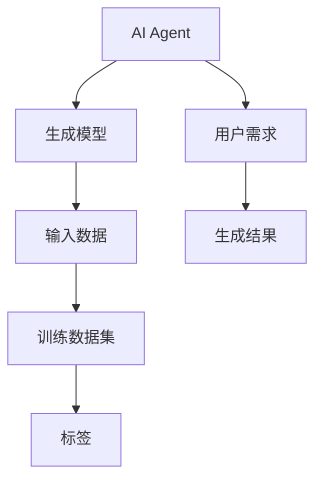

                 

# AI Agent在智能内容生成中的应用

**关键词：** AI Agent, 智能内容生成, 生成模型, 强化学习, Transformer, 多模态生成

**摘要：** 本文深入探讨AI Agent在智能内容生成中的应用，从基础概念到高级算法，结合实际案例分析，揭示其在自然语言处理、机器学习和系统架构中的核心原理与实践应用。通过对比分析和系统设计，提供全面的技术视角，助力读者理解AI Agent在智能内容生成中的潜力与挑战。

---

## 第1章: AI Agent 的基本概念与背景

### 1.1 AI Agent 的定义与特点

AI Agent（人工智能代理）是指能够感知环境、做出决策并执行动作的智能实体。它通过数据输入、模型处理和结果输出，实现内容生成的目标。AI Agent的核心特点包括：

1. **智能性**：能够理解输入数据并生成符合要求的输出。
2. **自主性**：无需人工干预，自动完成任务。
3. **适应性**：能够根据反馈调整生成策略。
4. **交互性**：支持与用户或系统的实时交互。

### 1.2 AI Agent 的应用场景

AI Agent在内容生成中的应用场景广泛，包括：

1. **文本生成**：用于新闻报道、营销文案等。
2. **图像生成**：生成图像或视觉内容。
3. **视频生成**：制作动态内容。
4. **代码生成**：辅助编程任务。

与传统内容生成工具相比，AI Agent的优势在于其智能化和自动化能力，能够根据需求自适应调整生成策略。

---

## 第2章: AI Agent 的核心原理与技术基础

### 2.1 AI Agent 的感知与决策机制

AI Agent的感知模块负责从输入数据中提取特征，决策模块基于这些特征做出生成策略的选择。执行模块将决策转化为实际输出。

### 2.2 AI Agent 的核心算法与模型

AI Agent的生成模型通常基于Transformer架构，结合强化学习策略优化生成质量。

---

## 第3章: AI Agent 的核心概念与联系

### 3.1 AI Agent 的核心概念

智能内容生成需要考虑模型类型、生成策略和质量评估指标。通过对比表格和ER实体关系图，明确各概念之间的关系。

---

## 第4章: AI Agent 的生成模型原理

### 4.1 基于 Transformer 的生成模型

Transformer模型通过多头注意力机制实现高效的序列处理，生成模型基于解码器结构。

### 4.2 基于强化学习的生成策略

强化学习通过奖励函数优化生成质量，模型训练流程包括状态、动作和奖励的定义。

---

## 第5章: AI Agent 的数学模型与公式

### 5.1 生成模型的数学公式

交叉熵损失函数和生成对抗网络的公式用于模型训练和优化。

$$
\text{交叉熵损失} = -\frac{1}{N}\sum_{i=1}^{N} y_i \log p(y_i|x_i)
$$

$$
\text{生成对抗网络} = \min_{G}\max_{D} \mathbb{E}_{x}[ \log D(x) ] + \mathbb{E}_{z}[ \log (1 - D(G(z))) ]
$$

---

## 第6章: AI Agent 的系统分析与架构设计

### 6.1 问题场景介绍

系统需要处理输入数据、训练模型、生成内容并反馈结果，涉及多个模块的协同工作。

### 6.2 系统架构设计

系统架构包括数据处理模块、模型训练模块和生成执行模块，各模块通过接口进行交互。

---

## 第7章: AI Agent 的项目实战

### 7.1 环境安装与代码实现

安装Python和相关库，编写生成模型代码并进行测试。

### 7.2 代码解读与案例分析

通过具体案例分析生成结果，评估模型性能并优化参数。

---

## 第8章: AI Agent 的高级应用与未来趋势

### 8.1 高级应用案例

AI Agent在教育、商业等领域的应用案例，展示其潜力。

### 8.2 未来发展趋势

多模态生成、实时互动和个性化定制是未来的重要发展方向。

---

## 小结与最佳实践

AI Agent在智能内容生成中的应用前景广阔，但需注意数据安全和伦理问题。建议读者从基础概念入手，逐步深入学习和实践。

---

**结束语：** AI Agent作为智能内容生成的核心技术，正在推动内容创作的智能化与自动化。通过本文的系统分析和实践案例，读者可以全面理解其技术原理和应用潜力，为未来的创新与发展奠定基础。

--- 

**注意：** 由于篇幅限制，本文仅为部分章节内容，完整文章需根据上述大纲进行扩展。

