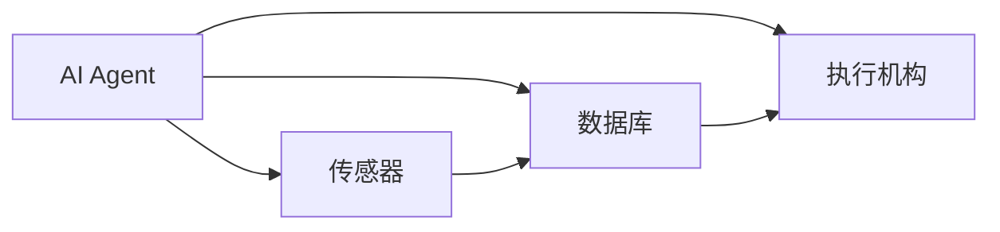

                 


# AI Agent在智能农业中的应用

## 关键词：AI Agent, 智能农业, 农业智能化, 农业物联网, 农业人工智能

## 摘要：  
随着人工智能技术的飞速发展，AI Agent（人工智能代理）在智能农业中的应用日益广泛。本文系统地探讨了AI Agent在智能农业中的核心概念、算法原理、系统架构以及实际应用案例。通过详细分析AI Agent在农业环境监测、作物管理、病虫害识别等场景中的作用，本文为读者提供了从理论到实践的全面解读，帮助读者理解AI Agent如何推动农业智能化的发展。  

---

## 第1章: AI Agent与智能农业的背景介绍

### 1.1 AI Agent的基本概念  
AI Agent（人工智能代理）是指能够感知环境、自主决策并执行任务的智能实体。它通过传感器获取数据，利用算法进行分析和推理，并通过执行机构实现目标。AI Agent的核心特征包括自主性、反应性、目标导向性和社交能力。  

#### 1.1.1 什么是AI Agent  
AI Agent可以是软件程序，也可以是与物理设备结合的系统。它能够根据输入的环境信息，做出相应的决策并执行动作。例如，一个AI Agent可以控制温室的温度和湿度，以优化作物生长环境。  

#### 1.1.2 AI Agent的核心特征  
| 特征 | 描述 |
|------|------|
| 自主性 | AI Agent能够在没有外部干预的情况下自主运行。 |
| 反应性 | 能够实时感知环境变化并做出反应。 |
| 目标导向性 | 以实现特定目标为导向进行决策和行动。 |
| 社交能力 | 可以与其他AI Agent或人类进行交互和协作。 |

### 1.2 智能农业的背景与发展趋势  
智能农业是指利用现代信息技术（如物联网、大数据、人工智能等）来优化农业生产和管理的过程。随着全球人口增长和资源有限化的挑战，智能农业已成为提高农业效率和可持续性的重要手段。  

#### 1.2.1 智能农业的定义与内涵  
智能农业通过传感器、无人机、智能设备等技术手段，实现对农田环境、作物生长状态的实时监测和精准管理。其核心目标是提高农业生产效率、降低资源浪费并减少环境影响。  

#### 1.2.2 智能农业的发展历程  
智能农业的发展经历了多个阶段：从传统的手工农业，到机械化农业，再到现代化农业，最终发展为智能化农业。当前，智能农业正在向高度自动化和智能化方向迈进。  

#### 1.2.3 当前智能农业的主要技术与应用  
智能农业的主要技术包括物联网（IoT）、人工智能（AI）、大数据分析、区块链等。常见的应用场景包括精准种植、环境监测、病虫害防治、智能灌溉等。  

### 1.3 AI Agent在智能农业中的应用背景  
AI Agent在智能农业中的应用背景主要体现在农业智能化的需求与挑战、AI Agent在农业中的潜在价值以及全球智能农业的现状与趋势。  

#### 1.3.1 农业智能化的需求与挑战  
随着气候变化、土地资源紧张等问题的加剧，传统农业模式难以满足现代农业生产的需求。AI Agent可以通过智能化的手段，帮助农民实现精准种植、资源优化配置和高效管理。  

#### 1.3.2 AI Agent在农业中的潜在价值  
AI Agent能够通过实时感知环境数据、分析作物生长状态并做出决策，从而实现农业生产的智能化和高效化。例如，AI Agent可以优化灌溉计划，减少水资源浪费，同时提高作物产量。  

#### 1.3.3 全球智能农业的现状与趋势  
当前，全球智能农业正在快速发展，各国都在积极推动智能农业技术的研发和应用。例如，一些国家已经开始使用AI Agent进行精准农业管理，取得了显著的成效。  

## 1.4 本章小结  
本章从AI Agent的基本概念出发，介绍了智能农业的背景与发展趋势，并重点分析了AI Agent在智能农业中的应用背景。通过本章的阐述，读者可以理解AI Agent在智能农业中的重要性及其潜在价值。  

---

## 第2章: AI Agent的核心概念与原理  

### 2.1 AI Agent的核心概念  
AI Agent的核心概念包括感知、决策、执行和学习。这些概念共同构成了AI Agent的基本功能模块。  

#### 2.1.1 AI Agent的定义与分类  
AI Agent可以根据功能、应用场景和智能水平进行分类。例如，根据功能可以分为监测型AI Agent和执行型AI Agent；根据应用场景可以分为农业AI Agent、工业AI Agent等。  

#### 2.1.2 AI Agent的核心特征  
AI Agent的核心特征包括自主性、反应性、目标导向性和社交能力。这些特征使其能够独立完成任务并与其他系统协作。  

#### 2.1.3 AI Agent与传统农业技术的区别  
与传统农业技术相比，AI Agent具有更高的智能化和自动化水平。它能够通过数据驱动的方式进行决策，而传统农业技术则更多依赖人工经验。  

---

### 2.2 AI Agent的核心原理  
AI Agent的核心原理包括感知、推理、决策和执行。这些过程共同构成了AI Agent的工作流程。  

#### 2.2.1 感知与数据采集  
AI Agent通过传感器、摄像头等设备获取环境数据，例如温度、湿度、光照强度等。  

#### 2.2.2 数据处理与分析  
AI Agent对获取的数据进行预处理、特征提取和分析，以识别环境中的异常情况或优化管理策略。  

#### 2.2.3 决策与执行  
基于分析结果，AI Agent制定决策并执行相应的操作，例如调整灌溉系统或启动喷洒设备。  

---

### 2.3 AI Agent的实体关系图  
以下是AI Agent在智能农业中的实体关系图：  



---

## 第3章: AI Agent的算法原理  

### 3.1 感知算法  
感知算法是AI Agent获取环境数据的核心技术。  

#### 3.1.1 数据采集与预处理  
AI Agent通过传感器采集环境数据，并对数据进行清洗、归一化等预处理操作。  

#### 3.1.2 感知模型的构建与训练  
感知模型通常采用机器学习算法（如支持向量机、神经网络等）进行训练，以提高数据的准确性和可靠性。  

#### 3.1.3 感知算法的实现与优化  
感知算法的实现需要考虑计算效率和准确性。常用的优化方法包括参数调整、模型压缩等。  

---

### 3.2 决策算法  
决策算法是AI Agent制定行动计划的核心技术。  

#### 3.2.1 决策模型的构建与训练  
决策模型通常基于强化学习或监督学习算法进行训练，以优化决策策略。  

#### 3.2.2 决策算法的实现与优化  
决策算法的实现需要考虑多种因素，例如环境约束、资源限制等。常用的优化方法包括贪心算法、动态规划等。  

---

### 3.3 算法的数学模型与公式  
以下是一个简单的决策算法数学模型：  

$$ V(s) = \max_{a} [ r(s,a) + \gamma V(next\_state(s,a)) ] $$  

其中，$V(s)$ 表示状态 $s$ 的价值函数，$r(s,a)$ 表示在状态 $s$ 下采取行动 $a$ 的奖励，$\gamma$ 表示折扣因子，$next\_state(s,a)$ 表示采取行动 $a$ 后的状态。  

---

## 第4章: AI Agent的系统架构与设计  

### 4.1 系统功能设计  
AI Agent在智能农业中的系统功能设计包括环境监测、作物管理、病虫害识别等。  

#### 4.1.1 环境监测  
AI Agent通过传感器实时监测农田的环境参数，例如温度、湿度、光照强度等。  

#### 4.1.2 作物管理  
AI Agent可以根据作物生长周期和环境数据，制定精准的种植计划，例如播种时间、施肥量等。  

#### 4.1.3 病虫害识别  
AI Agent可以通过图像识别技术，自动识别作物的病虫害情况，并提出相应的防治措施。  

---

### 4.2 系统架构设计  
以下是AI Agent在智能农业中的系统架构图：  


---

## 第5章: AI Agent在智能农业中的项目实战  

### 5.1 环境安装  
为了运行AI Agent系统，需要安装以下环境：  
- 操作系统：Linux/Windows/MacOS  
- 编程语言：Python 3.8+  
- 库依赖：numpy, pandas, scikit-learn, etc.  

### 5.2 核心代码实现  
以下是AI Agent的核心代码实现：  

```python
import numpy as np
from sklearn import svm

# 数据预处理
data = np.array([[20, 60], [25, 55], [30, 50], [35, 45]])
target = np.array([0, 1, 2, 3])

# 模型训练
model = svm.SVC()
model.fit(data, target)

# 预测
new_data = np.array([[28, 52]])
print(model.predict(new_data))
```

---

## 第6章: AI Agent的优化与未来展望  

### 6.1 优化方向  
AI Agent在智能农业中的优化方向包括算法优化、系统性能提升和用户体验优化。  

#### 6.1.1 算法优化  
可以通过改进算法结构、引入新的算法模型等方法，提高AI Agent的感知和决策能力。  

#### 6.1.2 系统性能提升  
可以通过优化硬件配置、改进系统架构等方法，提高AI Agent的运行效率和稳定性。  

#### 6.1.3 用户体验优化  
可以通过改进人机交互界面、增加用户反馈机制等方法，提高AI Agent的易用性和用户体验。  

### 6.2 未来展望  
随着人工智能技术的不断发展，AI Agent在智能农业中的应用前景将更加广阔。未来的AI Agent将更加智能化、自动化，并能够与其他智能系统协同工作，共同推动农业的智能化和高效化。  

---

## 结语  
通过本文的阐述，读者可以全面了解AI Agent在智能农业中的核心概念、算法原理、系统架构以及实际应用案例。AI Agent作为智能农业的重要技术手段，将在未来的农业生产中发挥越来越重要的作用。  

--- 

如果需要进一步的修改或补充，请随时告知！

