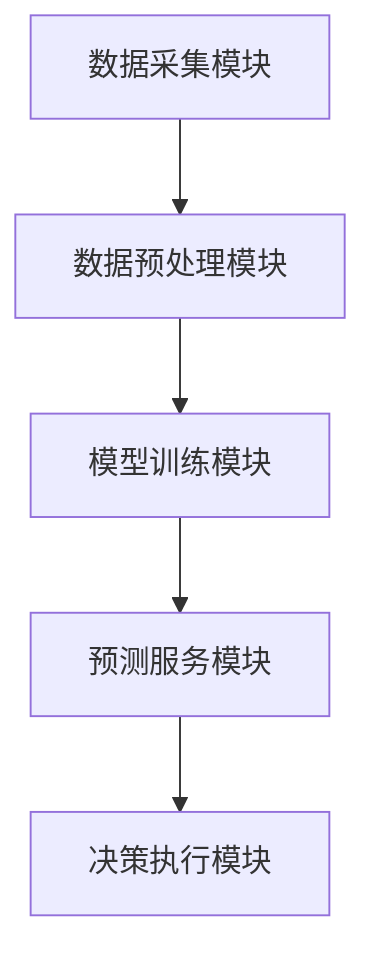
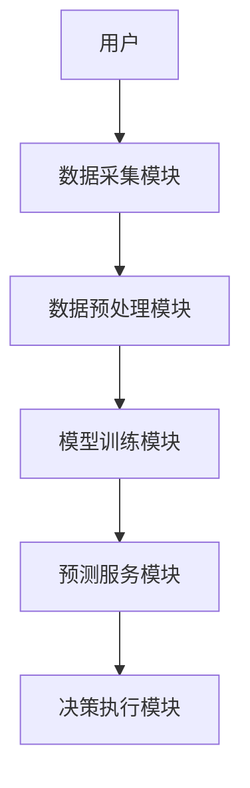

                 


# AI Agent在智能农业产量预测中的实践

## 关键词：AI Agent，智能农业，产量预测，机器学习，深度学习

## 摘要：  
随着人工智能技术的快速发展，AI Agent（人工智能代理）在智能农业中的应用日益广泛。本文以AI Agent在农业产量预测中的实践为核心，详细探讨了其在智能农业中的应用背景、核心原理、算法实现、系统架构及实际案例。通过对AI Agent的感知、决策和执行机制的分析，结合机器学习和深度学习算法，展示了如何利用AI技术提升农业产量预测的准确性。本文还通过具体的小麦产量预测案例，详细讲解了AI Agent系统的构建过程，为农业智能化提供了实践参考。

---

# 第一章: AI Agent的基本概念与应用背景

## 1.1 AI Agent的定义与核心特征

AI Agent（人工智能代理）是一种能够感知环境、自主决策并执行任务的智能系统。其核心特征包括：

- **自主性**：能够自主决策，无需外部干预。
- **反应性**：能够实时感知环境变化并做出响应。
- **学习能力**：通过数据和经验不断优化自身性能。
- **可扩展性**：适用于多种场景和任务。

## 1.2 智能农业的现状与挑战

### 1.2.1 智能农业的概念与内涵

智能农业是利用现代信息技术（如物联网、大数据、人工智能）提升农业生产的效率和可持续性。其核心在于通过数据采集、分析和决策支持，优化种植、养殖和管理过程。

### 1.2.2 当前农业中的主要问题

- **气候变化**：极端天气影响农作物生长周期。
- **资源不足**：土地、水和劳动力短缺。
- **病虫害**：影响农作物产量和质量。
- **数据碎片化**：缺乏统一的数据标准和共享机制。

### 1.2.3 智能农业的发展趋势

- **智能化**：利用AI技术实现精准农业。
- **数据化**：通过物联网采集和分析数据。
- **绿色化**：减少资源消耗，提高可持续性。

## 1.3 AI Agent在农业中的应用背景

### 1.3.1 农业产量预测的重要性

准确的产量预测能够帮助农民合理规划种植、施肥、灌溉和病虫害防治，从而提高产量和质量。

### 1.3.2 AI Agent在产量预测中的优势

- **高效性**：能够快速处理大量数据并生成预测结果。
- **准确性**：通过机器学习模型提升预测精度。
- **适应性**：能够根据环境变化动态调整预测模型。

### 1.3.3 当前AI Agent在农业中的应用现状

- **数据采集**：通过传感器实时采集土壤、气象和作物数据。
- **模型训练**：利用历史数据训练机器学习模型。
- **预测与决策**：基于模型预测结果优化农业生产。

## 1.4 本章小结

本章介绍了AI Agent的基本概念和核心特征，分析了智能农业的现状与挑战，并重点探讨了AI Agent在农业产量预测中的应用背景及其优势。

---

# 第二章: AI Agent的核心原理

## 2.1 AI Agent的感知机制

AI Agent通过传感器和数据采集设备获取环境信息，包括土壤湿度、温度、光照强度等。这些数据经过预处理和特征提取后，为后续的决策提供支持。

### 2.1.1 数据采集与处理

- **数据采集**：通过物联网设备实时采集土壤、气象和作物数据。
- **数据预处理**：去除噪声、填充缺失值、标准化数据。

### 2.1.2 数据特征提取

- **特征选择**：通过统计分析和机器学习方法筛选重要特征。
- **特征工程**：构建有意义的特征组合以提升模型性能。

### 2.1.3 数据预处理方法

- **数据清洗**：去除异常值和重复数据。
- **数据转换**：将数据转换为模型可接受的格式。
- **数据增强**：通过数据增强技术提高数据多样性。

## 2.2 AI Agent的决策机制

AI Agent基于感知到的环境信息，结合历史数据和模型预测结果，生成最优决策。

### 2.2.1 机器学习模型的选择

- **线性回归**：适用于简单线性关系的预测。
- **支持向量机**：适用于非线性关系的分类和回归。
- **随机森林**：适用于高维数据的特征提取和预测。

### 2.2.2 模型训练与优化

- **训练数据准备**：将采集到的数据划分为训练集和测试集。
- **模型训练**：利用训练数据训练机器学习模型。
- **模型优化**：通过交叉验证和超参数调优提高模型性能。

### 2.2.3 决策规则的制定

- **决策策略**：基于模型预测结果制定具体的种植策略。
- **动态调整**：根据环境变化实时调整决策规则。

## 2.3 AI Agent的执行机制

AI Agent根据决策结果执行具体的操作，如调整灌溉、施肥和病虫害防治。

### 2.3.1 执行策略的制定

- **策略制定**：根据预测结果制定具体的执行计划。
- **任务分解**：将复杂任务分解为简单操作。

### 2.3.2 执行过程的监控

- **实时监控**：通过传感器实时监控执行过程。
- **异常处理**：发现异常情况及时采取措施。

### 2.3.3 执行结果的反馈

- **结果反馈**：将执行结果反馈给模型，用于后续优化。
- **模型更新**：根据新数据更新模型，提高预测精度。

## 2.4 本章小结

本章详细讲解了AI Agent的核心原理，包括感知、决策和执行机制。通过机器学习模型的选择和优化，展示了如何利用AI Agent提升农业产量预测的准确性。

---

# 第三章: AI Agent在产量预测中的算法原理

## 3.1 机器学习算法的选择与比较

### 3.1.1 线性回归

线性回归是一种简单且高效的回归算法，适用于线性关系的数据。其数学模型为：

$$ y = \beta_0 + \beta_1x + \epsilon $$

其中，$y$ 是目标变量，$x$ 是自变量，$\beta_0$ 和 $\beta_1$ 是回归系数，$\epsilon$ 是误差项。

### 3.1.2 支持向量机

支持向量机（SVM）是一种强大的分类和回归算法，适用于非线性关系的数据。其核心思想是通过构建超平面将数据分成不同类别。

### 3.1.3 随机森林

随机森林是一种基于树的集成学习算法，适用于高维数据的特征提取和预测。其数学模型为：

$$ y = \sum_{i=1}^{n} \theta_i x_i $$

其中，$n$ 是特征的数量，$\theta_i$ 是特征的重要性系数，$x_i$ 是自变量。

### 3.1.4 神经网络

神经网络是一种模拟人脑神经网络的深度学习算法，适用于复杂非线性关系的数据。其数学模型为：

$$ y = \sigma(w x + b) $$

其中，$w$ 是权重，$b$ 是偏置，$\sigma$ 是激活函数。

## 3.2 基于机器学习的产量预测模型构建

### 3.2.1 数据特征的选择

选择土壤湿度、温度、光照强度和降雨量作为主要特征。

### 3.2.2 模型训练与验证

- **训练数据**：使用历史数据训练模型。
- **验证数据**：用于验证模型的泛化能力。
- **模型优化**：通过交叉验证和超参数调优提高模型性能。

### 3.2.3 模型调优与优化

- **超参数调优**：通过网格搜索和随机搜索找到最优超参数。
- **模型评估**：通过均方误差（MSE）、平均绝对误差（MAE）和决定系数（R²）评估模型性能。

## 3.3 深度学习算法在产量预测中的应用

### 3.3.1 CNN在图像数据中的应用

卷积神经网络（CNN）适用于图像数据的特征提取，其数学模型为：

$$ f(x) = \text{max}(\text{conv}(x, w) + b) $$

其中，$x$ 是输入图像，$w$ 是卷积核权重，$b$ 是偏置。

### 3.3.2 RNN在时间序列数据中的应用

循环神经网络（RNN）适用于时间序列数据的预测，其数学模型为：

$$ h_t = \text{tanh}(W_{hh} h_{t-1} + W_{xh} x_t + b_h) $$

其中，$h_t$ 是隐藏层状态，$W_{hh}$ 和 $W_{xh}$ 是权重矩阵，$b_h$ 是偏置。

### 3.3.3 Transformer模型的最新进展

Transformer模型通过自注意力机制处理长序列数据，其数学模型为：

$$ \text{Attention}(Q, K, V) = \text{softmax}\left(\frac{QK^T}{\sqrt{d_k}}\right)V $$

其中，$Q$、$K$、$V$ 是查询、键和值向量，$d_k$ 是键向量的维度。

## 3.4 本章小结

本章详细讲解了AI Agent在产量预测中的算法原理，包括机器学习和深度学习算法的选择与优化，以及如何利用这些算法提高预测精度。

---

# 第四章: AI Agent的系统架构与设计

## 4.1 系统总体架构

AI Agent系统总体架构包括数据采集模块、模型训练模块、预测服务模块和决策执行模块。其系统架构图如下：



## 4.2 系统功能设计

### 4.2.1 数据采集模块

通过传感器和物联网设备实时采集土壤湿度、温度、光照强度和降雨量等数据。

### 4.2.2 数据预处理模块

对采集到的数据进行清洗、特征提取和标准化处理。

### 4.2.3 模型训练模块

利用预处理后的数据训练机器学习或深度学习模型，生成预测模型。

### 4.2.4 预测服务模块

根据新的数据输入，调用预测模型生成产量预测结果。

### 4.2.5 决策执行模块

根据预测结果生成具体的种植策略，并通过执行系统优化农业生产。

## 4.3 系统架构设计

### 4.3.1 系统架构图


### 4.3.2 系统交互图



## 4.4 本章小结

本章详细讲解了AI Agent系统的总体架构和功能设计，展示了如何通过模块化设计实现高效的产量预测和决策支持。

---

# 第五章: AI Agent在农业产量预测中的项目实战

## 5.1 项目背景

本项目旨在利用AI Agent技术，实现小麦产量的精准预测。通过传感器实时采集小麦生长环境的数据，利用机器学习模型进行预测，并根据预测结果优化种植策略。

## 5.2 项目环境安装

### 5.2.1 安装Python环境

安装Python 3.8及以上版本，建议使用Anaconda或virtualenv管理虚拟环境。

### 5.2.2 安装依赖库

安装以下依赖库：

```bash
pip install numpy scikit-learn pandas matplotlib tensorflow
```

## 5.3 系统核心实现

### 5.3.1 数据采集模块

通过传感器和物联网设备采集小麦生长环境的数据，包括土壤湿度、温度、光照强度和降雨量。

### 5.3.2 数据预处理模块

对采集到的数据进行清洗、特征提取和标准化处理。

### 5.3.3 模型训练模块

利用预处理后的数据训练机器学习或深度学习模型，生成预测模型。

### 5.3.4 预测服务模块

根据新的数据输入，调用预测模型生成产量预测结果。

### 5.3.5 决策执行模块

根据预测结果生成具体的种植策略，并通过执行系统优化农业生产。

## 5.4 项目实战代码

### 5.4.1 数据采集代码

```python
import pandas as pd
import numpy as np

# 读取数据
data = pd.read_csv('agriculture_data.csv')

# 查看数据信息
print(data.info())
```

### 5.4.2 数据预处理代码

```python
from sklearn.impute import SimpleImputer
from sklearn.preprocessing import StandardScaler

# 填充缺失值
imputer = SimpleImputer(strategy='mean')
data_imputed = imputer.fit_transform(data)

# 标准化数据
scaler = StandardScaler()
data_scaled = scaler.fit_transform(data_imputed)
```

### 5.4.3 模型训练代码

```python
from sklearn.linear_model import LinearRegression
from sklearn.metrics import mean_squared_error

# 训练线性回归模型
model = LinearRegression()
model.fit(X_train, y_train)

# 预测结果
y_pred = model.predict(X_test)

# 计算均方误差
mse = mean_squared_error(y_test, y_pred)
print('均方误差:', mse)
```

## 5.5 实际案例分析

以小麦产量预测为例，通过训练好的模型预测不同环境下的小麦产量，并根据预测结果优化种植策略。

## 5.6 本章小结

本章通过具体的项目实战，详细讲解了AI Agent在农业产量预测中的实现过程，展示了如何利用机器学习技术提升农业生产的效率和准确性。

---

# 第六章: AI Agent的系统优化与未来展望

## 6.1 系统优化方案

### 6.1.1 数据优化

- **数据多样性**：增加不同环境和条件下的数据。
- **数据质量**：提高数据的准确性和完整性。

### 6.1.2 模型优化

- **模型可解释性**：通过特征重要性分析提高模型的可解释性。
- **模型泛化能力**：通过数据增强和迁移学习提高模型的泛化能力。

## 6.2 系统架构优化

### 6.2.1 高可用性

- **容错设计**：通过冗余设计提高系统的容错能力。
- **负载均衡**：通过负载均衡技术提高系统的处理能力。

### 6.2.2 可扩展性

- **模块化设计**：通过模块化设计提高系统的可扩展性。
- **云部署**：通过云平台部署提高系统的可扩展性和灵活性。

## 6.3 未来展望

- **多模态数据融合**：结合图像、文本和传感器数据，提高预测精度。
- **自适应学习**：通过自适应学习算法，实时优化模型性能。
- **智能决策支持**：通过人机交互界面，提供更直观的决策支持。

## 6.4 本章小结

本章总结了AI Agent系统的优化方案，并展望了未来的发展趋势，为农业智能化提供了进一步的方向。

---

# 附录: 参考文献与拓展阅读

1. Bishop, C. M. (2006). Pattern Recognition and Machine Learning.
2. Goodfellow, I., Bengio, Y., & Courville, A. (2016). Deep Learning.
3. Hastie, T., Tibshirani, R., & Friedman, J. (2009). The Elements of Statistical Learning.
4. LeCun, Y., Bengio, Y., & Hinton, G. (2015). Deep Learning.

---

# 结语

AI Agent在智能农业产量预测中的应用，不仅提升了农业生产的效率和准确性，也为农业智能化提供了新的思路。通过本文的详细讲解，读者可以深入了解AI Agent的核心原理和实际应用，为未来的农业智能化发展提供有力的技术支持。

